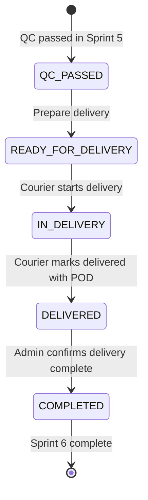

# DELIVERY WORKFLOW DESIGN DOCUMENT

## Project

Asia Dental Lab Management System

## Version

1.0

## Sprint

Sprint 6 - Delivery & Proof of Delivery

## Architecture

Laravel 12, Blade + Livewire 3, PostgreSQL 16, Modular Monolith

---

# 1. Sprint 6 Overview

## Business Purpose

Sprint 6 mendesain workflow Delivery dan Proof of Delivery (POD) setelah Lab Order lulus Quality Control pada Sprint 5.

Tujuan bisnis utama adalah memastikan hasil pekerjaan yang sudah `QC_PASSED` dapat dikirim ke clinic/dokter dengan bukti penerimaan yang kuat, terdokumentasi, dan dapat diaudit.

Delivery menjadi penghubung antara QC dan Finance. Sprint 6 memastikan order sudah benar-benar diterima sebelum Sprint 7 membuat invoice.

## Delivery Workflow Goals

Sprint 6 bertujuan untuk:

* mengubah order `QC_PASSED` menjadi siap dikirim;
* membuat delivery assignment ke courier;
* mencatat perjalanan delivery;
* mengunggah Proof of Delivery;
* memastikan receiver, signature, photo, dan timestamp tercatat;
* menutup delivery dengan status Lab Order `COMPLETED`;
* menyediakan histori delivery yang dapat diaudit.

## Scope

Sprint 6 mencakup:

* Delivery Queue
* Delivery Preparation
* Courier Assignment
* Courier Reassignment
* Delivery Lifecycle
* Proof of Delivery
* Delivery Evidence
* Status Timeline
* Audit Trail
* Recommended entities
* Business rules

## Out of Scope

Sprint 6 tidak mencakup:

* Invoice workflow
* Payment workflow
* Reporting dashboard implementation
* Courier GPS tracking
* Route optimization
* WhatsApp notification
* Customer portal delivery tracking

## Dependencies on Sprint 3-5

Sprint 6 bergantung pada Sprint 3 Lab Order Core:

* `trx_lab_orders`
* `trx_lab_order_status_logs`
* `sys_attachments`
* `sys_audit_logs`
* Lab Order status enum
* Delivery preparation fields on Lab Order

Sprint 6 bergantung pada Sprint 4 Production Workflow:

* production history
* assignment history
* order handoff to QC

Sprint 6 bergantung pada Sprint 5 Quality Control:

* Lab Order status `QC_PASSED`
* QC history
* QC evidence
* quality gate before delivery

Only Lab Orders with status `QC_PASSED` can enter Sprint 6 Delivery.

---

# 2. Delivery Workflow

Sprint 6 Lab Order status flow:

```text
QC_PASSED
-> READY_FOR_DELIVERY
-> IN_DELIVERY
-> DELIVERED
-> COMPLETED
```



Status meaning:

| Lab Order Status | Meaning |
| --- | --- |
| `QC_PASSED` | QC has approved the work. Delivery has not been prepared. |
| `READY_FOR_DELIVERY` | Delivery record exists and courier can be assigned or has been assigned. |
| `IN_DELIVERY` | Courier is carrying or delivering the order. |
| `DELIVERED` | Goods have been received and POD data has been uploaded. |
| `COMPLETED` | Lab Order delivery workflow is closed and ready for future invoice flow. |

Rules:

* Sprint 6 starts from `QC_PASSED`.
* Sprint 6 ends at `COMPLETED`.
* Invoice does not start in Sprint 6.
* Every status transition must create `trx_lab_order_status_logs`.
* Every delivery action must create `sys_audit_logs`.

---

# 3. Roles and Responsibilities

| Role | Prepare Delivery | Assign Courier | Start Delivery | Upload POD | Complete Delivery | View Delivery History |
| --- | --- | --- | --- | --- | --- | --- |
| Admin Lab | Yes | Yes | Optional by permission | Yes | Yes | Yes |
| Delivery Coordinator | Yes | Yes | Optional by permission | Yes | Yes | Yes |
| Courier | No | No | Own delivery only | Own delivery only | Own delivery only or submit for completion | Own delivery only |
| QC Inspector | No | No | No | No | No | View QC-to-delivery handoff only |
| Technician | No | No | No | No | No | Related order only |

## Admin Lab

Responsibilities:

* Monitor orders that have passed QC.
* Prepare delivery when order is ready to send.
* Assign or reassign courier.
* Review POD completeness.
* Complete delivery workflow after POD is valid.

## Delivery Coordinator

Responsibilities:

* Own day-to-day delivery planning.
* Assign courier.
* Reassign courier when needed.
* Monitor `READY_FOR_DELIVERY`, `IN_DELIVERY`, and `DELIVERED`.
* Ensure POD is complete before completion.

## Courier

Responsibilities:

* View own deliveries.
* Start delivery.
* Capture receiver name.
* Capture receiver signature.
* Upload receiver/photo evidence.
* Mark delivery as delivered.

Courier cannot:

* create invoice;
* record payment;
* edit QC result;
* complete delivery without POD.

## QC Inspector

Responsibilities:

* View handoff after `QC_PASSED` when needed.
* Confirm that only QC-passed orders enter delivery.

QC Inspector does not manage delivery execution in Sprint 6.

## Technician

Responsibilities:

* View related order delivery history if allowed.
* No delivery mutation responsibility in Sprint 6.

---

# 4. Delivery Queue

Delivery Queue lists orders that are ready for delivery preparation or currently in delivery.

Primary status sources:

```text
QC_PASSED
READY_FOR_DELIVERY
IN_DELIVERY
DELIVERED
```

Queue groups:

| Queue Group | Included Status |
| --- | --- |
| Ready to Prepare | `QC_PASSED` |
| Ready for Courier | `READY_FOR_DELIVERY` |
| In Delivery | `IN_DELIVERY` |
| Delivered Pending Completion | `DELIVERED` |

Filters:

* order number
* clinic
* doctor
* patient
* courier
* delivery status
* due date

Recommended columns:

* Order Number
* Clinic
* Doctor
* Patient
* Priority
* Due Date
* Delivery Status
* Courier
* Delivery Date
* POD Status
* Action

Search strategy:

* Search by `order_number`.
* Search by clinic, doctor, patient, or courier name.

Sorting:

* `SUPER_URGENT` first.
* Earliest due date first.
* Oldest `QC_PASSED` handoff first.
* `IN_DELIVERY` should remain highly visible.

Rules:

* Cancelled orders must not appear in active delivery queue.
* Orders that are not `QC_PASSED` cannot be prepared for delivery.
* Completed orders move to Delivery History.

---

# 5. Delivery Assignment

Delivery assignment connects a prepared delivery with a courier.

## Courier Assignment

Flow:

```text
Open Delivery Queue
-> Select QC_PASSED order
-> Prepare delivery
-> Select courier
-> Add delivery notes
-> Save
-> Lab Order status becomes READY_FOR_DELIVERY
-> Delivery record is created
-> Audit log is created
-> Status log is created
```

Assignment data should capture:

* delivery record
* courier
* assigned_by
* assigned_at
* delivery_date
* notes

## Assignment History

Delivery assignment history must be preserved.

Minimum V1 approach:

* Store current courier on `trx_lab_deliveries.courier_id`.
* Store assignment and reassignment events in `sys_audit_logs`.
* Store status changes in `trx_lab_order_status_logs`.

Optional future approach:

* Add `trx_lab_delivery_assignments` only if courier assignment history needs first-class reporting beyond audit logs.

## Reassignment Rules

Courier reassignment is allowed when:

* delivery is `READY_FOR_DELIVERY`; or
* delivery is `IN_DELIVERY` but not yet delivered.

Reassignment requires:

* new courier;
* reassignment notes;
* audit action `REASSIGN_COURIER`;
* assignment history preservation.

Reassignment is blocked when:

* Lab Order is `DELIVERED`;
* Lab Order is `COMPLETED`;
* delivery has finalized POD;
* order is cancelled.

## Delivery Notes

Delivery notes may include:

* clinic delivery instruction;
* contact person;
* preferred delivery time;
* parking or building access notes;
* fragile package note;
* remake/revision context if relevant.

---

# 6. Delivery Lifecycle

Lifecycle:

```text
READY_FOR_DELIVERY
-> IN_DELIVERY
-> DELIVERED
-> COMPLETED
```

## READY_FOR_DELIVERY

Meaning:

* Delivery is prepared and ready to be handled by courier.

Rules:

* Only `QC_PASSED` orders can enter `READY_FOR_DELIVERY`.
* Courier should be assigned before delivery starts.
* Delivery record must exist.

## IN_DELIVERY

Meaning:

* Courier has started delivery.

Rules:

* Courier is required before `IN_DELIVERY`.
* Only assigned courier or authorized delivery user can start delivery.
* Starting delivery creates audit action `START_DELIVERY`.
* Lab Order status changes from `READY_FOR_DELIVERY` to `IN_DELIVERY`.

## DELIVERED

Meaning:

* Courier has handed over the package and uploaded POD.

Rules:

* Only assigned courier can mark delivered unless Admin Lab/Delivery Coordinator overrides with permission.
* POD data must be present before `DELIVERED`.
* Delivery history must be preserved.
* Mark delivered creates audit action `MARK_DELIVERED`.

## COMPLETED

Meaning:

* Delivery workflow is closed after POD is reviewed as complete.

Rules:

* POD is required before `COMPLETED`.
* Receiver name is required.
* Receiver signature is required.
* Delivery evidence is required.
* Complete delivery creates audit action `COMPLETE_DELIVERY`.
* `COMPLETED` prepares order for Sprint 7 Invoice, but invoice is not created in Sprint 6.

---

# 7. Proof Of Delivery (POD)

POD is mandatory before delivery completion.

Required POD data:

* `receiver_name`
* `receiver_signature`
* `receiver_photo`
* `received_at`
* `delivery_notes`

Recommended supporting data:

* receiver role
* receiver phone
* courier
* clinic
* delivery timestamp
* POD evidence category

Validation rules:

| Field | Rule |
| --- | --- |
| `receiver_name` | required, string |
| `receiver_signature` | required, stored as file evidence |
| `receiver_photo` | required, stored as file evidence |
| `received_at` | required, datetime |
| `delivery_notes` | nullable for clean delivery, required for exception/failed attempt |

POD completion rules:

* POD must be uploaded before `DELIVERED`.
* `COMPLETED` is blocked if receiver name is missing.
* `COMPLETED` is blocked if signature is missing.
* `COMPLETED` is blocked if receiver photo/evidence is missing.
* POD files are stored as attachments; database stores file path only.
* POD upload must be audited.

---

# 8. Delivery Evidence

Delivery evidence reuses:

```text
sys_attachments
entity_type
entity_id
```

Attachment categories:

```text
DELIVERY_PHOTO
POD_SIGNATURE
POD_RECEIVER_PHOTO
DELIVERY_EVIDENCE
```

Preferred entity target:

```text
entity_type = trx_lab_deliveries
entity_id   = delivery_id
```

Order-level fallback:

```text
entity_type = trx_lab_orders
entity_id   = lab_order_id
```

Upload strategy:

* Store evidence files under delivery-specific folder.
* Use generated safe file names.
* Validate file type and size.
* Store file metadata only in `sys_attachments`.
* Create audit action `UPLOAD_POD`.

Retrieval strategy:

* Delivery Detail shows all delivery evidence for the delivery.
* Lab Order Timeline can include delivery evidence entries.
* Delivery History can show evidence grouped by delivery.

Rules:

* Do not create a separate attachment system.
* Do not duplicate attachment tables when `sys_attachments` is sufficient.
* Existing `trx_lab_delivery_photos` may remain for schema compatibility, but Sprint 6 design should prefer `sys_attachments` for new POD and delivery evidence behavior.
* Attachment metadata should use soft delete.

---

# 9. Audit Requirements

Every delivery action must create audit record in:

```text
sys_audit_logs
```

Audit actions:

```text
ASSIGN_COURIER
REASSIGN_COURIER
START_DELIVERY
MARK_DELIVERED
COMPLETE_DELIVERY
UPLOAD_POD
STATUS_CHANGE
```

Audit data should include:

* `entity_type`
* `entity_id`
* `action`
* `old_values`
* `new_values`
* `performed_by`
* `performed_at`
* `ip_address`
* `user_agent`

Recommended audit targets:

* `trx_lab_deliveries` for delivery assignment and POD actions.
* `trx_lab_orders` for Lab Order status changes.
* `sys_attachments` metadata for POD upload references.

Rules:

* Audit logs must be written in the same transaction as the delivery action where possible.
* Audit log must not store raw file content.
* Reassignment audit must identify old courier and new courier.
* POD audit must identify receiver and evidence metadata.

---

# 10. Status Log Requirements

Every Lab Order status transition must create:

```text
trx_lab_order_status_logs
```

Required transitions:

| Old Status | New Status | Trigger |
| --- | --- | --- |
| `QC_PASSED` | `READY_FOR_DELIVERY` | Prepare delivery / assign courier |
| `READY_FOR_DELIVERY` | `IN_DELIVERY` | Courier starts delivery |
| `IN_DELIVERY` | `DELIVERED` | Courier marks delivered with POD |
| `DELIVERED` | `COMPLETED` | Admin/Coordinator completes delivery workflow |

Required fields:

* `lab_order_id`
* `old_status`
* `new_status`
* `notes`
* `changed_by`
* `changed_at`

Rules:

* Status logs are append-only.
* Status change and delivery mutation must occur in one transaction.
* Every status log should have related `STATUS_CHANGE` audit log.

---

# 11. Recommended Entities

## trx_lab_deliveries

Purpose:

* Store delivery record for a Lab Order.
* Track courier assignment, delivery date, delivery status, receiver data, signature path, delivery timestamp, and notes.

Relationships:

* belongs to `trx_lab_orders`
* belongs to `users` as courier
* belongs to `mst_clinics`
* belongs to `users` as created_by
* has many attachments through `sys_attachments`

Recommended key fields:

* `delivery_number`
* `lab_order_id`
* `courier_id`
* `clinic_id`
* `delivery_date`
* `status`
* `receiver_name`
* `receiver_role`
* `receiver_phone`
* `signature_file_path`
* `delivered_at`
* `notes`
* `created_by`

Delivery status:

```text
READY_FOR_DELIVERY
IN_DELIVERY
DELIVERED
COMPLETED
CANCELLED
```

Note:

* Existing schema may also include delivery states such as `IN_TRANSIT`, `ARRIVED`, and `POD_COMPLETED`. Sprint 6 Lab Order status flow uses `READY_FOR_DELIVERY`, `IN_DELIVERY`, `DELIVERED`, and `COMPLETED`.

## Optional: trx_lab_delivery_assignments

Recommendation:

* Do not add this table in Sprint 6 unless courier reassignment history must be queried independently from audit logs.

Why optional:

* `trx_lab_deliveries.courier_id` stores current courier.
* `sys_audit_logs` can preserve assignment and reassignment history.
* Small-to-medium dental lab operations usually do not need a separate assignment table for delivery in V1.

Use this optional table later if:

* courier reassignment becomes frequent;
* SLA reporting needs exact courier assignment intervals;
* multiple couriers per delivery become a real operational requirement.

## Attachment Tables

Do not create duplicate attachment tables when `sys_attachments` is sufficient.

Recommended Sprint 6 evidence storage:

```text
sys_attachments
```

---

# 12. Business Rules

Required Sprint 6 rules:

* Delivery requires `QC_PASSED`.
* Courier is required before `IN_DELIVERY`.
* POD is required before `COMPLETED`.
* Receiver name is required.
* Signature is required.
* Delivery evidence is required.
* All delivery actions are audited.
* All Lab Order status changes are logged.

Additional rules:

* Delivery must not create invoice.
* Delivery must not create payment.
* Delivery completion prepares future invoice flow only.
* Courier reassignment requires notes.
* Failed delivery attempt must be logged and audited.
* Duplicate delivery completion must be blocked.
* Cancelled order cannot be delivered.
* Order already `COMPLETED` cannot be modified through delivery workflow.

Allowed Lab Order transitions:

| From | Action | To |
| --- | --- | --- |
| `QC_PASSED` | Prepare delivery | `READY_FOR_DELIVERY` |
| `READY_FOR_DELIVERY` | Start delivery | `IN_DELIVERY` |
| `IN_DELIVERY` | Upload POD and mark delivered | `DELIVERED` |
| `DELIVERED` | Complete delivery workflow | `COMPLETED` |

Blocked transitions:

| Current Status | Blocked Action |
| --- | --- |
| `RECEIVED` | Prepare delivery |
| `ASSIGNED` | Prepare delivery |
| `IN_PRODUCTION` | Prepare delivery |
| `QC_PENDING` | Prepare delivery |
| `REMAKE` | Prepare delivery |
| `CANCELLED` | Start or complete delivery |
| `COMPLETED` | Start or complete delivery again |

---

# 13. Risks and Edge Cases

## Courier Reassignment

Risk:

* Courier becomes unavailable after assignment.

Handling:

* Allow reassignment before completion.
* Require notes.
* Audit old courier and new courier.
* Preserve delivery history.

## Failed Delivery

Risk:

* Courier cannot deliver due to wrong address, clinic closed, or traffic issue.

Handling:

* Record failed attempt as notes and evidence.
* Keep delivery from becoming `DELIVERED`.
* Allow reschedule or reassignment.
* Audit failed attempt.

## Receiver Unavailable

Risk:

* No authorized receiver is available at clinic.

Handling:

* Do not mark delivered.
* Add delivery notes.
* Upload supporting evidence if needed.
* Keep order in `IN_DELIVERY` or return to delivery queue based on implementation policy.

## Missing Signature

Risk:

* Courier forgets signature or receiver refuses to sign.

Handling:

* Block `COMPLETED`.
* Require `POD_SIGNATURE`.
* Allow admin exception only if future policy defines one; default V1 behavior is no bypass.

## Blurry POD Photo

Risk:

* Evidence is not useful for dispute resolution.

Handling:

* Allow evidence replacement with audit trail.
* Preserve old attachment through soft delete.
* Require review before `COMPLETED` when evidence quality is questionable.

## Duplicate Delivery Completion

Risk:

* Same delivery is completed multiple times.

Handling:

* Block completion if Lab Order already `COMPLETED`.
* Block completion if delivery already delivered and completed.
* Use status checks and database transaction.

## Order Cancelled Before Shipment

Risk:

* Order is cancelled after QC but before courier starts delivery.

Handling:

* Block delivery start.
* Mark delivery cancelled if delivery record exists.
* Audit cancellation and preserve history.

---

# 14. Future Integration

## Sprint 7 Invoice

Sprint 6 supports Sprint 7 by producing a reliable completion gate:

```text
COMPLETED
```

Future Invoice rules can depend on:

* completed Lab Order;
* delivery record;
* POD receiver name;
* POD signature;
* delivery evidence;
* delivered/completed timestamps.

Sprint 6 does not create invoice records.

## Sprint 8 Reporting

Sprint 6 creates reporting-ready data:

* delivery count;
* courier workload;
* delivery duration;
* failed delivery attempts;
* POD completeness;
* late deliveries;
* clinic delivery volume;
* dispute support through POD evidence.

Reporting implementation remains Sprint 8.

---

# 15. Definition of Done

Sprint 6 design is ready when:

* workflow defined;
* POD defined;
* delivery evidence defined;
* audit requirements defined;
* status log requirements defined;
* recommended entities defined.

Validation checklist:

```text
- Delivery starts only after QC_PASSED
- Delivery status flow documented
- Role responsibility matrix documented
- Delivery queue documented
- Courier assignment documented
- Courier reassignment documented
- POD required fields documented
- POD validation documented
- Delivery evidence uses sys_attachments
- Audit actions documented
- Status log transitions documented
- trx_lab_deliveries recommended
- trx_lab_delivery_assignments optional only
- Duplicate attachment system excluded
- Invoice implementation excluded
- Payment implementation excluded
- Reporting implementation excluded
- Sprint 3-5 consistency maintained
```

---

# Key Workflow Decisions

| Decision | Rationale |
| --- | --- |
| Delivery starts from `QC_PASSED`. | QC is the quality gate from Sprint 5. |
| Preparing delivery changes status to `READY_FOR_DELIVERY`. | Separates QC pass from actual delivery execution. |
| Starting courier work changes status to `IN_DELIVERY`. | Provides operational visibility while package is in transit. |
| POD is required before `DELIVERED` / `COMPLETED`. | Prevents weak or disputed delivery closure. |
| Completion ends Sprint 6 at `COMPLETED`. | Provides clean handoff to Sprint 7 Invoice. |
| Evidence uses `sys_attachments`. | Avoids duplicate attachment systems and follows Sprint 3 strategy. |
| Courier reassignment uses audit logs in V1. | Avoids overengineering for small-to-medium lab operations. |

---

# Readiness Checklist

```text
- Workflow decisions documented
- POD strategy documented
- Attachment strategy documented
- Recommended entities documented
- Risks identified
- Audit strategy documented
- Status log strategy documented
- Future Sprint 7 and Sprint 8 integration documented
```
