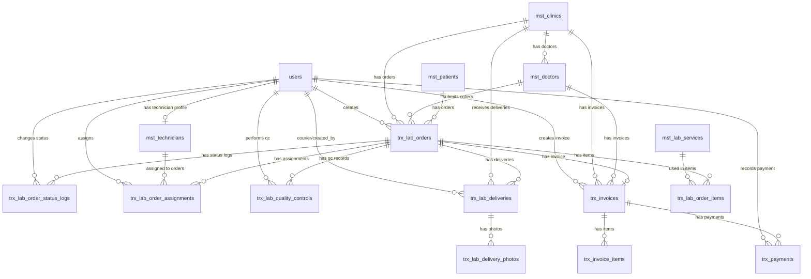

# ERD.md

# Asia Dental Lab Management System

Version: V1
Database: PostgreSQL
Architecture: Modular Monolith
Backend: Laravel 12

---

# 1. ERD Purpose

Dokumen ini menjelaskan relasi antar tabel utama pada Asia Dental Lab Management System V1.

ERD ini menjadi acuan untuk:

```text
Migration
Model Relationship
Repository
Service Layer
API
Testing
```

---

# 2. Core ERD Concept

Pusat transaksi aplikasi adalah:

```text
trx_lab_orders
```

Semua proses operasional utama berelasi ke order:

```text
Lab Order
↓
Order Items
↓
Assignment Teknisi
↓
Status Log
↓
Quality Control
↓
Delivery + POD
↓
Invoice
↓
Payment
```

---

# 3. High Level ERD

```text
users
├── mst_technicians
├── trx_lab_orders
├── trx_lab_order_status_logs
├── trx_lab_order_assignments
├── trx_lab_quality_controls
├── trx_lab_deliveries
├── trx_invoices
└── trx_payments


mst_clinics
├── mst_doctors
├── trx_lab_orders
├── trx_lab_deliveries
└── trx_invoices


mst_doctors
├── trx_lab_orders
└── trx_invoices


mst_patients
└── trx_lab_orders


mst_lab_services
└── trx_lab_order_items


mst_technicians
└── trx_lab_order_assignments


trx_lab_orders
├── trx_lab_order_items
├── trx_lab_order_status_logs
├── trx_lab_order_assignments
├── trx_lab_quality_controls
├── trx_lab_deliveries
└── trx_invoices


trx_lab_deliveries
└── trx_lab_delivery_photos


trx_invoices
├── trx_invoice_items
└── trx_payments
```

---

# 4. Mermaid ERD Diagram



---

# 5. Entity Relationship Details

## 5.1 users → mst_technicians

```text
Relationship:
users 1 → 0..1 mst_technicians

Foreign Key:
mst_technicians.user_id → users.id
```

Artinya:

```text
Satu user bisa memiliki satu profil teknisi.
Tidak semua user adalah teknisi.
```

---

## 5.2 users → trx_lab_orders

```text
Relationship:
users 1 → many trx_lab_orders

Foreign Key:
trx_lab_orders.created_by → users.id
```

Artinya:

```text
User admin membuat banyak lab order.
```

---

## 5.3 mst_clinics → mst_doctors

```text
Relationship:
mst_clinics 1 → many mst_doctors

Foreign Key:
mst_doctors.clinic_id → mst_clinics.id
```

Artinya:

```text
Satu klinik dapat memiliki banyak dokter.
```

---

## 5.4 mst_clinics → trx_lab_orders

```text
Relationship:
mst_clinics 1 → many trx_lab_orders

Foreign Key:
trx_lab_orders.clinic_id → mst_clinics.id
```

Artinya:

```text
Satu klinik dapat memiliki banyak order lab.
```

---

## 5.5 mst_doctors → trx_lab_orders

```text
Relationship:
mst_doctors 1 → many trx_lab_orders

Foreign Key:
trx_lab_orders.doctor_id → mst_doctors.id
```

Artinya:

```text
Satu dokter dapat membuat banyak order lab.
```

---

## 5.6 mst_patients → trx_lab_orders

```text
Relationship:
mst_patients 1 → many trx_lab_orders

Foreign Key:
trx_lab_orders.patient_id → mst_patients.id nullable
```

Artinya:

```text
Satu pasien dapat memiliki banyak order.
Untuk V1, patient_id boleh kosong.
```

---

## 5.7 trx_lab_orders → trx_lab_order_items

```text
Relationship:
trx_lab_orders 1 → many trx_lab_order_items

Foreign Key:
trx_lab_order_items.lab_order_id → trx_lab_orders.id
```

Artinya:

```text
Satu order wajib memiliki minimal satu item pekerjaan.
```

---

## 5.8 mst_lab_services → trx_lab_order_items

```text
Relationship:
mst_lab_services 1 → many trx_lab_order_items

Foreign Key:
trx_lab_order_items.lab_service_id → mst_lab_services.id
```

Artinya:

```text
Satu service lab bisa digunakan di banyak order item.
```

---

## 5.9 trx_lab_orders → trx_lab_order_status_logs

```text
Relationship:
trx_lab_orders 1 → many trx_lab_order_status_logs

Foreign Key:
trx_lab_order_status_logs.lab_order_id → trx_lab_orders.id
```

Artinya:

```text
Setiap perubahan status order wajib tercatat.
```

---

## 5.10 trx_lab_orders → trx_lab_order_assignments

```text
Relationship:
trx_lab_orders 1 → many trx_lab_order_assignments

Foreign Key:
trx_lab_order_assignments.lab_order_id → trx_lab_orders.id
```

Artinya:

```text
Satu order bisa memiliki satu atau lebih assignment teknisi.
```

---

## 5.11 mst_technicians → trx_lab_order_assignments

```text
Relationship:
mst_technicians 1 → many trx_lab_order_assignments

Foreign Key:
trx_lab_order_assignments.technician_id → mst_technicians.id
```

Artinya:

```text
Satu teknisi bisa mengerjakan banyak order.
```

---

## 5.12 trx_lab_orders → trx_lab_quality_controls

```text
Relationship:
trx_lab_orders 1 → many trx_lab_quality_controls

Foreign Key:
trx_lab_quality_controls.lab_order_id → trx_lab_orders.id
```

Artinya:

```text
Satu order bisa memiliki beberapa record QC, terutama jika ada revisi.
```

---

## 5.13 trx_lab_orders → trx_lab_deliveries

```text
Relationship:
trx_lab_orders 1 → many trx_lab_deliveries

Foreign Key:
trx_lab_deliveries.lab_order_id → trx_lab_orders.id
```

Artinya:

```text
Satu order dapat memiliki lebih dari satu delivery jika terjadi pengiriman ulang.
```

---

## 5.14 trx_lab_deliveries → trx_lab_delivery_photos

```text
Relationship:
trx_lab_deliveries 1 → many trx_lab_delivery_photos

Foreign Key:
trx_lab_delivery_photos.delivery_id → trx_lab_deliveries.id
```

Artinya:

```text
Satu delivery wajib memiliki minimal satu foto penerimaan.
```

---

## 5.15 trx_lab_orders → trx_invoices

```text
Relationship:
trx_lab_orders 1 → 0..1 trx_invoices

Foreign Key:
trx_invoices.lab_order_id → trx_lab_orders.id

Constraint:
trx_invoices.lab_order_id UNIQUE
```

Artinya:

```text
Untuk V1, satu order hanya boleh memiliki maksimal satu invoice.
```

---

## 5.16 trx_invoices → trx_invoice_items

```text
Relationship:
trx_invoices 1 → many trx_invoice_items

Foreign Key:
trx_invoice_items.invoice_id → trx_invoices.id
```

Artinya:

```text
Satu invoice memiliki banyak detail item tagihan.
```

---

## 5.17 trx_invoices → trx_payments

```text
Relationship:
trx_invoices 1 → many trx_payments

Foreign Key:
trx_payments.invoice_id → trx_invoices.id
```

Artinya:

```text
Satu invoice dapat memiliki banyak pembayaran karena mendukung partial payment.
```

---

# 6. Cardinality Summary

| Parent             | Child                     | Cardinality |
| ------------------ | ------------------------- | ----------- |
| users              | mst_technicians           | 1 to 0..1   |
| users              | trx_lab_orders            | 1 to many   |
| users              | trx_lab_order_status_logs | 1 to many   |
| users              | trx_lab_order_assignments | 1 to many   |
| users              | trx_lab_quality_controls  | 1 to many   |
| users              | trx_lab_deliveries        | 1 to many   |
| users              | trx_invoices              | 1 to many   |
| users              | trx_payments              | 1 to many   |
| mst_clinics        | mst_doctors               | 1 to many   |
| mst_clinics        | trx_lab_orders            | 1 to many   |
| mst_clinics        | trx_lab_deliveries        | 1 to many   |
| mst_clinics        | trx_invoices              | 1 to many   |
| mst_doctors        | trx_lab_orders            | 1 to many   |
| mst_doctors        | trx_invoices              | 1 to many   |
| mst_patients       | trx_lab_orders            | 1 to many   |
| mst_lab_services   | trx_lab_order_items       | 1 to many   |
| mst_technicians    | trx_lab_order_assignments | 1 to many   |
| trx_lab_orders     | trx_lab_order_items       | 1 to many   |
| trx_lab_orders     | trx_lab_order_status_logs | 1 to many   |
| trx_lab_orders     | trx_lab_order_assignments | 1 to many   |
| trx_lab_orders     | trx_lab_quality_controls  | 1 to many   |
| trx_lab_orders     | trx_lab_deliveries        | 1 to many   |
| trx_lab_orders     | trx_invoices              | 1 to 0..1   |
| trx_lab_deliveries | trx_lab_delivery_photos   | 1 to many   |
| trx_invoices       | trx_invoice_items         | 1 to many   |
| trx_invoices       | trx_payments              | 1 to many   |

---

# 7. Polymorphic Attachment Relationship

Untuk V1, file umum menggunakan:

```text
sys_attachments
```

Relasi polymorphic:

```text
attachable_type
attachable_id
```

Digunakan untuk:

```text
trx_lab_orders
trx_lab_quality_controls
trx_lab_deliveries
trx_invoices
```

Contoh:

```text
attachable_type = trx_lab_orders
attachable_id = 1
file_path = order-attachments/ADL-2026-000001/photo-1.jpg
```

---

# 8. Special ERD Rules

## 8.1 Lab Order sebagai pusat transaksi

```text
trx_lab_orders
```

menjadi pusat transaksi utama.

---

## 8.2 Invoice V1: One Order One Invoice

```text
trx_lab_orders 1 → 0..1 trx_invoices
```

Rule:

```text
trx_invoices.lab_order_id wajib UNIQUE.
```

---

## 8.3 Delivery boleh lebih dari satu

```text
trx_lab_orders 1 → many trx_lab_deliveries
```

Alasan:

```text
Jika terjadi pengiriman ulang atau koreksi delivery.
```

---

## 8.4 QC boleh lebih dari satu

```text
trx_lab_orders 1 → many trx_lab_quality_controls
```

Alasan:

```text
Jika hasil perlu revisi dan QC ulang.
```

---

## 8.5 POD wajib memiliki foto

```text
trx_lab_deliveries 1 → many trx_lab_delivery_photos
```

Rule:

```text
Minimal 1 foto sebelum status DELIVERED.
```

---

# 9. Foreign Key Recommendation

## mst_doctors

```text
clinic_id → mst_clinics.id
```

## mst_technicians

```text
user_id → users.id
```

## trx_lab_orders

```text
clinic_id → mst_clinics.id
doctor_id → mst_doctors.id
patient_id → mst_patients.id nullable
created_by → users.id
```

## trx_lab_order_items

```text
lab_order_id → trx_lab_orders.id
lab_service_id → mst_lab_services.id
```

## trx_lab_order_status_logs

```text
lab_order_id → trx_lab_orders.id
changed_by → users.id
```

## trx_lab_order_assignments

```text
lab_order_id → trx_lab_orders.id
technician_id → mst_technicians.id
assigned_by → users.id
```

## trx_lab_quality_controls

```text
lab_order_id → trx_lab_orders.id
qc_by → users.id
```

## trx_lab_deliveries

```text
lab_order_id → trx_lab_orders.id
courier_id → users.id
clinic_id → mst_clinics.id
created_by → users.id
```

## trx_lab_delivery_photos

```text
delivery_id → trx_lab_deliveries.id
uploaded_by → users.id
```

## trx_invoices

```text
lab_order_id → trx_lab_orders.id UNIQUE
clinic_id → mst_clinics.id
doctor_id → mst_doctors.id
created_by → users.id
```

## trx_invoice_items

```text
invoice_id → trx_invoices.id
lab_order_item_id → trx_lab_order_items.id
```

## trx_payments

```text
invoice_id → trx_invoices.id
created_by → users.id
```

## sys_attachments

```text
uploaded_by → users.id
```

## sys_audit_logs

```text
user_id → users.id nullable
```

---

# 10. Index Recommendation

## trx_lab_orders

```text
order_number UNIQUE
clinic_id INDEX
doctor_id INDEX
patient_id INDEX
status INDEX
order_date INDEX
due_date INDEX
```

## trx_lab_order_items

```text
lab_order_id INDEX
lab_service_id INDEX
```

## trx_lab_order_status_logs

```text
lab_order_id INDEX
changed_by INDEX
changed_at INDEX
```

## trx_lab_order_assignments

```text
lab_order_id INDEX
technician_id INDEX
status INDEX
```

## trx_lab_quality_controls

```text
lab_order_id INDEX
qc_by INDEX
result INDEX
```

## trx_lab_deliveries

```text
delivery_number UNIQUE
lab_order_id INDEX
courier_id INDEX
clinic_id INDEX
status INDEX
delivery_date INDEX
```

## trx_lab_delivery_photos

```text
delivery_id INDEX
uploaded_by INDEX
```

## trx_invoices

```text
invoice_number UNIQUE
lab_order_id UNIQUE
clinic_id INDEX
doctor_id INDEX
status INDEX
invoice_date INDEX
```

## trx_invoice_items

```text
invoice_id INDEX
lab_order_item_id INDEX
```

## trx_payments

```text
payment_number UNIQUE
invoice_id INDEX
payment_date INDEX
```

## sys_attachments

```text
attachable_type INDEX
attachable_id INDEX
uploaded_by INDEX
```

## sys_audit_logs

```text
user_id INDEX
table_name INDEX
record_id INDEX
action INDEX
created_at INDEX
```

---

# 11. Migration Dependency Order

```text
1. users
2. roles
3. permissions
4. model_has_roles
5. role_has_permissions

6. mst_clinics
7. mst_doctors
8. mst_patients
9. mst_lab_services
10. mst_technicians

11. trx_lab_orders
12. trx_lab_order_items
13. trx_lab_order_status_logs
14. trx_lab_order_assignments
15. trx_lab_quality_controls
16. trx_lab_deliveries
17. trx_lab_delivery_photos
18. trx_invoices
19. trx_invoice_items
20. trx_payments

21. sys_attachments
22. sys_audit_logs
```

---

# 12. ERD Decisions

```text
1. trx_lab_orders menjadi pusat transaksi.
2. Satu order memiliki banyak order item.
3. Satu order memiliki banyak status log.
4. Satu order bisa memiliki banyak assignment.
5. Satu order bisa memiliki banyak QC.
6. Satu order bisa memiliki banyak delivery.
7. Satu delivery memiliki banyak foto POD.
8. Satu order hanya memiliki maksimal satu invoice pada V1.
9. Satu invoice dapat memiliki banyak pembayaran.
10. Attachment umum menggunakan polymorphic relation.
11. Signature disimpan di trx_lab_deliveries.signature_file_path.
12. Foto POD disimpan di trx_lab_delivery_photos.
```

---

# 13. V2 ERD Candidates

Fitur berikut tidak masuk ERD V1:

```text
mst_materials
mst_shade_colors
sys_notifications
inventory_material_lab
whatsapp_notifications
gps_tracking
customer_portal
mobile_app
```
