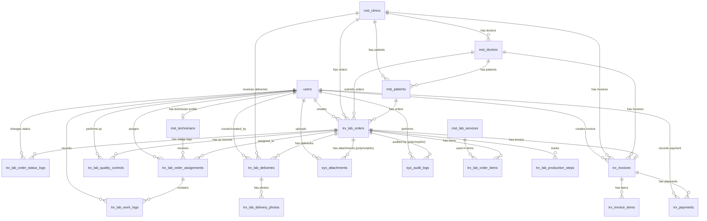
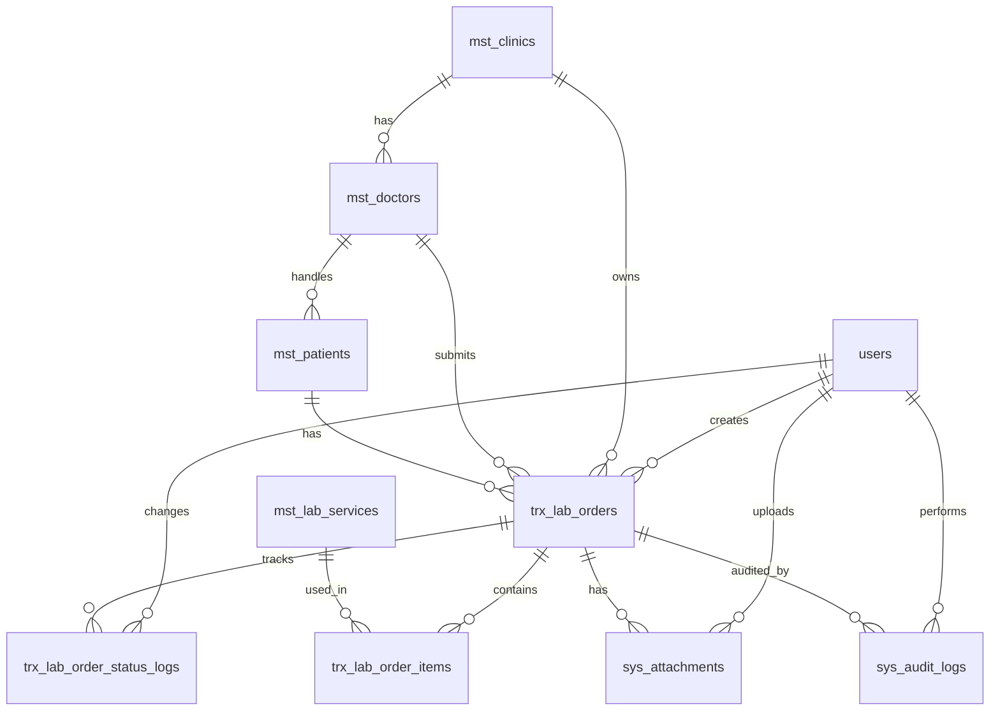
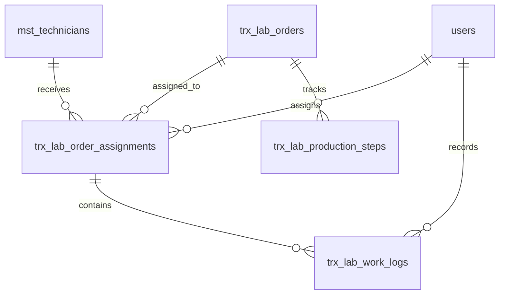
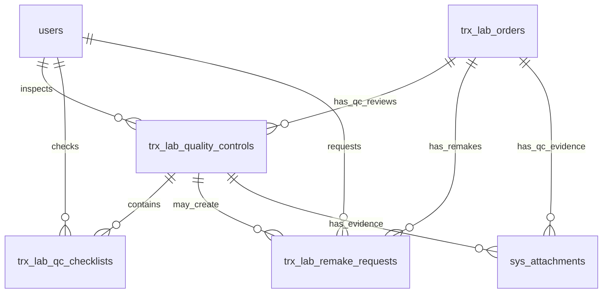

# ERD.md

# Asia Dental Lab Management System

Version: V1
Database: PostgreSQL
Architecture: Modular Monolith
Backend: Laravel 12

---

# 1. ERD Purpose

Dokumen ini menjelaskan relasi antar tabel utama pada Asia Dental Lab Management System V1.

ERD ini menjadi acuan untuk:

```text
Migration
Model Relationship
Repository
Service Layer
API
Testing
```

---

# 2. Core ERD Concept

Pusat transaksi aplikasi adalah:

```text
trx_lab_orders
```

Semua proses operasional utama berelasi ke order:

```text
Lab Order
↓
Order Items
↓
Assignment Teknisi
-> Work Logs
-> Production Steps
↓
Status Log
↓
Quality Control
↓
Delivery + POD
↓
Invoice
↓
Payment
```

---

# 3. High Level ERD

```text
users
├── mst_technicians
├── trx_lab_orders
├── trx_lab_order_status_logs
├── trx_lab_order_assignments
├── trx_lab_quality_controls
├── trx_lab_deliveries
├── trx_invoices
├── trx_payments
├── sys_attachments
└── sys_audit_logs


mst_clinics
├── mst_doctors
├── mst_patients
├── trx_lab_orders
├── trx_lab_deliveries
└── trx_invoices


mst_doctors
├── mst_patients
├── trx_lab_orders
└── trx_invoices


mst_patients
└── trx_lab_orders


mst_lab_services
└── trx_lab_order_items


mst_technicians
└── trx_lab_order_assignments


trx_lab_orders
├── trx_lab_order_items
├── trx_lab_order_status_logs
├── trx_lab_order_assignments
├── trx_lab_quality_controls
├── trx_lab_deliveries
├── trx_invoices
├── sys_attachments (polymorphic)
└── sys_audit_logs (polymorphic)


trx_lab_deliveries
└── trx_lab_delivery_photos


trx_invoices
├── trx_invoice_items
└── trx_payments
```

---

Sprint 4 high-level ERD additions:

```text
trx_lab_orders
├── trx_lab_order_items
├── trx_lab_order_status_logs
├── trx_lab_order_assignments
├── trx_lab_production_steps
├── sys_attachments (polymorphic)
└── sys_audit_logs (polymorphic)

trx_lab_order_assignments
└── trx_lab_work_logs
```

---

# 4. Mermaid ERD Diagram



---

# 5. Entity Relationship Details

## 5.1 users → mst_technicians

```text
Relationship:
users 1 → 0..1 mst_technicians

Foreign Key:
mst_technicians.user_id → users.id
```

Artinya:

```text
Satu user bisa memiliki satu profil teknisi.
Tidak semua user adalah teknisi.
```

---

## 5.2 users → trx_lab_orders

```text
Relationship:
users 1 → many trx_lab_orders

Foreign Key:
trx_lab_orders.created_by → users.id
```

Artinya:

```text
User admin membuat banyak lab order.
```

---

## 5.3 mst_clinics → mst_doctors

```text
Relationship:
mst_clinics 1 → many mst_doctors

Foreign Key:
mst_doctors.clinic_id → mst_clinics.id
```

Artinya:

```text
Satu klinik dapat memiliki banyak dokter.
```

---

## 5.4 mst_clinics → trx_lab_orders

```text
Relationship:
mst_clinics 1 → many trx_lab_orders

Foreign Key:
trx_lab_orders.clinic_id → mst_clinics.id
```

Artinya:

```text
Satu klinik dapat memiliki banyak order lab.
```

---

## 5.5 mst_doctors → trx_lab_orders

```text
Relationship:
mst_doctors 1 → many trx_lab_orders

Foreign Key:
trx_lab_orders.doctor_id → mst_doctors.id
```

Artinya:

```text
Satu dokter dapat membuat banyak order lab.
```

---

## 5.6 mst_patients → trx_lab_orders

```text
Relationship:
mst_patients 1 → many trx_lab_orders

Foreign Key:
trx_lab_orders.patient_id → mst_patients.id nullable
```

Artinya:

```text
Satu pasien dapat memiliki banyak order.
Untuk V1, patient_id boleh kosong.
```

---

## 5.7 trx_lab_orders → trx_lab_order_items

```text
Relationship:
trx_lab_orders 1 → many trx_lab_order_items

Foreign Key:
trx_lab_order_items.lab_order_id → trx_lab_orders.id
```

Artinya:

```text
Satu order wajib memiliki minimal satu item pekerjaan.
```

---

## 5.8 mst_lab_services → trx_lab_order_items

```text
Relationship:
mst_lab_services 1 → many trx_lab_order_items

Foreign Key:
trx_lab_order_items.lab_service_id → mst_lab_services.id
```

Artinya:

```text
Satu service lab bisa digunakan di banyak order item.
```

---

## 5.9 trx_lab_orders → trx_lab_order_status_logs

```text
Relationship:
trx_lab_orders 1 → many trx_lab_order_status_logs

Foreign Key:
trx_lab_order_status_logs.lab_order_id → trx_lab_orders.id
```

Artinya:

```text
Setiap perubahan status order wajib tercatat.
```

---

## 5.10 trx_lab_orders → trx_lab_order_assignments

```text
Relationship:
trx_lab_orders 1 → many trx_lab_order_assignments

Foreign Key:
trx_lab_order_assignments.lab_order_id → trx_lab_orders.id
```

Artinya:

```text
Satu order bisa memiliki satu atau lebih assignment teknisi.
```

---

## 5.11 mst_technicians → trx_lab_order_assignments

```text
Relationship:
mst_technicians 1 → many trx_lab_order_assignments

Foreign Key:
trx_lab_order_assignments.technician_id → mst_technicians.id
```

Artinya:

```text
Satu teknisi bisa mengerjakan banyak order.
```

---

## 5.12 trx_lab_orders → trx_lab_quality_controls

```text
Relationship:
trx_lab_orders 1 → many trx_lab_quality_controls

Foreign Key:
trx_lab_quality_controls.lab_order_id → trx_lab_orders.id
```

Artinya:

```text
Satu order bisa memiliki beberapa record QC, terutama jika ada revisi.
```

---

## 5.13 trx_lab_orders → trx_lab_deliveries

```text
Relationship:
trx_lab_orders 1 → many trx_lab_deliveries

Foreign Key:
trx_lab_deliveries.lab_order_id → trx_lab_orders.id
```

Artinya:

```text
Satu order dapat memiliki lebih dari satu delivery jika terjadi pengiriman ulang.
```

---

## 5.14 trx_lab_deliveries → trx_lab_delivery_photos

```text
Relationship:
trx_lab_deliveries 1 → many trx_lab_delivery_photos

Foreign Key:
trx_lab_delivery_photos.delivery_id → trx_lab_deliveries.id
```

Artinya:

```text
Satu delivery wajib memiliki minimal satu foto penerimaan.
```

---

## 5.15 trx_lab_orders → trx_invoices

```text
Relationship:
trx_lab_orders 1 → 0..1 trx_invoices

Foreign Key:
trx_invoices.lab_order_id → trx_lab_orders.id

Constraint:
trx_invoices.lab_order_id UNIQUE
```

Artinya:

```text
Untuk V1, satu order hanya boleh memiliki maksimal satu invoice.
```

---

## 5.16 trx_invoices → trx_invoice_items

```text
Relationship:
trx_invoices 1 → many trx_invoice_items

Foreign Key:
trx_invoice_items.invoice_id → trx_invoices.id
```

Artinya:

```text
Satu invoice memiliki banyak detail item tagihan.
```

---

## 5.17 trx_invoices → trx_payments

```text
Relationship:
trx_invoices 1 → many trx_payments

Foreign Key:
trx_payments.invoice_id → trx_invoices.id
```

Artinya:

```text
Satu invoice dapat memiliki banyak pembayaran karena mendukung partial payment.
```

---

## 5.18 users → trx_lab_order_assignments

```text
Relationship:
users 1 → many trx_lab_order_assignments

Foreign Key:
trx_lab_order_assignments.assigned_by → users.id
```

Artinya:

```text
User Admin Lab atau Production Manager dapat membuat banyak assignment teknisi.
```

---

## 5.19 trx_lab_order_assignments → trx_lab_work_logs

```text
Relationship:
trx_lab_order_assignments 1 → many trx_lab_work_logs

Foreign Key:
trx_lab_work_logs.assignment_id → trx_lab_order_assignments.id
```

Artinya:

```text
Satu assignment dapat memiliki banyak work session.
Work logs mencatat start work, pause work, resume work, dan complete work.
Historical work logs tidak boleh dihapus.
```

---

## 5.20 users → trx_lab_work_logs

```text
Relationship:
users 1 → many trx_lab_work_logs

Foreign Key:
trx_lab_work_logs.performed_by → users.id
```

Artinya:

```text
User teknisi, Admin Lab, atau Production Manager dapat mencatat aktivitas produksi.
```

---

## 5.21 trx_lab_orders → trx_lab_production_steps

```text
Relationship:
trx_lab_orders 1 → many trx_lab_production_steps

Foreign Key:
trx_lab_production_steps.lab_order_id → trx_lab_orders.id
```

Artinya:

```text
Satu order dapat memiliki banyak production step.
Production steps bersifat independen dari assignment records.
Steps membantu mempersiapkan order untuk QC handoff tanpa memodelkan hasil QC.
```

---

## 5.22 Sprint 4 Workflow Relationship Notes

Assignment workflow:

```text
Lab Order
↓
Assignment
↓
Work Logs
```

Rules:

```text
1. One order may have multiple assignment records over time.
2. Only one active assignment exists at any moment.
3. Reassignment creates a new assignment record.
4. Historical assignment records are preserved.
```

Work log workflow:

```text
Assignment
↓
Work Logs
```

Rules:

```text
1. One assignment can have many work sessions.
2. Work logs record start work, pause work, resume work, and complete work.
3. Historical work logs must never be deleted.
```

Production step workflow:

```text
Lab Order
↓
Production Steps
```

Rules:

```text
1. Production steps are independent from assignment records.
2. Multiple production steps can exist per order.
3. Steps prepare the order for QC.
4. Sprint 4 does not model QC results.
```

---

# 6. Cardinality Summary

| Parent             | Child                     | Cardinality |
| ------------------ | ------------------------- | ----------- |
| users              | mst_technicians           | 1 to 0..1   |
| users              | trx_lab_orders            | 1 to many   |
| users              | trx_lab_order_status_logs | 1 to many   |
| users              | trx_lab_order_assignments | 1 to many   |
| users              | trx_lab_work_logs         | 1 to many   |
| users              | trx_lab_quality_controls  | 1 to many   |
| users              | trx_lab_deliveries        | 1 to many   |
| users              | trx_invoices              | 1 to many   |
| users              | trx_payments              | 1 to many   |
| mst_clinics        | mst_doctors               | 1 to many   |
| mst_clinics        | mst_patients              | 1 to many   |
| mst_doctors        | mst_patients              | 1 to many   |
| mst_clinics        | trx_lab_orders            | 1 to many   |
| mst_clinics        | trx_lab_deliveries        | 1 to many   |
| mst_clinics        | trx_invoices              | 1 to many   |
| mst_doctors        | trx_lab_orders            | 1 to many   |
| mst_doctors        | trx_invoices              | 1 to many   |
| mst_patients       | trx_lab_orders            | 1 to many   |
| mst_lab_services   | trx_lab_order_items       | 1 to many   |
| mst_technicians    | trx_lab_order_assignments | 1 to many   |
| trx_lab_orders     | trx_lab_order_items       | 1 to many   |
| trx_lab_orders     | trx_lab_order_status_logs | 1 to many   |
| trx_lab_orders     | trx_lab_order_assignments | 1 to many   |
| trx_lab_orders     | trx_lab_production_steps  | 1 to many   |
| trx_lab_order_assignments | trx_lab_work_logs    | 1 to many   |
| trx_lab_orders     | trx_lab_quality_controls  | 1 to many   |
| trx_lab_orders     | trx_lab_deliveries        | 1 to many   |
| trx_lab_orders     | trx_invoices              | 1 to 0..1   |
| trx_lab_deliveries | trx_lab_delivery_photos   | 1 to many   |
| trx_invoices       | trx_invoice_items         | 1 to many   |
| trx_invoices       | trx_payments              | 1 to many   |

---

# 7. Polymorphic Relationships

Dua tabel sistem bersifat **polymorphic** sehingga dapat dipakai ulang oleh
banyak entitas tanpa menambah foreign key per tabel:

```text
sys_attachments
sys_audit_logs
```

Kedua tabel menggunakan pasangan kolom polymorphic yang sama
(sesuai `lab_order_design.md` Sprint 3):

```text
entity_type
entity_id
```

Digunakan untuk (Sprint 3 dan seterusnya):

```text
trx_lab_orders            (Sprint 3)
trx_lab_orders            (Sprint 4 production attachments)
trx_lab_quality_controls  (Sprint 5)
trx_lab_deliveries        (Sprint 6)
trx_invoices              (Sprint 7)
trx_payments              (Sprint 7)
```

Contoh:

```text
entity_type = trx_lab_orders
entity_id   = 1
file_path   = order-attachments/ADL-2026-000001/photo-1.jpg
```

Alasan polymorphic:

```text
Dibuat polymorphic agar attachment dan audit log dapat digunakan ulang
pada sprint berikutnya (QC, Delivery, Invoice, Payment) tanpa refactor besar.
```

> **Naming note (reconciliation).** ERD ini mengikuti `lab_order_design.md`
> yang menggunakan `entity_type` / `entity_id` untuk `sys_attachments` dan
> `sys_audit_logs`. Versi awal `database_schema.md` masih memakai
> `attachable_type` / `attachable_id` (sys_attachments) dan
> `table_name` / `record_id` (sys_audit_logs). Penyelarasan kolom pada
> `database_schema.md` berada di luar scope tugas ini (hanya `erd.md` yang
> diperbarui) dan perlu dilakukan saat implementasi migration Sprint 3.

---

# 8. Special ERD Rules

## 8.1 Lab Order sebagai pusat transaksi

```text
trx_lab_orders
```

menjadi pusat transaksi utama.

---

## 8.2 Invoice V1: One Order One Invoice

```text
trx_lab_orders 1 → 0..1 trx_invoices
```

Rule:

```text
trx_invoices.lab_order_id wajib UNIQUE.
```

---

## 8.3 Delivery boleh lebih dari satu

```text
trx_lab_orders 1 → many trx_lab_deliveries
```

Alasan:

```text
Jika terjadi pengiriman ulang atau koreksi delivery.
```

---

## 8.4 QC boleh lebih dari satu

```text
trx_lab_orders 1 → many trx_lab_quality_controls
```

Alasan:

```text
Jika hasil perlu revisi dan QC ulang.
```

---

## 8.5 POD wajib memiliki foto

```text
trx_lab_deliveries 1 → many trx_lab_delivery_photos
```

Rule:

```text
Minimal 1 foto sebelum status DELIVERED.
```

---

## 8.6 Sprint 4 Production Status Notes

Sprint 4 mengaktifkan status Lab Order berikut:

```text
ASSIGNED
IN_PRODUCTION
ON_HOLD
QC_PENDING
```

Catatan:

```text
1. RECEIVED berasal dari Sprint 3 dan menjadi titik awal assignment.
2. ASSIGNED berarti order sudah memiliki active technician assignment.
3. IN_PRODUCTION berarti teknisi sudah memulai pekerjaan.
4. ON_HOLD berarti pekerjaan tertahan sementara dengan alasan yang dicatat.
5. QC_PENDING berarti produksi selesai dan order siap diterima QC.
6. QC_PASSED dan REMAKE menjadi bagian Sprint 5.
7. Sprint 4 tidak memodelkan QC result behavior.
```

---

## 8.7 Sprint 4 Assignment and Work Log Rules

```text
1. One order may have multiple assignment records over time.
2. Only one active technician assignment exists at any moment.
3. Reassignment creates a new assignment record.
4. Work logs are immutable historical records.
5. Work logs preserve start, pause, resume, complete, and status change events.
```

---

## 8.8 Sprint 4 Production Step Rules

```text
1. trx_lab_production_steps belongs to trx_lab_orders.
2. Production steps are independent from assignment records.
3. Multiple production steps can exist per order.
4. Production steps prepare the order for QC handoff.
5. Production steps do not store QC pass, reject, or remake decisions.
```

---

# 9. Foreign Key Recommendation

## mst_doctors

```text
clinic_id → mst_clinics.id
```

## mst_technicians

```text
user_id → users.id nullable
```

## mst_patients

```text
clinic_id → mst_clinics.id
doctor_id → mst_doctors.id
```

> Added in Sprint 2 (TASK-0203): patient is captured against its referring
> clinic and doctor at registration time.

## trx_lab_orders

```text
clinic_id → mst_clinics.id
doctor_id → mst_doctors.id
patient_id → mst_patients.id nullable
created_by → users.id
```

## trx_lab_order_items

```text
lab_order_id → trx_lab_orders.id
lab_service_id → mst_lab_services.id
```

## trx_lab_order_status_logs

```text
lab_order_id → trx_lab_orders.id
changed_by → users.id
```

## trx_lab_order_assignments

```text
lab_order_id → trx_lab_orders.id
technician_id → mst_technicians.id
assigned_by → users.id
```

## trx_lab_work_logs

```text
assignment_id → trx_lab_order_assignments.id
performed_by → users.id
```

## trx_lab_production_steps

```text
lab_order_id → trx_lab_orders.id
```

## trx_lab_quality_controls

```text
lab_order_id → trx_lab_orders.id
qc_by → users.id
```

## trx_lab_deliveries

```text
lab_order_id → trx_lab_orders.id
courier_id → users.id
clinic_id → mst_clinics.id
created_by → users.id
```

## trx_lab_delivery_photos

```text
delivery_id → trx_lab_deliveries.id
uploaded_by → users.id
```

## trx_invoices

```text
lab_order_id → trx_lab_orders.id UNIQUE
clinic_id → mst_clinics.id
doctor_id → mst_doctors.id
created_by → users.id
```

## trx_invoice_items

```text
invoice_id → trx_invoices.id
lab_order_item_id → trx_lab_order_items.id
```

## trx_payments

```text
invoice_id → trx_invoices.id
created_by → users.id
```

## sys_attachments

```text
entity_type + entity_id → polymorphic (e.g. trx_lab_orders.id)
uploaded_by → users.id
```

## sys_audit_logs

```text
entity_type + entity_id → polymorphic (e.g. trx_lab_orders.id)
performed_by → users.id
```

---

# 10. Index Recommendation

## trx_lab_orders

```text
order_number UNIQUE
clinic_id INDEX
doctor_id INDEX
patient_id INDEX
status INDEX
order_date INDEX
due_date INDEX
```

## trx_lab_order_items

```text
lab_order_id INDEX
lab_service_id INDEX
```

## trx_lab_order_status_logs

```text
lab_order_id INDEX
changed_by INDEX
changed_at INDEX
```

## trx_lab_order_assignments

```text
lab_order_id INDEX
technician_id INDEX
status INDEX
```

## trx_lab_work_logs

```text
assignment_id INDEX
performed_by INDEX
event INDEX
performed_at INDEX
```

## trx_lab_production_steps

```text
lab_order_id INDEX
status INDEX
step_name INDEX
```

## trx_lab_quality_controls

```text
lab_order_id INDEX
qc_by INDEX
result INDEX
```

## trx_lab_deliveries

```text
delivery_number UNIQUE
lab_order_id INDEX
courier_id INDEX
clinic_id INDEX
status INDEX
delivery_date INDEX
```

## trx_lab_delivery_photos

```text
delivery_id INDEX
uploaded_by INDEX
```

## trx_invoices

```text
invoice_number UNIQUE
lab_order_id UNIQUE
clinic_id INDEX
doctor_id INDEX
status INDEX
invoice_date INDEX
```

## trx_invoice_items

```text
invoice_id INDEX
lab_order_item_id INDEX
```

## trx_payments

```text
payment_number UNIQUE
invoice_id INDEX
payment_date INDEX
```

## sys_attachments

```text
entity_type INDEX
entity_id INDEX
uploaded_by INDEX
```

## sys_audit_logs

```text
entity_type INDEX
entity_id INDEX
performed_by INDEX
action INDEX
performed_at INDEX
```

---

# 11. Migration Dependency Order

```text
1. users
2. roles
3. permissions
4. model_has_roles
5. role_has_permissions

6. mst_clinics
7. mst_doctors
8. mst_patients
9. mst_lab_services
10. mst_technicians

11. trx_lab_orders
12. trx_lab_order_items
13. trx_lab_order_status_logs
14. trx_lab_order_assignments
15. trx_lab_work_logs
16. trx_lab_production_steps
17. trx_lab_quality_controls
18. trx_lab_deliveries
19. trx_lab_delivery_photos
20. trx_invoices
21. trx_invoice_items
22. trx_payments

23. sys_attachments
24. sys_audit_logs
```

---

# 12. ERD Decisions

```text
1. trx_lab_orders menjadi pusat transaksi.
2. Satu order memiliki banyak order item.
3. Satu order memiliki banyak status log.
4. Satu order bisa memiliki banyak assignment.
5. Satu order bisa memiliki banyak QC.
6. Satu order bisa memiliki banyak delivery.
7. Satu delivery memiliki banyak foto POD.
8. Satu order hanya memiliki maksimal satu invoice pada V1.
9. Satu invoice dapat memiliki banyak pembayaran.
10. Attachment umum menggunakan polymorphic relation.
11. Signature disimpan di trx_lab_deliveries.signature_file_path.
12. Foto POD disimpan di trx_lab_delivery_photos.
13. Assignment teknisi disimpan sebagai histori, bukan ditimpa.
14. Work logs menyimpan sesi kerja produksi.
15. Production steps menyimpan milestone produksi sebelum QC.
```

---

# 13. Sprint 3 ERD — Lab Order Core

Bagian ini menyelaraskan ERD dengan desain **Sprint 3 — Lab Order Core**
(`lab_order_design.md`). Sprint 3 menjadikan `trx_lab_orders` sebagai pusat
transaksi pertama yang benar-benar diimplementasikan.

## 13.1 Tabel dalam scope Sprint 3

```text
trx_lab_orders
trx_lab_order_items
trx_lab_order_status_logs
sys_attachments
sys_audit_logs
```

## 13.2 Relasi yang wajib ada

```text
mst_clinics      1 → many  trx_lab_orders
mst_doctors      1 → many  trx_lab_orders
mst_patients     1 → many  trx_lab_orders
users            1 → many  trx_lab_orders            (created_by)

trx_lab_orders   1 → many  trx_lab_order_items
mst_lab_services 1 → many  trx_lab_order_items

trx_lab_orders   1 → many  trx_lab_order_status_logs
users            1 → many  trx_lab_order_status_logs (changed_by)

users            1 → many  sys_attachments           (uploaded_by)
users            1 → many  sys_audit_logs            (performed_by)

trx_lab_orders   1 → many  sys_attachments           (polymorphic)
trx_lab_orders   1 → many  sys_audit_logs            (polymorphic)
```

## 13.3 Mermaid ERD — Sprint 3



## 13.4 Aturan Polymorphic

`sys_attachments` dan `sys_audit_logs` memakai pasangan kolom polymorphic
(lihat bagian 7):

```text
sys_attachments : entity_type, entity_id
sys_audit_logs  : entity_type, entity_id
```

Keduanya dibuat polymorphic agar dapat **digunakan ulang pada sprint berikutnya**
tanpa refactor besar:

```text
QC        (Sprint 5)
Delivery  (Sprint 6)
Invoice   (Sprint 7)
Payment   (Sprint 7)
```

## 13.5 Sprint 3 ERD Decisions

```text
1.  trx_lab_orders menjadi pusat transaksi awal.
2.  Satu order memiliki satu clinic.
3.  Satu order memiliki satu doctor.
4.  Satu order memiliki satu patient.
5.  Satu order memiliki banyak item.
6.  Satu order memiliki banyak attachment.
7.  Satu order memiliki banyak status log.
8.  Satu order memiliki banyak audit log.
9.  sys_attachments menggunakan polymorphic relation.
10. sys_audit_logs menggunakan polymorphic relation.
11. Delivery, QC, Invoice, dan Payment tidak diimplementasikan pada Sprint 3.
12. ERD tetap disiapkan agar Sprint 4–7 dapat melanjutkan workflow tanpa refactor besar.
```

---

# 14. Sprint 4 ERD — Production Workflow

Bagian ini memperluas ERD Sprint 3 agar mendukung **Sprint 4 — Production Workflow**
(`production_workflow_design.md`). Sprint 4 memindahkan Lab Order dari
`RECEIVED` ke `QC_PENDING` melalui assignment teknisi, work logs, dan production
steps.

## 14.1 Tabel dalam scope Sprint 4

```text
trx_lab_order_assignments
trx_lab_work_logs
trx_lab_production_steps
trx_lab_order_status_logs
sys_attachments
sys_audit_logs
```

Catatan:

```text
trx_lab_order_status_logs, sys_attachments, dan sys_audit_logs sudah disiapkan
di Sprint 3 dan digunakan ulang pada Sprint 4.
```

Entity purpose:

| Entity | Purpose |
| --- | --- |
| `trx_lab_order_assignments` | Assignment of Lab Orders to technicians. |
| `trx_lab_work_logs` | Tracking technician work sessions. |
| `trx_lab_production_steps` | Tracking production progress and milestones. |

## 14.2 Relasi yang wajib ada

```text
trx_lab_orders
  1 -> many trx_lab_order_assignments

mst_technicians
  1 -> many trx_lab_order_assignments

users
  1 -> many trx_lab_order_assignments (assigned_by)

trx_lab_order_assignments
  1 -> many trx_lab_work_logs

users
  1 -> many trx_lab_work_logs (performed_by)

trx_lab_orders
  1 -> many trx_lab_production_steps
```

## 14.3 Assignment Workflow Relationships

```text
Lab Order
-> Assignment
-> Work Logs
```

Rules:

```text
1. One order may have multiple assignment records over time.
2. Only one active assignment exists at any moment.
3. Reassignment creates a new assignment record.
4. Historical assignment records are preserved.
```

## 14.4 Work Log Relationships

```text
Assignment
-> Work Logs
```

Rules:

```text
1. One assignment can have many work sessions.
2. Work logs record start work, pause work, resume work, and complete work.
3. Historical work logs must never be deleted.
```

## 14.5 Production Step Relationships

```text
Lab Order
-> Production Steps
```

Rules:

```text
1. Production steps are independent from assignment records.
2. Multiple production steps can exist per order.
3. Steps prepare the order for QC.
4. QC results are not modeled in Sprint 4.
```

## 14.6 Mermaid ERD — Sprint 4



## 14.7 Sprint 4 Status Notes

Sprint 4 activates:

```text
ASSIGNED
IN_PRODUCTION
ON_HOLD
QC_PENDING
```

Notes:

```text
1. RECEIVED comes from Sprint 3.
2. ASSIGNED, IN_PRODUCTION, ON_HOLD, and QC_PENDING are active in Sprint 4.
3. QC_PENDING is only QC handoff preparation.
4. QC_PASSED and REMAKE belong to Sprint 5.
5. Sprint 4 does not model Sprint 5 QC workflow.
```

## 14.8 Sprint 4 ERD Decisions

```text
1. Assignment history must be preserved.
2. Only one active technician assignment per order.
3. Reassignment creates a new assignment record.
4. Work logs are immutable historical records.
5. Production steps support future reporting.
6. Production steps prepare QC handoff.
7. QC entities are not part of Sprint 4.
8. Delivery entities are not part of Sprint 4.
9. Invoice entities are not part of Sprint 4.
10. Payment entities are not part of Sprint 4.
```

## 14.9 Sprint 4 ERD Validation Checklist

```text
✓ Assignment entity present
✓ Work Log entity present
✓ Production Step entity present
✓ Assignment relationships documented
✓ Work Log relationships documented
✓ Production Step relationships documented
✓ Mermaid diagram updated
✓ Existing Sprint 1-3 relations preserved
✓ Sprint 5 entities excluded from Sprint 4 scope
✓ Sprint 6 entities excluded from Sprint 4 scope
```

---

# 15. Sprint 5 ERD - Quality Control Workflow

Bagian ini memperluas ERD Sprint 3 dan Sprint 4 agar mendukung **Sprint 5 -
Quality Control Workflow** (`qc_workflow_design.md`). Sprint 5 memproses Lab
Order dari `QC_PENDING` menjadi `QC_PASSED` atau `REMAKE`.

Sprint 5 tidak mengimplementasikan Delivery, Proof of Delivery, Invoice,
Payment, atau Reporting dashboard.

## 15.1 Tabel dalam scope Sprint 5

```text
trx_lab_quality_controls
trx_lab_qc_checklists
trx_lab_remake_requests
trx_lab_order_status_logs
sys_attachments
sys_audit_logs
```

Catatan:

```text
trx_lab_order_status_logs, sys_attachments, dan sys_audit_logs sudah disiapkan
di Sprint 3 dan digunakan ulang pada Sprint 5.
```

Entity purpose:

| Entity | Purpose |
| --- | --- |
| `trx_lab_quality_controls` | Stores each QC review session for a Lab Order. |
| `trx_lab_qc_checklists` | Stores checklist items and results per QC review. |
| `trx_lab_remake_requests` | Stores remake request details when QC result requires remake. |
| `sys_attachments` | Stores QC evidence by polymorphic `entity_type` and `entity_id`. |

## 15.2 High-Level ERD Update

```text
trx_lab_orders
|-- trx_lab_quality_controls
|-- trx_lab_remake_requests
|-- sys_attachments (QC evidence via polymorphic)
`-- sys_audit_logs

trx_lab_quality_controls
|-- trx_lab_qc_checklists
|-- trx_lab_remake_requests
`-- sys_attachments (QC evidence via polymorphic)
```

QC photos/evidence:

```text
QC evidence uses sys_attachments.
trx_lab_qc_photos is not used in V1 unless later required by schema or compliance.
```

## 15.3 Required Relationships

```text
trx_lab_orders
  1 -> many trx_lab_quality_controls

users
  1 -> many trx_lab_quality_controls (inspected_by / qc_by)

trx_lab_quality_controls
  1 -> many trx_lab_qc_checklists

trx_lab_quality_controls
  1 -> many trx_lab_remake_requests

trx_lab_orders
  1 -> many trx_lab_remake_requests

users
  1 -> many trx_lab_remake_requests (requested_by)

trx_lab_quality_controls
  polymorphic -> sys_attachments as QC evidence

trx_lab_orders
  polymorphic -> sys_attachments as order-level QC evidence
```

Implementation naming note:

```text
The existing schema uses qc_by on trx_lab_quality_controls.
Sprint 5 ERD treats qc_by as the inspector/inspected_by relationship.
```

## 15.4 Mermaid ERD - Sprint 5



This Mermaid diagram extends the main ERD and must be merged with existing
Sprint 1-4 relationships during implementation. Existing relationships must not
be removed.

## 15.5 Entity Relationship Details

### trx_lab_orders -> trx_lab_quality_controls

```text
Relationship:
trx_lab_orders 1 -> many trx_lab_quality_controls

Foreign Key:
trx_lab_quality_controls.lab_order_id -> trx_lab_orders.id
```

Meaning:

```text
One Lab Order can have many QC review records, especially when remake requires
another QC cycle.
```

### users -> trx_lab_quality_controls

```text
Relationship:
users 1 -> many trx_lab_quality_controls

Foreign Key:
trx_lab_quality_controls.qc_by -> users.id
```

Meaning:

```text
One QC Inspector can perform many QC reviews.
```

### trx_lab_quality_controls -> trx_lab_qc_checklists

```text
Relationship:
trx_lab_quality_controls 1 -> many trx_lab_qc_checklists

Foreign Key:
trx_lab_qc_checklists.qc_id -> trx_lab_quality_controls.id
```

Meaning:

```text
One QC review has many checklist item results.
```

### trx_lab_quality_controls -> trx_lab_remake_requests

```text
Relationship:
trx_lab_quality_controls 1 -> many trx_lab_remake_requests

Foreign Key:
trx_lab_remake_requests.qc_id -> trx_lab_quality_controls.id
```

Meaning:

```text
One QC review may create one or more remake request records when result is
REJECTED or REVISION.
```

### trx_lab_orders -> trx_lab_remake_requests

```text
Relationship:
trx_lab_orders 1 -> many trx_lab_remake_requests

Foreign Key:
trx_lab_remake_requests.lab_order_id -> trx_lab_orders.id
```

Meaning:

```text
One Lab Order can have many remake requests across repeated QC cycles.
```

### users -> trx_lab_remake_requests

```text
Relationship:
users 1 -> many trx_lab_remake_requests

Foreign Key:
trx_lab_remake_requests.requested_by -> users.id
```

Meaning:

```text
One QC Inspector or authorized Admin Lab user can request many remakes.
```

### trx_lab_quality_controls -> sys_attachments

```text
Relationship:
trx_lab_quality_controls polymorphic -> many sys_attachments

Polymorphic fields:
sys_attachments.entity_type = trx_lab_quality_controls
sys_attachments.entity_id   = trx_lab_quality_controls.id
```

Meaning:

```text
QC evidence such as photos, rejection proof, reference images, and QC documents
are stored through sys_attachments.
```

### trx_lab_orders -> sys_attachments for QC evidence

```text
Relationship:
trx_lab_orders polymorphic -> many sys_attachments

Polymorphic fields:
sys_attachments.entity_type = trx_lab_orders
sys_attachments.entity_id   = trx_lab_orders.id
```

Meaning:

```text
Order-level QC evidence can also be attached directly to Lab Order when the file
needs to be visible across Production, QC, and future Delivery handoff.
```

## 15.6 Recommended Entity Fields

### trx_lab_quality_controls

```text
id
lab_order_id
qc_by
qc_date
started_at
completed_at
result
notes
created_at
updated_at
```

Allowed QC result:

```text
PASSED
REJECTED
REVISION
```

### trx_lab_qc_checklists

```text
id
qc_id
checklist_item
result
notes
checked_by
checked_at
created_at
updated_at
```

Allowed checklist result:

```text
PASS
FAIL
N/A
```

### trx_lab_remake_requests

```text
id
lab_order_id
qc_id
reason
notes
requested_by
requested_at
assigned_technician_id
status
created_at
updated_at
deleted_at
```

Recommended remake request status:

```text
OPEN
ASSIGNED
IN_PRODUCTION
RETURNED_TO_QC
CLOSED
```

## 15.7 QC Evidence Categories

QC evidence uses:

```text
sys_attachments
```

Recommended `category` values:

```text
QC_PHOTO
QC_REJECTION_PROOF
QC_REFERENCE_IMAGE
QC_NOTE
QC_DOCUMENT
```

Rules:

```text
1. Do not create trx_lab_qc_photos in V1.
2. Store file path only in sys_attachments.
3. Attach decision-specific evidence to trx_lab_quality_controls.
4. Attach general order evidence to trx_lab_orders.
5. Upload and delete actions must be audited.
```

## 15.8 Status Flow Notes

Sprint 5 status flow:

```text
QC_PENDING
   |
   v
QC REVIEW
   |
   |-- PASSED   -> QC_PASSED
   |
   |-- REJECTED -> REMAKE
   |
   |-- REVISION -> REMAKE
```

Important distinction:

```text
QC Result:
PASSED, REJECTED, REVISION

Lab Order Status:
QC_PASSED, REMAKE
```

Rules:

```text
1. QC REVIEW is an operational activity, not a Lab Order status.
2. PASSED, REJECTED, and REVISION are QC result values.
3. QC_PASSED and REMAKE are Lab Order statuses.
4. REVISION must not be used as Lab Order status.
5. REMAKE is used for both REJECTED and REVISION QC results.
```

## 15.9 Remake Flow Notes

Remake flow:

```text
QC_PENDING
-> REMAKE
-> ASSIGNED
-> IN_PRODUCTION
-> QC_PENDING
```

Rules:

```text
1. Remake preserves QC history.
2. Remake creates a trx_lab_remake_requests record.
3. Remake does not delete original production data.
4. Remake does not delete original assignment records.
5. Remake does not delete original work logs.
6. Remake reuses Sprint 4 Production Workflow.
7. Returning to QC creates another QC review cycle.
```

## 15.10 Foreign Key Additions

```text
trx_lab_qc_checklists.qc_id       -> trx_lab_quality_controls.id
trx_lab_qc_checklists.checked_by  -> users.id

trx_lab_remake_requests.lab_order_id -> trx_lab_orders.id
trx_lab_remake_requests.qc_id        -> trx_lab_quality_controls.id
trx_lab_remake_requests.requested_by -> users.id
```

Optional reference:

```text
trx_lab_remake_requests.assigned_technician_id -> mst_technicians.id
```

## 15.11 Index Additions

```text
trx_lab_qc_checklists.qc_id INDEX
trx_lab_qc_checklists.result INDEX
trx_lab_qc_checklists.checked_by INDEX

trx_lab_remake_requests.lab_order_id INDEX
trx_lab_remake_requests.qc_id INDEX
trx_lab_remake_requests.requested_by INDEX
trx_lab_remake_requests.status INDEX
trx_lab_remake_requests.requested_at INDEX

sys_attachments.entity_type INDEX
sys_attachments.entity_id INDEX
sys_attachments.category INDEX
```

## 15.12 Migration Dependency Order Additions

Sprint 5 entities should be created after `trx_lab_quality_controls` and before
Delivery entities:

```text
17. trx_lab_quality_controls
18. trx_lab_qc_checklists
19. trx_lab_remake_requests
20. trx_lab_deliveries
```

`sys_attachments` and `sys_audit_logs` remain shared system tables.

## 15.13 Sprint 5 ERD Decisions

```text
1. QC review is stored in trx_lab_quality_controls.
2. QC checklist items are stored in trx_lab_qc_checklists.
3. QC evidence reuses sys_attachments.
4. trx_lab_qc_photos is not used in V1 unless later required.
5. QC result and Lab Order status are separate concepts.
6. PASSED, REJECTED, and REVISION are QC results.
7. QC_PASSED and REMAKE are Lab Order statuses.
8. Remake requests are stored in trx_lab_remake_requests.
9. Remake preserves original QC, production, and order history.
10. Remake reuses Sprint 4 Production Workflow.
11. Delivery is not part of Sprint 5.
12. Invoice is not part of Sprint 5.
13. Payment is not part of Sprint 5.
14. Reporting is not part of Sprint 5.
```

## 15.14 Sprint 5 ERD Validation Checklist

```text
- QC review entity present
- QC checklist entity present
- Remake request entity present
- QC evidence uses sys_attachments
- QC photos table excluded
- QC result vs Lab Order status documented
- Remake flow documented
- Mermaid diagram updated
- Existing Sprint 1-4 relationships preserved
- Delivery excluded
- Invoice excluded
- Payment excluded
- Reporting excluded
```

---

# 16. V2 ERD Candidates

Fitur berikut tidak masuk ERD V1:

```text
mst_materials
mst_shade_colors
sys_notifications
inventory_material_lab
whatsapp_notifications
gps_tracking
customer_portal
mobile_app
```
