# Android production signing governance

**REVISION-DOCTOR-ANDROID-DIRECT-APK-SIGNING-DISTRIBUTION-1 — durable authority.**

Decision and rationale: [ADR 0010](../adr/0010-android-direct-apk-signing-and-distribution.md)
(supersedes [ADR 0009](../adr/0009-android-production-signing-distribution-and-device-management.md)).
Machine-readable form: `config/android_release.php`.
Gates: `php artisan android:release-readiness --strict` ·
`php artisan android:verify-release <apk> <manifest>`.

This document is the standing answer to "who may sign the DaengtisiaMS Clinic
app, with what, kept where, and what happens when that goes wrong". It is
written to be read by someone under time pressure during an incident.

> **Google Play is NOT used.** Managed Google Play, Play App Signing and a Play
> Developer account are **not required** for anything. Distribution is a signed
> APK installed directly by authorised DaengtisiaMS Admin/IT.

> **Status:** no production signing identity has been created yet. Everything
> below is binding from the moment it is.

---

## 1. The trust chain

Every link is a place trust can be lost. There is no third party in it.

```mermaid
flowchart LR
  A["Git commit<br/>reviewed, merged"] --> B["CI build<br/>no signing key"]
  B --> C["Release build<br/>signing workstation"]
  C --> D["DaengtisiaMS signing key<br/>UNRECOVERABLE if lost"]
  D --> E["Signed APK<br/>+ release manifest"]
  E --> F["Release source<br/>access-controlled"]
  F --> G["Authorised Admin/IT<br/>verifies SHA-256 + signer"]
  G --> H["Dedicated tablet<br/>Device Owner + Lock Task"]
  H --> I["Device enrolment<br/>Keystore identity"]
  I --> J["Doctor session<br/>branch + room scoped"]

  style D fill:#fecaca,stroke:#b91c1c,color:#000
  style G fill:#fde68a,stroke:#b45309,color:#000
  style H fill:#bbf7d0,stroke:#15803d,color:#000
```



| Zone | Holds | Loss impact | Recoverable? |
|---|---|---|---|
| **Signing (red)** | production app signing key | app can never be updated; forced reinstall destroys **every** device enrolment | **NO** — this is the one |
| Installer (amber) | nothing secret | an install is repeated | yes |
| Device (green) | per-device Keystore identity | that device re-enrols | yes |

Under ADR 0009 this diagram had **no unrecoverable link in clinic custody**,
because Google held the permanent key. It does now. That is the trade the owner
made, and every rule below exists because of it.

---

## 2. Roles

Named roles, not named people. Current holders live in the clinic's operations
register, which is where a departure is actually noticed.

| Role | Responsibility | Count |
|---|---|---|
| **Signing custodian (primary)** | holds the encrypted keystore and its credential; performs release signing | 1 |
| **Signing custodian (recovery)** | holds the offsite encrypted copy; never signs routinely | 1 |
| **Signing custodian (cold)** | holds a sealed third copy, opened only on a declared key-loss incident | 1 |
| **Authorised installer (Admin/IT)** | verifies and installs the APK on clinic devices | ≥1 |

**Three custodians, not two.** ADR 0009 was satisfied with two because a lost
upload key could be reset. Nothing can reset this one, so two simultaneous
losses would be terminal.

**Application Super Admin is not an installer authority.** A DaengtisiaMS Super
Admin approves a device in Master Data → Device Dokter. Installing an
operating-system package on clinic hardware is a separate, IT-side permission
and is not implied by any application role.

**Signer and installer should be different people** where headcount allows. It
means a compromised installer workstation cannot produce a signed artifact, and
a compromised signing workstation cannot reach the tablets. Below that
headcount, record the exception rather than pretending it is not one.

---

## 3. Where the signing key may live

**Permitted**

- an encrypted offline medium held by the primary custodian
- an encrypted attachment in the organisation password manager, limited to the
  custodian roles
- an encrypted offsite recovery medium

**Forbidden — each has a failure attached**

| Location | Failure |
|---|---|
| Any git repository | history is permanent and repositories become public |
| Unencrypted shared network drive | everyone with the share is a release authority |
| Unencrypted workstation home directory | one stolen laptop is one stolen release identity |
| A CI secret readable by pull-request jobs | untrusted code signs releases |
| Chat or email attachment | unbounded copies, no revocation |
| Unencrypted cloud sync folder | silent replication to devices nobody audited |
| A clinic Android device | the device is the thing being protected |
| The production VPS | the server signs nothing and has no reason to hold it |

Enforced where mechanism is possible: `no_committed_key_material` checks the
**git index** (an ignored file on disk proves nothing about history), and
`keystore_ignored` checks that a local key cannot be staged by accident.

---

## 4. Credentials

The keystore password and key password are secrets of the same order as the
keystore. A keystore with its password beside it is a keystore with no password.

- stored in the organisation password manager, in a **separate entry** from the
  keystore file
- never on a command line (shell history is a file), never in a Gradle
  properties file that could be committed, never in a commit message or ticket
- rotated when a custodian changes

---

## 5. Backup and recovery

Three copies, all encrypted, one offsite, one sealed cold.

| Property | Requirement | Play-era value |
|---|---|---|
| Copies | **3** | 2 |
| Encryption | required, all copies | same |
| Offsite | required | same |
| Restore drill | every **90 days** | 180 |

A backup that has never been restored is a belief, not a backup. The drill is in
[`android-signing-key-backup-and-recovery.md`](../runbooks/android-signing-key-backup-and-recovery.md)
and takes about fifteen minutes.

**Key lost — this is the incident that matters.** There is no reset. Restore
from backup. If every copy is gone, the app can never be updated again: recovery
requires publishing under a **new package name** or uninstalling and reinstalling
on every device, and uninstall erases app data, which destroys the Keystore
identity, which means **the entire fleet re-enrols by hand**. Declare it an
incident, not a task.

**Key compromised.** An attacker who holds this key can sign an APK that
installs as an *update* over the legitimate app, inheriting its package identity.
Stop all distribution, notify custodians, audit the release source for artifacts
DaengtisiaMS did not publish, and verify every deployed device's installed
signer fingerprint. Recovery realistically means a new signing identity and a
new package name — plan the incident on that basis.

---

## 6. Release process

1. Merge to the base branch; required CI green.
2. Set `versionName` and `versionCode` — `versionCode` **strictly greater** than
   the last published value. Android only enforces `>=`; the strict rule is ours.
3. Build the release APK on the **designated signing workstation**, under manual
   approval. Never automatically on push.
4. Sign with the DaengtisiaMS production key.
5. Generate the release manifest (§7).
6. Verify before publishing:
   `php artisan android:verify-release <apk> <manifest>`
7. Publish to the access-controlled release source.
8. Authorised Admin/IT verifies again before installing (§7), then installs.

**Pull-request CI never signs.** It has no access to the key and no step that
needs one; `android:release-readiness` is safe on a fork PR because it holds
nothing.

---

## 7. Release manifest

Every release is accompanied by a manifest, and both the publisher and the
installer verify against it:

```
package_name · version_name · version_code · git_commit · ci_run_id
build_variant · apk_filename · artifact_sha256
signing_certificate_fingerprint_sha256 · release_channel · approval_status
```

The certificate fingerprint is a **public identifier**, not a secret — it is how
you prove a tablet is running an artifact from the right authority. Recording it
is what makes "is this the build we tested?" answerable six months later.

**The manifest's copy of the fingerprint is not the authority.** The authority is
the pin in `config/android_release.signing.production_certificate_sha256`, and
the APK is verified against that. A manifest travelling beside an APK cannot
vouch for it: an attacker who replaces one replaces the other. Publish the
fingerprint (it is public), pin it in configuration, and treat the manifest's
copy as a cross-check.

While the pin is `null`, `android:verify-release` fails closed. Pinning it is a
Phase-4 entry step, performed together with provisioning the key.

The manifest never contains key material.

---

## 8. Rotation

Android 13+ supports signing-key rotation via the v3.1 signing block, but it is
constrained and does not help devices on older releases. **Treat the key as
permanent** and plan custody accordingly rather than banking on rotation.

---

## 9. What must never happen

1. A production release signed by the **debug** key — a publicly known identity
   anyone can sign an update over. Gate: `release_not_debug_signed`.
2. Key material committed to git. Gate: `no_committed_key_material`.
3. A signing key reachable from pull-request CI. Gate:
   `pull_request_ci_cannot_sign`.
4. A **decremented or reused** `versionCode`. Gate:
   `version_code_policy_monotonic`. Note Android alone would *not* catch a
   reused one.
5. An APK installed without verifying its SHA-256 **and** signer fingerprint.
6. A production key created "to unblock a sprint" without recorded custody.
7. Describing a locally signed or debug artifact as a production release.
8. Reintroducing a Google Play dependency without a new ADR. Gate:
   `google_play_not_required`.

---

## 10. Relationship to the rest of the programme

- Device identity and private-key custody **on the tablet** are a different
  subject: those are per-device Keystore keys, unrelated to app signing.
  `.cursor/rules/140-android-clinic-device-identity.mdc`. Keeping the two apart
  matters, because "the key" means different things in each conversation.
- Device registry lifecycle: `.cursor/rules/139-doctor-device-registry.mdc`.
- Direct-APK release rules: `.cursor/rules/142-android-direct-apk-signing-distribution.mdc`.
- Doctor room scope and print denial: Phase 1, unchanged.
- Enforcement rollout: designed in Phase 3.5, activated in Phase 5. Enforcement
  is **off** and there is no flag to flip.
