# Android production signing governance

**FEATURE-DOCTOR-TRUSTED-ANDROID-DEVICE-LOCK-1 Phase 3.5 — durable authority.**

Decision and rationale: [ADR 0009](../adr/0009-android-production-signing-distribution-and-device-management.md).
Machine-readable form: `config/android_release.php`.
Gate: `php artisan android:release-readiness --strict`.

This document is the standing answer to "who may sign the DaengtisiaMS Clinic
app, with what, kept where, and what happens when that goes wrong". It is
written to be read by someone under time pressure during an incident.

> **Status as of Phase 3.5:** no production signing identity has been created.
> This document says how it must be created and held. Everything below is
> binding from the moment the Play Developer account exists.

---

## 1. The trust chain

Every link is a place trust can be lost. The chain is short on purpose.

```mermaid
flowchart LR
  A["Git commit<br/>reviewed, merged"] --> B["CI build<br/>no signing key"]
  B --> C["Release build<br/>protected environment"]
  C --> D["Upload key<br/>clinic-held, RESETTABLE"]
  D --> E["Play App Signing<br/>Google KMS, permanent"]
  E --> F["Managed Google Play<br/>private, org-restricted"]
  F --> G["Dedicated tablet<br/>Device Owner + Lock Task"]
  G --> H["Device enrolment<br/>Keystore identity"]
  H --> I["Doctor session<br/>branch + room scoped"]

  style D fill:#fde68a,stroke:#b45309,color:#000
  style E fill:#bfdbfe,stroke:#1d4ed8,color:#000
  style G fill:#bbf7d0,stroke:#15803d,color:#000
```



Read it as three custody zones:

| Zone | Holds | Loss impact | Recoverable? |
|---|---|---|---|
| Clinic (amber) | upload key | cannot publish until reset | **yes** — Play Console reset |
| Google (blue) | app signing key | — | n/a, not ours to lose |
| Device (green) | per-device Keystore identity | that device must re-enrol | yes, by re-enrolment |

The design goal was to leave **no unrecoverable link in clinic custody**. That
is achieved: the only permanent key lives in Google KMS.

---

## 2. Roles

Named roles, not named people. People change; the governance should not need a
commit when they do. The current holders are recorded in the clinic's
operations register, which is where a departure is actually noticed.

| Role | Responsibility | Count |
|---|---|---|
| **Signing custodian (primary)** | holds the encrypted upload keystore and its credential | 1 |
| **Signing custodian (recovery)** | holds the offsite encrypted copy; never signs routinely | 1 |
| **Release operator** | performs release builds and uploads; may be a custodian | ≥1 |
| **Play Console admin** | manages the developer account and app-signing enrolment | ≥1, a *role account* |

Two custodians is the minimum. One custodian is not custody, it is a single
laptop.

**Play Console admin must be a dedicated role account**, not an individual's
personal Google account. Google's own guidance for private apps says this, and
the failure it prevents is mundane and fatal: an employee leaves, their account
is deprovisioned, and the organisation loses administrative access to its own
published app.

Separation of duty: the release operator and the Play Console admin should not
be the same person where headcount allows. Below that headcount, record the
exception rather than pretending it is not one.

---

## 3. Where the upload key may live

**Permitted**

- an encrypted offline medium held by the primary custodian
- an encrypted attachment in the organisation password manager, access-limited
  to the custodian roles

**Forbidden — each has a failure attached**

| Location | Failure |
|---|---|
| Any git repository | history is permanent and repositories become public |
| Unencrypted shared network drive | everyone with the share is a release authority |
| Unencrypted workstation home directory | one stolen laptop is one stolen release identity |
| A CI secret readable by pull-request jobs | untrusted code signs releases |
| Chat or email attachment | unbounded copies, no revocation |
| Unencrypted cloud sync folder | silent replication to devices nobody audited |

Enforced mechanically where mechanism is possible: `no_committed_key_material`
checks the **git index** (not the working tree — an ignored file on disk proves
nothing about history), and `keystore_ignored` checks that a local key cannot be
staged by accident.

---

## 4. Credentials

The keystore password and key password are secrets of the same order as the
keystore. A keystore with its password beside it is a keystore with no password.

- stored in the organisation password manager, in a separate entry from the
  keystore file
- never passed on a command line (shell history), never written into a Gradle
  properties file that could be committed, never in a commit message or a
  ticket
- rotated when a custodian changes

---

## 5. Backup and recovery

Two copies, both encrypted, one offsite.

| Property | Requirement |
|---|---|
| Copies | 2 (primary custodian + offsite recovery) |
| Encryption | required, both copies |
| Offsite | required |
| Restore test | every **180 days**, and after any custodian change |

A backup that has never been restored is a belief, not a backup. The restore
drill is in
[`android-signing-key-backup-and-recovery.md`](../runbooks/android-signing-key-backup-and-recovery.md)
and takes about fifteen minutes.

**Upload key lost** — reset it through Play Console. Publishing is blocked until
the new upload certificate is registered; the app already in the field is
unaffected because Google still holds the signing key. This is an outage of
*releases*, not of the clinic.

**Upload key compromised** — treat as lost, urgently: revoke and reset before
the next release, then audit Play Console release history for uploads the
clinic did not make. A compromised upload key lets an attacker submit a build;
it does not let them sign one that installs outside Play.

**App signing key** — held by Google. Not ours to lose, and the reason it is
theirs.

---

## 6. Release process

1. Merge to the base branch; required CI green.
2. Set `versionName` and `versionCode` — `versionCode` strictly greater than the
   last published value, always.
3. Build the App Bundle in the **protected release environment**, with manual
   approval. Never automatically on push.
4. Sign with the upload key.
5. Upload to Managed Google Play as a private app release.
6. Record the release manifest (§7) and validate it:
   `php artisan android:release-readiness --manifest=<file> --strict`
7. Staged rollout. Watch the observability signals in the release runbook before
   widening.

**Pull-request CI never signs.** It has no access to the key and no step that
needs one; `android:release-readiness` runs safely on a fork PR because it holds
nothing.

---

## 7. Release manifest

Every release records, and the gate enforces the presence of:

```
version_name
version_code
git_commit
ci_run_id
artifact_sha256
signing_certificate_fingerprint_sha256
release_channel
```

The certificate fingerprint is a **public identifier**, not a secret — it is how
you prove a tablet is running an artifact from the right authority. Recording it
is what makes "is this the build we tested?" answerable six months later.

---

## 8. Rotation

- **App signing key** — constrained; treat as permanent. Do not plan around
  rotating it.
- **Upload key** — resettable through Play Console. Rotate on custodian change
  or suspected compromise.

This asymmetry is the whole reason for the Play App Signing decision. It is not
an implementation detail.

---

## 9. What must never happen

1. A production release signed by the **debug** key. It is a publicly known
   identity; anyone can sign an update over it. Gate:
   `release_not_debug_signed`.
2. Key material committed to git. Gate: `no_committed_key_material`.
3. A signing key reachable from pull-request CI. Gate:
   `pull_request_ci_cannot_sign`.
4. A **decremented or reused** `versionCode`. Play rejects it; Android blocks the
   install. Gate: `version_code_policy_monotonic`.
5. A production key created "to unblock a sprint" without recorded custody. A key
   nobody owns is a key nobody can find in an incident. Phase 3.5 deliberately
   ships with **no** production key rather than an unowned one.
6. Describing a locally signed or debug artifact as a production release.

---

## 10. Relationship to the rest of the programme

- Device identity, private-key custody **on the tablet**, and the challenge/
  response protocol: `.cursor/rules/140-android-clinic-device-identity.mdc`.
  Those are per-device Keystore keys and have nothing to do with app signing —
  keeping the two apart matters, because "the key" means different things in
  each conversation.
- Device registry lifecycle: `.cursor/rules/139-doctor-device-registry.mdc`.
- Doctor room scope and print denial: Phase 1, unchanged by anything here.
- Enforcement rollout: designed in
  [the Phase 3.5 sprint doc](../sprints/feature-doctor-trusted-android-device-lock-1-phase-3-5.md),
  activated in Phase 5. Enforcement is **off** and there is no flag to flip.
