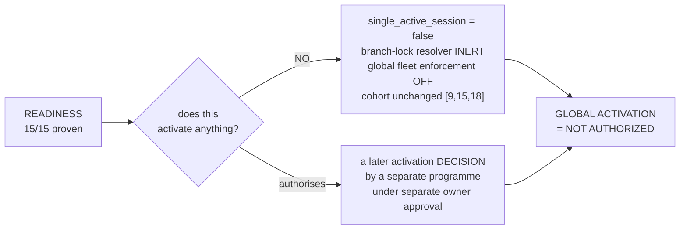

# DOCTOR-ACCESS-FLEET-ROLLOUT-READINESS-1 — CLOSURE EVIDENCE

**Runtime authority:** `023e30cd379987034508fbc96fe8c13a8647ef3c` · tree `f45e6ddd6443eca4c9a62dd4801e2589bc88357e`
No runtime source changed during this session. Production, the base branch tip and
the tested tree are the same commit.

---

## 1. Where the fleet stands

```
                    REAL DEVICE READY

                         15 / 15
                    ▔▔▔▔▔▔▔▔▔▔▔▔▔▔▔
                    every eligible doctor has
                    walked a trusted path once
```

| | | |
|---|---|---|
| **Eligible doctors** | **15** | Doctor role + active doctor record |
| **Home-branch locked** | **15** | every lock points at a live branch |
| **UNSET** | **0** | owner decision O1 satisfied fleet-wide |
| **Authorization matrix** | **45 / 45** | 15 doctors × 3 eligible tablets |
| **Missing pairs** | **0** | |
| **Duplicate active pairs** | **0** | |
| **Eligible trusted devices** | **3** | ids `[3, 5, 6]` — estate holds 5, two revoked |
| **Devices carrying a proof** | **3 / 3** | no unproven eligible tablet |
| **Verdict** | **READY** | |

`READY = [9, 12, 14, 15, 18, 19, 20, 21, 22, 23, 24, 25, 26, 27, 28]`
`ELIGIBLE − READY = ∅`

## 2. What that does and does not switch on

This is the distinction the whole programme exists to keep straight.



| posture | value |
|---|---|
| `doctor.single_active_session` | **false** |
| `doctor.branch_lock` (flag) | **true** |
| `BRANCH_LOCK_EFFECTIVE` | **false** — the resolver also needs `single_active_session` |
| `CURRENT_BROWSER_ENFORCEMENT_SCOPE` | `[9, 15, 18]` — unchanged throughout |
| `SCOPED_BROWSER_DEVICE_ENFORCEMENT_ACTIVE` | **YES** (those three doctors) |
| `GLOBAL_FLEET_ENFORCEMENT_ACTIVE` | **false** |
| `GLOBAL_PERMITTED` | **false** |
| `GLOBAL_ACTIVATION_AUTHORIZED` | **NO** |

**Readiness GO is capability evidence, not enforcement.** Fifteen clinicians can
reach a clinical session through a trusted tablet. Nothing about what the system
*requires* of them changed today.

## 3. The six ceremonies

Each doctor: physical presence confirmed by a human → tablet confirmed in hand →
just-in-time precheck → the clinician typed her own credentials on the tablet →
server-side proof located and correlated → canonical logout → reconciled.
Serial throughout; never two campaign doctors authenticated at once.

| # | doctor | user / doctor | REQ → SUCCESS | UTC | WITA (UTC+08:00) | auth / device | result |
|---|---|---|---|---|---|---|---|
| 1 | drg Ilmiah | 22 / 25 | 833 → **834** | 07:40:09 | 15:40:09 | 30 / 3 | PASS |
| 2 | drg Ega | 23 / 26 | 835 → **836** | 07:44:08 | 15:44:08 | 33 / 3 | PASS |
| 3 | drg Syifa | 24 / 27 | 837 → **838** | 07:46:56 | 15:46:56 | 36 / 3 | PASS |
| 4 | drg Yudya | 25 / 28 | 839 → **840** | 07:48:32 | 15:48:32 | 39 / 3 | PASS |
| 5 | drg Syahrul | 26 / 29 | 841 → **842** | 07:50:37 | 15:50:37 | 42 / 3 | PASS |
| 6 | drg Wahyuni | 27 / 30 | 845 → **846** | 07:56:51 | 15:56:51 | 45 / 3 | PASS |

All six on device **3** (`PHASE4A_PILOT_TABLET_02` @ SPN4), the same branch as
every doctor's HOME lock. For each: device active and cryptographically verified
with `revoked_at` NULL at proof time, authorization `active` and genuinely the
named (doctor, device) pair, HOME lock byte-identical before and after with
`transfer_count` 0 → 0, engine `READY` with empty blockers, independent SQL
agreeing, and logout leaving 0 sessions / 0 online / no room.

### 3.1 drg Wahyuni — the failure worth reading

Her first two attempts failed. The tablet showed **"tidak dapat menghubungi
server"**. The server had recorded:

```
843 | DOCTOR_APP_LOGIN_DEVICE_PROOF_REJECTED | 07:52:24 UTC | {"reason":"invalid_credentials"}
844 | DOCTOR_APP_LOGIN_DEVICE_PROOF_REJECTED | 07:52:45 UTC | {"reason":"invalid_credentials"}
```

The request reached the server both times. It was an authentication rejection
displayed as a connectivity error — a known UX defect in the clinic app. Taking
the on-screen message at face value would have sent the operator to check wifi.

Recorded as `SUBMITTED_CREDENTIALS_REJECTED=YES`. **Not** `PASSWORD_BROKEN`: one
deliberate owner-authorised retry, credentials re-entered by the clinician
herself, succeeded — which is what demonstrates the stored credential was always
fine. No password was reset, no limiter key was cleared, and no third attempt was
taken. Her `real_device_login_count` is **1**: the two rejections left no proof
behind, exactly as they should not.

**A correction to this session's own diagnostics.** A line I printed read
*"empty = the server recorded NOTHING for user 27 — consistent with the request
never arriving."* That inference was wrong. The per-user query was empty because
a failed authentication writes `performed_by = NULL`; absence there means "not
authenticated", not "never arrived". A check that cannot separate those two states
must not be read as if it can.

## 4. Reconciled independently, not self-graded

Every number above was recomputed with direct SQL that does not share code with
the readiness engine — different formulation, same answer.

| metric | engine | independent SQL |
|---|---|---|
| eligible doctors | 15 | 15 |
| locked / unset | 15 / 0 | 15 / 0 |
| eligible devices | 3 | 3 — ids `[3,5,6]` |
| active pairs on eligible hardware | 45 | 45 |
| duplicate active pairs | 0 | 0 |
| ready set | 15 users | identical 15 users |
| eligible − ready | ∅ | ∅ (count = 0) |

## 5. What did not change

Reconciled on security-relevant fields — status, doctor_id, device_id,
`revoked_*`, `approved_*`, `identity_state`, credentials — rather than on
`updated_at`, which counts login bookkeeping as a "change":

```
branch locks mutated .............. 0
auths non-active on eligible hw ... 0
auths revoked / rejected .......... 0
devices revoked / disabled ........ 0
device identity_state drift ....... 0
credentials revoked ............... 0
user credential changes ........... 0
cohort changes .................... 0   ([9,15,18] before, during, after)
flag changes ...................... 0
unexplained new errors ............ 0
```

### 5.2 The full write footprint — corrected

An adversarial pass refuted an earlier version of this section, which said the
six proofs were "the only writes". They were not. The complete footprint:

```
sys_audit_logs (id > 832)            14 rows
   6 x DOCTOR_APP_LOGIN_AUTHORIZATION_SUCCESS   834 836 838 840 842 846
   6 x DOCTOR_DEVICE_LOGIN_REQUESTED            833 835 837 839 841 845
   2 x DOCTOR_APP_LOGIN_DEVICE_PROOF_REJECTED   843 844  (Wahyuni)
mst_doctor_device_authorizations      6 rows x 2 cols  (last_authorized_login_at, updated_at)
mst_doctor_devices id 3               2 cols           (last_seen_at, updated_at)
trx_doctor_device_login_challenges    8 new rows
trx_doctor_device_login_tickets       6 new rows
session_leases / webauthn_creds / enrollments / branch_lock_requests / covers : 0
users / mst_doctors / mst_branches                                            : 0
```

Every write falls inside login-request / login-success / login-rejection, so
nothing of an **unexpected class** occurred — but "six writes" understated the
footprint roughly fivefold, and anyone reconciling the estate against that number
would mis-count. No security-relevant field moved; the touched columns are login
bookkeeping on exactly the authorizations and the device used.

### 5.3 One config-layer write, attributable

`bootstrap/cache/config.php` and `bootstrap/cache/routes-v7.php` were both
rewritten at **07:21:31 UTC**, inside the session window and unrecorded by any
audit row. That is the **deploy's own cache rebuild** — deploy evidence generated
07:21:28, smoke 07:21:35, `DEPLOY OK: 20260914-071259` — eighteen minutes before
the first ceremony proof. `.env` mtime is 2026-09-13, so the rebuild was fed
identical source and the cohort could not have moved through it. Recorded because
"no config write occurred in the window" would have been literally false at the
filesystem layer, even though the substantive claim holds.

### 5.1 One pre-existing item, deliberately not tidied

A live session lease (id 8) and an online context (id 10) belong to **drg Karmila
(user 18)**, dated **2026-09-12** — two days before this session opened. Campaign
doctors 22–27 left **zero** leases and **zero** contexts. Karmila's lease is
explicitly out of scope for this closure and is left exactly as found.

## 6. Production health at closure

```
/login 200 · /health/live 200 · /health/ready 200 · /health/lb 200
APP_ENV=pilot · APP_DEBUG=false · maintenance OFF
pending migrations 0 · failed jobs 0
laravel log today: 0 bytes, 0 ERROR lines
```

## 7. Limits — what this closure does not prove

- **A device proof identifies the TABLET, not the clinician.** The credential has
  no doctor column by design. The password step before it identifies the person.
  "This account reached a clinical session through this tablet" is the exact
  claim, and it is strictly weaker than "this human was at this tablet".
- **One proof per doctor, on one tablet.** 15/15 means each doctor has walked a
  trusted path once, on device 3. It does not prove all 45 doctor-device
  combinations work, and no attempt was made to test them.
- **Branch lock is proven as capability, not as live behaviour.** The resolver is
  inert while `single_active_session=false`, so the effective-branch values
  observed today are observational only.
- **Readiness is not activation.** Nothing here authorises global enforcement.
- **15/15 does NOT mean fifteen doctors proved they can work at their OWN
  branch.** Eligible tablets sit at SPN4 (device 3), LDK2 (device 5) and ATG3
  (device 6). **TLK1 has no trusted tablet at all**, yet two doctors are
  home-locked to TLK1 and counted READY on proofs from another branch's hardware;
  four doctors in total have every qualifying proof on a tablet outside their HOME
  branch. The readiness verdict does not model device-branch intersection, and
  `config/android_release.php` lists `device_branch_intersection_verified` as a
  pilot acceptance check — if that is ever armed, those four proofs stop
  demonstrating anything about the doctor's actual workplace.

  | HOME | doctors locked | eligible tablets there |
  |---|---|---|
  | SPN4 | 10 | 1 |
  | LDK2 | 3 | 1 |
  | **TLK1** | **2** | **0** |

- **Twelve of the fifteen ready doctors are outside the enforcement cohort**
  (`[9, 15, 18]`). They earned proofs on hardware they are authorized for while
  the device lock does not apply to them. Consistent with scoped enforcement —
  and another reason 15/15 measures capability, not constraint.
- **A failed device login is unattributable.** Audit 843 and 844 carry
  `performed_by IS NULL` and `entity_id IS NULL`; the payload is only
  `{"reason":"invalid_credentials"}`. The sole identifying data are the IP and
  user-agent. A repeated credential-guessing run against the device-login
  endpoint would leave no account fingerprint in `sys_audit_logs`. Recorded as a
  follow-up for a security sprint; not changed here.

---

**FLEET_READINESS_GO** · **REAL_DEVICE_READY 15/15** ·
**GLOBAL_ACTIVATION_AUTHORIZED = NO**

`DOCTOR-ACCESS-GLOBAL-ACTIVATION-1` remains a separate, future, explicitly
owner-authorised programme. It is not started by this closure.
