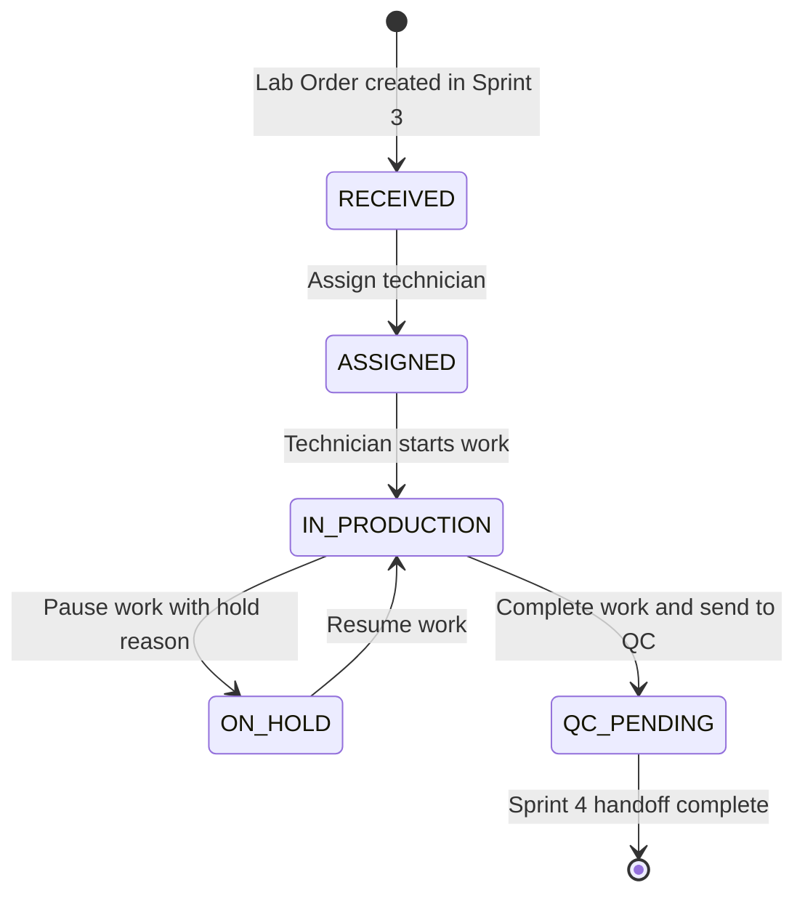

# PRODUCTION WORKFLOW DESIGN DOCUMENT

## Project

Asia Dental Lab Management System

## Version

1.0

## Sprint

Sprint 4 - Production Workflow

## Architecture

Laravel 12, Blade + Livewire 3, PostgreSQL 16, Modular Monolith

---

# 1. Sprint 4 Overview

## Purpose

Sprint 4 mendefinisikan desain workflow produksi setelah Lab Order berhasil dibuat pada Sprint 3. Fokusnya adalah bagaimana order dengan status `RECEIVED` diassign ke teknisi, dikerjakan, dipantau, ditahan sementara jika ada hambatan, lalu dikirim ke antrian Quality Control sebagai `QC_PENDING`.

## Business Goal

Tujuan bisnis Sprint 4 adalah membuat proses produksi laboratorium terlihat jelas, terukur, dan bisa diaudit. Admin Lab dan Production Manager dapat mengetahui siapa teknisi yang mengerjakan order, kapan pekerjaan dimulai, kapan tertunda, kenapa tertunda, kapan dilanjutkan, dan kapan siap diserahkan ke QC.

## Scope

Sprint 4 mencakup:

* Assign technician
* Reassign technician
* Technician work lifecycle
* Production status transition from `RECEIVED` to `QC_PENDING`
* Work log concept
* Production timeline
* Production attachments
* Production audit requirements
* Recommended entities for implementation planning

## Out of Scope

Sprint 4 tidak mencakup:

* QC result behavior
* QC pass, reject, or remake decision
* Delivery workflow
* Proof of Delivery
* Invoice
* Payment
* Reporting implementation
* Complex capacity planning or scheduling optimization

QC pada Sprint 4 hanya menjadi penerima handoff saat produksi selesai. Semua behavior aktif QC masuk Sprint 5.

---

# 2. Production Workflow

Sprint 4 active Lab Order statuses:

```text
RECEIVED
ASSIGNED
IN_PRODUCTION
ON_HOLD
QC_PENDING
```

Primary flow:

```text
RECEIVED
-> ASSIGNED
-> IN_PRODUCTION
-> QC_PENDING
```

Hold flow:

```text
IN_PRODUCTION
-> ON_HOLD
-> IN_PRODUCTION
```

Combined production flow:

```text
RECEIVED
-> ASSIGNED
-> IN_PRODUCTION
-> ON_HOLD
-> IN_PRODUCTION
-> QC_PENDING
```



Rules:

* `RECEIVED` means order exists but has not been assigned for production.
* `ASSIGNED` means at least one active technician assignment exists.
* `IN_PRODUCTION` means technician has started work.
* `ON_HOLD` means production is temporarily paused for a recorded reason.
* `QC_PENDING` means production is complete and waiting for Sprint 5 QC processing.

---

# 3. Roles

## Admin Lab

Responsibilities:

* Monitor all production orders.
* Assign technician when no Production Manager role is used.
* Reassign technician when needed.
* Review production status and timeline.
* Ensure blocked orders have notes and follow-up.
* Cannot perform Sprint 5 QC result actions in Sprint 4.

## Production Manager

Responsibilities:

* Own daily production coordination.
* Select technician based on specialization, workload, urgency, and due date.
* Reassign work when technician is unavailable.
* Monitor orders in `ASSIGNED`, `IN_PRODUCTION`, and `ON_HOLD`.
* Push completed production work to QC as `QC_PENDING`.

Note: Production Manager can be implemented as a dedicated role later or as a permission-bearing operational responsibility assigned to Admin Lab in smaller labs.

## Technician

Responsibilities:

* View assigned orders.
* Start assigned work.
* Pause work with notes and reason.
* Resume paused work.
* Complete work.
* Upload production attachments when needed.
* Send completed work to QC when ready.

Technician cannot:

* Assign orders to other technicians unless explicitly permitted.
* Perform QC pass, reject, or remake decisions in Sprint 4.
* Move order to delivery or invoice workflow.

## QC

Responsibilities in Sprint 4:

* Receive visibility of orders in `QC_PENDING`.
* See order detail, production notes, work logs, and production attachments.
* Prepare for Sprint 5 QC processing.

QC is only a receiver for handoff in Sprint 4. QC does not approve, reject, or request remake in this sprint.

---

# 4. Assignment Workflow

## Assign Technician

Assignment starts from a Lab Order with status `RECEIVED`.

Flow:

```text
Open Lab Order
-> Assignment tab
-> Select technician
-> Add notes
-> Save assignment
-> Lab Order status becomes ASSIGNED
-> Assignment status becomes ASSIGNED
-> Status log is created
-> Audit log is created
```

Assignment statuses:

```text
ASSIGNED
IN_PROGRESS
DONE
CANCELLED
REASSIGNED
```

Important terminology:

* `IN_PROGRESS` is assignment status only.
* Lab Order production status must use `IN_PRODUCTION`.

## Reassign Technician

Reassignment is used when an order needs to move from one technician to another.

Flow:

```text
Open active assignment
-> Choose new technician
-> Add reassignment notes
-> Mark old assignment as REASSIGNED or CANCELLED
-> Create new assignment as ASSIGNED
-> Keep Lab Order status as ASSIGNED, IN_PRODUCTION, or ON_HOLD based on current state
-> Create audit log
-> Create timeline entry
```

Reassignment must preserve production history. Old work logs and attachments remain linked to the order and original technician.

## Assignment Rules

* Order must be `RECEIVED` before first assignment.
* Cancelled order cannot be assigned.
* Completed future orders cannot be assigned.
* Technician should be active.
* Technician should match service specialization where available.
* An order should have one primary active assignment at a time for small-to-medium lab operations.
* Reassignment must require notes.
* Assignment and reassignment must be audited.
* Assignment to technician must create or update status log when Lab Order status changes.

---

# 5. Technician Work Lifecycle

## Start Work

Start work begins active production.

Rules:

* Lab Order must be `ASSIGNED`.
* Assignment status must be `ASSIGNED`.
* User must be the assigned technician or an authorized production user.
* Assignment status becomes `IN_PROGRESS`.
* Lab Order status becomes `IN_PRODUCTION`.
* Work log event `WORK_STARTED` is created.
* Status log and audit log are created.

## Pause Work

Pause work is used when production cannot continue temporarily.

Rules:

* Lab Order must be `IN_PRODUCTION`.
* Assignment status must be `IN_PROGRESS`.
* Hold reason is required.
* Notes are required for operational clarity.
* Lab Order status becomes `ON_HOLD`.
* Work log event `WORK_PAUSED` is created.
* Status log and audit log are created.

## Resume Work

Resume work returns a held order to active production.

Rules:

* Lab Order must be `ON_HOLD`.
* Active assignment must exist.
* Notes should explain what changed or what dependency was resolved.
* Lab Order status becomes `IN_PRODUCTION`.
* Work log event `WORK_RESUMED` is created.
* Status log and audit log are created.

## Complete Work

Complete work marks production activity as done by technician.

Rules:

* Lab Order must be `IN_PRODUCTION`.
* Assignment status must be `IN_PROGRESS`.
* Completion notes are recommended.
* Assignment status becomes `DONE`.
* Completed timestamp is captured.
* Work log event `WORK_COMPLETED` is created.
* Audit log is created.

## Send to QC

Send to QC performs the Sprint 4 handoff.

Rules:

* Production must be completed before sending to QC.
* At least one active assignment should be `DONE`.
* Lab Order status becomes `QC_PENDING`.
* Status log is created.
* Audit log action `SEND_TO_QC` is created.
* Sprint 4 stops here. No QC result is recorded.

---

# 6. Work Log

Work logs are operational records that show what happened during production. They are separate from status logs because not every production event is only a Lab Order status transition.

Required events:

```text
WORK_STARTED
WORK_PAUSED
WORK_RESUMED
WORK_COMPLETED
STATUS_CHANGED
```

Each work log must capture:

* user
* timestamp
* notes
* duration_minutes

Recommended work log fields:

| Field | Purpose |
| --- | --- |
| `lab_order_id` | Links the log to the Lab Order. |
| `assignment_id` | Links the log to the technician assignment when applicable. |
| `technician_id` | Identifies the technician involved in production work. |
| `event` | Stores event name such as `WORK_STARTED`. |
| `old_status` | Previous Lab Order status when status changed. |
| `new_status` | New Lab Order status when status changed. |
| `notes` | Operational notes from technician or manager. |
| `duration_minutes` | Duration since previous relevant work event or explicit duration entry. |
| `performed_by` | User who performed the action. |
| `performed_at` | Timestamp of the action. |

Duration guidance:

* `WORK_STARTED` can use `duration_minutes = 0`.
* `WORK_PAUSED` should capture active time since last start or resume.
* `WORK_RESUMED` can use `duration_minutes = 0`.
* `WORK_COMPLETED` should capture active time since last start or resume.
* `STATUS_CHANGED` can use `duration_minutes = 0` unless tied to production time.

---

# 7. Production Steps

Recommended production steps for dental lab work:

* Model Preparation
* Wax Design
* Milling
* Printing
* Finishing
* Polishing
* Packaging

Purpose:

* Provide a simple checklist-like structure for production progress.
* Help technicians record which stage is being worked on.
* Support future productivity reporting.
* Avoid mixing production with QC decisions.

Step rules:

* Steps are optional per service type.
* Not every service needs every step.
* A Crown Zirconia case may use Model Preparation, Wax Design, Milling, Finishing, Polishing, and Packaging.
* A printed model case may use Model Preparation, Printing, Finishing, and Packaging.
* QC steps are not included in Sprint 4.

---

# 8. On Hold Workflow

On Hold is used when production cannot continue temporarily.

Hold reasons:

* Waiting Material
* Waiting Approval
* Doctor Confirmation
* Equipment Issue
* Other

Pause process:

```text
Technician or Production Manager opens active production order
-> Choose Pause Work
-> Select hold reason
-> Add notes
-> Submit
-> Lab Order status becomes ON_HOLD
-> Work log, status log, and audit log are created
```

Resume process:

```text
Dependency is resolved
-> Open held order
-> Choose Resume Work
-> Add resolution notes
-> Submit
-> Lab Order status becomes IN_PRODUCTION
-> Work log, status log, and audit log are created
```

Rules:

* Hold reason is required.
* Notes are required.
* Held orders remain visible in production lists.
* Held orders should still count as active production, but excluded from active duration while paused.
* Multiple pause/resume cycles are allowed.

---

# 9. Production Timeline

Production timeline combines operational events into one readable history on Lab Order detail.

Timeline entries:

* assignment
* reassignment
* start work
* pause
* resume
* complete
* status change
* notes
* attachments

Recommended display fields:

| Timeline Entry | Source |
| --- | --- |
| Assignment created | `trx_lab_order_assignments` |
| Reassignment | `trx_lab_order_assignments` and audit log |
| Start work | `trx_lab_work_logs` |
| Pause work | `trx_lab_work_logs` |
| Resume work | `trx_lab_work_logs` |
| Complete work | `trx_lab_work_logs` |
| Status change | `trx_lab_order_status_logs` |
| Production note | `trx_lab_work_logs` |
| Attachment uploaded | `sys_attachments` and audit log |

Sorting:

* Timeline should be ordered by event timestamp.
* Detail page may show newest first for quick review.
* Printable or audit view may show oldest first.

---

# 10. Attachment Usage

Sprint 4 reuses the Sprint 3 polymorphic attachment strategy:

```text
sys_attachments
entity_type
entity_id
```

For Lab Order production attachments:

```text
entity_type = trx_lab_orders
entity_id = Lab Order id
```

Production attachment categories:

```text
WORK_PHOTO
DESIGN_FILE
STL_REVISION
REFERENCE_IMAGE
PRODUCTION_NOTE
```

Usage:

* `WORK_PHOTO` stores photos of work-in-progress.
* `DESIGN_FILE` stores CAD or design output files.
* `STL_REVISION` stores revised STL files received or produced during production.
* `REFERENCE_IMAGE` stores shade, shape, or doctor reference images.
* `PRODUCTION_NOTE` stores supporting notes or documents.

Rules:

* Multiple production attachments are allowed.
* File path only is stored in database.
* Upload must be authorized.
* Upload must be audited.
* Attachment must appear in production timeline.
* Attachment delete must be soft delete and audited.

---

# 11. Audit Requirements

Every production action must create a `sys_audit_logs` record.

Required audit actions:

```text
ASSIGN_TECHNICIAN
REASSIGN_TECHNICIAN
START_WORK
PAUSE_WORK
RESUME_WORK
COMPLETE_WORK
SEND_TO_QC
STATUS_CHANGE
```

Audit data should include:

* `entity_type`
* `entity_id`
* `action`
* `old_values`
* `new_values`
* `performed_by`
* `performed_at`
* `ip_address`
* `user_agent`

Audit rules:

* Assignment and reassignment must record technician changes.
* Start, pause, resume, and complete must record assignment and work status.
* Status changes must record old and new Lab Order status.
* `SEND_TO_QC` must record completed assignment and handoff timestamp.
* Audit records are append-only.
* Audit records must not store raw file contents.

---

# 12. Recommended Entities

These entities are recommended for Sprint 4 implementation planning. This document does not implement them.

## trx_lab_order_assignments

Purpose:

* Store technician assignment records for Lab Orders.
* Track who assigned the work, which technician owns it, when it started, and when it completed.

Relationships:

* Belongs to `trx_lab_orders` through `lab_order_id`.
* Belongs to `mst_technicians` through `technician_id`.
* Belongs to `users` through `assigned_by`.
* Has many `trx_lab_work_logs`.

Recommended key fields:

* `lab_order_id`
* `technician_id`
* `assigned_by`
* `assigned_at`
* `started_at`
* `completed_at`
* `status`
* `notes`

## trx_lab_work_logs

Purpose:

* Store production lifecycle events and duration records.
* Provide source data for production timeline and future productivity reporting.

Relationships:

* Belongs to `trx_lab_orders`.
* Belongs to `trx_lab_order_assignments`.
* Belongs to `mst_technicians` when action is technician-owned.
* Belongs to `users` through `performed_by`.

Recommended key fields:

* `lab_order_id`
* `assignment_id`
* `technician_id`
* `event`
* `old_status`
* `new_status`
* `notes`
* `duration_minutes`
* `performed_by`
* `performed_at`

## trx_lab_production_steps

Purpose:

* Store simple production step progress per order or assignment.
* Support service-specific production visibility without adding QC behavior.

Relationships:

* Belongs to `trx_lab_orders`.
* Optionally belongs to `trx_lab_order_assignments`.
* Optionally belongs to `mst_technicians`.

Recommended key fields:

* `lab_order_id`
* `assignment_id`
* `step_name`
* `status`
* `started_at`
* `completed_at`
* `performed_by`
* `notes`

Recommended step statuses:

```text
PENDING
IN_PROGRESS
DONE
SKIPPED
```

---

# 13. Business Rules

Required rules:

* Order must be `RECEIVED` before assignment.
* Cancelled order cannot be assigned.
* Assigned order can enter `IN_PRODUCTION`.
* Production must complete before `QC_PENDING`.
* Every status change must be logged.
* Every production action must be audited.
* Work logs are required for start, pause, resume, and complete.

Additional Sprint 4 rules:

* `IN_PROGRESS` must only be used as assignment status, not Lab Order status.
* Lab Order status for active production must be `IN_PRODUCTION`.
* `ON_HOLD` requires a hold reason and notes.
* Resume from `ON_HOLD` returns Lab Order to `IN_PRODUCTION`.
* `QC_PENDING` is a handoff status only.
* Sprint 4 must not create QC result records.
* Sprint 4 must not move orders to `QC_PASSED`, `READY_FOR_DELIVERY`, `IN_DELIVERY`, `DELIVERED`, or `COMPLETED`.
* Reassignment must preserve original assignment and work log history.
* Emergency order should use existing `priority = URGENT` or `SUPER_URGENT`, not a new workflow.

Allowed Sprint 4 Lab Order transitions:

| From | Action | To |
| --- | --- | --- |
| `RECEIVED` | Assign technician | `ASSIGNED` |
| `ASSIGNED` | Start work | `IN_PRODUCTION` |
| `IN_PRODUCTION` | Pause work | `ON_HOLD` |
| `ON_HOLD` | Resume work | `IN_PRODUCTION` |
| `IN_PRODUCTION` | Complete and send to QC | `QC_PENDING` |

---

# 14. Future Integration

## Sprint 5 QC

Sprint 4 prepares QC by moving completed production work to `QC_PENDING`. Sprint 5 can then read:

* Lab Order header and items.
* Assignment history.
* Work logs.
* Production timeline.
* Production attachments.
* Technician completion notes.

Sprint 4 does not define QC pass, reject, or remake behavior.

## Sprint 6 Delivery

Sprint 4 supports Delivery indirectly by ensuring only production-complete orders can enter QC. Sprint 6 should depend on Sprint 5 outcomes, not Sprint 4 directly. Delivery should only begin after QC passes and later status rules allow `READY_FOR_DELIVERY`.

## Sprint 8 Reporting

Sprint 4 creates reporting-ready signals:

* Technician assignment count.
* Production start and completion timestamps.
* Active duration from work logs.
* Hold duration and hold reasons.
* Reassignment frequency.
* Orders waiting for QC.
* Priority and due-date performance.

These signals support productivity, delay, and operational dashboard reporting in Sprint 8.

---

# 15. Risks and Edge Cases

## Technician Unavailable

Risk:

* Assigned technician is sick, overloaded, resigned, or unavailable.

Handling:

* Production Manager reassigns the order.
* Old assignment becomes `REASSIGNED` or `CANCELLED`.
* New assignment starts as `ASSIGNED`.
* Audit log records old and new technician.

## Reassignment

Risk:

* Reassignment can hide previous work or confuse accountability.

Handling:

* Preserve all old assignments.
* Preserve all work logs.
* Require reassignment notes.
* Show reassignment clearly in timeline.

## Multiple Pauses

Risk:

* A long case may pause and resume many times.

Handling:

* Allow multiple pause/resume cycles.
* Require hold reason on every pause.
* Capture duration separately for active work and hold periods.

## Emergency Order

Risk:

* Urgent cases may bypass normal operational discipline.

Handling:

* Use existing priority values `URGENT` and `SUPER_URGENT`.
* Keep the same assignment, work log, status log, and audit rules.
* Do not create a separate emergency workflow.

## Order Returned from QC Later

Risk:

* Sprint 5 may return an order from QC for remake or additional production.

Handling:

* Sprint 4 does not implement this behavior.
* Recommended future path: Sprint 5 can move failed QC cases to `REMAKE` or a future production return flow using the official Lab Order enum.
* Existing assignment and work logs remain useful for traceability.

## Long-Running Production

Risk:

* Complex cases may stay in production for days and become hard to monitor.

Handling:

* Track start time, pause time, resume time, and completion time.
* Show due date and priority in production lists.
* Use `ON_HOLD` with reason when work is blocked.
* Use future reporting to detect aging and overdue production.

---

# 16. Definition of Done

Sprint 4 design is ready when:

* Assignment workflow is clear.
* Work log concept is clear.
* Production status flow is clear.
* QC handoff is clear.
* Audit requirements are clear.
* Recommended entities are clear.
* Sprint 5 behavior is excluded.

Validation checklist:

* Uses only Sprint 4 active Lab Order statuses.
* Keeps `IN_PROGRESS` as assignment status only.
* Uses `IN_PRODUCTION` as Lab Order production status.
* Reuses Sprint 3 status log design.
* Reuses Sprint 3 audit log design.
* Reuses Sprint 3 polymorphic attachment design.
* Does not design QC pass, reject, or remake behavior.
* Does not design Delivery, Invoice, Payment, or Reporting implementation.
* Suitable for small-to-medium dental laboratory operations.
