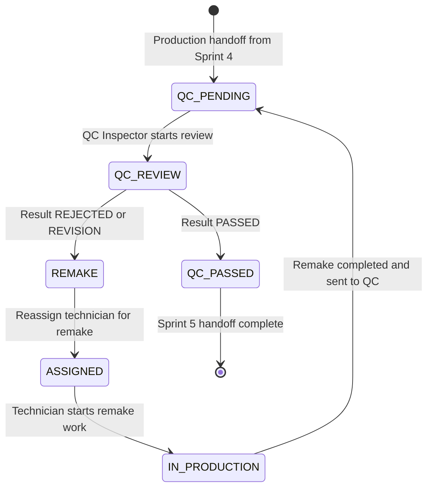

# QC WORKFLOW DESIGN DOCUMENT

## Project

Asia Dental Lab Management System

## Version

1.0

## Sprint

Sprint 5 - Quality Control Workflow

## Architecture

Laravel 12, Blade + Livewire 3, PostgreSQL 16, Modular Monolith

---

# 1. Sprint 5 Overview

## Purpose

Dokumen ini mendefinisikan desain bisnis, workflow, data model rekomendasi, audit, status log, evidence, dan aturan implementasi untuk modul Quality Control.

Sprint 5 dimulai setelah Sprint 4 mengirim Lab Order ke status `QC_PENDING`. Modul QC menentukan apakah hasil produksi:

* lulus QC dan menjadi `QC_PASSED`; atau
* gagal/revisi dan menjadi `REMAKE`.

## Business Goal

Tujuan bisnis Sprint 5:

* memastikan hasil pekerjaan lab memenuhi standar kualitas sebelum delivery;
* mengurangi kasus remake yang tidak terdokumentasi;
* membuat keputusan QC dapat diaudit;
* menyediakan histori QC untuk Admin Lab, QC Inspector, Production Manager, dan Technician;
* memastikan Delivery Sprint 6 hanya dapat berjalan setelah QC lulus.

## Scope

Sprint 5 mencakup:

* QC queue
* QC review
* QC checklist
* QC result
* QC evidence
* QC history
* Remake request
* Status log
* Audit log
* Recommended entities for implementation planning

## Out of Scope

Sprint 5 tidak mencakup:

* Delivery workflow
* Proof of Delivery
* Invoice
* Payment
* Reporting dashboard implementation
* Inventory/material automation
* Advanced QC scoring engine

## Dependency on Sprint 3 Lab Order Core

Sprint 5 bergantung pada:

* `trx_lab_orders`
* `trx_lab_order_items`
* `trx_lab_order_status_logs`
* `sys_attachments`
* `sys_audit_logs`
* Lab Order status enum
* Lab Order detail page
* Attachment polymorphic strategy
* Audit polymorphic strategy

Lab Order tetap menjadi pusat workflow.

## Dependency on Sprint 4 Production Workflow

Sprint 5 bergantung pada:

* Lab Order status `QC_PENDING`
* Technician assignment history
* Work logs
* Production steps
* Production attachments
* Production completion notes

QC hanya boleh dimulai untuk order yang sudah selesai produksi dan berada pada status `QC_PENDING`.

---

# 2. QC Workflow

Sprint 5 active Lab Order statuses:

```text
QC_PENDING
QC_PASSED
REMAKE
```

Related previous statuses:

```text
ASSIGNED
IN_PRODUCTION
ON_HOLD
```

Future statuses not implemented in Sprint 5:

```text
READY_FOR_DELIVERY
IN_DELIVERY
DELIVERED
COMPLETED
```

Primary pass flow:

```text
QC_PENDING
-> QC REVIEW
-> QC_PASSED
```

Remake flow:

```text
QC_PENDING
-> QC REVIEW
-> REMAKE
-> ASSIGNED
-> IN_PRODUCTION
-> QC_PENDING
```



Important notes:

* `QC REVIEW` is an operational activity, not a Lab Order status.
* `PASSED`, `REJECTED`, and `REVISION` are QC result values.
* `QC_PASSED` and `REMAKE` are Lab Order statuses.
* Sprint 5 stops at `QC_PASSED`. It does not move order to `READY_FOR_DELIVERY`.

---

# 3. Roles and Responsibilities

| Role | View QC Queue | Start QC | Pass QC | Reject QC | Request Remake | Upload QC Evidence | View QC History |
| --- | --- | --- | --- | --- | --- | --- | --- |
| Admin Lab | Yes | Optional by permission | Optional by permission | Optional by permission | Yes | Yes | Yes |
| Production Manager | Yes | No | No | No | View/request follow-up only | Yes, production-related only | Yes |
| QC Inspector | Yes | Yes | Yes | Yes | Yes | Yes | Yes |
| Technician | Own/related orders only | No | No | No | No | Production response only | Own/related orders only |

## Admin Lab

Responsibilities:

* Monitor all QC activity.
* Ensure urgent orders are reviewed.
* Review remake history.
* Resolve operational disputes.
* Confirm that delivery does not begin before QC pass.

## Production Manager

Responsibilities:

* Monitor failed QC cases.
* Coordinate technician reassignment for remake.
* Review production root cause from QC notes.
* Ensure remake work returns to production workflow correctly.

## QC Inspector

Responsibilities:

* Review orders in `QC_PENDING`.
* Fill QC checklist.
* Upload QC evidence.
* Set QC result.
* Write notes for pass, reject, or revision.
* Request remake when quality criteria fail.

## Technician

Responsibilities:

* View QC result for assigned or historical work.
* Read rejection/revision notes.
* Perform remake work after reassignment.
* Upload additional production evidence if needed in production workflow.

---

# 4. QC Queue

QC queue lists Lab Orders waiting for QC review.

Primary source:

```text
trx_lab_orders.status = QC_PENDING
```

QC queue should show:

* order number
* clinic
* doctor
* patient
* technician
* priority
* due date
* QC status
* production completed time
* latest production notes

Filters:

* order number
* clinic
* doctor
* patient
* technician
* priority
* due date
* QC status

Recommended QC status values for queue display:

```text
WAITING_REVIEW
IN_REVIEW
PASSED
REMAKE_REQUESTED
```

Queue rules:

* Only orders with Lab Order status `QC_PENDING` appear in active queue.
* Orders already `QC_PASSED` move to QC history.
* Orders in `REMAKE` move out of active QC queue and back to production/remake flow.
* Cancelled orders must not appear in active queue.
* Urgent and super urgent orders should sort higher or be visually prioritized.

---

# 5. QC Review

QC review is the inspection activity performed by QC Inspector.

QC review must capture:

* inspector
* started_at
* completed_at
* result
* notes
* evidence
* checklist result

Recommended flow:

```text
Open QC Queue
-> Select QC_PENDING order
-> Start QC review
-> Inspect order, items, production notes, and attachments
-> Fill checklist
-> Upload evidence if needed
-> Choose result
-> Add notes
-> Submit QC decision
-> Create QC record
-> Update Lab Order status
-> Create status log
-> Create audit log
```

Rules:

* QC review may only start when Lab Order status is `QC_PENDING`.
* QC Inspector must be authenticated.
* QC review must have at least one checklist result before final decision.
* Failed or revision QC must include notes.
* Evidence is strongly recommended for failed QC and remake request.
* Completed QC record must be preserved even if order later goes through remake and QC again.

---

# 6. QC Checklist

Recommended checklist items:

* Fit Accuracy
* Margin Quality
* Occlusion
* Shade Match
* Contact Point
* Surface Finish
* Polishing
* Cleanliness
* Packaging Readiness

Each checklist item supports:

```text
PASS
FAIL
N/A
```

Each checklist item should capture:

* item name
* result
* notes
* checked_by
* checked_at

Checklist behavior:

* `PASS` means item meets QC requirement.
* `FAIL` means item does not meet QC requirement.
* `N/A` means item is not relevant for the service or case.
* Notes are optional for `PASS`.
* Notes are required for `FAIL`.
* Notes are recommended for `N/A` when the reason is not obvious.

Recommended validation:

* At least one checklist item is required.
* Final `PASSED` should not be allowed if any required checklist item is `FAIL`.
* Final `REJECTED` or `REVISION` should identify failed checklist items or include clear notes.

---

# 7. QC Result

Allowed QC results:

```text
PASSED
REJECTED
REVISION
```

Mapping to Lab Order status:

| QC Result | Lab Order Status | Meaning |
| --- | --- | --- |
| `PASSED` | `QC_PASSED` | Work passes QC and is ready for future delivery preparation. |
| `REJECTED` | `REMAKE` | Work fails QC and requires remake or major rework. |
| `REVISION` | `REMAKE` | Work needs correction/revision before QC can pass. |

Important separation:

* QC result belongs to QC record.
* Lab Order status belongs to Lab Order workflow.
* `REVISION` is not a Lab Order status.
* `REMAKE` is the Lab Order status for both rejected and revision cases.

Rules:

* `PASSED` must create Lab Order status transition `QC_PENDING -> QC_PASSED`.
* `REJECTED` must create Lab Order status transition `QC_PENDING -> REMAKE`.
* `REVISION` must create Lab Order status transition `QC_PENDING -> REMAKE`.
* QC result cannot be edited silently after submission.
* Any correction of inspector mistake must create audit trail and preserve the original QC record.

---

# 8. Remake Workflow

Remake occurs when QC result is `REJECTED` or `REVISION`.

Flow:

```text
QC_PENDING
-> QC review result REJECTED or REVISION
-> Lab Order status becomes REMAKE
-> Remake request is created
-> Production Manager reviews remake reason
-> Technician is assigned or reassigned
-> Lab Order status becomes ASSIGNED
-> Technician starts remake work
-> Lab Order status becomes IN_PRODUCTION
-> Remake work completed
-> Lab Order status becomes QC_PENDING
-> QC review repeats
```

Remake data must capture:

* remake reason
* remake notes
* requested_by
* requested_at
* assigned technician
* remake history
* related QC record
* related Lab Order

Recommended remake reasons:

```text
FIT_ISSUE
MARGIN_ISSUE
OCCLUSION_ISSUE
SHADE_MISMATCH
CONTACT_POINT_ISSUE
SURFACE_FINISH_ISSUE
POLISHING_ISSUE
PACKAGING_ISSUE
OTHER
```

Remake rules:

* Remake must have reason.
* Remake must have notes.
* Remake must preserve original QC history.
* Remake should create or reuse production assignment flow from Sprint 4.
* Repeated remake is allowed but must be visible in QC history.
* Remake assignment should not delete previous assignment, work logs, QC records, or evidence.

---

# 9. QC Evidence

QC evidence may include:

* QC photos
* notes
* file attachments
* inspection checklist
* rejection proof

Sprint 5 reuses Sprint 3 polymorphic attachment strategy:

```text
sys_attachments
entity_type
entity_id
```

Recommended attachment categories:

```text
QC_PHOTO
QC_REJECTION_PROOF
QC_REFERENCE_IMAGE
QC_NOTE
QC_DOCUMENT
```

Recommended entity targets:

```text
entity_type = trx_lab_quality_controls
entity_id = qc_record_id
```

or, when evidence belongs to the overall order:

```text
entity_type = trx_lab_orders
entity_id = lab_order_id
```

Rules:

* Use `trx_lab_quality_controls` as the preferred target for QC decision evidence.
* Use `trx_lab_orders` for general order evidence visible across workflow stages.
* Do not create a separate attachment system.
* QC photos should use `sys_attachments` unless database schema later explicitly requires `trx_lab_qc_photos`.
* Upload and delete must be audited.
* Attachment metadata must use soft delete.
* File path only is stored in database.

---

# 10. Audit Requirements

Every QC action must create audit log in:

```text
sys_audit_logs
```

Required audit actions:

```text
START_QC
PASS_QC
REJECT_QC
REQUEST_REMAKE
UPLOAD_QC_EVIDENCE
UPDATE_QC_CHECKLIST
STATUS_CHANGE
```

Audit log must use:

```text
entity_type
entity_id
```

Recommended audit target:

* `entity_type = trx_lab_quality_controls` for QC review, checklist, result, and evidence.
* `entity_type = trx_lab_orders` for Lab Order status change.
* `entity_type = trx_lab_remake_requests` for remake request when implemented.

Audit data should include:

* actor
* timestamp
* old values
* new values
* Lab Order id
* QC record id
* checklist summary
* result
* notes
* evidence metadata

Rules:

* Audit log must be written inside the same transaction as QC action.
* Audit logs are append-only.
* Do not store raw file contents in audit JSON.
* Inspector mistake correction must create new audit record.

---

# 11. Status Log Requirements

Every Lab Order status transition must create record in:

```text
trx_lab_order_status_logs
```

Required fields:

* `lab_order_id`
* `old_status`
* `new_status`
* `notes`
* `changed_by`
* `changed_at`

Required Sprint 5 related transitions:

| Transition | Trigger |
| --- | --- |
| `QC_PENDING -> QC_PASSED` | QC result `PASSED` |
| `QC_PENDING -> REMAKE` | QC result `REJECTED` or `REVISION` |
| `REMAKE -> ASSIGNED` | Remake assignment starts production flow |
| `IN_PRODUCTION -> QC_PENDING` | Remake production completed and sent back to QC |

Notes:

* `REMAKE -> ASSIGNED` reuses Sprint 4 assignment workflow.
* `ASSIGNED -> IN_PRODUCTION` also reuses Sprint 4 start work workflow.
* `IN_PRODUCTION -> QC_PENDING` reuses Sprint 4 complete/send-to-QC workflow.
* Status logs must be append-only.
* Every status log should have related `STATUS_CHANGE` audit entry.

---

# 12. Recommended Entities

These entities are recommended for Sprint 5 implementation planning. This document does not implement them.

## trx_lab_quality_controls

Purpose:

* Store QC review records for Lab Orders.
* Preserve QC history across pass, reject, revision, and repeated remake cycles.

Relationships:

* belongs to `trx_lab_orders` through `lab_order_id`
* belongs to `users` through `qc_by`
* has many checklist rows through `trx_lab_qc_checklists`
* may have attachments through `sys_attachments` polymorphic relation

Recommended key fields:

* `lab_order_id`
* `qc_by`
* `qc_date`
* `started_at`
* `completed_at`
* `result`
* `notes`

Allowed result:

```text
PASSED
REJECTED
REVISION
```

## trx_lab_qc_checklists

Purpose:

* Store QC checklist item results per QC review.
* Allow detailed inspection history instead of storing checklist as one text note.

Relationships:

* belongs to `trx_lab_quality_controls`
* belongs to `users` through `checked_by`

Recommended key fields:

* `qc_id`
* `checklist_item`
* `result`
* `notes`
* `checked_by`
* `checked_at`

Allowed result:

```text
PASS
FAIL
N/A
```

## trx_lab_remake_requests

Purpose:

* Store remake request data when QC result requires remake.
* Preserve reason, notes, requester, and related QC record.

Relationships:

* belongs to `trx_lab_orders`
* belongs to `trx_lab_quality_controls`
* belongs to `users` through `requested_by`
* optionally references assigned technician after production reassignment

Recommended key fields:

* `lab_order_id`
* `qc_id`
* `reason`
* `notes`
* `requested_by`
* `requested_at`
* `assigned_technician_id`
* `status`

Recommended remake request status:

```text
OPEN
ASSIGNED
IN_PRODUCTION
RETURNED_TO_QC
CLOSED
```

## trx_lab_qc_photos

Recommendation:

* Do not create this table for V1 unless there is a strong reporting or compliance requirement that cannot be handled by `sys_attachments`.

Reason:

* Sprint 3 already provides polymorphic attachments.
* ERD supports `sys_attachments` for `trx_lab_quality_controls`.
* A separate QC photo table would duplicate attachment behavior.

Use:

```text
sys_attachments
```

for QC photos and rejection proof.

---

# 13. Business Rules

Required rules:

* Only `QC_PENDING` orders can be reviewed.
* Cancelled orders cannot be reviewed.
* QC must have at least one checklist result.
* QC pass changes Lab Order status to `QC_PASSED`.
* QC reject or revision changes Lab Order status to `REMAKE`.
* Remake must have reason.
* Remake must preserve original QC history.
* Every QC action must be audited.
* Every status change must be logged.
* Delivery cannot start before `QC_PASSED`.

Additional rules:

* QC result `REVISION` is not a Lab Order status.
* Lab Order status for failed QC is always `REMAKE`.
* QC bypass is not allowed in V1.
* QC result must be submitted by an authorized QC Inspector or authorized Admin Lab.
* Failed checklist item requires notes.
* Failed QC should include evidence.
* Repeated remake must create new QC and remake records, not overwrite old ones.
* Orders already in future delivery statuses must not be modified by Sprint 5 QC workflow.

Allowed Sprint 5 status transitions:

| From | Action | To |
| --- | --- | --- |
| `QC_PENDING` | QC pass | `QC_PASSED` |
| `QC_PENDING` | QC reject | `REMAKE` |
| `QC_PENDING` | QC revision | `REMAKE` |
| `REMAKE` | Assign technician for remake | `ASSIGNED` |
| `ASSIGNED` | Start remake work | `IN_PRODUCTION` |
| `IN_PRODUCTION` | Complete remake and send to QC | `QC_PENDING` |

Blocked transitions:

| From | Blocked Action |
| --- | --- |
| `RECEIVED` | Start QC |
| `ASSIGNED` | Start QC |
| `IN_PRODUCTION` | Start QC |
| `ON_HOLD` | Start QC |
| `CANCELLED` | Start QC, pass QC, reject QC, request remake |
| `QC_PASSED` | Start duplicate QC without explicit correction workflow |
| `READY_FOR_DELIVERY` | Sprint 5 QC mutation |
| `IN_DELIVERY` | Sprint 5 QC mutation |
| `DELIVERED` | Sprint 5 QC mutation |
| `COMPLETED` | Sprint 5 QC mutation |

---

# 14. Future Integration

## Sprint 6 Delivery

Sprint 5 supports Delivery by creating a quality gate:

```text
QC_PASSED
```

Sprint 6 should only allow delivery preparation after QC is passed. Sprint 5 does not create delivery records and does not move order to `READY_FOR_DELIVERY`.

Recommended future handoff:

```text
QC_PASSED
-> READY_FOR_DELIVERY
-> IN_DELIVERY
```

The exact `QC_PASSED -> READY_FOR_DELIVERY` transition belongs to Sprint 6.

## Sprint 7 Invoice

Sprint 5 supports Invoice indirectly:

* Only QC-passed work can continue to delivery.
* Invoice remains blocked until Delivery/POD rules are satisfied in future sprint.
* QC history can explain why an order was delayed before invoicing.

Sprint 5 does not create invoice, invoice item, or payment records.

## Sprint 8 Reporting

Sprint 5 creates reporting-ready data:

* QC pass count
* QC reject count
* QC revision count
* remake frequency
* QC cycle time
* inspector workload
* failed checklist patterns
* technician remake rate
* urgent order QC performance

Reporting implementation remains Sprint 8.

---

# 15. Risks and Edge Cases

## Failed QC Without Evidence

Risk:

* Technician or doctor may dispute the QC decision.

Handling:

* Failed QC should require notes.
* Evidence is strongly recommended.
* For high-risk categories, implementation may require at least one QC evidence attachment.

## Repeated Remake

Risk:

* The same order may fail QC multiple times.

Handling:

* Create a new QC record for every QC cycle.
* Create a new remake request for every failed QC cycle.
* Preserve all previous QC and production history.
* Surface repeated remake count in QC history.

## Partial Checklist Failure

Risk:

* Some checklist items pass while one critical item fails.

Handling:

* Allow mixed checklist results.
* Final `PASSED` should be blocked if any required item is `FAIL`.
* Final `REJECTED` or `REVISION` should reference failed items.

## Inspector Mistake

Risk:

* QC Inspector may choose the wrong result or write incorrect notes.

Handling:

* Do not silently edit submitted QC result.
* Add correction workflow later if needed.
* For Sprint 5, correction must be audited and preserve original values.

## Order Already Delivered

Risk:

* QC mutation after delivery could corrupt downstream workflow.

Handling:

* Sprint 5 must block QC actions for `READY_FOR_DELIVERY`, `IN_DELIVERY`, `DELIVERED`, and `COMPLETED`.

## Order Cancelled During QC

Risk:

* Active QC review may exist when order is cancelled.

Handling:

* Cancelled order cannot receive QC decision.
* Active review should be marked as cancelled/void only through an audited administrative action if implemented.

## Technician Disagreement

Risk:

* Technician disagrees with QC reject or revision.

Handling:

* Technician can view QC notes and evidence.
* Production Manager/Admin Lab resolves dispute operationally.
* QC result remains authoritative unless audited correction workflow is used.

## Urgent Order QC Bypass Request

Risk:

* Staff may request bypass for urgent or super urgent orders.

Handling:

* QC bypass is not allowed in V1.
* Urgent order should be prioritized in QC queue.
* Audit and checklist requirements remain mandatory.

---

# 16. Definition of Done

Sprint 5 design is ready when:

* QC workflow is clear.
* QC checklist is clear.
* QC result mapping is clear.
* Remake workflow is clear.
* Evidence strategy is clear.
* Audit requirements are clear.
* Status log rules are clear.
* Sprint 6 delivery handoff is clear.

Acceptance checklist:

* Uses `QC_PENDING`, `QC_PASSED`, and `REMAKE` as Sprint 5 active Lab Order statuses.
* Separates QC result `REVISION` from Lab Order status `REMAKE`.
* Matches Sprint 3 Lab Order design.
* Matches Sprint 4 Production Workflow.
* Reuses `sys_attachments`.
* Reuses `sys_audit_logs`.
* Reuses `trx_lab_order_status_logs`.
* Does not introduce Delivery implementation.
* Does not introduce Invoice implementation.
* Does not introduce Payment implementation.
* Does not introduce Reporting dashboard implementation.
* Suitable for a small-to-medium dental laboratory.

---

# Key Decisions

| Decision | Rationale |
| --- | --- |
| QC starts only from `QC_PENDING`. | Sprint 4 handoff ends at `QC_PENDING`; QC should not inspect unfinished production. |
| `PASSED` maps to `QC_PASSED`. | Lab Order is quality-approved but not yet in Delivery workflow. |
| `REJECTED` and `REVISION` map to `REMAKE`. | Lab Order status enum uses `REMAKE`, while `REVISION` remains QC result only. |
| QC evidence reuses `sys_attachments`. | Avoids duplicate file system and follows Sprint 3 polymorphic design. |
| QC checklist gets its own recommended entity. | Checklist needs item-level PASS/FAIL/N/A and notes. |
| Remake request gets its own recommended entity. | Repeated remake needs reason, requester, timestamp, and history. |
| QC bypass is not allowed in V1. | Quality gate must remain trustworthy before Delivery. |

---

# Risks Identified

| Risk | Impact | Mitigation |
| --- | --- | --- |
| Failed QC without evidence | Decision may be disputed. | Require notes and strongly recommend evidence for failures. |
| Repeated remake | History may become confusing. | Store every QC cycle and remake request separately. |
| Partial checklist failure | Inconsistent QC decisions. | Block pass when required checklist item fails. |
| Inspector mistake | Incorrect status transition. | Preserve original record and require audited correction. |
| Order already delivered | Downstream workflow corruption. | Block Sprint 5 QC mutation for delivery and completed statuses. |
| Cancelled during QC | Incomplete review state. | Block final QC decision after cancellation. |
| Technician disagreement | Operational conflict. | Use QC evidence, notes, and Admin Lab resolution. |
| Urgent bypass request | Quality control loses value. | Do not allow bypass; prioritize queue instead. |
