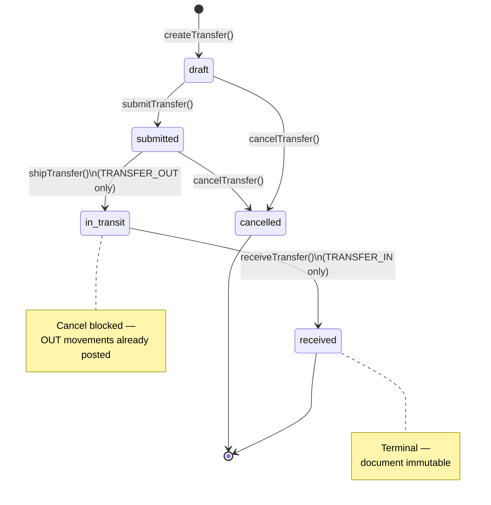

# Sprint 15.2 Technical Design — Transfer Receiving Workflow

Date: 2026-06-06  
Status: DESIGN (implemented 2026-06-06)  
Module: `app/Modules/Inventory`  
Prerequisite: Sprint 15.1 Stock Transfer Workflow (implemented in codebase as Sprint 14)

## Sprint Numbering Note

The repository's permanent history (`docs/sprint_history.md`) records the current Stock Transfer implementation as **Sprint 14**. This design uses the active planning slice numbering requested for the current milestone:

| Planning slice | History / codebase reference |
|---|---|
| Sprint 15.1 | Sprint 14 — Stock Transfer (`draft → submitted → completed`) |
| Sprint 15.2 | This document — evolve to ship/receive (`draft → submitted → in_transit → received`) |

Future implementation must not break the Sprint 14 completed contract until the 15.2 migration and service refactor are applied atomically in one release slice.

**Implementation note (2026-06-06):** Sprint 15.2 shipped. The legacy `complete` route, controller action, policy ability, request class, and `completeTransfer()` service method were removed. Stock movement is split across `shipTransfer()` (OUT only) and `receiveTransfer()` (IN only). Legacy DB rows with status `completed` remain readable via model helpers; new workflow uses `received`.

---

## Problem Statement

Sprint 15.1 delivers a functional inter-location stock transfer, but completion is a **single atomic step**: one action posts paired `TRANSFER_OUT` and `TRANSFER_IN` movements and marks the document `completed`. That models an instantaneous move, not a real operational handoff where:

1. Source staff **ships** goods (stock leaves the source location).
2. Destination staff **receives** goods later (stock arrives at the destination location).

Without separating ship and receive:

- Source and destination stock change at the same instant, which misrepresents in-transit inventory.
- Operators cannot see transfers awaiting receipt at the destination.
- Audit trails do not distinguish who shipped vs who received.
- Destination teams cannot action a dedicated receiving step.

Sprint 15.2 evolves the existing transfer document into a **two-phase ledger workflow** while preserving ADLMS invariants: modular monolith layering, `BranchContext` isolation, and ledger-derived stock only.

---

## Current Sprint 15.1 Behavior

### Workflow states

| Status | Meaning | Editable | Ledger impact |
|---|---|---|---|
| `draft` | Document created, not submitted | Yes | None |
| `submitted` | Ready for processing | No | None |
| `completed` | Transfer finished | No | Paired OUT + IN posted on `completeTransfer()` |
| `cancelled` | Terminal off-ramp | No | None |

### State machine (15.1)

```text
                    submit
          draft ──────────────► submitted
            │                      │
            │ cancel               │ complete (OUT + IN)
            ▼                      ▼
        cancelled ◄── cancel ── completed
```

### Service methods (current)

| Method | From status | To status | Ledger |
|---|---|---|---|
| `createTransfer()` | — | `draft` | None |
| `updateTransfer()` | `draft` | `draft` | None |
| `submitTransfer()` | `draft` | `submitted` | None |
| `completeTransfer()` | `submitted` | `completed` | `TRANSFER_OUT` at source + `TRANSFER_IN` at destination per item |
| `cancelTransfer()` | `draft`, `submitted` | `cancelled` | None |

### Key implementation facts (codebase)

- Model: `StockTransfer` with constants `STATUS_DRAFT`, `STATUS_SUBMITTED`, `STATUS_COMPLETED`, `STATUS_CANCELLED`.
- Service: `StockTransferService` — `completeTransfer()` checks source stock sufficiency, locks transfer/locations/products/items, posts both movement types in one transaction.
- Movement types: `InventoryMovement::TYPE_TRANSFER_OUT`, `TYPE_TRANSFER_IN`.
- Reference linkage: `reference_type = trx_stock_transfers`, `reference_id = transfer.id`.
- Timestamps/actors on completion: `approved_by`, `completed_at`.
- Routes: `submit`, `complete`, `cancel` under `inventory.stock-transfers.*`.
- UI: Show page displays ledger movements only when `status === completed`.
- Tests: 65 focused tests across 7 files (`--filter=StockTransfer`).

### Gaps relative to operational reality

- No `in_transit` state between ship and receive.
- Stock sufficiency is checked at completion, not at ship (same moment as IN posting).
- Destination cannot independently confirm receipt.
- Status label "Selesai" conflates ship and receive into one operator action.

---

## Target Sprint 15.2 Behavior

### Workflow states

| Status | Meaning | Editable | Ledger impact |
|---|---|---|---|
| `draft` | Document created | Yes | None |
| `submitted` | Approved for shipping | No | None |
| `in_transit` | Shipped from source; awaiting receipt | No | `TRANSFER_OUT` at source only |
| `received` | Fully received at destination | No | `TRANSFER_IN` at destination only |
| `cancelled` | Terminal off-ramp before shipping | No | None |

`completed` is **retired** as a status value. Existing rows are migrated to `received` (see Data Model Impact).

### Business rules (authoritative)

1. **Draft transfers can be edited** — `updateTransfer()` allowed only when `status = draft`.
2. **Submitted transfers can be shipped** — `shipTransfer()` allowed only when `status = submitted`.
3. **Shipping moves stock OUT from source location only** — one `TRANSFER_OUT` movement per item at source; no destination IN on ship.
4. **Received transfers move stock IN to destination location** — one `TRANSFER_IN` movement per item at destination; no additional OUT on receive.
5. **Cancelled transfers must not create new movements** — cancel is a status update only; no ledger writes in the cancel action.
6. **Received transfers cannot be edited** — same immutability as 15.1 completed transfers; `in_transit` is also immutable.
7. **Source stock must be sufficient before shipping** — sufficiency check moves from `completeTransfer()` to `shipTransfer()`.
8. **Receiving is only allowed after in_transit** — `receiveTransfer()` requires `status = in_transit`.
9. **Branch isolation must be enforced** — unchanged: `BranchContext::requireId()`, branch-scoped repository queries, policy `belongsToActiveBranch()`.
10. **Inventory remains ledger-based only** — `Stock = SUM(quantity_in) - SUM(quantity_out)` per product + location; no mutable stock columns.
11. **No mutable stock columns** — no schema or code changes that introduce `current_stock`, `qty_on_hand`, etc.

### Additional rules (derived)

- **Cancel scope:** Allowed from `draft` and `submitted` only. Once shipped (`in_transit`), cancel is **blocked** because source OUT movements already exist and cancel must not post reversal movements in 15.2.
- **Partial receipt:** Out of scope. Receive always posts full line quantities from the transfer document.
- **Re-ship / re-receive:** Idempotency guards reject duplicate ship or receive on the same transfer.
- **In-transit stock semantics:** After ship, source derived stock decreases; destination derived stock is unchanged until receive. There is no separate "in transit" ledger bucket — in-transit is a **document state** between OUT and IN.
- **Inter-branch transfer:** Remains out of scope (same-branch locations only).

### State transition diagram (15.2)



ASCII equivalent:

```text
                         submit
               draft ─────────────► submitted
                 │                      │
       cancel    │                      │ ship (OUT only)
                 ▼                      ▼
             cancelled              in_transit
                                        │
                                        │ receive (IN only)
                                        ▼
                                    received
```

---

## Data Model Impact

### Status enum change

**`StockTransfer` model**

| Constant (new) | DB value | Replaces |
|---|---|---|
| `STATUS_IN_TRANSIT` | `in_transit` | — |
| `STATUS_RECEIVED` | `received` | `STATUS_COMPLETED` / `completed` |
| `STATUS_DRAFT` | `draft` | unchanged |
| `STATUS_SUBMITTED` | `submitted` | unchanged |
| `STATUS_CANCELLED` | `cancelled` | unchanged |

Update `StockTransfer::STATUSES` array accordingly. Remove `STATUS_COMPLETED` after migration.

### Schema additions (additive migration)

Recommended new columns on `trx_stock_transfers`:

| Column | Type | Purpose |
|---|---|---|
| `shipped_at` | `timestamp`, nullable | When transfer entered `in_transit` |
| `shipped_by` | `foreignId → users`, nullable | Actor who shipped |

Retain existing columns with clarified semantics:

| Column | 15.1 usage | 15.2 semantic |
|---|---|---|
| `approved_by` | Set on complete | **Deprecate in favor of `received_by`** (see below) |
| `completed_at` | Set on complete | **Rename to `received_at`** in migration for clarity |

Recommended migration approach (single additive migration + data migration):

```sql
-- Pseudocode — actual migration uses Laravel schema builder
ALTER trx_stock_transfers ADD shipped_at TIMESTAMP NULL;
ALTER trx_stock_transfers ADD shipped_by BIGINT NULL REFERENCES users(id);
ALTER trx_stock_transfers RENAME completed_at TO received_at;
ALTER trx_stock_transfers RENAME approved_by TO received_by;

UPDATE trx_stock_transfers SET status = 'received' WHERE status = 'completed';
```

If column rename is deemed too disruptive for a hotfix path, acceptable alternative:

- Keep `completed_at` / `approved_by` column names but document them as receive timestamps/actors in code comments and UI labels only.
- Still add `shipped_at` / `shipped_by`.

**No changes** to `trx_stock_transfer_items` schema. Line quantities remain document quantities; ledger posting still driven by service layer.

**No changes** to `trx_inventory_movements` schema. Existing `TRANSFER_IN` / `TRANSFER_OUT` types are reused.

**No mutable stock columns** on any table.

### Data migration for existing transfers

| Existing status | Target status | Ledger assumption |
|---|---|---|
| `draft` | `draft` | No movements |
| `submitted` | `submitted` | No movements |
| `completed` | `received` | Already has paired OUT+IN — valid end state |
| `cancelled` | `cancelled` | No movements |

For migrated `completed → received` rows:

- Set `received_at` / `received_by` from existing `completed_at` / `approved_by` if columns renamed.
- Set `shipped_at` / `shipped_by` to `received_at` / `received_by` **or** leave null with a one-time backfill note that ship/receive were atomic in 15.1. Preferred: backfill `shipped_at = received_at` and `shipped_by = received_by` for audit continuity.

### Factory impact

`StockTransferFactory`:

- Replace `completed()` state with `inTransit()` and `received()` states.
- `inTransit()` sets `shipped_at`, `shipped_by`.
- `received()` sets ship + receive timestamps/actors.

---

## Service Method Changes

All changes remain in `StockTransferService` inside `DB::transaction()` boundaries with `BranchContext::requireId()` and `lockForUpdate()` on transfer, locations, products, and items during ship/receive.

### Method matrix

| Method | Action | Status guard | Ledger |
|---|---|---|---|
| `createTransfer()` | Unchanged | — → `draft` | None |
| `updateTransfer()` | Unchanged | `draft` only | None |
| `submitTransfer()` | Unchanged | `draft` → `submitted` | None |
| `shipTransfer()` | **NEW** | `submitted` → `in_transit` | `TRANSFER_OUT` per item at source |
| `receiveTransfer()` | **NEW** | `in_transit` → `received` | `TRANSFER_IN` per item at destination |
| `completeTransfer()` | **REMOVE** | — | Replaced by ship + receive |
| `cancelTransfer()` | **Narrow** | `draft`, `submitted` → `cancelled` | None |
| `getTransferDetails()` | Unchanged | — | — |

### `shipTransfer(int $transferId): StockTransfer`

1. Resolve `branchId` via `BranchContext::requireId()`.
2. `lockTransferInBranch()`.
3. Reject unless `status === submitted`.
4. Lock and validate source/destination locations (active, same branch, distinct).
5. Lock transfer items; require ≥ 1 item.
6. For each product line (grouped by `product_id`):
   - Lock product in branch.
   - Compute `currentStock` at **source** via `InventoryMovementRepository::currentStock()`.
   - Reject if `currentStock < quantity` (insufficient source stock).
7. For each item, post **one** movement:
   - `movement_type = TRANSFER_OUT`
   - `inventory_location_id = source`
   - `quantity_out = item.quantity`, `quantity_in = 0`
   - `reference_type/id` = transfer header
   - `movement_date` = `transfer_date` (or `now()` if business prefers ship date — default: `transfer_date`, document in implementation plan)
8. Update transfer:
   - `status = in_transit`
   - `shipped_at = now()`
   - `shipped_by = Auth::id()`

### `receiveTransfer(int $transferId): StockTransfer`

1. Resolve `branchId` via `BranchContext::requireId()`.
2. `lockTransferInBranch()`.
3. Reject unless `status === in_transit`.
4. Lock and validate destination location (active, same branch).
5. Lock transfer items; require ≥ 1 item.
6. For each item:
   - Lock product in branch.
   - Assert positive quantity.
   - Post **one** movement:
     - `movement_type = TRANSFER_IN`
     - `inventory_location_id = destination`
     - `quantity_in = item.quantity`, `quantity_out = 0`
     - Same reference linkage as ship movements
7. Update transfer:
   - `status = received`
   - `received_at = now()` (or renamed `completed_at`)
   - `received_by = Auth::id()` (or renamed `approved_by`)

**No stock sufficiency check at destination on receive** — IN movements always allowed. Source sufficiency was enforced at ship.

**Idempotency:** Reject if already `received` or if ship movements missing when attempting receive (data integrity guard).

### Shared private helpers

- Extract `postTransferOutMovement()` and `postTransferInMovement()` from current `createTransferMovement()` to clarify phase-specific posting.
- `createTransferMovement()` may remain as internal dispatcher or be split — implementation choice, not design blocker.

### Concurrency

Preserve Sprint 15.1 pattern:

- `lockForUpdate()` on transfer header, both locations, products, and items during ship and receive.
- Ship and receive are separate transactions — a failed receive after successful ship leaves transfer `in_transit` with OUT movements posted (operational reality). Operators must receive or a future reversal sprint must handle exceptions.

---

## Request Validation Changes

| Request | Change |
|---|---|
| `StoreStockTransferRequest` | Unchanged |
| `UpdateStockTransferRequest` | Unchanged |
| `SubmitStockTransferRequest` | Unchanged |
| `CompleteStockTransferRequest` | **Remove** |
| `ShipStockTransferRequest` | **NEW** — no body fields (mirror submit) |
| `ReceiveStockTransferRequest` | **NEW** — no body fields |
| `CancelStockTransferRequest` | Unchanged (optional `notes`) |

`ValidatesStockTransferInput` concern: unchanged for create/update.

Service-layer `ValidationException` messages (Indonesian, consistent with 15.1):

| Guard | Example message |
|---|---|
| Ship from non-submitted | `Transfer stok harus diajukan sebelum dikirim.` |
| Receive from non-in_transit | `Transfer stok harus dalam perjalanan sebelum diterima.` |
| Insufficient stock at ship | `Stok sumber tidak mencukupi untuk mengirim transfer.` |
| Cancel from in_transit | `Transfer stok yang sudah dikirim tidak bisa dibatalkan.` |
| Edit non-draft | `Transfer stok hanya bisa diubah saat masih DRAFT.` |

---

## Policy Changes

`StockTransferPolicy` — extend `ChecksInventoryAccess`:

| Ability | Permission | Branch check | Notes |
|---|---|---|---|
| `viewAny`, `view` | `view_inventory` (+ legacy) | `belongsToActiveBranch` | Unchanged |
| `create`, `update` | `manage_inventory` | active branch | `update` still requires draft at service layer |
| `submit` | `manage_inventory` | active branch | Unchanged |
| `ship` | `manage_inventory` | active branch | **NEW** — replaces `complete` for submit→in_transit |
| `receive` | `manage_inventory` | active branch | **NEW** — in_transit→received |
| `cancel` | `manage_inventory` | active branch | Unchanged permission; narrower service guard |
| `complete` | — | — | **REMOVE** |

No new permissions required for 15.2 if ship/receive remain under `manage_inventory`. Optional future split (`ship_inventory_transfer`, `receive_inventory_transfer`) is out of scope unless product owners request role separation.

---

## Route Changes

In `routes/web.php` under `inventory.*` prefix:

| Action | Remove | Add |
|---|---|---|
| Complete | `POST stock-transfers/{stockTransfer}/complete` → `inventory.stock-transfers.complete` | — |
| Ship | — | `POST stock-transfers/{stockTransfer}/ship` → `inventory.stock-transfers.ship` |
| Receive | — | `POST stock-transfers/{stockTransfer}/receive` → `inventory.stock-transfers.receive` |

Retain: `index`, `create`, `store`, `show`, `edit`, `update`, `submit`, `cancel`.

`StockTransferController`:

- Remove `complete()`.
- Add `ship(ShipStockTransferRequest, StockTransfer)` and `receive(ReceiveStockTransferRequest, StockTransfer)`.

Expected route count after 15.2: **10 routes** (was 9; +1 net).

`RepositoryServiceProvider`: no binding changes expected (same interface/model/policy registration).

---

## UI Changes

Follow `docs/ui_design_system.md` — teal primary, `<x-settings-shell>`, Indonesian operator labels, permission-gated actions.

### `show.blade.php` action buttons

| Status | Buttons visible (`@can`) |
|---|---|
| `draft` | Ubah, Ajukan Transfer, Batalkan |
| `submitted` | **Kirim Transfer** (ship), Batalkan |
| `in_transit` | **Terima Transfer** (receive) |
| `received` | None (read-only) |
| `cancelled` | None |

Remove "Selesaikan Transfer" (`complete`) button.

### `_status-badge.blade.php`

| Status | Label | Color suggestion |
|---|---|---|
| `draft` | Draft | blue |
| `submitted` | Diajukan | yellow |
| `in_transit` | Dalam Perjalanan | orange |
| `received` | Diterima | green |
| `cancelled` | Dibatalkan | red |

### Ledger panel on show page

Display movements when `status` is `in_transit` **or** `received`:

| Status | Movements shown |
|---|---|
| `in_transit` | OUT rows only |
| `received` | OUT + IN rows |

Update controller query: replace `status === completed` check with `in_array($status, [in_transit, received])`.

### Summary sidebar (`show.blade.php`)

Add display fields:

- **Dikirim Oleh / Dikirim Pada** — from `shipped_by`, `shipped_at`
- **Diterima Oleh / Diterima Pada** — from `received_by`, `received_at`

### `index.blade.php`

- Add `in_transit` and `received` to status filter options.
- Replace `completed` filter label with `Diterima`.
- Optional: highlight `in_transit` rows (awaiting receipt) for operational visibility.

### Sidebar (`resources/views/layouts/sidebar.blade.php`)

No structural change — keep single **Transfer Stok** link gated by `@can('viewAny', StockTransfer::class)`. Receiving is an action on the transfer show page, not a separate menu item.

---

## Ledger Movement Rules

### Movement types (unchanged)

- `TRANSFER_OUT` — outbound from source on **ship**
- `TRANSFER_IN` — inbound to destination on **receive**

### Posting rules

| Phase | Location | `quantity_in` | `quantity_out` | When |
|---|---|---|---|---|
| Ship | Source | 0 | item.quantity | `submitted → in_transit` |
| Receive | Destination | item.quantity | 0 | `in_transit → received` |

### Metadata (unchanged from 15.1)

- `branch_id` from transfer header (never from request)
- `unit_cost` from `product.average_cost`
- `reference_type` = `trx_stock_transfers`
- `reference_id` = transfer id
- `notes` references transfer number
- `created_by` = authenticated user

### Stock derivation examples

Product P, source S, destination D. Opening stock at S = 10, D = 0. Transfer qty = 4.

| Step | Status | Stock at S | Stock at D | Movements |
|---|---|---|---|---|
| After submit | `submitted` | 10 | 0 | 0 |
| After ship | `in_transit` | 6 | 0 | 1× OUT(4) |
| After receive | `received` | 6 | 4 | 1× OUT(4) + 1× IN(4) |

Cancel from `draft` or `submitted`: no movement rows created.

### Forbidden patterns

- Posting paired OUT+IN in a single action (15.1 `completeTransfer` behavior) after 15.2 ships.
- Posting IN before OUT.
- Posting movements on cancel.
- Simulating transfer via manual `ADJUSTMENT_IN`/`ADJUSTMENT_OUT` pairs.
- Adding mutable stock columns to avoid ledger queries.

---

## Branch Isolation Rules

Unchanged from Sprint 15.1 / Sprint 12 inventory mandates:

1. **Write stamping:** `branch_id` on transfer header from `BranchContext::requireId()` — never from request input.
2. **Repository scoping:** `StockTransferRepository` methods accept `int $branchId` first; all queries include `where('branch_id', $branchId)`.
3. **Location validation:** Source and destination `inv_inventory_locations` must belong to active branch and be active.
4. **Product validation:** Line products must belong to active branch and be active.
5. **Policy enforcement:** `StockTransferPolicy` uses `belongsToActiveBranch($stockTransfer->branch_id)` on instance abilities.
6. **Cross-branch denial:** Service throws validation error; policy returns false; HTTP 403 on unauthorized access.
7. **Movement branch consistency:** All posted movements use `transfer.branch_id`.

### Sprint Consistency Check

| Sprint | Requirement | 15.2 compliance |
|---|---|---|
| 10 | Branch via `BranchContext` | Yes — unchanged |
| 11 | Branch-scoped queries | Yes — repository + service |
| 12 | Ledger-derived stock | Yes — ship/receive post movements only |

---

## Test Plan

Update all 7 existing `StockTransfer*` test files. Target: preserve or increase coverage; all tests must pass after refactor.

### Service tests (`StockTransferServiceTest`)

| Scenario | Expected |
|---|---|
| Happy path: draft → submit → ship → receive | Status progression; 1 OUT then 1 IN per item; derived balances correct |
| Ship reduces source stock only | Destination unchanged after ship |
| Receive increases destination only | Source unchanged after receive |
| Insufficient source stock blocks **ship** | ValidationException; no OUT movements |
| Receive blocked from `submitted` | ValidationException |
| Ship blocked from `draft` | ValidationException |
| Cancel from `draft` / `submitted` | `cancelled`; zero movements |
| Cancel from `in_transit` | ValidationException |
| Update blocked after submit | ValidationException |
| Duplicate ship / receive | ValidationException |
| Branch isolation on ship/receive | Cross-branch transfer id rejected |

### Request tests (`StockTransferRequestTest`)

- Remove complete request tests.
- Add ship/receive request authorization passthrough tests (empty body validation).

### Policy tests (`StockTransferPolicyTest`)

- Replace `complete` with `ship` and `receive` ability matrix.
- Cross-branch denial for new abilities.

### Controller tests (`StockTransferControllerTest`)

- Replace `complete` route tests with `ship` and `receive` HTTP flows.
- Redirect + flash messages in Indonesian.

### Hardening tests (`StockTransferHardeningTest`)

- Ledger correctness across two-phase flow.
- No mutable stock columns touched.
- `in_transit` transfer has OUT only in ledger.
- Migrated `received` records (from legacy `completed`) remain valid.

### UI tests (`StockTransferUiTest`)

- Button visibility per status (Kirim Transfer, Terima Transfer).
- Status badge labels: Dalam Perjalanan, Diterima.
- Ledger panel visible for `in_transit` and `received`.

### Model tests (`StockTransferModelTest`)

- New status constants and `STATUSES` array.
- Fillable/casts for `shipped_at`, `shipped_by`, `received_at`, `received_by`.

### Factory tests / usage

- `inTransit()` and `received()` states used in tests.

### Quality gates (definition of done)

```bash
php artisan test --filter=StockTransfer
php artisan test
./vendor/bin/pint --test
php artisan route:list --name=stock-transfer
npm run build
```

---

## Rollback Considerations

### Application rollback (revert code deploy)

- Risk: code expecting `received`/`in_transit` statuses against DB still migrated.
- Rollback strategy: deploy previous tag **and** run down migration if status migration was applied.

### Migration rollback

Down migration should:

1. Map `received` → `completed` where no partial ship/receive split exists.
2. Drop `shipped_at`, `shipped_by` if added.
3. Rename `received_at`/`received_by` back if renamed.

**Data integrity warning:** Transfers that reached `in_transit` under 15.2 have OUT-only movements. Rolling back to 15.1 code without data repair will leave source stock reduced with no way to complete via old `completeTransfer()` (expects `submitted`). Rollback requires either:

- Manual data fix (advance `in_transit` → `completed` with synthetic IN movements), or
- Freeze operations until forward fix deployed.

**Recommendation:** Treat 15.2 as a forward-only migration in production; keep down migration for dev/test only.

### Feature flag

Not required for this monolith slice. Atomic release: migration + service + routes + UI + tests in one merge.

---

## Definition of Done

Sprint 15.2 is complete when all of the following are true:

1. **Design** — This document reviewed and approved (this file).
2. **Schema** — Additive migration applied; `completed` status migrated to `received`; ship columns added.
3. **Model** — `StockTransfer` reflects new statuses and timestamps/actors.
4. **Service** — `shipTransfer()` and `receiveTransfer()` implemented; `completeTransfer()` removed; cancel narrowed to pre-ship statuses.
5. **HTTP layer** — Controller, requests, routes, and policies updated (`ship`, `receive`; no `complete`).
6. **UI** — Show/index/badge views updated with Indonesian labels and correct action visibility.
7. **Ledger** — Ship posts OUT only; receive posts IN only; cancel posts nothing.
8. **Branch** — All existing branch isolation tests pass; no cross-branch leakage introduced.
9. **Tests** — All `StockTransfer*` tests updated and passing; full suite green.
10. **Quality gates** — Pint, route list, `npm run build` pass.
11. **Docs** — `docs/sprint_history.md` updated with Sprint 15.2 completion record after implementation.

### Out of scope (15.2)

- Partial quantity receive
- Cancel / reversal after ship (`in_transit`)
- Inter-branch transfers
- Separate permissions for ship vs receive roles
- In-transit inventory reporting bucket (beyond document status filter)
- Purchase Order / receiving workflow (planned Sprint 15 in roadmap memory under purchasing — distinct from this transfer receiving slice)

---

## Implementation Files Expected

| Area | Files |
|---|---|
| Migration | `database/migrations/*_evolve_stock_transfer_receiving_workflow.php` |
| Model | `app/Modules/Inventory/Models/StockTransfer.php` |
| Service | `app/Modules/Inventory/Services/StockTransferService.php` |
| Controller | `app/Modules/Inventory/Controllers/StockTransferController.php` |
| Requests | `ShipStockTransferRequest.php`, `ReceiveStockTransferRequest.php`; remove `CompleteStockTransferRequest.php` |
| Policy | `app/Modules/Inventory/Policies/StockTransferPolicy.php` |
| Routes | `routes/web.php` |
| Views | `inventory/stock-transfers/show.blade.php`, `_status-badge.blade.php`, `index.blade.php` |
| Factory | `database/factories/StockTransferFactory.php` |
| Tests | All `tests/Feature/Inventory/StockTransfer*.php` |
| Docs (post-impl) | `docs/sprint_history.md` |

No changes to `RepositoryServiceProvider` bindings unless repository method signatures change (not expected).

---

## References

- `docs/sprint_history.md` — Sprint 14 (15.1) Stock Transfer baseline
- `docs/sprint_12_inventory_audit.md` — Module patterns and branch caveats
- `docs/sprint_12_technical_design.md` — BranchContext and ledger design
- `docs/inventory_rules.md` — Ledger-only authority
- `app/Modules/Branch/Services/BranchContext.php` — Active branch resolution
- `app/Modules/Inventory/Services/StockTransferService.php` — Current 15.1 workflow
- `app/Providers/RepositoryServiceProvider.php` — Bindings and policy registration
- `resources/views/layouts/sidebar.blade.php` — Transfer Stok navigation
