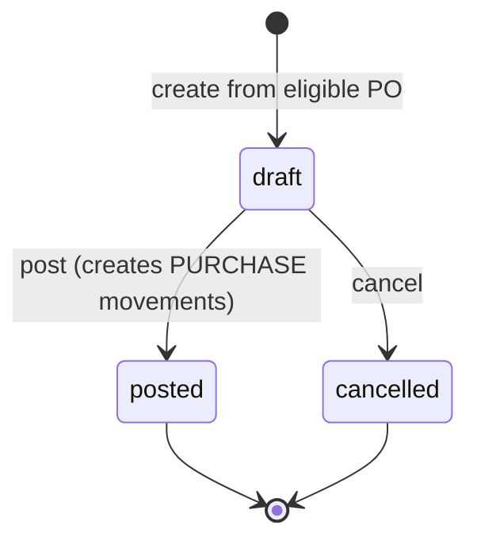

# Sprint 16.3 Technical Design — Goods Receipt Workflow

Date: 2026-06-06  
Status: COMPLETED (see `docs/sprint_16_3_goods_receipt_completion_summary.md`)  
Baseline: Sprint 16.2 Purchase Order complete (`sprint-16.2-complete`)

## Goal

Introduce a branch-scoped **Goods Receipt (GR)** workflow that closes the procurement chain:

```text
Purchase Request → Purchase Order → Goods Receipt → Inventory PURCHASE Movement
```

Sprint 16.3 is the **first sprint in the procurement milestone that writes to the inventory ledger**.
Goods Receipt must create `trx_inventory_movements` rows with `movement_type = PURCHASE` inside
`DB::transaction()` boundaries. Stock remains ledger-derived; no mutable stock columns are added.

### In Scope

- Tables `trx_goods_receipts`, `trx_goods_receipt_items`
- GR document workflow (draft → posted, with cancel from draft)
- PO-linked receiving (approved, sent, or partially_received PO only)
- Partial receipt (multiple GR documents per PO)
- Over-receiving blocked by default
- PURCHASE movement posting with movement references
- Batch/lot support for `requires_batch_tracking` products (Sprint 15.3 patterns)
- PO receiving status progression (`partially_received`, `fully_received`)
- Indonesian operator UI
- Pest feature tests (auth, validation, branch isolation, ledger correctness)

### Out of Scope

- Supplier invoice / payment
- GR void / reversal / credit note (posted GR is immutable in 16.3)
- Over-receiving override flag or approval path
- PO `closed` status (use `fully_received` as terminal receiving state)
- Replacing standalone **Terima Stok** on product stock card (remains for ad-hoc receives)
- HR module
- Cross-branch receiving
- Notification channels

---

## 1. Files Reviewed

### Mandatory workflow reads

| File | Purpose |
|---|---|
| `AGENTS.md` | Agent operating rules |
| `docs/ai_bootstrap_prompt.md` | Bootstrap procedure |
| `docs/inventory_rules.md` | Ledger-only inventory rules |
| `docs/sprint_history.md` | S16.1/S16.2 contracts and deferred receiving statuses |
| `graphify-out/GRAPH_REPORT.md` | Architecture graph (queried indirectly; code/docs used as source of truth) |
| `.cursor/memory/inventory.md` | Procurement milestone memory |
| `.cursor/memory/sprint-roadmap-13-20.md` | Sprint 16.3 placement |

### Sprint 16.1 / 16.2 procurement patterns

| File | Relevance |
|---|---|
| `app/Modules/Inventory/Services/PurchaseRequestService.php` | Workflow service pattern, `BranchContext`, transactions |
| `app/Modules/Inventory/Services/PurchaseOrderService.php` | PO eligibility, item normalization, number generation |
| `app/Modules/Inventory/Models/PurchaseOrder.php` | Status constants; `sent` terminal for document workflow |
| `app/Modules/Inventory/Models/PurchaseOrderItem.php` | Line structure; no `quantity_received` yet |
| `app/Modules/Inventory/Policies/PurchaseOrderPolicy.php` | `ChecksInventoryAccess` policy pattern |
| `app/Modules/Inventory/Controllers/PurchaseOrderController.php` | Thin controller + `RendersInventoryViews` |
| `database/migrations/2026_06_07_100002_create_trx_purchase_orders_table.php` | Header schema conventions |
| `database/migrations/2026_06_07_100003_create_trx_purchase_order_items_table.php` | Line schema conventions |
| `routes/web.php` (purchase-orders block) | Route naming under `inventory.*` |
| `tests/Feature/Inventory/PurchaseOrder*.php` | Test coverage patterns |

### Inventory ledger / receiving patterns

| File | Relevance |
|---|---|
| `app/Modules/Inventory/Services/InventoryStockService.php` | `receiveStock()` → `PURCHASE` inbound movement |
| `app/Modules/Inventory/Models/InventoryMovement.php` | `reference_type` / `reference_id` columns |
| `app/Modules/Inventory/Services/StockTransferService.php` | Transactional movement posting with document reference |
| `app/Modules/Inventory/Services/StockOpnameService.php` | Finalize → ledger posting pattern |
| `docs/sprint_15_3_batch_lot_tracking_design.md` | Batch fields on PURCHASE receive |
| `docs/ui_inventory_module_design.md` | Receive Stock UI contract |
| `docs/ui_design_system.md` | PO does not change stock; GR does |

### Branch / permissions

| File | Relevance |
|---|---|
| `app/Modules/Branch/Services/BranchContext.php` | Active branch resolution |
| `app/Modules/Inventory/Policies/Concerns/ChecksInventoryAccess.php` | Shared policy helpers |
| `database/seeders/PermissionSeeder.php` | `view_inventory`, `manage_inventory` |

---

## 2. Existing Patterns Found

### Layering (S16.1 / S16.2)

```text
Controller → Form Request → Service → Repository → Model
```

- Controllers use `AuthorizesRequests`, `RendersInventoryViews`, inject services only.
- Services own workflow rules inside `DB::transaction()`.
- Repositories scope all queries with `int $branchId` first.
- Policies use `ChecksInventoryAccess` + `belongsToActiveBranch()`.
- Document numbers: `{PREFIX}-{YYYYMMDD}-{branch_id}-{6-digit-sequence}`.

### PR / PO document workflow (no ledger)

| Aspect | PR (16.1) | PO (16.2) | GR (16.3) |
|---|---|---|---|
| Stock impact | None | None | **PURCHASE movements on post** |
| Status flow | draft→submitted→approved/rejected | draft→submitted→approved→sent | draft→posted |
| Terminal states | approved, rejected, cancelled | sent, cancelled | posted, cancelled |
| Approval permission | `approve_inventory_purchase_request` | `approve_inventory_purchase_order` | **Not required** — `manage_inventory` gates post |

### Ledger posting precedents

**Stock Transfer (S15.2):** `StockTransferService::createTransferMovement()` writes movements with:

```text
reference_type = trx_stock_transfers
reference_id   = stock_transfer.id
```

**Stock Opname (S13):** Finalize posts adjustment movements referencing opname document.

**Receive Stock (S12/S15.3):** `InventoryStockService::receiveStock()` posts `PURCHASE` but currently sets
`reference_type` / `reference_id` to `null`. Sprint 16.3 must populate references for GR-originated movements.

### PO receiving deferrals (S16.2 baseline)

- PO statuses `partially_received`, `fully_received`, `closed` were **reserved** but not implemented.
- PO items have `quantity_ordered` only — no cumulative received quantity column yet.
- PO show page has **no** Terima Barang action (explicitly excluded in 16.2).

### Batch tracking (S15.3)

- `requires_batch_tracking` on `inv_products` gates batch form fields.
- PURCHASE receive may create `inv_inventory_batches` and link `inventory_batch_id` on movement.
- GR receiving must reuse the same batch validation/uniqueness rules.

---

## 3. Schema Proposal

### 3.1 `trx_goods_receipts` (header)

Purpose: Branch-scoped goods receipt document. Records receiving intent and audit trail. Does **not**
store stock balances.

| Column | Type | Nullable | Notes |
|---|---|---|---|
| `id` | `bigIncrements` | No | PK |
| `branch_id` | `foreignId → mst_branches` | No | From `BranchContext`; never from request |
| `goods_receipt_number` | `string(50)` | No | Unique; `GR-{YYYYMMDD}-{branch_id}-{seq}` |
| `receipt_date` | `date` | No | Physical receipt date |
| `status` | `string(30)` | No | `draft`, `posted`, `cancelled` |
| `purchase_order_id` | `foreignId → trx_purchase_orders` | No | Required link to PO |
| `supplier_id` | `foreignId → inv_suppliers` | Yes | Copied from PO at creation |
| `supplier_snapshot_name` | `string` | Yes | Copied from PO `supplier_snapshot_name` |
| `supplier_delivery_note` | `string` | Yes | Optional supplier delivery note / surat jalan |
| `notes` | `text` | Yes | Internal notes |
| `posted_by` | `foreignId → users` | Yes | Set on post |
| `posted_at` | `timestamp` | Yes | Set on post |
| `created_by` | `foreignId → users` | Yes | Creator |
| `timestamps` | | No | |

**Indexes:**

- `branch_id`, `status`, `receipt_date`, `purchase_order_id`, `goods_receipt_number`
- Composite: `(branch_id, status)`, `(branch_id, receipt_date)`, `(branch_id, purchase_order_id)`

**Constraints / rules:**

- `purchase_order_id` must reference a PO in the same `branch_id`.
- Posted GR is immutable (no update/delete of posted rows except via future reversal sprint).

### 3.2 `trx_goods_receipt_items` (lines)

Purpose: Per-line received quantities. On post, each line with `accepted_qty > 0` generates exactly one
`PURCHASE` movement. Rejected quantity is recorded for audit but does not affect stock or PO fulfillment.

| Column | Type | Nullable | Notes |
|---|---|---|---|
| `id` | `bigIncrements` | No | PK |
| `goods_receipt_id` | `foreignId → trx_goods_receipts` | No | Cascade delete only while draft |
| `purchase_order_item_id` | `foreignId → trx_purchase_order_items` | No | Source PO line |
| `product_id` | `foreignId → inv_products` | No | Denormalized from PO item for query/report |
| `inventory_location_id` | `foreignId → inv_inventory_locations` | No | **Required** receiving destination |
| `accepted_qty` | `decimal(12,2)` | No | Qty accepted into stock on post; must be ≥ 0; at least one line must have `accepted_qty > 0` |
| `rejected_qty` | `decimal(12,2)` | No | Default `0`; qty rejected on receipt; **never** increments PO `quantity_received` |
| `unit_cost` | `decimal(14,2)` | No | **Cost snapshot** — copied from PO item `unit_price` at GR create/post time |
| `line_total` | `decimal(14,2)` | No | **Cost snapshot** — `accepted_qty × unit_cost`; stored at post time |
| `inventory_batch_id` | `foreignId → inv_inventory_batches` | Yes | Set when batch tracked; created on post if new batch |
| `inventory_movement_id` | `foreignId → trx_inventory_movements` | Yes | Set on post; 1:1 link for audit (only when `accepted_qty > 0`) |
| `notes` | `text` | Yes | Line notes |
| `timestamps` | | No | |

**Indexes:**

- `goods_receipt_id`, `purchase_order_item_id`, `product_id`, `inventory_location_id`
- `inventory_movement_id` (unique when not null)
- Composite: `(goods_receipt_id, purchase_order_item_id)`

**Constraints / rules:**

- `product_id` must match the linked `purchase_order_item.product_id`.
- `inventory_location_id` must belong to same branch as GR.
- `accepted_qty` ≥ 0; `rejected_qty` ≥ 0; at least one line must have `accepted_qty > 0` on post.
- Over-receive guard enforced in service against `accepted_qty` only (see §5).
- `unit_cost` and `line_total` are written at post time and are **immutable** after post.

#### 3.2.1 PO price snapshot on GR item (cost safeguard)

Sprint 16.3 stores received cost on the GR line, not only on the movement row:

| Field | Rule |
|---|---|
| `unit_cost` | Copied from the linked `trx_purchase_order_items.unit_price` at GR creation and **re-snapshotted on post** before movements are created. PO remains the source document; the GR item stores the received cost snapshot for that receipt event. |
| `line_total` | Computed and persisted as `accepted_qty × unit_cost` at post time. Used for line-level audit, future stock valuation, future costing reports, and historical consistency even if PO prices change later. |

**Immutability after post:**

- Future edits to PO item `unit_price` must **not** rewrite `unit_cost` or `line_total` on posted GR items.
- Draft GR updates may refresh `unit_cost` from the current PO item price until the GR is posted.
- Movement `unit_cost` must match the snapshotted GR item `unit_cost` at post time.

### 3.3 PO schema extension (additive migration in 16.3)

**`trx_purchase_order_items` — add:**

| Column | Type | Default | Notes |
|---|---|---|---|
| `quantity_received` | `decimal(12,2)` | `0` | Cumulative received across all **posted** GRs |

This is a **derived cache** of cumulative accepted quantity across all **posted** GRs — a document
fulfillment metric, not stock. Stock remains `SUM(quantity_in) - SUM(quantity_out)`.

#### 3.3.1 Derived cache rule — `quantity_received` ownership

`quantity_received` on `trx_purchase_order_items` is a **derived cache controlled exclusively by
`GoodsReceiptService::post()`**. It exists to improve PO list/reporting performance and avoid repeated
`SUM(accepted_qty)` over posted GR items on common screens. It is safe only when service ownership is strict.

| Layer | Rule |
|---|---|
| **Controllers** | Must not directly update `quantity_received`. |
| **Repositories** | Must not expose arbitrary mutation of `quantity_received` except through service-controlled methods (e.g. `incrementItemQuantityReceived()` called only from `GoodsReceiptService::post()`). |
| **UI / Form Requests** | Must never accept or expose `quantity_received` as editable input. PO show may display it read-only. |
| **Seeders** | Must not rely on manually edited `quantity_received` unless building explicit test fixtures with documented intent. |
| **Service** | All business updates happen inside `GoodsReceiptService::post(...)` within the posting transaction. |
| **Tests** | Must prove `quantity_received` equals the sum of `accepted_qty` from all **posted** GR lines per PO item. |

**Drift prevention:** If `quantity_received` diverges from posted GR accepted totals, treat as a data
integrity bug — the cache must be rebuildable from posted GR items but must not be edited ad hoc.

**`trx_purchase_orders` — extend status enum values:**

| Status | Meaning |
|---|---|
| `partially_received` | At least one posted GR; some lines still have remaining qty |
| `fully_received` | All PO lines have `quantity_received >= quantity_ordered` |

Existing statuses unchanged: `draft`, `submitted`, `approved`, `sent`, `cancelled`.

**PO eligibility for new GR:**

| PO Status | Can create GR? |
|---|---|
| `approved` | Yes |
| `sent` | Yes |
| `partially_received` | Yes (additional partial receipts) |
| `fully_received` | No |
| `draft` | No |
| `submitted` | No |
| `cancelled` | No |
| `rejected` | No (if PO workflow adds this status; otherwise treat cancelled/rejected document states equivalently) |

`closed` remains deferred; `fully_received` is the receiving terminal state.

---

## 4. Model Relations

### `GoodsReceipt`

```text
GoodsReceipt
├── belongsTo Branch
├── belongsTo PurchaseOrder
├── belongsTo Supplier (nullable)
├── belongsTo User (postedBy, createdBy)
└── hasMany GoodsReceiptItem
```

### `GoodsReceiptItem`

```text
GoodsReceiptItem
├── belongsTo GoodsReceipt
├── belongsTo PurchaseOrderItem
├── belongsTo Product
├── belongsTo InventoryLocation
├── belongsTo InventoryBatch (nullable)
└── belongsTo InventoryMovement (nullable, set after post)
```

### `PurchaseOrder` (extended)

```text
PurchaseOrder
└── hasMany GoodsReceipt
```

### `PurchaseOrderItem` (extended)

```text
PurchaseOrderItem
├── hasMany GoodsReceiptItem (via purchase_order_item_id)
└── accessor: quantityRemaining() = quantity_ordered - quantity_received
```

### `InventoryMovement` (read-side)

Posted GR movements are discoverable via the **existing project pattern** (same as Stock Transfer):

```text
reference_type = 'trx_goods_receipts'   // GoodsReceipt::getTable() — no reference_number column in trx_inventory_movements
reference_id   = goods_receipt.id
```

Per-line traceability additionally uses `goods_receipt_items.inventory_movement_id` (1:1 when `accepted_qty > 0`).

**Audit chain:** stock card movement → GR header (`reference_type/id`) → GR item (`inventory_movement_id`) → PO item → PO header.
Do not rely on `notes` text or `goods_receipt_number` alone for traceability.

---

## 5. Status Workflow

### Goods Receipt



| Transition | Preconditions | Side effects |
|---|---|---|
| **create** | PO status ∈ {approved, sent, partially_received}; PO has open lines | GR header + items in `draft`; supplier fields copied from PO |
| **update** | GR is `draft` | Replace line items; revalidate qty/location/product |
| **post** | GR is `draft`; `posted_at` is null; ≥1 line with `accepted_qty > 0`; all validations pass | Snapshot `unit_cost`/`line_total`; create PURCHASE movements; link `inventory_movement_id`; increment PO item `quantity_received` by `accepted_qty` only; update PO status; set GR `posted` + `posted_at`/`posted_by` |
| **cancel** | GR is `draft` | Status → `cancelled`; no ledger writes |

**Posted GR is terminal and immutable** in Sprint 16.3.

### Purchase Order (receiving progression)

```text
approved ──┐
sent ──────┼──► partially_received ──► fully_received
           │         ▲      │
           └─────────┘      └── (additional posted GRs while partial)
```

#### PO completion algorithm (after GR post)

When a GR is posted, `GoodsReceiptService::post()` updates PO fulfillment inside the same transaction:

**Per PO item (`syncPurchaseOrderReceivingStatus` helper):**

1. For each GR line linked to the PO item, add **`accepted_qty` only** to `purchase_order_items.quantity_received`:
   ```text
   quantity_received += gr_item.accepted_qty
   ```
2. **`rejected_qty` must not increase `quantity_received`** — rejected quantity is audit-only on the GR line.
3. Compute remaining per line:
   ```text
   remaining_qty = quantity_ordered - quantity_received
   ```

**PO header status algorithm** (evaluate after all PO items are updated):

| Condition | PO status |
|---|---|
| Every PO item has `quantity_received >= quantity_ordered` | `fully_received` |
| At least one PO item has `quantity_received > 0` but not all lines are fully received | `partially_received` |
| No PO item has `quantity_received > 0` (edge case — should not occur after a successful post with lines) | Keep current eligible status (`approved` or `sent`) |

**Transition guards:**

- Only transition PO status from `{approved, sent, partially_received}`.
- Never transition from `draft`, `submitted`, or `cancelled`.
- After `fully_received`, no new GR may be created for that PO.

**Eligibility recap — GR create allowed only when PO status ∈:**

- `approved`
- `sent`
- `partially_received`

**GR create blocked when PO status ∈:**

- `draft`
- `submitted`
- `rejected` (if present)
- `cancelled`
- `fully_received`

### Partial receipt

- Multiple GR documents may exist per PO.
- Each GR may include a subset of PO lines and/or partial quantities per line.
- Remaining qty per PO line:

```text
remaining_qty = quantity_ordered - quantity_received
```

- Create form pre-fills lines with `remaining_qty > 0` only; operator may zero-out or omit lines.

### Over-receiving (blocked)

For each GR line on post (using `accepted_qty` only):

```text
new_cumulative = po_item.quantity_received + gr_item.accepted_qty
MUST satisfy: new_cumulative <= po_item.quantity_ordered
```

`rejected_qty` does not participate in over-receive calculation or PO fulfillment.

No override in 16.3. Error message (Indonesian):

```text
Jumlah diterima melebihi sisa pesanan untuk item ini.
```

---

## 6. Service Methods

### `GoodsReceiptService`

| Method | Responsibility |
|---|---|
| `listForBranch(int $branchId, array $filters)` | Paginated index; branch-scoped |
| `findEligiblePurchaseOrderForCreate(int $purchaseOrderId)` | Validate PO status + branch; load open lines |
| `buildPrefillItemsFromPurchaseOrder(PurchaseOrder $po)` | Lines with `quantity_remaining > 0`, default location from PO item |
| `createDraft(array $data, User $user)` | Create GR + items in transaction |
| `createDraftFromPurchaseOrder(PurchaseOrder $po, array $data, User $user)` | PO-linked create with prefill |
| `updateDraft(GoodsReceipt $gr, array $data, User $user)` | Draft-only header/line replace |
| `post(GoodsReceipt $gr, User $user)` | **Ledger write** — movements + PO fulfillment update |
| `cancel(GoodsReceipt $gr, User $user)` | Draft-only cancel |

**Private helpers (mirror PO service style):**

- `lockGoodsReceiptInBranch(int $branchId, int $id)`
- `lockPurchaseOrderInBranch(int $branchId, int $id)`
- `generateGoodsReceiptNumber(int $branchId, string $receiptDate)`
- `normalizeAndValidateItems(int $branchId, PurchaseOrder $po, array $items)`
- `assertPurchaseOrderEligibleForReceipt(PurchaseOrder $po, int $branchId)`
- `assertStatus(GoodsReceipt $gr, string|array $allowed)`
- `postPurchaseMovements(GoodsReceipt $gr, Collection $items, User $user)`
- `snapshotLineCosts(GoodsReceiptItem $item, PurchaseOrderItem $poItem)` — copy `unit_cost`, compute `line_total`
- `syncPurchaseOrderReceivingStatus(PurchaseOrder $po)` — PO item cache + header status algorithm (§5)
- `assertNotAlreadyPosted(GoodsReceipt $gr)` — idempotency guard (§6)

### Posting guard and idempotency (`post()`)

Posting must be **idempotent with respect to ledger and PO cache** — a posted GR creates inventory
movements exactly once. Guard at the start of `post()` (before any writes):

```php
if ($goodsReceipt->posted_at !== null || $goodsReceipt->status === GoodsReceipt::STATUS_POSTED) {
    throw new DomainException('Goods Receipt already posted.');
}
```

Additional rules:

| Rule | Detail |
|---|---|
| Status guard | `post()` allowed only when `status = draft` and `posted_at IS NULL`. |
| Double-post block | If `posted_at` is not null **or** status is `posted`, posting must be blocked. |
| Single movement set | Posted GR must create PURCHASE inventory movements **only once** — no duplicate rows on retry or concurrent requests. |
| Transaction scope | Entire post runs inside one `DB::transaction()`. |
| Atomic updates | Status, `posted_at`, `posted_by`, PO item `quantity_received`, PO header status, GR item cost snapshots, and inventory movement records commit together or roll back together. |
| Failure rollback | If movement creation fails, GR status, `posted_at`, PO `quantity_received`, and PO status must **not** be updated. |

**Concurrency mitigation:** Lock GR header and PO header (and PO items) with `lockForUpdate()` at the
start of the transaction before re-checking the posting guard.

### `GoodsReceiptRepository` + interface

| Method | Responsibility |
|---|---|
| `paginateForBranch(int $branchId, array $filters)` | Index queries |
| `findForBranch(int $branchId, int $id)` | Detail with relations |
| `create(array $data)` | Header insert |
| `update(GoodsReceipt $gr, array $data)` | Header update |
| `replaceItems(GoodsReceipt $gr, array $items)` | Delete draft lines + insert |
| `latestNumberForDateAndBranch(string $prefix, int $branchId)` | Number sequence |
| `existsNumber(string $number)` | Uniqueness check |

### `PurchaseOrderRepository` extension

- `incrementItemQuantityReceived(int $poItemId, float $acceptedQty)` — atomic increment inside post transaction; **callable only from `GoodsReceiptService::post()`**
- `updateStatus(PurchaseOrder $po, string $status)`

Repository must **not** expose generic `updateQuantityReceived()` or mass-assignment paths for the cache column.

### `InventoryStockService` extension (minimal)

Add optional parameters to inbound path:

```php
receiveStock(
    ...,
    ?string $referenceType = null,
    ?int $referenceId = null,
): InventoryMovement
```

`GoodsReceiptService::postPurchaseMovements()` calls `receiveStock()` (or shared private inbound helper)
with:

- `movement_type` = `PURCHASE`
- `supplier_id` from GR/PO
- `unit_cost` from GR item
- `reference_type` = `trx_goods_receipts`
- `reference_id` = GR id
- `batchData` from GR item batch fields when `requires_batch_tracking`

**Do not** duplicate batch creation logic — delegate to `InventoryStockService`.

### Transaction boundary for `post()`

Single `DB::transaction()` with row locks:

1. Lock GR (draft), PO, PO items (`lockForUpdate`)
2. **Posting guard** — `assertNotAlreadyPosted()` (see pseudo-code above)
3. Revalidate PO eligibility, quantities, and over-receive against `accepted_qty`
4. For each GR item with `accepted_qty > 0`:
   - Snapshot `unit_cost` from PO item `unit_price`; persist `line_total = accepted_qty × unit_cost`
   - Create PURCHASE movement with traceability refs (§7); store `inventory_movement_id`
5. Increment each PO item `quantity_received` by **`accepted_qty` only** (not `rejected_qty`)
6. Run PO completion algorithm — set `partially_received` or `fully_received` (§5)
7. Update GR → `status = posted`, set `posted_by`, `posted_at`

Rollback on any failure — no partial movements, no partial PO cache updates, no partial GR status change.

---

## 7. Inventory Movement Posting Design

### Source traceability (mandatory)

Each PURCHASE movement created by GR posting must be traceable back to the Goods Receipt document
using the **existing `trx_inventory_movements` columns** (no `reference_number` column exists today;
Sprint 16.3 follows the Stock Transfer precedent):

| Field | Value | Purpose |
|---|---|---|
| `reference_type` | `trx_goods_receipts` (i.e. `GoodsReceipt::getTable()`) | Document-level back-link |
| `reference_id` | GR header `id` | Resolves to GR show page |
| `notes` | e.g. `Dihasilkan dari penerimaan barang {goods_receipt_number}` | Human-readable supplement only — **not** a substitute for `reference_type/id` |

**Line-level traceability:**

- `goods_receipt_items.inventory_movement_id` → movement row (1:1 when `accepted_qty > 0`)
- Enables audit path: **stock card → movement → GR item → GR header → PO**

**Do not:**

- Rely only on free-text `notes` or `goods_receipt_number` string matching for programmatic traceability.
- Leave `reference_type` / `reference_id` null for GR-originated PURCHASE movements (unlike standalone Terima Stok).

### Movement row (per GR item with `accepted_qty > 0`)

| Field | Value |
|---|---|
| `branch_id` | GR `branch_id` |
| `inventory_location_id` | GR item location (required) |
| `product_id` | GR item product |
| `supplier_id` | GR `supplier_id` (from PO) |
| `inventory_batch_id` | Created/selected per 15.3 rules |
| `movement_type` | `PURCHASE` |
| `movement_date` | GR `receipt_date` |
| `quantity_in` | GR item `accepted_qty` |
| `quantity_out` | `0` |
| `unit_cost` | GR item snapshotted `unit_cost` (from PO at post time; ≥ 0) |
| `reference_type` | `trx_goods_receipts` |
| `reference_id` | GR `id` |
| `notes` | e.g. `Dihasilkan dari penerimaan barang {goods_receipt_number}` |
| `created_by` | posting user |

Lines with `accepted_qty = 0` and `rejected_qty > 0` record rejection on the GR line only — **no movement**.

### Validation before each movement

- Product active in branch
- Location active in branch
- Supplier active in branch (when set)
- Quantity > 0
- Batch rules per Sprint 15.3 when `requires_batch_tracking`
- Over-receive guard at PO item level

### Stock effect

```text
current_stock(product, location) increases by accepted_qty (per line)
```

Derived only from ledger — no product/location balance columns updated.

### Coexistence with standalone Terima Stok

| Path | Reference | Use case |
|---|---|---|
| Product stock card → Terima Stok | `reference_type = null` | Ad-hoc receive without PO |
| Goods Receipt → Post | `reference_type = trx_goods_receipts`, `reference_id = gr.id` | Procurement receive against PO |

Both use `movement_type = PURCHASE`. Analytics and stock card display both; GR-originated movements
must always populate `reference_type` / `reference_id`.

### Idempotency and posting guards

| Guard | Enforcement |
|---|---|
| `posted_at IS NOT NULL` | Block post — throw domain exception |
| `status = posted` | Block post — throw domain exception |
| `status = draft` required | Policy + service `assertStatus()` |
| Single movement creation | Posting guard + transaction; `inventory_movement_id` unique per line |
| Concurrent double-post | Row lock GR + re-check guard inside transaction |

Posted GR cannot be posted again. A second post attempt must not duplicate PURCHASE movements or
double-increment PO `quantity_received`.

---

## 8. Route Names

All routes under `inventory` prefix with `inventory.` name prefix (match PO/PR).

| Method | URI | Route name |
|---|---|---|
| GET | `inventory/goods-receipts` | `inventory.goods-receipts.index` |
| GET | `inventory/goods-receipts/create` | `inventory.goods-receipts.create` |
| POST | `inventory/goods-receipts` | `inventory.goods-receipts.store` |
| GET | `inventory/goods-receipts/{goods_receipt}` | `inventory.goods-receipts.show` |
| GET | `inventory/goods-receipts/{goods_receipt}/edit` | `inventory.goods-receipts.edit` |
| PUT/PATCH | `inventory/goods-receipts/{goods_receipt}` | `inventory.goods-receipts.update` |
| POST | `inventory/goods-receipts/{goodsReceipt}/post` | `inventory.goods-receipts.post` |
| POST | `inventory/goods-receipts/{goodsReceipt}/cancel` | `inventory.goods-receipts.cancel` |

**Query param prefill:** `inventory.goods-receipts.create?purchase_order_id={id}`

**PO show integration:** **Terima Barang** button → create route with `purchase_order_id`.

Route model binding must resolve GR through branch-scoped repository (`findInBranch`).

---

## 9. Policy Matrix

### `GoodsReceiptPolicy` (uses `ChecksInventoryAccess`)

| Ability | Permission | Status guard | Branch guard |
|---|---|---|---|
| `viewAny` | `view_inventory` | — | active branch context |
| `view` | `view_inventory` | — | `belongsToActiveBranch` |
| `create` | `manage_inventory` | — | — |
| `update` | `manage_inventory` | `draft` only | `belongsToActiveBranch` |
| `post` | `manage_inventory` | `draft` only | `belongsToActiveBranch` |
| `cancel` | `manage_inventory` | `draft` only | `belongsToActiveBranch` |

No separate `approve_inventory_goods_receipt` permission in 16.3 — posting is the authoritative
stock-affecting action, gated by `manage_inventory` (same as transfer receive / stock operations).

### `PurchaseOrderPolicy` extension

| Ability | Notes |
|---|---|
| `receive` (new) | `manage_inventory` + PO status ∈ {approved, sent, partially_received} + branch match |

Used to show **Terima Barang** on PO show page.

### Permissions seeder

No new permission required if `manage_inventory` / `view_inventory` suffice. Optional future:
`post_inventory_goods_receipt` — **not in 16.3**.

---

## 10. Validation Rules

### Header — `StoreGoodsReceiptRequest` / `UpdateGoodsReceiptRequest`

| Field | Rules |
|---|---|
| `purchase_order_id` | Required on create; exists in branch; PO eligible for receipt |
| `receipt_date` | Required; `date`; not in the future |
| `supplier_delivery_note` | Optional; `string`; `max:100` |
| `notes` | Optional; `string` |
| `items` | Required; `array`; `min:1` |

### Line items — shared concern `ValidatesGoodsReceiptInput`

| Field | Rules |
|---|---|
| `items.*.purchase_order_item_id` | Required; exists; belongs to linked PO |
| `items.*.product_id` | Required; matches PO item product |
| `items.*.inventory_location_id` | Required; active location in branch |
| `items.*.accepted_qty` | Required; `numeric`; `min:0` |
| `items.*.rejected_qty` | Optional; `numeric`; `min:0`; default `0` |
| `items.*.unit_cost` | Optional on draft input; service snapshots from PO at post — **not user-editable after post** |
| `items.*.notes` | Optional; `string` |

**Excluded from all requests:** `quantity_received` (PO item cache), `line_total`, `posted_at`, `inventory_movement_id`.

### Batch fields (when product `requires_batch_tracking`)

Reuse Sprint 15.3 receive rules:

| Field | Rules |
|---|---|
| `items.*.batch_number` | Required if batch tracking; `max:100` |
| `items.*.lot_number` | Optional; `max:100` |
| `items.*.received_date` | Required if batch tracking; `date`; `before_or_equal:today` |
| `items.*.expiry_date` | Optional; `date`; `>= received_date` |
| `items.*.inventory_batch_id` | Optional; existing batch in branch for product |

Server must reload product and enforce `requires_batch_tracking` — never trust client flags.

### Service-layer guards (not duplicated in FormRequest alone)

- PO status eligibility (§5)
- Over-receive: `quantity_received + accepted_qty <= quantity_ordered`
- `rejected_qty` must not affect PO `quantity_received`
- Duplicate `purchase_order_item_id` within same GR blocked
- At least one line with `accepted_qty > 0`
- GR post blocked if PO is `fully_received`
- Posting guard: `posted_at` null and status not `posted`
- Inactive product/location/supplier rejected with Indonesian messages

### Indonesian validation messages (samples)

| Key | Message |
|---|---|
| `purchase_order_id` | Pesanan pembelian tidak ditemukan atau tidak dapat diterima. |
| `items.*.accepted_qty` | Jumlah diterima harus nol atau lebih. |
| over-receive | Jumlah diterima melebihi sisa pesanan untuk item ini. |
| `items.*.inventory_location_id` | Lokasi persediaan wajib dipilih dan harus aktif. |
| post | Penerimaan barang sudah diposting. |

---

## 11. UI Pages

Follow Sprint 12 inventory UI + `docs/ui_design_system.md`. Indonesian operator labels.

### Sidebar

- New link: **Penerimaan Barang** (permission: `view_inventory`)
- Placement: Inventory group, after **Pesanan Pembelian**

### Pages

| View | Path | Purpose |
|---|---|---|
| Index | `inventory/goods-receipts/index` | List GR with filters (status, PO, supplier, date range) |
| Create | `inventory/goods-receipts/create` | New GR; PO selector or prefill via `purchase_order_id` |
| Edit | `inventory/goods-receipts/edit` | Draft-only line editing |
| Show | `inventory/goods-receipts/show` | Detail; posted shows linked movements |

### Partial blades

- `_form.blade.php` — header + dynamic line repeater
- `_status-badge.blade.php` — `draft` / `posted` / `cancelled`
- `_line-row.blade.php` — product, location, qty, unit cost, batch fields (conditional)

### Index columns (Indonesian)

- Nomor Penerimaan
- Tanggal Terima
- Nomor PO
- Supplier
- Status
- Diposting Oleh / Pada (when posted)

### Create / Edit line columns

- Produk (read-only from PO)
- Lokasi Penerimaan (required select)
- Jumlah Pesan / Sudah Diterima / Sisa (read-only helpers — PO `quantity_received` display only)
- Jumlah Diterima / Ditolak (`accepted_qty` / `rejected_qty` editable on draft)
- Harga Satuan (read-only from PO snapshot on draft; snapshotted on post)
- Batch/Lot fields (when `requires_batch_tracking`)

**UI safeguard:** PO item `quantity_received` is **never** an editable form field on GR or PO create/edit forms.

### Show page sections

1. **Ringkasan Dokumen** — GR number, dates, PO link, supplier, status badge
2. **Item Penerimaan** — lines with qty and location
3. **Pergerakan Stok** (when posted) — table of linked PURCHASE movements with link to stock card
4. **Actions** (permission-gated):
   - Draft: Simpan, Posting Penerimaan, Batalkan
   - Posted: read-only

### PO show page addition

- Button **Terima Barang** when `@can('receive', $purchaseOrder)` and PO has remaining qty
- Warning banner on PO show (already implied by design system):

```text
Pesanan pembelian tidak menambah stok. Stok bertambah saat Penerimaan Barang diposting.
```

### Posting confirmation

Use `<x-modal>` + warning banner (mirror Stock Opname finalize):

```text
Posting akan menambah stok melalui pergerakan ledger PURCHASE dan tidak dapat dibatalkan.
```

Show summary: total lines, total qty in, locations affected.

### Dashboard quick action

- **Buat Penerimaan Barang** — links to create (optionally filtered to eligible POs)

### Status badge labels

| Status | Label |
|---|---|
| `draft` | Draft |
| `posted` | Diposting |
| `cancelled` | Dibatalkan |

### PO receiving status badges (new)

| Status | Label |
|---|---|
| `partially_received` | Sebagian Diterima |
| `fully_received` | Lengkap Diterima |

---

## 12. Test Strategy

### New test files (Pest, `RefreshDatabase`)

| File | Focus |
|---|---|
| `GoodsReceiptSchemaTest.php` | Tables, columns, indexes, FKs, PO extension columns |
| `GoodsReceiptModelTest.php` | Relations, accessors, status helpers |
| `GoodsReceiptServiceTest.php` | Workflow, partial receipt, over-receive block, PO status sync, posting guard, cost snapshot |
| `GoodsReceiptPolicyTest.php` | Auth matrix, branch denial |
| `GoodsReceiptControllerTest.php` | HTTP happy/deny paths, double-post denial |
| `GoodsReceiptLedgerTest.php` | **Ledger correctness** — stock increases, movement refs, batch FK, idempotency |
| `GoodsReceiptBranchIsolationTest.php` | Cross-branch PO/GR/location denied |
| `GoodsReceiptUiTest.php` | Blade labels, buttons, permission gates |

### Required scenarios

**Happy path**

- Create draft GR from `sent` PO → post → PURCHASE movements created
- Partial receipt → PO `partially_received`; second GR completes → `fully_received`
- PO item `quantity_received` equals sum of `accepted_qty` from all posted GR lines (derived cache correctness)
- Movement `reference_type/id` points to GR header (`trx_goods_receipts`)
- Stock increases at correct location by `accepted_qty` (ledger-derived assertion)

**Safeguard tests (required in 16.3.7)**

| Scenario | Assertion |
|---|---|
| Posted GR cannot be posted twice | Second `post()` throws; GR unchanged |
| Double post does not duplicate PURCHASE movements | Movement count unchanged after failed second post |
| Movement has reference to Goods Receipt | `reference_type = trx_goods_receipts`, `reference_id = gr.id` |
| Cost snapshot on GR item | After post, `unit_cost` matches PO item price at post time; `line_total = accepted_qty × unit_cost` |
| PO cache increment by accepted only | `quantity_received` increases by `accepted_qty` per posted GR line |
| Rejected qty excluded from PO cache | Line with `rejected_qty > 0` does not increase PO `quantity_received` |
| Partial PO status | After partial post, PO status = `partially_received` |
| Full PO status | After all ordered qty received across GR(s), PO status = `fully_received` |
| Fully received PO blocks new GR | Create GR from `fully_received` PO rejected |
| UI does not expose PO `quantity_received` as editable | Form/request tests — field absent from GR create/update payloads |

**Validation**

- PO `draft` / `submitted` / `cancelled` / `fully_received` rejected for new GR
- `accepted_qty < 0` or all lines zero rejected
- Over-receive rejected (accepted_qty only)
- Inactive product/location/supplier rejected
- Missing location rejected
- Batch required when `requires_batch_tracking`
- Post blocked when `posted_at` already set

**Authorization**

- `view_inventory` can index/show
- `manage_inventory` required for create/update/post/cancel
- Wrong permission → 403

**Branch isolation**

- GR in branch A not visible/actionable from branch B context
- PO from other branch cannot be linked
- Location from other branch rejected

**Ledger**

- No mutable stock columns added (schema test)
- Post is atomic — failed mid-post rolls back movements, PO cache increments, and GR status
- Duplicate post blocked (`posted_at` + status guard)
- Cancelled draft creates no movements
- PO `quantity_received` drift test — cache matches sum of posted GR `accepted_qty` per PO item

**Regression**

- Existing `InventoryStockServiceTest` still passes
- Purchase Order tests updated for new PO statuses and `quantity_received` column
- Standalone Terima Stok still works with `reference_type = null`

### Quality gates (at implementation completion)

```bash
php artisan migrate:fresh --seed
php artisan test
php artisan test --filter=GoodsReceipt
vendor/bin/pint
php artisan route:list
npm run build
graphify update .
```

---

## 13. Risks

| Risk | Mitigation |
|---|---|
| Partial post leaves inconsistent PO/ledger state | Single `DB::transaction()`; lock PO + GR rows; rollback all writes on any failure |
| Over-receive corrupts fulfillment tracking | Service guard on `accepted_qty` + test coverage; no override in 16.3 |
| Duplicate movement on double-post | `posted_at`/status posting guard + row lock + `inventory_movement_id` uniqueness; safeguard tests in 16.3.7 |
| **`quantity_received` drift from ledger/GR items** | Service-only cache updates in `post()`; tests prove cache = SUM(posted `accepted_qty`); no controller/repository ad hoc edits |
| **Cost snapshot mismatch if PO is edited after receipt** | Snapshot `unit_cost`/`line_total` at post time; immutable on posted GR; movement uses GR item snapshot not live PO price |
| **Missing source reference on inventory movement** | Mandate `reference_type = trx_goods_receipts` + `reference_id`; line FK `inventory_movement_id`; test traceability chain |
| **Double posting caused by concurrent requests** | `lockForUpdate()` on GR + PO inside transaction; re-check posting guard after lock |
| **PO status mismatch if posting transaction partially fails** | All PO cache/status updates inside same transaction as movements; no partial commit |
| Batch logic drift from `InventoryStockService` | Delegate inbound to stock service; do not reimplement |
| Standalone Terima Stok vs GR confusion | UI labels + reference_type distinction; PO show warning |
| PO item location nullable but GR requires location | Force location selection on GR line; default from PO when set |
| `approved` PO receipt before `sent` | Allowed per scope; document in UI that sent is recommended |
| Posted GR cannot be reversed | Accept for 16.3; document as follow-up (credit/adjustment sprint) |
| Performance on multi-line post | Acceptable for lab scale; batch inserts in one transaction |
| Test suite growth | Focused `--filter=GoodsReceipt` for iteration; full suite before tag |

---

## 14. Implementation Plan

Sub-phases map to sprint deliverables for tracking:

| Sub-phase | Scope |
|---|---|
| **16.3.1** | Design approval (this document) |
| **16.3.2** | Schema & models |
| **16.3.3** | Posting transaction, PO cache, PO status algorithm, movement traceability |
| **16.3.4** | HTTP layer (requests, policy, controller, routes) |
| **16.3.5** | UI |
| **16.3.6** | Integration & docs |
| **16.3.7** | Safeguard & ledger test suite |

### Phase 0 — Design approval (16.3.1)

- [ ] Review and approve this document
- [ ] Confirm PO eligibility: `approved`, `sent`, `partially_received` (not `draft`/`submitted`/`cancelled`/`fully_received`)

### Phase 1 — Schema & models (16.3.2)

- [ ] Migration: `trx_goods_receipts`, `trx_goods_receipt_items`
- [ ] **`trx_goods_receipt_items` must include `accepted_qty`, `rejected_qty`, `unit_cost`, `line_total`**
- [ ] Migration: add `quantity_received` (default `0`) to `trx_purchase_order_items` if not already present
- [ ] Migration: extend PO status values (application-level; no DB enum)
- [ ] Models: `GoodsReceipt`, `GoodsReceiptItem` + factories
- [ ] Extend `PurchaseOrder` / `PurchaseOrderItem` models
- [ ] `GoodsReceiptSchemaTest`, `GoodsReceiptModelTest`

### Phase 2 — Repository & service core

- [ ] `GoodsReceiptRepositoryInterface` + `GoodsReceiptRepository`
- [ ] Register binding in `RepositoryServiceProvider`
- [ ] `GoodsReceiptService` — draft create/update/cancel (no ledger yet)
- [ ] Extend `PurchaseOrderRepository` — service-controlled `incrementItemQuantityReceived()` only
- [ ] `GoodsReceiptServiceTest` (draft paths)

### Phase 3 — Ledger posting (16.3.3)

- [ ] Extend `InventoryStockService::receiveStock()` with reference params
- [ ] `GoodsReceiptService::post()` — **posting transaction**, posting guard/idempotency, cost snapshot, movement traceability
- [ ] **`quantity_received` update (accepted_qty only)**, PO completion algorithm, PO status sync
- [ ] `GoodsReceiptLedgerTest`, extend `InventoryStockServiceTest`

### Phase 4 — HTTP layer (16.3.4)

- [ ] `StoreGoodsReceiptRequest`, `UpdateGoodsReceiptRequest`, `ValidatesGoodsReceiptInput` — exclude PO `quantity_received` from input
- [ ] `GoodsReceiptPolicy` + register in `RepositoryServiceProvider`
- [ ] Extend `PurchaseOrderPolicy::receive`
- [ ] `GoodsReceiptController` + routes
- [ ] `GoodsReceiptPolicyTest`, `GoodsReceiptControllerTest`, `GoodsReceiptBranchIsolationTest`

### Phase 5 — UI (16.3.5)

- [ ] Blade views under `resources/views/inventory/goods-receipts/`
- [ ] Sidebar **Penerimaan Barang**
- [ ] PO show **Terima Barang** button
- [ ] Dashboard quick action
- [ ] Read-only PO `quantity_received` on forms; editable `accepted_qty` / `rejected_qty` only
- [ ] `GoodsReceiptUiTest`
- [ ] `npm run build`

### Phase 6 — Integration & docs (16.3.6)

- [ ] Update `tests/Feature/Inventory/PurchaseOrder*Test` for new statuses and derived cache column
- [ ] Update `.cursor/memory/inventory.md` and `docs/sprint_history.md` (at sprint completion only)
- [ ] Run full quality gates
- [ ] Tag `sprint-16.3-complete`

### Phase 7 — Safeguard tests (16.3.7)

- [ ] Posted GR cannot be posted twice
- [ ] Double post does not duplicate PURCHASE movements
- [ ] Movement `reference_type/id` traceability to GR
- [ ] `unit_cost` and `line_total` snapshotted on GR item at post
- [ ] PO `quantity_received` increases only by `accepted_qty`
- [ ] `rejected_qty` does not increase PO cache
- [ ] PO `partially_received` / `fully_received` transitions
- [ ] `fully_received` PO cannot create new GR
- [ ] UI/request tests — PO `quantity_received` not editable

### File manifest (expected new/changed)

**New**

- `database/migrations/*_create_trx_goods_receipts_table.php`
- `database/migrations/*_create_trx_goods_receipt_items_table.php`
- `database/migrations/*_add_receiving_columns_to_purchase_order_items.php`
- `app/Modules/Inventory/Models/GoodsReceipt.php`
- `app/Modules/Inventory/Models/GoodsReceiptItem.php`
- `app/Modules/Inventory/Interfaces/GoodsReceiptRepositoryInterface.php`
- `app/Modules/Inventory/Repositories/GoodsReceiptRepository.php`
- `app/Modules/Inventory/Services/GoodsReceiptService.php`
- `app/Modules/Inventory/Policies/GoodsReceiptPolicy.php`
- `app/Modules/Inventory/Controllers/GoodsReceiptController.php`
- `app/Modules/Inventory/Requests/StoreGoodsReceiptRequest.php`
- `app/Modules/Inventory/Requests/UpdateGoodsReceiptRequest.php`
- `app/Modules/Inventory/Requests/Concerns/ValidatesGoodsReceiptInput.php`
- `database/factories/GoodsReceiptFactory.php`
- `database/factories/GoodsReceiptItemFactory.php`
- `resources/views/inventory/goods-receipts/*`
- `tests/Feature/Inventory/GoodsReceipt*.php`

**Changed**

- `app/Modules/Inventory/Models/PurchaseOrder.php` — new statuses + `goodsReceipts()` relation
- `app/Modules/Inventory/Models/PurchaseOrderItem.php` — `quantity_received`, `quantityRemaining()`
- `app/Modules/Inventory/Policies/PurchaseOrderPolicy.php` — `receive()`
- `app/Modules/Inventory/Services/InventoryStockService.php` — reference params
- `app/Modules/Inventory/Repositories/PurchaseOrderRepository.php` — receiving helpers
- `app/Providers/RepositoryServiceProvider.php` — bindings + policy
- `routes/web.php` — goods-receipts routes
- `resources/views/inventory/purchase-orders/show.blade.php` — Terima Barang CTA
- `resources/views/layouts/sidebar.blade.php` — navigation link

---

## Assumptions

1. PO statuses `approved`, `sent`, and `partially_received` allow receiving; `sent` is the operational norm but `approved` is not blocked.
2. `quantity_received` on PO items is a **derived cache** of cumulative accepted qty — not a stock balance and not user-editable.
3. GR lines use `accepted_qty` (stock + PO cache) and optional `rejected_qty` (audit only).
4. One PURCHASE movement per GR line with `accepted_qty > 0` (not one aggregated movement per GR).
5. `unit_cost` and `line_total` on GR items are immutable cost snapshots after post; PO price edits do not retroactively change posted GR costs.
6. Posted GR is immutable; corrections require a future reversal/adjustment sprint.
7. Standalone product **Terima Stok** remains for non-PO receives (`reference_type = null`).
8. No new Spatie permission is required; `manage_inventory` gates posting.
9. `closed` PO status is not implemented; `fully_received` terminates the receiving lifecycle.
10. `trx_inventory_movements` has `reference_type` / `reference_id` only — no `reference_number` column; GR traceability follows the Stock Transfer pattern.

---

## Sprint Consistency Check

| Sprint rule | Compliance |
|---|---|
| S10 — BranchContext | `BranchContext::requireId()` in all service writes |
| S11 — Branch-scoped queries | Repository `findInBranch`; policy branch guard |
| S12 — Ledger-only stock | PURCHASE movements only; no mutable stock columns |
| S16.1 — PR intent-only | Unchanged; no PR ledger writes |
| S16.2 — PO document-only | PO workflow unchanged; ledger only via GR post |
| S15.3 — Batch tracking | Reuse `InventoryStockService` batch path |

---

*End of Sprint 16.3 Technical Design*
