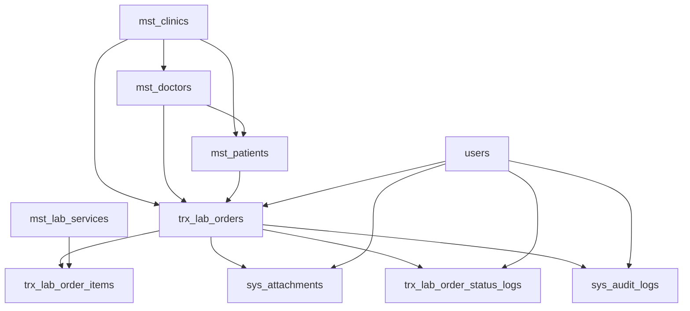

# SPRINT 3 TECHNICAL DESIGN DOCUMENT

## Project

Asia Dental Lab Management System

## Version

1.0

## Sprint

Sprint 3 - Lab Order Core

## Architecture

Laravel 12, Blade + Livewire 3, PostgreSQL 16, Modular Monolith

---

# 1. Sprint Overview

## Sprint Goal

Sprint 3 membangun fondasi teknis modul Lab Order sebagai pusat transaksi awal Asia Dental Lab Management System. Modul ini harus siap menjadi anchor untuk Production, Quality Control, Delivery, Invoice, Payment, dan Reporting pada sprint berikutnya.

## Business Objective

Tujuan bisnis Sprint 3 adalah mengganti pencatatan order manual menjadi pencatatan digital yang:

* memiliki nomor order otomatis;
* mencatat clinic, doctor, patient, service item, due date, priority, dan notes;
* menyimpan attachment kasus;
* menyimpan timeline status;
* mencatat audit trail untuk aktivitas penting;
* dikendalikan oleh permission dan policy.

## In Scope

Sprint 3 hanya mencakup:

* Lab Order CRUD
* Lab Order Items
* Attachment Upload
* Status Timeline
* Audit Trail
* Permissions
* Policies
* Seeder Planning
* Testing Strategy

## Out of Scope

Sprint 3 tidak mengimplementasikan:

* Technician Assignment
* Production Workflow
* QC Workflow
* Delivery Workflow
* Invoice
* Payment
* Reporting

Status, tab, dan field yang terkait sprint berikutnya boleh disiapkan sebagai placeholder atau schema preparation, tetapi tidak boleh memiliki workflow aktif pada Sprint 3.

---

# 2. Architecture Overview

Lab Order berada setelah master data Clinic, Doctor, dan Patient. Satu Lab Order berisi satu atau lebih Lab Order Item yang merujuk ke Lab Service.

Alur domain inti:

```text
Clinic
-> Doctor
-> Patient
-> Lab Order
-> Lab Order Item
```

Supporting components:

* Attachments untuk file resep, foto kasus, STL, X-Ray, dan dokumen pendukung.
* Status Logs untuk semua perubahan status order.
* Audit Logs untuk semua mutasi penting.



Technical flow:

```text
Controller
-> Form Request
-> Service
-> Repository Interface
-> Repository
-> Model
-> PostgreSQL
```

All create, update, cancel, status-change, and attachment-upload operations must run through Service Layer rules and database transactions.

---

# 3. Module Structure

Sprint 3 uses the existing Modular Monolith standard.

Expected module path:

```text
app/Modules/LabOrder
```

Expected structure:

```text
app/Modules/LabOrder/
  Controllers/
  Services/
  Repositories/
  Interfaces/
  Requests/
  Policies/
  Models/
  Resources/
  Tests/
```

| Layer | Responsibility |
| --- | --- |
| Controllers | Receive HTTP or Livewire-facing requests, call services, return response or view data. No business logic. |
| Requests | Validate input, authorize request entry point where applicable, provide consistent validation messages. |
| Services | Own business rules, transactions, order number generation orchestration, status logging, audit logging, and attachment workflow. |
| Repositories | Own database queries, filtering, eager loading, pagination, create/update/delete persistence. No business rules. |
| Interfaces | Define repository contracts and allow service layer to depend on abstractions. |
| Models | Represent database tables and relationships. Protect fillable fields and use soft deletes where required. |
| Resources | Shape API-ready responses for future `/api/v1` use. |
| Policies | Enforce record-level authorization for lab order and attachments. |
| Tests | Pest test coverage for CRUD, validation, authorization, audit, status log, attachment, and guest access. |

---

# 4. Domain Models

## LabOrder

| Item | Design |
| --- | --- |
| Purpose | Header transaksi order lab gigi. Menjadi pusat workflow operasional. |
| Table | `trx_lab_orders` |
| Relationships | Belongs to Clinic, Doctor, Patient, creator User, updater User. Has many LabOrderItem, LabOrderStatusLog. Has many Attachment and AuditLog via polymorphic `entity_type/entity_id`. |
| Soft Delete | Required. Lab Order must not be hard deleted. |
| Auditing Requirements | Create, update, cancel, attachment upload, and status change must create audit logs. |

Important fields:

* `order_number`
* `clinic_id`
* `doctor_id`
* `patient_id`
* `order_date`
* `due_date`
* `priority`
* `status`
* `notes`
* `delivery_signature_path`
* `delivery_photo_path`
* `received_by_name`
* `received_at`
* `created_by`
* `updated_by`

## LabOrderItem

| Item | Design |
| --- | --- |
| Purpose | Detail pekerjaan atau service yang dipesan dalam satu Lab Order. |
| Table | `trx_lab_order_items` |
| Relationships | Belongs to LabOrder. Belongs to LabService. |
| Soft Delete | Required. Item removal should preserve history. |
| Auditing Requirements | Item create, update, and delete are audited as part of Lab Order mutation. |

Canonical Sprint 3 fields:

* `lab_order_id`
* `lab_service_id`
* `tooth_number`
* `shade_color_text`
* `material_text`
* `quantity`
* `unit_price`
* `subtotal`
* `notes`

## LabOrderStatusLog

| Item | Design |
| --- | --- |
| Purpose | Immutable timeline record for status changes. |
| Table | `trx_lab_order_status_logs` |
| Relationships | Belongs to LabOrder. Belongs to User through `changed_by`. |
| Soft Delete | Not required. Status history should remain immutable. |
| Auditing Requirements | Every status log creation must also be represented in audit log as `STATUS_CHANGE` when caused by user action. |

Fields:

* `lab_order_id`
* `old_status`
* `new_status`
* `notes`
* `changed_by`
* `changed_at`

## Attachment

| Item | Design |
| --- | --- |
| Purpose | Store metadata for uploaded files related to Lab Order and future modules. |
| Table | `sys_attachments` |
| Relationships | Belongs to uploader User. Polymorphic to LabOrder through `entity_type/entity_id`. |
| Soft Delete | Required. Delete action should remove logical visibility while preserving audit trail. |
| Auditing Requirements | Upload and delete attachment must be audited. |

Fields:

* `entity_type`
* `entity_id`
* `category`
* `file_name`
* `file_path`
* `mime_type`
* `file_size`
* `uploaded_by`
* `uploaded_at`

## AuditLog

| Item | Design |
| --- | --- |
| Purpose | Immutable business audit record for important system activity. |
| Table | `sys_audit_logs` |
| Relationships | Belongs to User through `performed_by`. Polymorphic to entity through `entity_type/entity_id`. |
| Soft Delete | Not required. Audit history must be retained. |
| Auditing Requirements | This is the audit record itself and must not be bypassed. |

Fields:

* `entity_type`
* `entity_id`
* `action`
* `old_values`
* `new_values`
* `performed_by`
* `performed_at`
* `ip_address`
* `user_agent`

---

# 5. Relationships

| Parent | Child | Cardinality | Foreign Key / Strategy | Sprint 3 Usage |
| --- | --- | --- | --- | --- |
| Clinic | Doctor | 1 to many | `mst_doctors.clinic_id` | Read/select supporting data |
| Clinic | Patient | 1 to many | `mst_patients.clinic_id` | Read/select supporting data |
| Doctor | Patient | 1 to many | `mst_patients.doctor_id` | Read/select supporting data |
| Clinic | LabOrder | 1 to many | `trx_lab_orders.clinic_id` | Active |
| Doctor | LabOrder | 1 to many | `trx_lab_orders.doctor_id` | Active |
| Patient | LabOrder | 1 to many | `trx_lab_orders.patient_id` | Active, required by Sprint 3 validation |
| User | LabOrder | 1 to many | `trx_lab_orders.created_by`, `updated_by` | Active |
| LabOrder | LabOrderItem | 1 to many | `trx_lab_order_items.lab_order_id` | Active |
| LabService | LabOrderItem | 1 to many | `trx_lab_order_items.lab_service_id` | Active |
| LabOrder | Attachment | 1 to many | `sys_attachments.entity_type/entity_id` | Active |
| User | Attachment | 1 to many | `sys_attachments.uploaded_by` | Active |
| LabOrder | StatusLog | 1 to many | `trx_lab_order_status_logs.lab_order_id` | Active |
| User | StatusLog | 1 to many | `trx_lab_order_status_logs.changed_by` | Active |
| LabOrder | AuditLog | 1 to many | `sys_audit_logs.entity_type/entity_id` | Active |
| User | AuditLog | 1 to many | `sys_audit_logs.performed_by` | Active |

Note: `database_schema.md` allows `patient_id` nullable for V1 compatibility, but Sprint 3 validation requires `patient_id` because `lab_order_design.md` defines every Lab Order as belonging to one Patient.

---

# 6. Repository Design

Repositories must isolate persistence concerns and expose predictable query methods to services.

## LabOrderRepositoryInterface

Responsibilities:

* Paginate Lab Orders with filters.
* Load Lab Order detail with required relationships.
* Persist Lab Order header.
* Persist Lab Order item changes.
* Soft delete or cancel records through service-approved calls.

Methods and return types:

| Method | Responsibility | Expected Return |
| --- | --- | --- |
| `paginate(filters, perPage)` | List orders with search, filters, eager loading, and pagination. | Length-aware paginator |
| `findById(id)` | Find order by id with basic relationships. | LabOrder or null |
| `findDetailById(id)` | Find order detail with items, attachments, status logs, audit logs. | LabOrder or null |
| `create(data)` | Create Lab Order header. | LabOrder |
| `update(order, data)` | Update Lab Order header. | LabOrder |
| `syncItems(order, items)` | Create, update, and soft delete order items according to request. | Collection of LabOrderItem |
| `softDelete(order)` | Soft delete Lab Order when business rules allow. | Boolean |
| `existsOrderNumber(orderNumber)` | Check generated number collision. | Boolean |
| `latestOrderNumberForYear(year)` | Get latest order number for yearly sequence. | String or null |

Pagination strategy:

* Default `per_page` is 10.
* Maximum `per_page` is 100.
* List query must eager load clinic, doctor, and patient.

Search strategy:

* Search by `order_number`.
* Search by clinic name, doctor name, or patient name through joined or relation-aware query.
* Filter by status, priority, clinic, doctor, patient, order date range, and due date range.

## AttachmentRepositoryInterface

Responsibilities:

* Store attachment metadata.
* List attachments for Lab Order.
* Find attachment by id.
* Soft delete attachment.

Methods and return types:

| Method | Responsibility | Expected Return |
| --- | --- | --- |
| `forEntity(entityType, entityId)` | List active attachments for entity. | Collection |
| `create(data)` | Persist attachment metadata. | Attachment |
| `findById(id)` | Find attachment. | Attachment or null |
| `softDelete(attachment)` | Soft delete attachment. | Boolean |

Pagination strategy:

* Detail page can use collection for normal order volume.
* Add pagination later if attachment count grows beyond operational expectation.

Search strategy:

* Filter by `entity_type`, `entity_id`, and `category`.

## AuditLogRepositoryInterface

Responsibilities:

* Persist audit logs.
* List audit logs for Lab Order detail.
* Support future reporting and investigation.

Methods and return types:

| Method | Responsibility | Expected Return |
| --- | --- | --- |
| `create(data)` | Persist audit record. | AuditLog |
| `forEntity(entityType, entityId, perPage)` | Paginate entity audit logs. | Length-aware paginator |
| `latestForEntity(entityType, entityId, limit)` | Show recent audit entries on detail page. | Collection |

Pagination strategy:

* Use descending `performed_at`.
* Paginate Audit Log tab to avoid large detail payloads.

Search strategy:

* Filter by entity, action, performed_by, performed_at date range.

## StatusLogRepositoryInterface

Responsibilities:

* Persist status logs.
* List timeline entries for Lab Order.

Methods and return types:

| Method | Responsibility | Expected Return |
| --- | --- | --- |
| `create(data)` | Persist status change. | LabOrderStatusLog |
| `forLabOrder(labOrderId)` | List status logs by order. | Collection |
| `latestForLabOrder(labOrderId)` | Get latest status log. | LabOrderStatusLog or null |

Pagination strategy:

* Status log count is expected to be small in Sprint 3; collection is acceptable.
* Future workflow timeline can paginate or merge multiple timeline sources.

Search strategy:

* Filter by `lab_order_id`, `new_status`, `changed_by`, and date range when needed.

---

# 7. Service Layer Design

## LabOrderService

Purpose:

* Coordinate Lab Order CRUD.
* Enforce business rules.
* Manage database transactions.
* Call order number, status log, and audit log services.

Inputs:

* Validated data from Store, Update, and Cancel requests.
* Authenticated user context.

Outputs:

* LabOrder model or structured result.
* Validation or domain exceptions when business rules fail.

Dependencies:

* LabOrderRepositoryInterface
* OrderNumberGeneratorService
* StatusLogService
* AuditLogService

Side effects:

* Creates or updates Lab Order.
* Creates, updates, or soft deletes Lab Order Items.
* Creates status log.
* Creates audit log.

Business rules:

* Create requires at least one item.
* Initial status is `RECEIVED`.
* Cancel sets status to `CANCELLED` and requires notes.
* Completed orders cannot be edited.
* Every mutation must be audited.
* Status changes must be logged.

## OrderNumberGeneratorService

Purpose:

* Generate unique yearly Lab Order number.

Inputs:

* Order date or current date.

Outputs:

* String in `ADL-YYYY-XXXXXX` format.

Dependencies:

* LabOrderRepositoryInterface
* PostgreSQL transaction or lock strategy coordinated by LabOrderService.

Side effects:

* None directly. It returns candidate number; persistence occurs in repository.

Business rules:

* Prefix must be `ADL`.
* Year segment uses order year.
* Sequence resets every year.
* Number is not editable manually.
* Collision must be checked before save.

Concurrency strategy:

* Generate inside the same database transaction as order creation.
* Query latest sequence for year with locking where supported.
* Rely on database unique constraint as final protection.
* Retry generation on unique collision.

## AttachmentService

Purpose:

* Validate and store Lab Order attachments.
* Persist attachment metadata.
* Soft delete attachment records.

Inputs:

* LabOrder id.
* Uploaded file.
* Category.
* Authenticated user context.

Outputs:

* Attachment record.

Dependencies:

* AttachmentRepositoryInterface
* AuditLogService
* LabOrderRepositoryInterface
* Storage disk `public`

Side effects:

* Writes file to local storage.
* Creates `sys_attachments` record.
* Creates audit log.

Business rules:

* Entity must be Lab Order in Sprint 3.
* File path only is stored in database.
* Multiple files per order are allowed.
* Delete is soft delete.

## AuditLogService

Purpose:

* Centralize audit log creation.

Inputs:

* Entity type.
* Entity id.
* Action.
* Old values.
* New values.
* User context.
* Request metadata when available.

Outputs:

* AuditLog record.

Dependencies:

* AuditLogRepositoryInterface

Side effects:

* Writes immutable audit record.

Business rules:

* Must be called for create, update, cancel, attachment upload, attachment delete, and status change.
* Old and new values must be JSON-compatible.
* Avoid storing sensitive data or raw file content.

## StatusLogService

Purpose:

* Centralize status timeline creation.

Inputs:

* LabOrder id.
* Old status.
* New status.
* Notes.
* User context.

Outputs:

* LabOrderStatusLog record.

Dependencies:

* StatusLogRepositoryInterface
* AuditLogService

Side effects:

* Writes status log.
* May create audit log for `STATUS_CHANGE`.

Business rules:

* Initial creation should log `old_status = null`, `new_status = RECEIVED`.
* Cancel should log old active status to `CANCELLED`.
* Sprint 3 active statuses are `RECEIVED` and `CANCELLED`.
* Other enum values are reserved for later sprints.

---

# 8. Business Rules

## Order Number

Format:

```text
ADL-YYYY-XXXXXX
```

Requirements:

* Unique across all Lab Orders.
* Auto generated by system.
* Reset yearly.
* Not editable manually.
* Generated during create transaction.
* Uses database unique constraint as final collision guard.

## Lab Order Rules

* One Lab Order belongs to one Clinic.
* One Lab Order belongs to one Doctor.
* One Lab Order belongs to one Patient.
* One Lab Order must have at least one item.
* Initial status is `RECEIVED`.
* Default priority is `NORMAL`.
* Supported priority values are `NORMAL`, `URGENT`, `SUPER_URGENT`.
* Lab Order uses soft delete only.
* Cancel requires reason in `notes`.
* Status changes must be logged.
* All mutations must be audited.
* Orders with status `COMPLETED` cannot be edited.

## Status Rules

Official Lab Order status enum:

```text
DRAFT
RECEIVED
ASSIGNED
IN_PRODUCTION
QC_PENDING
QC_PASSED
READY_FOR_DELIVERY
IN_DELIVERY
DELIVERED
COMPLETED
ON_HOLD
CANCELLED
REMAKE
```

Sprint 3 active transitions:

| Current Status | Action | Next Status |
| --- | --- | --- |
| none | create order | RECEIVED |
| RECEIVED | cancel order | CANCELLED |

Future statuses are enum-ready only. Sprint 3 must not implement Assignment, Production, QC, Delivery, Invoice, Payment, or Reporting transitions.

## Lab Order Item Rules

* Minimum one item per order.
* Each item requires `lab_service_id`.
* `quantity` must be greater than 0.
* `unit_price` must be greater than or equal to 0.
* `subtotal = quantity * unit_price`.
* Item delete must be soft delete.
* Updating an order must never leave the order with zero active items.

---

# 9. Permission Matrix

Permissions required by Sprint 3:

* `manage_lab_orders`
* `view_lab_orders`
* `create_lab_orders`
* `update_lab_orders`
* `cancel_lab_orders`

| Operation | manage_lab_orders | view_lab_orders | create_lab_orders | update_lab_orders | cancel_lab_orders |
| --- | --- | --- | --- | --- | --- |
| List Lab Orders | Allow | Allow | Deny | Deny | Deny |
| View Lab Order | Allow | Allow | Deny | Deny | Deny |
| Create Lab Order | Allow | Deny | Allow | Deny | Deny |
| Edit Lab Order | Allow | Deny | Deny | Allow | Deny |
| Update Lab Order | Allow | Deny | Deny | Allow | Deny |
| Cancel Lab Order | Allow | Deny | Deny | Deny | Allow |
| Upload Attachment | Allow | Deny | Allow for newly created order flow, otherwise requires update permission | Allow | Deny |
| Delete Attachment | Allow | Deny | Deny | Allow | Deny |
| View Timeline | Allow | Allow | Deny | Deny | Deny |
| View Audit Log | Allow | Allow, if role is allowed operational audit visibility | Deny | Deny | Deny |

Recommended role mapping:

| Role | Recommended Sprint 3 Access |
| --- | --- |
| Super Admin | All Lab Order permissions |
| Admin Lab | All Lab Order permissions |
| Technician | `view_lab_orders` only, future assignment pages excluded |
| Quality Control | `view_lab_orders` only, future QC pages excluded |
| Courier | `view_lab_orders` only, future delivery pages excluded |
| Finance | `view_lab_orders` only, future invoice pages excluded |
| Doctor | View own orders only through policy constraint |

---

# 10. Policy Design

## LabOrderPolicy

Operations:

| Operation | Permission Gate | Record Rule |
| --- | --- | --- |
| View Any | `manage_lab_orders` or `view_lab_orders` | Doctors may only see their own orders when doctor user mapping exists. |
| View | `manage_lab_orders` or `view_lab_orders` | Must pass ownership or operational role rule. |
| Create | `manage_lab_orders` or `create_lab_orders` | User must be active. |
| Update | `manage_lab_orders` or `update_lab_orders` | Deny if status is `COMPLETED` or `CANCELLED`. |
| Cancel | `manage_lab_orders` or `cancel_lab_orders` | Deny if status is `COMPLETED` or `CANCELLED`. Notes required by request. |
| Delete | `manage_lab_orders` | Soft delete only. Deny if status is `DELIVERED` or `COMPLETED`. |

## AttachmentPolicy

Operations:

| Operation | Permission Gate | Record Rule |
| --- | --- | --- |
| View | `manage_lab_orders` or `view_lab_orders` | Attachment entity must be visible to user. |
| Upload Attachment | `manage_lab_orders`, `create_lab_orders`, or `update_lab_orders` | Lab Order must be editable. |
| Delete Attachment | `manage_lab_orders` or `update_lab_orders` | Lab Order must be editable; attachment soft delete only. |

Every controller endpoint must call authorization explicitly or use middleware that guarantees the same policy check.

---

# 11. Request Validation Design

## StoreLabOrderRequest

Fields and rules:

| Field | Rules |
| --- | --- |
| `clinic_id` | required, exists in `mst_clinics`, active clinic preferred |
| `doctor_id` | required, exists in `mst_doctors`, must belong to selected clinic |
| `patient_id` | required, exists in `mst_patients`, should belong to selected clinic and doctor |
| `order_date` | nullable or required by UI, date, defaults to today if omitted |
| `due_date` | required, date, greater than or equal to order date |
| `priority` | nullable, enum `NORMAL`, `URGENT`, `SUPER_URGENT`; defaults to `NORMAL` |
| `notes` | nullable, string |
| `items` | required, array, minimum 1 |
| `items.*.lab_service_id` | required, exists in `mst_lab_services`, active service preferred |
| `items.*.tooth_number` | nullable, string, max 20 |
| `items.*.shade_color_text` | nullable, string, max 100 |
| `items.*.material_text` | nullable, string, max 100 |
| `items.*.quantity` | required, numeric, greater than 0 |
| `items.*.unit_price` | required, numeric, greater than or equal to 0 |
| `items.*.notes` | nullable, string |

Validation messages:

* Clinic wajib dipilih.
* Doctor wajib dipilih.
* Patient wajib dipilih.
* Due date wajib diisi.
* Minimal satu item order wajib diisi.
* Lab service wajib dipilih pada setiap item.
* Quantity harus lebih dari 0.

Failure scenarios:

* Doctor does not belong to clinic.
* Patient does not belong to doctor or clinic.
* Empty item list.
* Invalid priority.
* Due date before order date.

## UpdateLabOrderRequest

Fields and rules:

| Field | Rules |
| --- | --- |
| `clinic_id` | required, exists in `mst_clinics` |
| `doctor_id` | required, exists in `mst_doctors`, must belong to clinic |
| `patient_id` | required, exists in `mst_patients`, should belong to clinic and doctor |
| `order_date` | required, date |
| `due_date` | required, date, greater than or equal to order date |
| `priority` | required, enum `NORMAL`, `URGENT`, `SUPER_URGENT` |
| `notes` | nullable, string |
| `items` | required, array, minimum 1 |
| `items.*.id` | nullable, existing item id belonging to order |
| `items.*.lab_service_id` | required, exists in `mst_lab_services` |
| `items.*.quantity` | required, numeric, greater than 0 |
| `items.*.unit_price` | required, numeric, greater than or equal to 0 |

Validation messages:

* Order yang sudah selesai tidak dapat diedit.
* Minimal satu item order wajib aktif.
* Item tidak valid untuk order ini.

Failure scenarios:

* Order status is `COMPLETED`.
* Order status is `CANCELLED`.
* Update would remove all active items.
* User lacks update permission.

## CancelLabOrderRequest

Fields and rules:

| Field | Rules |
| --- | --- |
| `notes` | required, string, minimum practical length recommended |

Validation messages:

* Alasan pembatalan wajib diisi.

Failure scenarios:

* Missing notes.
* Order already cancelled.
* Order completed.
* User lacks cancel permission.

## UploadAttachmentRequest

Fields and rules:

| Field | Rules |
| --- | --- |
| `category` | required, enum `Prescription`, `Case Photo`, `STL File`, `X-Ray`, `Other Document` |
| `file` | required, file, max 10 MB, allowed MIME per category |

Allowed file types:

| Category | Allowed Types |
| --- | --- |
| Prescription | PDF, JPG, JPEG, PNG |
| Case Photo | JPG, JPEG, PNG |
| STL File | STL, ZIP if needed for bundled scan files |
| X-Ray | JPG, JPEG, PNG, PDF |
| Other Document | PDF, JPG, JPEG, PNG |

Validation messages:

* File wajib diunggah.
* Kategori attachment wajib dipilih.
* Ukuran file maksimal 10 MB.
* Tipe file tidak didukung.

Failure scenarios:

* Invalid file extension or MIME.
* File too large.
* Lab Order not found.
* User lacks upload permission.

---

# 12. Controller Design

Controllers document responsibilities only. Business logic remains in services.

## LabOrderController

| Method | Responsibility |
| --- | --- |
| `index` | Authorize list access, pass filters to service or repository through service, return Lab Order List page/data. |
| `create` | Authorize create access, load clinic, doctor, patient, lab service options, return Create Lab Order page. |
| `store` | Authorize create, validate request, call LabOrderService create, redirect or return created response. |
| `show` | Authorize view, load detail data with tabs, return View Lab Order page. |
| `edit` | Authorize update, load editable order and options, return Edit Lab Order page. |
| `update` | Authorize update, validate request, call LabOrderService update, redirect or return updated response. |
| `cancel` | Authorize cancel, validate notes, call LabOrderService cancel, redirect or return cancelled response. |

## AttachmentController

| Method | Responsibility |
| --- | --- |
| `upload` | Authorize upload, validate file and category, call AttachmentService upload, return attachment result. |
| `destroy` | Authorize delete, call AttachmentService soft delete, return success response. |

Controller constraints:

* No direct database query.
* No order number generation.
* No file storage implementation details.
* No status transition logic.
* No audit payload construction beyond passing request context.

---

# 13. Route Design

Web routes for Blade + Livewire pages:

| Method | Route | Name | Middleware |
| --- | --- | --- | --- |
| GET | `/lab-orders` | `lab-orders.index` | `auth`, `permission:view_lab_orders|manage_lab_orders` |
| GET | `/lab-orders/create` | `lab-orders.create` | `auth`, `permission:create_lab_orders|manage_lab_orders` |
| POST | `/lab-orders` | `lab-orders.store` | `auth`, `permission:create_lab_orders|manage_lab_orders` |
| GET | `/lab-orders/{id}` | `lab-orders.show` | `auth`, `permission:view_lab_orders|manage_lab_orders`, policy `view` |
| GET | `/lab-orders/{id}/edit` | `lab-orders.edit` | `auth`, `permission:update_lab_orders|manage_lab_orders`, policy `update` |
| PUT/PATCH | `/lab-orders/{id}` | `lab-orders.update` | `auth`, `permission:update_lab_orders|manage_lab_orders`, policy `update` |
| POST | `/lab-orders/{id}/cancel` | `lab-orders.cancel` | `auth`, `permission:cancel_lab_orders|manage_lab_orders`, policy `cancel` |
| POST | `/lab-orders/{id}/attachments` | `lab-orders.attachments.upload` | `auth`, policy `uploadAttachment` |
| DELETE | `/lab-orders/{id}/attachments/{attachmentId}` | `lab-orders.attachments.destroy` | `auth`, policy `deleteAttachment` |

API-ready route equivalents may be exposed under `/api/v1/lab-orders` when the project activates API consumption. V1 UI remains Blade + Livewire, but service and resource design should remain API-ready.

---

# 14. UI Design

## Lab Order List

Purpose:

* Allow operational users to find, review, edit, cancel, and create orders.

Filters:

* Status
* Priority
* Clinic
* Doctor
* Patient
* Order date range
* Due date range

Search:

* Order number
* Clinic name
* Doctor name
* Patient name

Pagination:

* Default 10 rows per page.
* User-selectable per page up to 100.

Actions:

* View
* Edit
* Cancel
* Create Lab Order

Columns:

* Order Number
* Clinic
* Doctor
* Patient
* Order Date
* Due Date
* Priority
* Status
* Action

## Create Lab Order

Purpose:

* Capture Lab Order header, one or more items, and optional initial attachments.

Main form groups:

* Header: clinic, doctor, patient, order date, due date, priority, notes.
* Items: lab service, tooth number, shade, material, quantity, unit price, subtotal, notes.
* Attachments: category and file upload.

Actions:

* Add item
* Remove item
* Submit
* Cancel/back

## Edit Lab Order

Purpose:

* Update editable header and item data before later workflow completion.

Rules:

* Disabled for `COMPLETED` and `CANCELLED` orders.
* Must preserve at least one active item.
* Order number is read-only.
* Status is not manually edited from the general edit form.

## View Lab Order

Purpose:

* Central operational detail page and future workflow entry point.

Actions:

* Edit
* Cancel
* Upload Attachment
* Download Attachment
* Delete Attachment
* View timeline
* View audit log

---

# 15. Detail Page Design

Active Sprint 3 tabs:

| Tab | Content |
| --- | --- |
| Overview | Header data, current status, priority, due date, notes, delivery preparation fields as read-only placeholders if shown. |
| Items | Active order items with service, tooth number, shade, material, quantity, unit price, subtotal, notes. |
| Attachments | Attachment list, upload action, download action, soft delete action. |
| Timeline | Status logs from `trx_lab_order_status_logs`. |
| Audit Log | Audit activity from `sys_audit_logs`. |

Future placeholder tabs:

* Assignment
* Production
* QC
* Delivery
* Invoice

Future extensibility:

* Placeholder tabs should not execute Sprint 4+ workflows.
* They may display "Coming in future sprint" content or remain hidden behind permissions.
* The detail page is intentionally the central workflow page so future sprint modules can attach without redesigning Lab Order navigation.

---

# 16. Attachment Strategy

Table:

```text
sys_attachments
```

Polymorphic fields:

```text
entity_type
entity_id
```

Sprint 3 entity:

```text
entity_type = trx_lab_orders
entity_id = Lab Order id
```

Categories:

* Prescription
* Case Photo
* STL File
* X-Ray
* Other Document

Storage strategy:

* Use Laravel public disk backed by `storage/app/public`.
* Store files under order-specific folders.
* Database stores metadata and `file_path` only.
* Original file content is never stored in database.

Recommended path pattern:

```text
order-attachments/{order_number}/{category}/{generated_file_name}
```

Naming strategy:

* Normalize category segment.
* Generate unique file names using timestamp or UUID.
* Preserve original extension after validation.
* Store original or display file name in `file_name`.

Validation rules:

* File required.
* Category required.
* Maximum size 10 MB.
* MIME and extension must match allowed list.
* STL file category may allow STL and ZIP only if project accepts scan bundles.

Security rules:

* Validate MIME and extension.
* Never trust original file name for storage path.
* Prevent path traversal.
* Store in configured storage disk.
* Authorize upload and delete.
* Soft delete metadata on delete action.
* Audit every upload and delete.

---

# 17. Audit Log Strategy

Table:

```text
sys_audit_logs
```

Polymorphic fields:

```text
entity_type
entity_id
```

Sprint 3 actions:

* `CREATE`
* `UPDATE`
* `CANCEL`
* `UPLOAD_ATTACHMENT`
* `DELETE_ATTACHMENT`
* `STATUS_CHANGE`

When logs are created:

| Event | Audit Action |
| --- | --- |
| Lab Order created | `CREATE` |
| Lab Order updated | `UPDATE` |
| Lab Order cancelled | `CANCEL` and `STATUS_CHANGE` |
| Attachment uploaded | `UPLOAD_ATTACHMENT` |
| Attachment deleted | `DELETE_ATTACHMENT` |
| Initial status logged | `STATUS_CHANGE` |

Data stored:

* `entity_type`: target table or domain identifier, normally `trx_lab_orders`.
* `entity_id`: target record id.
* `action`: action constant.
* `old_values`: previous values for update or status change.
* `new_values`: new values for create, update, cancel, attachment, or status change.
* `performed_by`: authenticated user id.
* `performed_at`: action timestamp.
* `ip_address`: request IP when available.
* `user_agent`: request user agent when available.

Retention strategy:

* Audit logs are retained indefinitely for V1.
* No hard delete.
* Future retention/archive policy may be added after business and compliance review.

---

# 18. Status Log Strategy

Table:

```text
trx_lab_order_status_logs
```

Fields:

* `lab_order_id`
* `old_status`
* `new_status`
* `notes`
* `changed_by`
* `changed_at`

Rules:

* Create order logs `old_status = null`, `new_status = RECEIVED`.
* Cancel order logs old current status to `CANCELLED`.
* Status logs are append-only.
* Status changes must occur inside the same transaction as the Lab Order mutation.
* `changed_by` is the authenticated user.
* `changed_at` is the effective status-change timestamp.
* Status log is displayed in Timeline tab ordered by `changed_at` ascending or descending based on UI preference.

---

# 19. Performance Guidelines

## Eager Loading

List page must eager load:

* Clinic
* Doctor
* Patient

Detail page must eager load:

* Clinic
* Doctor
* Patient
* Items and Lab Service
* Attachments
* Status Logs and changer User

Audit Log tab should be paginated separately if the data grows.

## Pagination

* Use pagination for Lab Order list.
* Default page size is 10.
* Maximum page size is 100.
* Audit logs should be paginated.

## Database Transactions

Use transactions for:

* Create Lab Order with items.
* Update Lab Order with items.
* Cancel Lab Order.
* Upload attachment metadata and audit log creation.
* Status changes.

## Repository Pattern

* Keep filters and query composition in repositories.
* Keep business rules out of repositories.
* Services should call repository interfaces, not concrete repositories.

## Caching Opportunities

Optional future caching:

* Active clinic dropdown.
* Active doctor dropdown by clinic.
* Active lab services.

Sprint 3 should not add complex caching unless performance requires it.

## N+1 Prevention

* Use eager loading for list and detail relationships.
* Avoid loading audit and attachment uploader users one by one.
* Tests should include query count awareness where feasible.

---

# 20. Security Guidelines

## Authorization

* Every endpoint must require authentication.
* Every Lab Order endpoint must check permission and policy.
* Record-level access must be enforced for detail, edit, cancel, attachment upload, and attachment delete.

## Policies

* Use LabOrderPolicy for Lab Order actions.
* Use AttachmentPolicy for attachment actions.
* Deny update and cancel for `COMPLETED` and `CANCELLED` orders.

## Permissions

* Use Spatie Laravel Permission.
* Seed Sprint 3 permissions.
* Assign permissions to roles through seeder planning.

## Validation

* Use Form Request validation.
* Validate relationship consistency: doctor belongs to clinic, patient belongs to clinic and doctor.
* Validate minimum one item.
* Validate file uploads strictly.

## File Upload Security

* Maximum 10 MB.
* Validate MIME and extension.
* Generate safe storage file name.
* Prevent executable uploads.
* Store file path only.
* Authorize download/delete.

## Audit Logging

* All mutations must be audited.
* Do not store passwords, tokens, or raw file contents in audit JSON.
* Include actor and timestamp.

## Mass Assignment Protection

* Models must define explicit fillable fields or guarded strategy consistent with project rules.
* `order_number`, `created_by`, `updated_by`, `status`, and delivery preparation fields should not be blindly mass assignable from user request unless controlled by service.

---

# 21. Testing Strategy

Project target:

```text
120+ tests total project
```

Sprint 3 test categories:

| Category | Coverage |
| --- | --- |
| Create Order | Creates header, items, generated order number, initial status log, audit log. |
| Update Order | Updates editable fields and item set, recalculates subtotal, writes audit log. |
| Cancel Order | Requires notes, changes status to `CANCELLED`, writes status log and audit log. |
| Validation | Required clinic, doctor, patient, due date, minimum one item, valid item fields. |
| Authorization | Permission-based access for list, view, create, update, cancel, upload, delete. |
| Attachment Upload | Valid upload stores file path, metadata, audit log; invalid file fails. |
| Audit Log | Create, update, cancel, upload, delete, status change are recorded. |
| Status Log | Initial `RECEIVED` and cancel `CANCELLED` logs are recorded correctly. |
| Guest Access | Guest is redirected or rejected for every endpoint. |
| Permission Denied | Authenticated user without permission receives forbidden response. |

Recommended Sprint 3 test count:

* Lab Order feature tests: 20-30.
* Request validation tests: 10-15.
* Policy/permission tests: 10-15.
* Service unit tests: 10-15.
* Attachment tests: 8-12.
* Audit/status log tests: 8-12.

Testing approach:

* Use Pest PHP.
* Use factories for User, Clinic, Doctor, Patient, LabService, LabOrder.
* Use fake storage for attachment tests.
* Use database refresh strategy.
* Assert soft deletes rather than hard deletes.
* Assert database rows for status and audit logs.
* Assert forbidden access for missing permissions.

---

# 22. Definition Of Done

Sprint 3 is complete only if:

* Migration success.
* Seeder success.
* Build success.
* Tests pass.
* Lab Order CRUD works.
* Order Item CRUD works.
* Attachment upload works.
* Audit logs work.
* Status logs work.
* Permissions work.
* Policies work.
* Documentation updated.

Acceptance checklist:

| Item | Required |
| --- | --- |
| Implementation-ready design | Yes |
| Matches `lab_order_design.md` | Yes |
| Matches `database_schema.md` | Yes |
| Matches `erd.md` | Yes |
| Follows Repository Pattern | Yes |
| Follows Service Layer Pattern | Yes |
| Follows Sprint 1 and Sprint 2 architecture | Yes |
| Contains no application source code | Yes |
| Contains no Sprint 4+ implementation | Yes |

---

# Architecture Decisions Made

| Decision | Rationale |
| --- | --- |
| Lab Order is the Sprint 3 transaction center. | PRD, ERD, and Lab Order design all place Lab Order as the foundation for future workflows. |
| Use `entity_type/entity_id` polymorphic strategy for attachments and audit logs. | Supports QC, Delivery, Invoice, and Payment later without schema refactor. |
| Service layer owns transactions and business rules. | Required by system architecture and project rules. |
| Repository layer owns query, filters, pagination, and persistence. | Keeps controllers and services clean and testable. |
| Initial active status is `RECEIVED`. | Required by Sprint 3 Lab Order design and database schema. |
| `CANCELLED` is the only active Sprint 3 transition after create. | Production, QC, Delivery, Invoice, and Payment belong to later sprints. |
| `quantity`, `unit_price`, and `subtotal` are canonical item fields. | Matches revised Sprint 3 database schema. |
| Delivery preparation fields remain stored but inactive in UI/workflow. | Prevents Sprint 6 database refactor while keeping workflow out of Sprint 3. |

---

# Risks Identified

| Risk | Impact | Mitigation |
| --- | --- | --- |
| Legacy status names still exist in older docs. | Developers may use `IN_PROGRESS`, `QC`, or `REVISION` for Lab Order status. | Treat `lab_order_design.md` and revised schema as Sprint 3 source of truth for Lab Order status. |
| API spec still shows `qty`, `price`, and `discount` in an older request example. | Implementation may drift from schema. | Use canonical Sprint 3 fields `quantity`, `unit_price`, and computed `subtotal`. |
| Order number generation can collide under concurrent creation. | Failed order creation or duplicate key exception. | Generate inside transaction, lock latest sequence where possible, keep unique constraint, retry on collision. |
| File uploads can create security exposure. | Unsafe file access or malicious upload. | Strict MIME/extension validation, safe generated file names, storage disk usage, authorization, audit. |
| Audit logs can grow quickly. | Detail page performance degradation. | Paginate Audit Log tab and index `entity_type`, `entity_id`, `performed_at`, and `action`. |
| Patient is nullable in V1 schema but required by Sprint 3 validation. | Confusion in implementation. | Keep DB nullable for compatibility if already defined, but enforce required validation in Sprint 3. |

---

# Assumptions Made

* Sprint 3 uses Blade + Livewire pages and remains API-ready through services/resources.
* `lab_order_design.md` is the primary source of truth for Sprint 3 Lab Order behavior.
* `database_schema.md` revised Sprint 3 section is authoritative for table and column names.
* `patient_id` remains database-nullable for V1 compatibility, but Sprint 3 UI and request validation require it.
* Doctor and patient selection should be constrained by selected clinic.
* Item subtotal is computed by the system from `quantity * unit_price`.
* Attachment storage uses local public disk under `storage/app/public`.
* Audit log retention is indefinite for V1.

---

# Validation Checklist

* Sprint scope is limited to Lab Order Core.
* Technician Assignment is excluded.
* Production Workflow is excluded.
* QC Workflow is excluded.
* Delivery Workflow is excluded.
* Invoice is excluded.
* Payment is excluded.
* Reporting is excluded.
* Lab Order CRUD is designed.
* Lab Order Item CRUD is designed.
* Attachment upload is designed.
* Status timeline is designed.
* Audit trail is designed.
* Permission matrix is defined.
* Policy operations are defined.
* Request validation is defined.
* Controller responsibilities are documented without source code.
* Routes are documented with middleware requirements.
* UI pages and detail tabs are defined.
* Performance guidelines are included.
* Security guidelines are included.
* Testing strategy is included.
* Definition of Done is included.
