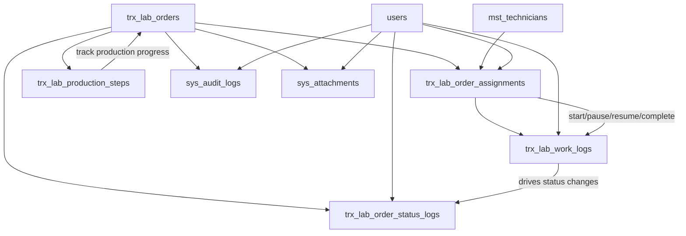

# SPRINT 4 TECHNICAL DESIGN DOCUMENT

## Project

Asia Dental Lab Management System

## Version

1.0

## Sprint

Sprint 4 - Production Workflow

## Architecture

Laravel 12, Blade + Livewire 3, PostgreSQL 16, Modular Monolith

---

# 1. Sprint 4 Overview

## Goal

Sprint 4 membangun workflow produksi dari Lab Order yang sudah `RECEIVED` sampai siap diserahkan ke Quality Control dengan status `QC_PENDING`.

Sprint ini adalah jembatan antara Lab Order Core Sprint 3 dan Quality Control Sprint 5.

## Business Value

Nilai bisnis Sprint 4:

* Admin Lab dan Production Manager dapat assign pekerjaan ke technician.
* Technician dapat melihat pekerjaan yang menjadi tanggung jawabnya.
* Proses mulai, pause, resume, dan selesai kerja tercatat rapi.
* Order dapat dikirim ke QC setelah produksi selesai.
* Setiap perubahan status, action produksi, dan histori assignment dapat diaudit.
* Manajemen dapat melihat progress pekerjaan tanpa menunggu laporan manual.

## Scope

Sprint 4 mencakup:

* Technician Assignment
* Reassignment
* Start Work
* Pause Work
* Resume Work
* Complete Work
* Send to QC
* Work Logs
* Production Steps
* Production Timeline
* Audit Logs
* Status Logs
* Permissions
* Policies
* Tests

## Out of Scope

Sprint 4 tidak mengimplementasikan:

* QC result workflow
* QC pass, reject, revision, remake decision
* Delivery workflow
* Invoice workflow
* Payment workflow
* Reporting dashboard

## Dependency on Sprint 3

Sprint 4 bergantung pada Sprint 3:

* `trx_lab_orders`
* `trx_lab_order_items`
* `trx_lab_order_status_logs`
* `sys_attachments`
* `sys_audit_logs`
* Lab Order status enum
* Lab Order detail page tabs
* Permission, Policy, Service, Repository, dan Request pattern

Sprint 4 wajib menggunakan Lab Order status resmi:

```text
RECEIVED
ASSIGNED
IN_PRODUCTION
ON_HOLD
QC_PENDING
```

---

# 2. Architecture Overview

Production Workflow mengikuti pola proyek:

```text
Controller
-> Request Validation
-> Service
-> Repository
-> Model
-> Database
```

Alur domain Sprint 4:

```text
Lab Order
-> Assignment
-> Work Logs
-> Production Steps
-> QC Pending
```



Core workflow:

```text
RECEIVED
-> ASSIGNED
-> IN_PRODUCTION
-> ON_HOLD
-> IN_PRODUCTION
-> QC_PENDING
```

`ON_HOLD` adalah status sementara. Setelah resume, order kembali ke `IN_PRODUCTION`.

---

# 3. Module Structure

Sprint 4 menggunakan module baru:

```text
app/Modules/Production
```

Struktur module:

```text
app/Modules/Production/
  Controllers/
  Services/
  Repositories/
  Interfaces/
  Requests/
  Policies/
  Models/
  Resources/
  Tests/
```

| Folder | Responsibility |
| --- | --- |
| Controllers | Menerima request, authorize, memanggil service, dan mengembalikan response atau view data. Tidak boleh query database langsung. |
| Services | Menjalankan business rules, status transition, audit log, status log, dan database transaction. |
| Repositories | Query, filtering, pagination, eager loading, dan persistence. Tidak boleh berisi business rule. |
| Interfaces | Contract repository agar service bergantung pada abstraction. |
| Requests | Form Request validation dan request-level authorization. |
| Policies | Record-level authorization untuk assignment, production workflow, work log, dan production step. |
| Models | Representasi tabel produksi dan relationship. |
| Resources | API-ready response shaping untuk future `/api/v1`. |
| Tests | Pest tests untuk workflow, validation, authorization, audit, status log, dan edge cases. |

Module Production berinteraksi dengan:

* `app/Modules/LabOrder`
* `app/Modules/Technician`
* `sys_audit_logs`
* `sys_attachments`

---

# 4. Domain Models

## LabOrderAssignment

| Item | Design |
| --- | --- |
| Table | `trx_lab_order_assignments` |
| Purpose | Mencatat technician yang ditugaskan pada satu Lab Order dan histori assignment/reassignment. |
| Soft Delete | Required, karena histori assignment tidak boleh hilang. |
| Audit Behavior | Assign, reassign, cancel, start, complete, dan send to QC wajib diaudit melalui service. |

Fillable fields:

* `lab_order_id`
* `technician_id`
* `assigned_by`
* `assigned_at`
* `started_at`
* `completed_at`
* `status`
* `notes`

Relationships:

* belongs to LabOrder
* belongs to Technician
* belongs to User as assigned_by
* has many WorkLog

Valid statuses:

```text
ASSIGNED
IN_PROGRESS
DONE
CANCELLED
REASSIGNED
```

Important rule:

* Only one active assignment may exist for one Lab Order.

## WorkLog

| Item | Design |
| --- | --- |
| Table | `trx_lab_work_logs` |
| Purpose | Mencatat aktivitas kerja technician selama production workflow. |
| Soft Delete | Required if schema standard requires `deleted_at`, but business display should treat work logs as immutable history. |
| Audit Behavior | Every work log event is caused by a production action and must have related audit log. |

Fillable fields:

* `lab_order_assignment_id`
* `lab_order_id`
* `event_type`
* `started_at`
* `ended_at`
* `duration_minutes`
* `notes`
* `performed_by`

Relationships:

* belongs to LabOrderAssignment
* belongs to LabOrder
* belongs to User as performed_by

Valid event types:

```text
WORK_STARTED
WORK_PAUSED
WORK_RESUMED
WORK_COMPLETED
STATUS_CHANGED
```

## ProductionStep

| Item | Design |
| --- | --- |
| Table | `trx_lab_production_steps` |
| Purpose | Mencatat step produksi yang direkomendasikan untuk satu Lab Order. |
| Soft Delete | Required for transaction table standard. |
| Audit Behavior | Step update should create audit log when status, notes, or actor changes. |

Fillable fields:

* `lab_order_id`
* `step_name`
* `step_status`
* `sequence`
* `started_at`
* `completed_at`
* `notes`
* `performed_by`

Relationships:

* belongs to LabOrder
* belongs to User as performed_by

Recommended step names:

```text
MODEL_PREPARATION
WAX_DESIGN
MILLING
PRINTING
FINISHING
POLISHING
PACKAGING
```

Valid step statuses:

```text
PENDING
IN_PROGRESS
COMPLETED
SKIPPED
ON_HOLD
```

---

# 5. Relationships

| Parent | Child | Cardinality | Foreign Key / Strategy |
| --- | --- | --- | --- |
| LabOrder | LabOrderAssignment | 1 to many | `trx_lab_order_assignments.lab_order_id` |
| Technician | LabOrderAssignment | 1 to many | `trx_lab_order_assignments.technician_id` |
| User | LabOrderAssignment as assigned_by | 1 to many | `trx_lab_order_assignments.assigned_by` |
| LabOrderAssignment | WorkLog | 1 to many | `trx_lab_work_logs.lab_order_assignment_id` |
| LabOrder | WorkLog | 1 to many | `trx_lab_work_logs.lab_order_id` |
| User | WorkLog as performed_by | 1 to many | `trx_lab_work_logs.performed_by` |
| LabOrder | ProductionStep | 1 to many | `trx_lab_production_steps.lab_order_id` |
| User | ProductionStep as performed_by | 1 to many | `trx_lab_production_steps.performed_by` |
| LabOrder | LabOrderStatusLog | 1 to many | `trx_lab_order_status_logs.lab_order_id` |
| LabOrder | Attachment | 1 to many | `sys_attachments.entity_type/entity_id` |
| LabOrder | AuditLog | 1 to many | `sys_audit_logs.entity_type/entity_id` |

Relationship notes:

* Assignment history is preserved through multiple assignment records.
* Current active assignment is the assignment with status `ASSIGNED` or `IN_PROGRESS`.
* Reassigned assignment should be marked `REASSIGNED`.
* Cancelled assignment should be marked `CANCELLED`.
* Done assignment should be marked `DONE`.

---

# 6. Repository Design

Repositories must return Eloquent models, collections, or paginators and must not enforce business transitions.

## AssignmentRepositoryInterface

Responsibilities:

* Paginate production assignments.
* Find active assignment by Lab Order.
* Create assignment.
* Update assignment status and timestamps.
* Load assignment detail with technician, order, and work logs.

Methods:

| Method | Responsibility | Return Type |
| --- | --- | --- |
| `paginate(filters, perPage)` | List assignments with filters and eager loading. | Length-aware paginator |
| `findById(id)` | Find assignment by id. | LabOrderAssignment or null |
| `findActiveByLabOrder(labOrderId)` | Get current active assignment. | LabOrderAssignment or null |
| `forLabOrder(labOrderId)` | Get assignment history for order. | Collection |
| `create(data)` | Create assignment row. | LabOrderAssignment |
| `update(assignment, data)` | Update assignment row. | LabOrderAssignment |
| `markReassigned(assignment, data)` | Persist reassignment status. | LabOrderAssignment |
| `markCancelled(assignment, data)` | Persist cancellation status. | LabOrderAssignment |

Search and filters:

* order number
* technician
* assignment status
* order status
* priority
* due date range
* clinic

Pagination:

* Default `per_page` is 10.
* Maximum `per_page` is 100.

## WorkLogRepositoryInterface

Responsibilities:

* Create work log entries.
* List work logs by assignment or Lab Order.
* Support timeline display.

Methods:

| Method | Responsibility | Return Type |
| --- | --- | --- |
| `create(data)` | Persist work log. | WorkLog |
| `forAssignment(assignmentId)` | List logs for assignment. | Collection |
| `forLabOrder(labOrderId)` | List logs for order timeline. | Collection |
| `latestForAssignment(assignmentId)` | Get latest work event. | WorkLog or null |

Search and filters:

* `lab_order_assignment_id`
* `lab_order_id`
* `event_type`
* `performed_by`
* date range

## ProductionStepRepositoryInterface

Responsibilities:

* Create default production steps for Lab Order.
* List production steps by order.
* Update step status, notes, and timestamps.

Methods:

| Method | Responsibility | Return Type |
| --- | --- | --- |
| `createMany(labOrder, steps)` | Create default step rows. | Collection |
| `forLabOrder(labOrderId)` | List steps ordered by sequence. | Collection |
| `findById(id)` | Find production step. | ProductionStep or null |
| `update(step, data)` | Update step row. | ProductionStep |

Search and filters:

* `lab_order_id`
* `step_name`
* `step_status`
* `performed_by`

---

# 7. Service Layer Design

## AssignmentService

Purpose:

* Assign technician to Lab Order.
* Reassign technician.
* Cancel assignment when allowed.
* Maintain assignment history.

Inputs:

* LabOrder
* Technician id
* Notes
* Authenticated user

Outputs:

* LabOrderAssignment model or structured workflow result.

Dependencies:

* AssignmentRepositoryInterface
* LabOrderRepositoryInterface
* StatusLogService
* AuditLogService
* ProductionStepService

Side effects:

* Creates assignment.
* Updates Lab Order status from `RECEIVED` to `ASSIGNED`.
* Creates status log.
* Creates audit log.
* Creates default production steps when first assigned.

Business rules:

* Order must be `RECEIVED` before first assignment.
* Cancelled order cannot be assigned.
* Completed order cannot be assigned.
* Only one active assignment is allowed.
* Reassignment preserves old assignment history.
* Assignment actions run inside database transaction.

## WorkLogService

Purpose:

* Create production work logs for start, pause, resume, complete, and status changed events.
* Calculate or receive duration in minutes when applicable.

Inputs:

* LabOrderAssignment
* Event type
* Notes
* Authenticated user
* Optional started_at and ended_at

Outputs:

* WorkLog model.

Dependencies:

* WorkLogRepositoryInterface
* AssignmentRepositoryInterface
* AuditLogService

Side effects:

* Creates `trx_lab_work_logs`.
* Supports timeline display.
* Supports audit evidence for production action.

Business rules:

* `WORK_STARTED` is required when technician starts work.
* `WORK_PAUSED` is required when work pauses.
* `WORK_RESUMED` is required when work resumes.
* `WORK_COMPLETED` is required when production is completed.
* Work logs must store user, timestamp, notes, and duration_minutes.

## ProductionStepService

Purpose:

* Generate and update production steps for Lab Order.
* Keep step progress separate from QC behavior.

Inputs:

* LabOrder
* Step data
* Authenticated user

Outputs:

* Collection of ProductionStep or updated ProductionStep.

Dependencies:

* ProductionStepRepositoryInterface
* AuditLogService

Side effects:

* Creates default steps on assignment.
* Updates step status and timestamps.
* Creates audit log for step mutation.

Business rules:

* Default steps are created only once per Lab Order unless explicitly reset by approved workflow.
* QC steps are not included.
* Step status cannot be updated for cancelled order.
* Step completion helps operational tracking but does not replace the complete/send-to-QC workflow action.

## ProductionWorkflowService

Purpose:

* Orchestrate start, pause, resume, complete, and send-to-QC workflow.
* Own status transitions for Sprint 4.

Inputs:

* LabOrder
* Active assignment
* Notes
* Authenticated user

Outputs:

* Structured workflow result containing LabOrder, Assignment, WorkLog, StatusLog, and AuditLog where applicable.

Dependencies:

* AssignmentRepositoryInterface
* WorkLogService
* ProductionStepService
* LabOrderRepositoryInterface
* StatusLogService
* AuditLogService

Side effects:

* Updates Lab Order status.
* Updates Assignment status and timestamps.
* Creates WorkLog.
* Creates StatusLog.
* Creates AuditLog.

Business rules:

* Start work requires active assignment.
* Pause work requires Lab Order status `IN_PRODUCTION`.
* Resume work requires Lab Order status `ON_HOLD`.
* Complete work requires active assignment in progress.
* Send to QC changes Lab Order status to `QC_PENDING`.
* QC result behavior is excluded.
* All mutating actions must run in database transaction.

---

# 8. Status Transition Design

Sprint 4 active transitions:

| Current Status | Action | Next Status |
| --- | --- | --- |
| `RECEIVED` | assign technician | `ASSIGNED` |
| `ASSIGNED` | start work | `IN_PRODUCTION` |
| `IN_PRODUCTION` | pause work | `ON_HOLD` |
| `ON_HOLD` | resume work | `IN_PRODUCTION` |
| `IN_PRODUCTION` | send to QC after complete | `QC_PENDING` |

Rules:

* Assignment creates `ASSIGNED`.
* Start work creates `IN_PRODUCTION`.
* Pause work creates `ON_HOLD`.
* Resume work returns to `IN_PRODUCTION`.
* Complete/send to QC creates `QC_PENDING`.
* Every status change creates `trx_lab_order_status_logs`.
* Every production action creates `sys_audit_logs`.
* Status transition and data mutation must happen in one database transaction.
* Manual status update is not allowed from production screens.

Invalid transitions:

| Current Status | Blocked Action |
| --- | --- |
| `CANCELLED` | assign, reassign, start, pause, resume, complete, send to QC |
| `QC_PENDING` | start, pause, resume, complete, send to QC |
| `RECEIVED` | start, pause, resume, complete, send to QC |
| `ASSIGNED` | pause, resume, send to QC |
| `ON_HOLD` | assign, start, pause, complete, send to QC |

---

# 9. Assignment Workflow Design

## Assign Technician

Flow:

```text
Lab Order RECEIVED
-> Admin Lab or Production Manager selects technician
-> Assignment created as ASSIGNED
-> Lab Order status changes to ASSIGNED
-> Default production steps created
-> Status log created
-> Audit log created
```

Rules:

* Lab Order must be `RECEIVED`.
* Technician must exist and be active.
* Technician should be linked to an active user when user access is required.
* Only one active assignment is allowed.
* Notes are optional for first assignment but recommended.

## Reassign Technician

Flow:

```text
Active assignment
-> Old assignment marked REASSIGNED
-> New assignment created as ASSIGNED
-> Lab Order remains ASSIGNED or IN_PRODUCTION depending on current state
-> Work history remains attached to old assignment
-> Audit log created
```

Rules:

* Reassign requires notes.
* Reassign must preserve old assignment.
* New technician cannot be the same as current technician.
* Reassign is allowed for `ASSIGNED`, `IN_PRODUCTION`, and `ON_HOLD`.
* Reassign is blocked for `RECEIVED`, `CANCELLED`, and `QC_PENDING`.

## Cancel Assignment

Flow:

```text
Active assignment
-> Assignment status becomes CANCELLED
-> Notes required
-> Audit log created
```

Rules:

* Cancel assignment does not automatically cancel Lab Order.
* Cancelling the only assignment should leave order needing reassignment.
* Production Manager or Admin Lab may cancel assignment.

Assignment statuses:

| Status | Meaning |
| --- | --- |
| `ASSIGNED` | Technician assigned but work not started. |
| `IN_PROGRESS` | Technician has started work. |
| `DONE` | Technician completed production work. |
| `CANCELLED` | Assignment cancelled and no longer active. |
| `REASSIGNED` | Assignment replaced by another technician. |

---

# 10. Work Log Design

Work logs represent production events and must be append-only from a business perspective.

Events:

| Event | Meaning |
| --- | --- |
| `WORK_STARTED` | Technician started production work. |
| `WORK_PAUSED` | Technician paused production work. |
| `WORK_RESUMED` | Technician resumed production work. |
| `WORK_COMPLETED` | Technician completed production work. |
| `STATUS_CHANGED` | System recorded a production-related status change. |

Required fields:

* `lab_order_assignment_id`
* `lab_order_id`
* `event_type`
* `started_at`
* `ended_at`
* `duration_minutes`
* `notes`
* `performed_by`

Duration rules:

* `WORK_STARTED`: `duration_minutes` may be `0`.
* `WORK_PAUSED`: duration may calculate from last start/resume to pause time.
* `WORK_RESUMED`: `duration_minutes` may be `0`.
* `WORK_COMPLETED`: duration may calculate from last start/resume to complete time.
* `STATUS_CHANGED`: duration may be `0` unless caused by timed work.

Validation:

* Notes are required for pause.
* Notes are required for complete.
* Performed user must be authenticated.
* Technician users may only log work for their own active assignments unless they have management permission.

---

# 11. Production Step Design

Recommended default production steps:

| Sequence | Step Name | Description |
| --- | --- | --- |
| 1 | `MODEL_PREPARATION` | Prepare physical or digital model. |
| 2 | `WAX_DESIGN` | Create wax-up or CAD design preparation. |
| 3 | `MILLING` | Milling process when required by service type. |
| 4 | `PRINTING` | Printing process when required by service type. |
| 5 | `FINISHING` | Shape, contour, and refine work result. |
| 6 | `POLISHING` | Final surface polish before packing. |
| 7 | `PACKAGING` | Package work result for QC handoff. |

Step statuses:

| Status | Meaning |
| --- | --- |
| `PENDING` | Step not started. |
| `IN_PROGRESS` | Step is being worked on. |
| `COMPLETED` | Step completed. |
| `SKIPPED` | Step intentionally skipped because not needed for the case. |
| `ON_HOLD` | Step paused due to hold condition. |

Rules:

* Production steps are operational checkpoints, not QC checks.
* QC inspection steps must not be added in Sprint 4.
* Steps can be updated independently while order is `ASSIGNED`, `IN_PRODUCTION`, or `ON_HOLD`.
* Completed steps should store `completed_at` and `performed_by`.
* Skipped steps require notes.

---

# 12. Permission Design

Sprint 4 permissions:

```text
manage_production
view_production
assign_technicians
reassign_technicians
start_production_work
pause_production_work
resume_production_work
complete_production_work
send_to_qc
```

Recommended role mapping:

| Role | Permissions |
| --- | --- |
| Super Admin | All production permissions. |
| Admin Lab | All production permissions. |
| Production Manager | `view_production`, `assign_technicians`, `reassign_technicians`, `start_production_work`, `pause_production_work`, `resume_production_work`, `complete_production_work`, `send_to_qc`. |
| Technician | `view_production`, `start_production_work`, `pause_production_work`, `resume_production_work`, `complete_production_work`, `send_to_qc` for own assignments only. |
| Quality Control | `view_production` only for handoff visibility. |

Permission rules:

* `manage_production` overrides other production permissions.
* Technician action must still pass policy ownership checks.
* QC cannot process result in Sprint 4.
* Doctor, Courier, and Finance do not need production write permission.

---

# 13. Policy Design

## AssignmentPolicy

Operations:

| Operation | Rule |
| --- | --- |
| `viewAny` | User has `view_production` or `manage_production`. |
| `view` | User can view production, or technician owns assignment. |
| `assign` | User has `assign_technicians` or `manage_production`. |
| `reassign` | User has `reassign_technicians` or `manage_production`. |
| `cancel` | User has management-level production permission. |

## ProductionPolicy

Operations:

| Operation | Rule |
| --- | --- |
| `viewAny` | User has `view_production` or `manage_production`. |
| `view` | User can view production, or technician owns active assignment. |
| `start` | User has start permission and valid assignment access. |
| `pause` | User has pause permission and valid assignment access. |
| `resume` | User has resume permission and valid assignment access. |
| `complete` | User has complete permission and valid assignment access. |
| `sendToQc` | User has send-to-QC permission and valid assignment access. |

## WorkLogPolicy

Operations:

| Operation | Rule |
| --- | --- |
| `viewAny` | User can view production for the Lab Order. |
| `view` | User can view production for the related assignment. |
| `create` | Only services create work logs after production policy passes. |

## ProductionStepPolicy

Operations:

| Operation | Rule |
| --- | --- |
| `viewAny` | User can view production for the Lab Order. |
| `view` | User can view production for the Lab Order. |
| `update` | User has production work permission and valid assignment access, or management permission. |

Policy constraints:

* Policies must deny actions for `CANCELLED` orders.
* Policies must deny production mutation for `QC_PENDING` orders.
* Policies must enforce technician ownership when user is technician.

---

# 14. Request Validation Design

## AssignTechnicianRequest

Fields:

| Field | Rules |
| --- | --- |
| `technician_id` | required, exists in `mst_technicians`, active technician |
| `notes` | nullable, string, max practical length |

Failure scenarios:

* Lab Order is not `RECEIVED`.
* Technician inactive.
* Active assignment already exists.
* User lacks permission.

## ReassignTechnicianRequest

Fields:

| Field | Rules |
| --- | --- |
| `from_technician_id` | required, exists, must match active assignment |
| `to_technician_id` | required, exists, different from current technician, active technician |
| `notes` | required, string |

Failure scenarios:

* No active assignment.
* Same technician selected.
* Order status does not allow reassignment.
* Notes missing.

## StartWorkRequest

Fields:

| Field | Rules |
| --- | --- |
| `notes` | nullable, string |

Failure scenarios:

* Order is not `ASSIGNED`.
* Active assignment not found.
* Assignment not owned by technician and user lacks management permission.

## PauseWorkRequest

Fields:

| Field | Rules |
| --- | --- |
| `hold_reason` | required, enum hold reason |
| `notes` | required, string |

Allowed hold reasons:

```text
WAITING_MATERIAL
WAITING_APPROVAL
DOCTOR_CONFIRMATION
EQUIPMENT_ISSUE
OTHER
```

Failure scenarios:

* Order is not `IN_PRODUCTION`.
* Notes missing.
* Invalid hold reason.

## ResumeWorkRequest

Fields:

| Field | Rules |
| --- | --- |
| `notes` | nullable, string |

Failure scenarios:

* Order is not `ON_HOLD`.
* Active assignment not found.
* User lacks permission.

## CompleteWorkRequest

Fields:

| Field | Rules |
| --- | --- |
| `notes` | required, string |

Failure scenarios:

* Order is not `IN_PRODUCTION`.
* Assignment is not `IN_PROGRESS`.
* Required production work logs are missing.

## SendToQcRequest

Fields:

| Field | Rules |
| --- | --- |
| `notes` | required, string |

Failure scenarios:

* Production work is not complete.
* Assignment is not `DONE`.
* Order is not `IN_PRODUCTION`.
* User lacks permission.

## UpdateProductionStepRequest

Fields:

| Field | Rules |
| --- | --- |
| `step_status` | required, enum `PENDING`, `IN_PROGRESS`, `COMPLETED`, `SKIPPED`, `ON_HOLD` |
| `notes` | nullable, required when skipped or on hold |
| `performed_by` | optional, derived from authenticated user by service |

Failure scenarios:

* Invalid step status.
* Skipped without notes.
* Order is cancelled or already `QC_PENDING`.
* User lacks permission.

---

# 15. Controller Design

Controllers must call services only and must not query models directly.

## AssignmentController

| Method | Responsibility |
| --- | --- |
| `index` | List assignment records with filters through service/repository. |
| `store` | Validate assignment request and call AssignmentService assign. |
| `reassign` | Validate reassignment request and call AssignmentService reassign. |
| `cancel` | Validate notes and call AssignmentService cancel. |

## ProductionWorkflowController

| Method | Responsibility |
| --- | --- |
| `board` | Show Production Board with filters and paginated orders. |
| `show` | Show Production Detail for one Lab Order. |
| `start` | Validate and call ProductionWorkflowService startWork. |
| `pause` | Validate and call ProductionWorkflowService pauseWork. |
| `resume` | Validate and call ProductionWorkflowService resumeWork. |
| `complete` | Validate and call ProductionWorkflowService completeWork. |
| `sendToQc` | Validate and call ProductionWorkflowService sendToQc. |

## WorkLogController

| Method | Responsibility |
| --- | --- |
| `index` | Show work logs for a Lab Order or assignment. |

## ProductionStepController

| Method | Responsibility |
| --- | --- |
| `update` | Validate step update and call ProductionStepService update. |

Controller constraints:

* No business rule in controller.
* No direct DB query in controller.
* No manual audit log construction outside service.
* No manual status update outside service.

---

# 16. Route Design

Recommended web routes:

| Method | Route | Name | Middleware |
| --- | --- | --- | --- |
| GET | `/production` | `production.board` | `auth`, `permission:view_production|manage_production` |
| GET | `/production/{labOrder}` | `production.show` | `auth`, policy `view` |
| POST | `/production/{labOrder}/assign` | `production.assign` | `auth`, `permission:assign_technicians|manage_production`, policy `assign` |
| POST | `/production/{labOrder}/reassign` | `production.reassign` | `auth`, `permission:reassign_technicians|manage_production`, policy `reassign` |
| POST | `/production/{labOrder}/start` | `production.start` | `auth`, `permission:start_production_work|manage_production`, policy `start` |
| POST | `/production/{labOrder}/pause` | `production.pause` | `auth`, `permission:pause_production_work|manage_production`, policy `pause` |
| POST | `/production/{labOrder}/resume` | `production.resume` | `auth`, `permission:resume_production_work|manage_production`, policy `resume` |
| POST | `/production/{labOrder}/complete` | `production.complete` | `auth`, `permission:complete_production_work|manage_production`, policy `complete` |
| POST | `/production/{labOrder}/send-to-qc` | `production.send-to-qc` | `auth`, `permission:send_to_qc|manage_production`, policy `sendToQc` |
| GET | `/production/{labOrder}/work-logs` | `production.work-logs.index` | `auth`, policy `view` |
| PATCH | `/production/{labOrder}/steps/{step}` | `production.steps.update` | `auth`, policy `update` |

API-ready equivalents may be exposed under:

```text
/api/v1/production
```

Sprint 4 may keep Blade + Livewire as the active UI while preserving service and resource design for API future use.

---

# 17. UI Design

## Production Board

Purpose:

* Give Admin Lab and Production Manager a quick view of production workload.

Filters:

* order number
* technician
* status
* priority
* due date
* clinic

Columns:

* Order Number
* Clinic
* Doctor
* Patient
* Technician
* Priority
* Due Date
* Current Status
* Assignment Status
* Action

Actions:

* View
* Assign
* Reassign
* Start
* Pause
* Resume
* Complete
* Send to QC

## Production Detail

Purpose:

* Central production page for one Lab Order.

Sections:

* Order summary
* Assignment summary
* Production step panel
* Work log timeline
* Attachments
* Status timeline

## Assignment Panel

Displays:

* Current technician
* Assignment status
* Assigned by
* Assigned at
* Started at
* Completed at
* Notes
* Reassignment history

## Work Log Timeline

Displays:

* Work started
* Work paused
* Work resumed
* Work completed
* Status changed
* Notes
* Duration minutes
* User and timestamp

## Production Steps Panel

Displays:

* Step name
* Step status
* Performer
* Started at
* Completed at
* Notes

UI constraints:

* QC tab remains handoff visibility only.
* QC result actions are not shown in Sprint 4.
* Delivery, Invoice, Payment, and Reporting actions are not shown in Sprint 4 production pages.

---

# 18. Audit Log Strategy

Every production action must create audit log in:

```text
sys_audit_logs
```

Audit actions:

```text
ASSIGN_TECHNICIAN
REASSIGN_TECHNICIAN
START_WORK
PAUSE_WORK
RESUME_WORK
COMPLETE_WORK
SEND_TO_QC
STATUS_CHANGE
```

Required data:

* `entity_type`
* `entity_id`
* `action`
* `old_values`
* `new_values`
* `performed_by`
* `performed_at`
* `ip_address` when available
* `user_agent` when available

Rules:

* Audit log must be written inside the same transaction as the action.
* Do not store raw file content in audit JSON.
* Old and new values must include meaningful changed fields.
* Audit logs are immutable and should not be hard deleted.

---

# 19. Status Log Strategy

Every Lab Order status transition must create status log in:

```text
trx_lab_order_status_logs
```

Required fields:

* `lab_order_id`
* `old_status`
* `new_status`
* `notes`
* `changed_by`
* `changed_at`

Sprint 4 status logs:

| Action | Old Status | New Status |
| --- | --- | --- |
| assign technician | `RECEIVED` | `ASSIGNED` |
| start work | `ASSIGNED` | `IN_PRODUCTION` |
| pause work | `IN_PRODUCTION` | `ON_HOLD` |
| resume work | `ON_HOLD` | `IN_PRODUCTION` |
| send to QC | `IN_PRODUCTION` | `QC_PENDING` |

Rules:

* Status logs are append-only.
* Status logs are ordered by `changed_at`.
* Status log creation should trigger or accompany audit action `STATUS_CHANGE`.
* Status transition must be blocked if the current status does not match the expected old status.

---

# 20. Attachment Strategy

Sprint 4 reuses Sprint 3 polymorphic attachment strategy:

```text
sys_attachments
entity_type
entity_id
```

No new production attachment table is required.

Production attachment categories:

```text
WORK_PHOTO
DESIGN_FILE
STL_REVISION
REFERENCE_IMAGE
PRODUCTION_NOTE
```

Rules:

* Multiple files are allowed.
* File metadata is stored in database.
* File content is stored in local storage.
* Upload action must be authorized.
* Upload and delete must be audited.
* Soft delete is required for attachment metadata.

Recommended entity target:

```text
entity_type = trx_lab_orders
entity_id = lab_order_id
```

This keeps all production files visible from the Lab Order detail and future QC handoff.

---

# 21. Testing Strategy

Project target after Sprint 4:

```text
160+ total tests
```

Recommended Sprint 4 test groups:

| Group | Coverage |
| --- | --- |
| Assignment | Assign technician from `RECEIVED`, prevent duplicate active assignment, create status log, create audit log. |
| Reassignment | Mark old assignment `REASSIGNED`, create new assignment, require notes, preserve history. |
| Start Work | Move order `ASSIGNED` to `IN_PRODUCTION`, assignment to `IN_PROGRESS`, create work log. |
| Pause Work | Move order `IN_PRODUCTION` to `ON_HOLD`, require notes and hold reason, create work log. |
| Resume Work | Move order `ON_HOLD` to `IN_PRODUCTION`, create work log. |
| Complete Work | Mark assignment `DONE`, create work completed log. |
| Send to QC | Move order `IN_PRODUCTION` to `QC_PENDING`, create status log and audit log. |
| Work Logs | Verify event type, user, timestamp, notes, duration_minutes. |
| Production Steps | Create default steps, update step status, require notes for skipped/on hold. |
| Authorization | Permission-based access for all routes. |
| Permission Denied | Authenticated user without permission receives forbidden response. |
| Guest Redirect | Guest cannot access production endpoints. |
| Audit Log Creation | Every production action creates audit row. |
| Status Log Creation | Every status transition creates status row. |

Minimum recommended Sprint 4 tests:

* Assignment feature tests: 10-15.
* Workflow transition tests: 15-20.
* Work log tests: 8-12.
* Production step tests: 8-12.
* Permission and policy tests: 15-20.
* Audit/status log tests: 10-15.

Testing approach:

* Use Pest PHP.
* Use database refresh strategy.
* Use factories for User, Technician, Clinic, Doctor, Patient, LabService, LabOrder, Assignment, WorkLog, and ProductionStep.
* Assert database rows for assignment, work logs, status logs, and audit logs.
* Assert invalid transitions are blocked.
* Assert technician cannot mutate another technician assignment.

---

# 22. Performance Guidelines

## Eager Loading

Production Board should eager load:

* Lab Order
* Clinic
* Doctor
* Patient
* Active Assignment
* Technician

Production Detail should eager load:

* Lab Order header
* Items and Lab Service
* Current assignment and technician
* Assignment history
* Work logs and performer
* Production steps and performer
* Attachments
* Status logs

## Pagination

* Production Board must be paginated.
* Default page size is 10.
* Maximum page size is 100.
* Work logs may use collection on detail page, but should be paginated if volume grows.

## Index Usage

Queries should benefit from indexes on:

* `trx_lab_order_assignments.lab_order_id`
* `trx_lab_order_assignments.technician_id`
* `trx_lab_order_assignments.status`
* `trx_lab_work_logs.lab_order_assignment_id`
* `trx_lab_work_logs.lab_order_id`
* `trx_lab_work_logs.event_type`
* `trx_lab_production_steps.lab_order_id`
* `trx_lab_production_steps.step_status`

## Transactions

Use database transaction for:

* assign technician
* reassign technician
* cancel assignment
* start work
* pause work
* resume work
* complete work
* send to QC
* update production step with audit log

## N+1 Prevention

* Never load technician, clinic, doctor, patient, work log performer, or step performer in loops without eager loading.
* Production Board query must be optimized before adding reporting metrics.
* Audit Log tab should be paginated separately when needed.

---

# 23. Security Guidelines

Authorization:

* Every production endpoint requires authentication.
* Every mutating endpoint requires permission and policy.
* Technician actions must be restricted to own assignment unless user has management permission.

Validation:

* Use Form Request classes.
* Validate technician existence and active status.
* Validate status transition preconditions.
* Validate notes for pause, reassign, complete, and send to QC.

Audit:

* Every production action must be audited.
* Every status change must be logged.
* Audit logs must not store credentials, tokens, raw file content, or sensitive internal headers.

Data protection:

* No hard delete for production history.
* Assignment history must be preserved.
* Work logs should be treated as immutable operational evidence.
* File upload must reuse Sprint 3 file validation and storage rules.

---

# 24. Definition of Done

Sprint 4 is complete only if:

* Assignment workflow is implemented and tested.
* Reassignment workflow is implemented and tested.
* Start work workflow is implemented and tested.
* Pause work workflow is implemented and tested.
* Resume work workflow is implemented and tested.
* Complete work workflow is implemented and tested.
* Send to QC workflow is implemented and tested.
* Work log concept is implemented and tested.
* Production steps are implemented and tested.
* Production status flow is clear and enforced.
* QC handoff ends at `QC_PENDING`.
* QC result behavior is excluded.
* Every production status change creates status log.
* Every production action creates audit log.
* Permissions are seeded.
* Policies protect all endpoints.
* Requests validate all workflow actions.
* Controllers call services only.
* Services use repositories and transactions.
* Production Board and Detail UI are available.
* Attachment categories are reusable through `sys_attachments`.
* Migration success.
* Build success.
* All tests passed.
* Documentation updated.

---

# Architecture Decisions Made

| Decision | Rationale |
| --- | --- |
| Production is a separate module under `app/Modules/Production`. | Keeps Sprint 4 workflow isolated while integrating with Lab Order. |
| Lab Order remains the workflow anchor. | Sprint 3 defines Lab Order as the foundation for Production, QC, Delivery, Invoice, Payment, and Reporting. |
| Sprint 4 ends at `QC_PENDING`. | QC result behavior belongs to Sprint 5. |
| Assignment history is preserved instead of overwritten. | Reassignment and auditability are important for lab operations. |
| Work logs are separate from status logs. | Work logs explain production activity; status logs explain Lab Order state changes. |
| Production steps are operational checkpoints only. | Prevents accidental QC implementation in Sprint 4. |
| Attachments reuse `sys_attachments`. | Avoids unnecessary table growth and keeps polymorphic Sprint 3 strategy. |
| All production actions run through service transactions. | Matches project rules and prevents partial workflow updates. |

---

# Risks Identified

| Risk | Impact | Mitigation |
| --- | --- | --- |
| Technician unavailable after assignment. | Work may stop without clear ownership. | Use reassignment workflow with required notes and preserved history. |
| Multiple pauses create confusing duration calculations. | Production time may be inaccurate. | Store every pause/resume event and calculate total duration from logs. |
| Emergency orders skip normal sequence. | Priority cases may bypass controls. | Use priority filters and allow management-driven assignment, but keep audit and status logs mandatory. |
| Order later returned from QC. | Sprint 4 may need future re-entry path. | Defer returned-from-QC behavior to Sprint 5 while keeping assignment history extensible. |
| Long-running production creates many logs. | Detail page may become slow. | Use indexes, eager loading, and pagination if volume grows. |
| Legacy docs mention old statuses like `IN_PROGRESS` or `QC`. | Developers may use wrong Lab Order status. | Use revised Sprint 3 status source of truth: `IN_PRODUCTION` and `QC_PENDING` for Lab Order status. |

---

# Readiness Checklist

* Matches `production_workflow_design.md`.
* Matches Sprint 4 additions in `database_schema.md`.
* Matches Sprint 4 additions in `erd.md`.
* Follows Sprint 1-3 modular monolith pattern.
* Follows Controller -> Request -> Service -> Repository -> Model.
* Uses Spatie Permission and Laravel Policy.
* Uses DB transaction for workflow actions.
* Does not introduce QC result workflow.
* Does not introduce Delivery workflow.
* Does not introduce Invoice workflow.
* Does not introduce Payment workflow.
* Does not introduce Reporting dashboard.
* Suitable for a small-to-medium dental laboratory.
