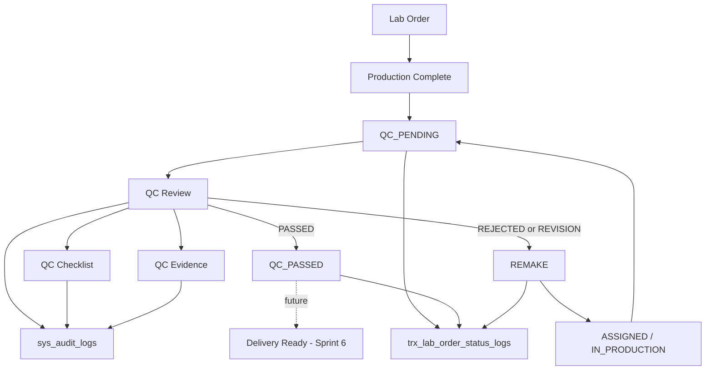

# SPRINT 5 TECHNICAL DESIGN DOCUMENT

## Project

Asia Dental Lab Management System

## Version

1.0

## Sprint

Sprint 5 - Quality Control Workflow

## Architecture

Laravel 12, Blade + Livewire 3, PostgreSQL 16, Modular Monolith

---

# 1. Sprint 5 Overview

## Goal

Sprint 5 membangun implementasi teknis Quality Control setelah produksi selesai dan Lab Order berada pada status `QC_PENDING`.

Sprint ini menentukan apakah hasil pekerjaan:

* lulus QC dan berubah menjadi `QC_PASSED`; atau
* gagal/revisi dan berubah menjadi `REMAKE`.

## Business Value

Nilai bisnis Sprint 5:

* QC Inspector memiliki queue pekerjaan yang jelas.
* Hasil QC terdokumentasi dengan checklist, notes, dan evidence.
* Keputusan pass, reject, dan revision dapat diaudit.
* Remake tidak menghapus histori produksi maupun histori QC.
* Delivery Sprint 6 memiliki quality gate yang jelas: hanya setelah `QC_PASSED`.

## Scope

Sprint 5 mencakup:

* QC Queue
* QC Review
* QC Checklist
* QC Result
* QC Evidence
* QC History
* Remake Request
* Remake Workflow
* Audit Logs
* Status Logs
* Permissions
* Policies
* Tests

## Out of Scope

Sprint 5 tidak mengimplementasikan:

* Delivery workflow
* Proof of Delivery
* Invoice workflow
* Payment workflow
* Reporting dashboard

## Dependency on Sprint 3 Lab Order Core

Sprint 5 bergantung pada:

* `trx_lab_orders`
* `trx_lab_order_items`
* `trx_lab_order_status_logs`
* `sys_attachments`
* `sys_audit_logs`
* Lab Order status enum
* Lab Order detail page and timeline
* Polymorphic attachment and audit strategy

## Dependency on Sprint 4 Production Workflow

Sprint 5 bergantung pada:

* Lab Order status `QC_PENDING`
* Assignment history
* Work logs
* Production steps
* Production attachments
* Production completion notes

Sprint 4 ends at `QC_PENDING`; Sprint 5 starts there.

---

# 2. Architecture Overview

Request flow follows the project standard:

```text
Controller
-> Request Validation
-> Service
-> Repository
-> Model
-> Database
```

Domain flow:

```text
Lab Order
-> Production Complete
-> QC Pending
-> QC Review
-> QC Passed / Remake
-> Delivery Ready (future)
```



Important concepts:

* `QC REVIEW` is an activity, not a Lab Order status.
* `PASSED`, `REJECTED`, and `REVISION` are QC results.
* `QC_PASSED` and `REMAKE` are Lab Order statuses.
* Sprint 5 does not move Lab Order to `READY_FOR_DELIVERY`.

---

# 3. Module Structure

Recommended module:

```text
app/Modules/QualityControl
```

Required structure:

```text
app/Modules/QualityControl/
  Controllers/
  Services/
  Repositories/
  Interfaces/
  Requests/
  Policies/
  Models/
  Resources/
  Tests/
```

| Layer | Responsibility |
| --- | --- |
| Controllers | Receive request, authorize, call services, return response or view data. No direct database queries. |
| Requests | Validate payloads and perform request-level authorization. |
| Services | Own QC business rules, transactions, status transition, audit log, and status log orchestration. |
| Repositories | Own query, search, filtering, pagination, eager loading, and persistence. No business rules. |
| Interfaces | Define repository contracts used by services. |
| Models | Represent `trx_lab_quality_controls`, `trx_lab_qc_checklists`, and `trx_lab_remake_requests`. |
| Policies | Enforce record-level access for QC review, checklist, evidence, and remake request. |
| Tests | Pest tests for QC queue, review, pass, reject, remake, evidence, authorization, audit, and status logs. |

Module dependencies:

* `app/Modules/LabOrder`
* `app/Modules/Production`
* `app/Modules/Technician`
* `sys_attachments`
* `sys_audit_logs`

---

# 4. Domain Models

## QualityControl

| Item | Design |
| --- | --- |
| Table | `trx_lab_quality_controls` |
| Purpose | Stores QC review sessions for Lab Orders. |
| Soft Delete | Required. QC history should be preserved. |
| Audit Behavior | Start, pass, reject, revision/remake, evidence upload, and status changes must be audited. |

Fillable fields:

* `lab_order_id`
* `inspected_by`
* `result`
* `notes`
* `started_at`
* `completed_at`

Relationships:

* belongs to LabOrder
* belongs to User as inspected_by
* has many QualityControlChecklist
* has many RemakeRequest
* has many Attachment through polymorphic `entity_type/entity_id`

Result enum:

```text
PASSED
REJECTED
REVISION
```

## QualityControlChecklist

| Item | Design |
| --- | --- |
| Table | `trx_lab_qc_checklists` |
| Purpose | Stores checklist item result per QC review. |
| Soft Delete | Not required by Sprint 5 schema. Preserve history by avoiding destructive updates where possible. |
| Audit Behavior | Checklist updates must create audit log action `UPDATE_QC_CHECKLIST`. |

Fillable fields:

* `quality_control_id`
* `checklist_item`
* `result`
* `notes`

Relationships:

* belongs to QualityControl

Checklist result enum:

```text
PASS
FAIL
N_A
```

Database note:

* The schema documents `N/A`; implementation should normalize safely, for example using code value `N_A` while displaying `N/A` in UI.

## RemakeRequest

| Item | Design |
| --- | --- |
| Table | `trx_lab_remake_requests` |
| Purpose | Stores remake request generated from failed QC review. |
| Soft Delete | Required. Remake history must be preserved. |
| Audit Behavior | Create/update must create audit log action `REQUEST_REMAKE`. |

Fillable fields:

* `lab_order_id`
* `quality_control_id`
* `requested_by`
* `reason`
* `notes`
* `status`
* `requested_at`

Relationships:

* belongs to LabOrder
* belongs to QualityControl
* belongs to User as requested_by

Remake status enum:

```text
OPEN
IN_PROGRESS
COMPLETED
CANCELLED
```

---

# 5. Relationships

| Parent | Child | Cardinality | Foreign Key / Strategy |
| --- | --- | --- | --- |
| LabOrder | QualityControl | 1 to many | `trx_lab_quality_controls.lab_order_id` |
| User | QualityControl as inspected_by | 1 to many | `trx_lab_quality_controls.inspected_by` |
| QualityControl | QualityControlChecklist | 1 to many | `trx_lab_qc_checklists.quality_control_id` |
| QualityControl | RemakeRequest | 1 to many | `trx_lab_remake_requests.quality_control_id` |
| LabOrder | RemakeRequest | 1 to many | `trx_lab_remake_requests.lab_order_id` |
| User | RemakeRequest as requested_by | 1 to many | `trx_lab_remake_requests.requested_by` |
| QualityControl | Attachment | 1 to many | `sys_attachments.entity_type/entity_id` |
| LabOrder | Attachment | 1 to many | `sys_attachments.entity_type/entity_id` |
| LabOrder | LabOrderStatusLog | 1 to many | `trx_lab_order_status_logs.lab_order_id` |
| LabOrder | AuditLog | 1 to many | `sys_audit_logs.entity_type/entity_id` |

Relationship rules:

* One Lab Order may have multiple QC review records over repeated remake cycles.
* One QC review must have at least one checklist before completion.
* One failed QC review may create a remake request.
* Remake does not create a new Lab Order.
* Attachments are polymorphic; no QC photo table is created.

---

# 6. Repository Design

Repositories return Eloquent models, collections, or paginators and must not contain status transition rules.

## QualityControlRepositoryInterface

Responsibilities:

* Query QC queue.
* Create QC review.
* Update QC review result and timestamps.
* Load QC detail and history.

Methods:

| Method | Responsibility | Return Type |
| --- | --- | --- |
| `paginateQueue(filters, perPage)` | List `QC_PENDING` orders with filters and eager loading. | Length-aware paginator |
| `findReviewById(id)` | Find QC review by id. | QualityControl or null |
| `findActiveByLabOrder(labOrderId)` | Find started but incomplete QC review. | QualityControl or null |
| `historyForLabOrder(labOrderId)` | List QC history for order. | Collection or paginator |
| `create(data)` | Create QC review. | QualityControl |
| `update(review, data)` | Update QC review. | QualityControl |
| `complete(review, data)` | Set result, notes, and completed_at. | QualityControl |

Search strategy:

* Search by order number, clinic, doctor, patient.
* Filter by priority, due date, technician, and QC result/status.

Pagination strategy:

* Default `per_page` is 10.
* Maximum `per_page` is 100.
* QC history can be paginated if order has repeated remake cycles.

## ChecklistRepositoryInterface

Responsibilities:

* Store checklist item rows.
* Update checklist result.
* List checklist rows by QC review.

Methods:

| Method | Responsibility | Return Type |
| --- | --- | --- |
| `forQualityControl(qualityControlId)` | List checklist rows for QC review. | Collection |
| `createMany(qualityControl, items)` | Create checklist rows. | Collection |
| `findById(id)` | Find checklist row. | QualityControlChecklist or null |
| `update(checklist, data)` | Update checklist row. | QualityControlChecklist |
| `countForQualityControl(qualityControlId)` | Count checklist rows. | Integer |
| `hasFailedRequiredItem(qualityControlId)` | Check failed checklist item. | Boolean |

Search strategy:

* Filter by `quality_control_id`, `checklist_item`, and `result`.

Pagination strategy:

* Checklist count is small; collection is acceptable.

## RemakeRequestRepositoryInterface

Responsibilities:

* Create remake request.
* List remake history by Lab Order.
* Update remake request status.

Methods:

| Method | Responsibility | Return Type |
| --- | --- | --- |
| `create(data)` | Create remake request. | RemakeRequest |
| `findById(id)` | Find remake request. | RemakeRequest or null |
| `forLabOrder(labOrderId)` | List remake requests for Lab Order. | Collection or paginator |
| `forQualityControl(qualityControlId)` | List remake requests from QC review. | Collection |
| `update(remakeRequest, data)` | Update remake request. | RemakeRequest |
| `latestForLabOrder(labOrderId)` | Get latest remake request. | RemakeRequest or null |

Search strategy:

* Filter by Lab Order, QC review, requested_by, status, and requested_at range.

Pagination strategy:

* Detail page may use collection.
* Admin remake history can use pagination.

---

# 7. Service Layer Design

## QualityControlService

Responsibility:

* Create/start QC review.
* Complete QC review.
* Load queue/detail/history through repositories.
* Enforce basic QC review rules.

Inputs:

* LabOrder
* Authenticated user
* Notes
* Result
* Checklist payload

Outputs:

* QualityControl model or structured result.

Dependencies:

* QualityControlRepositoryInterface
* ChecklistService
* AuditLogService
* StatusLogService
* LabOrderRepositoryInterface

Side effects:

* Creates QC review.
* Updates QC result/timestamps.
* Creates audit logs.

Business rules:

* Only `QC_PENDING` orders can be reviewed.
* Cancelled orders cannot be reviewed.
* QC review must capture `inspected_by`.
* Completed review must capture result and completed_at.
* QC history must be preserved.

## ChecklistService

Responsibility:

* Create and update QC checklist rows.
* Validate checklist result behavior.
* Ensure at least one checklist item exists before QC completion.

Inputs:

* QualityControl
* Checklist item payload
* Authenticated user

Outputs:

* Collection of QualityControlChecklist or updated checklist row.

Dependencies:

* ChecklistRepositoryInterface
* AuditLogService

Side effects:

* Creates or updates checklist rows.
* Creates `UPDATE_QC_CHECKLIST` audit log.

Business rules:

* Checklist result must be `PASS`, `FAIL`, or `N_A`.
* At least one checklist item must exist before final result.
* Failed checklist item should have notes.
* Checklist history must be preserved.

## RemakeService

Responsibility:

* Create remake request when QC result is `REJECTED` or `REVISION`.
* Preserve remake history.
* Prepare handoff back to Sprint 4 production workflow.

Inputs:

* LabOrder
* QualityControl
* Reason
* Notes
* Authenticated user

Outputs:

* RemakeRequest model.

Dependencies:

* RemakeRequestRepositoryInterface
* AuditLogService
* StatusLogService

Side effects:

* Creates remake request.
* Creates audit log.
* Participates in Lab Order status change to `REMAKE`.

Business rules:

* Remake requires reason.
* Remake does not create a new Lab Order.
* Remake preserves production and QC history.
* Multiple remake requests may exist for one Lab Order.

## QualityWorkflowService

Responsibility:

* Own QC status transitions and database transactions.
* Orchestrate pass, reject, and remake workflows.

Inputs:

* LabOrder
* QualityControl
* Result
* Notes
* Checklist payload
* Evidence metadata
* Authenticated user

Outputs:

* Structured workflow result containing LabOrder, QualityControl, Checklist rows, RemakeRequest if any, StatusLog, and AuditLog entries.

Dependencies:

* QualityControlService
* ChecklistService
* RemakeService
* LabOrderRepositoryInterface
* StatusLogService
* AuditLogService
* AttachmentService

Side effects:

* Updates Lab Order status.
* Creates status logs.
* Creates audit logs.
* Creates remake request for failed/revision QC.
* Stores QC evidence metadata when uploaded.

Business rules:

* `PASSED` changes Lab Order status to `QC_PASSED`.
* `REJECTED` changes Lab Order status to `REMAKE`.
* `REVISION` changes Lab Order status to `REMAKE`.
* All workflow mutations run inside database transaction.
* No Delivery, Invoice, Payment, or Reporting behavior is triggered.

---

# 8. QC Status Transition Design

Pass flow:

```text
QC_PENDING
-> QC_PASSED
```

Reject/revision flow:

```text
QC_PENDING
-> REMAKE
```

Transition table:

| Current Status | QC Result | Next Lab Order Status |
| --- | --- | --- |
| `QC_PENDING` | `PASSED` | `QC_PASSED` |
| `QC_PENDING` | `REJECTED` | `REMAKE` |
| `QC_PENDING` | `REVISION` | `REMAKE` |

Rules:

* Only `QC_PENDING` orders can be reviewed.
* `PASSED` changes Lab Order status to `QC_PASSED`.
* `REJECTED` changes Lab Order status to `REMAKE`.
* `REVISION` changes Lab Order status to `REMAKE`.
* Every status transition must create status logs.
* Every QC action must create audit logs.
* `READY_FOR_DELIVERY` belongs to Sprint 6, not Sprint 5.

---

# 9. QC Queue Design

QC queue lists Lab Orders ready for QC.

Primary source:

```text
trx_lab_orders.status = QC_PENDING
```

Queue columns:

* Order Number
* Clinic
* Doctor
* Patient
* Technician
* Priority
* Due Date
* Production Completed At
* QC Status
* Action

Filters:

* order number
* clinic
* doctor
* patient
* technician
* priority
* due date

Sorting:

* `SUPER_URGENT` first, then `URGENT`, then `NORMAL`.
* Oldest due date first.
* Oldest QC handoff first.

Search:

* `order_number`
* clinic name
* doctor name
* patient name
* technician name

Rules:

* Cancelled orders are excluded.
* `QC_PASSED` orders move to QC history.
* `REMAKE` orders move to remake/production flow.

---

# 10. QC Review Design

QC review lifecycle:

```text
QC queue
-> open QC detail
-> start review
-> update checklist
-> upload evidence
-> complete review
-> pass / reject / request remake
```

Actions:

| Action | Behavior |
| --- | --- |
| start review | Create `trx_lab_quality_controls` row with `inspected_by` and `started_at`. |
| complete review | Set result, notes, and `completed_at`. |
| pass QC | Complete review with result `PASSED`, set Lab Order status `QC_PASSED`. |
| reject QC | Complete review with result `REJECTED`, set Lab Order status `REMAKE`, create remake request. |
| request remake | Complete review with result `REVISION` or create remake request after reject/revision path. |

Captured data:

* inspector
* notes
* result
* started_at
* completed_at
* checklist result
* evidence metadata

Rules:

* Start review requires Lab Order status `QC_PENDING`.
* Complete review requires at least one checklist item.
* Pass should be blocked if required checklist item is failed.
* Reject and revision require notes.
* Reject/revision should create remake request.
* Submitted result is not silently edited.

---

# 11. QC Checklist Design

Recommended checklist items:

```text
FIT_ACCURACY
MARGIN_QUALITY
OCCLUSION
SHADE_MATCH
CONTACT_POINT
SURFACE_FINISH
POLISHING
CLEANLINESS
PACKAGING_READINESS
```

Checklist results:

```text
PASS
FAIL
N_A
```

Storage:

```text
trx_lab_qc_checklists
```

Checklist behavior:

* Each row belongs to one QC review through `quality_control_id`.
* Result is required.
* Notes are required for `FAIL`.
* Notes are recommended for `N_A`.
* At least one checklist item is required before QC completion.
* Checklist history is preserved.

Implementation note:

* UI may display `N/A`, but request/model constants should use `N_A` to avoid slash handling issues.

---

# 12. QC Evidence Design

QC evidence reuses:

```text
sys_attachments
```

Categories:

```text
QC_PHOTO
QC_NOTE
QC_EVIDENCE
QC_REJECTION_EVIDENCE
```

Upload strategy:

* Use existing attachment upload mechanism from Sprint 3.
* Store file under QC-specific storage path such as `qc/{order_number}/{generated_file_name}`.
* Store metadata only in `sys_attachments`.
* Use generated safe file name.
* Validate MIME, extension, and max 10 MB.

Retrieval strategy:

* QC Detail loads evidence attached to current QC review.
* QC History loads evidence per historical QC review.
* Lab Order detail can show QC evidence in timeline/history.

Polymorphic usage:

```text
entity_type = trx_lab_quality_controls
entity_id   = quality_control_id
```

For order-level evidence:

```text
entity_type = trx_lab_orders
entity_id   = lab_order_id
```

Rules:

* Do not create a separate photo table.
* Do not create `trx_lab_qc_photos`.
* Upload and delete are audited.
* Attachment metadata uses soft delete.

---

# 13. Remake Workflow Design

Remake flow:

```text
QC_PENDING
-> REMAKE
-> ASSIGNED
-> IN_PRODUCTION
-> QC_PENDING
```

Rules:

* Remake requires reason.
* Remake preserves QC history.
* Remake preserves production history.
* Remake does not create new Lab Order.
* Remake creates `trx_lab_remake_requests`.
* Return from `REMAKE` to `ASSIGNED` reuses Sprint 4 assignment workflow.
* Return from `IN_PRODUCTION` to `QC_PENDING` reuses Sprint 4 complete/send-to-QC workflow.

Recommended remake reasons:

```text
FIT_ISSUE
MARGIN_ISSUE
OCCLUSION_ISSUE
SHADE_MISMATCH
CONTACT_POINT_ISSUE
SURFACE_FINISH_ISSUE
POLISHING_ISSUE
PACKAGING_ISSUE
OTHER
```

Remake status:

```text
OPEN
IN_PROGRESS
COMPLETED
CANCELLED
```

---

# 14. Permission Design

Sprint 5 permissions:

```text
manage_quality_control
view_quality_control
start_qc
pass_qc
reject_qc
request_remake
update_qc_checklist
upload_qc_evidence
```

Recommended role grants:

| Role | Recommended Grants |
| --- | --- |
| Super Admin | All quality control permissions. |
| Admin Lab | All quality control permissions, including override visibility. |
| Production Manager | `view_quality_control`, `request_remake` view/follow-up context, and remake coordination if granted. |
| QC Inspector | `view_quality_control`, `start_qc`, `pass_qc`, `reject_qc`, `request_remake`, `update_qc_checklist`, `upload_qc_evidence`. |
| Technician | `view_quality_control` for own/related assignments only. |

Rules:

* `manage_quality_control` overrides other QC permissions.
* Technician access must be restricted by policy to related orders.
* Production Manager cannot pass or reject QC unless explicitly granted.
* Doctor, Courier, and Finance do not need Sprint 5 write access.

---

# 15. Policy Design

## QualityControlPolicy

| Operation | Rule |
| --- | --- |
| `viewAny` | User has `view_quality_control` or `manage_quality_control`. |
| `view` | User can view QC, or technician is related to the order assignment. |
| `start` | User has `start_qc` or `manage_quality_control`; order is `QC_PENDING`. |
| `pass` | User has `pass_qc` or `manage_quality_control`; review is completable. |
| `reject` | User has `reject_qc` or `manage_quality_control`; review is completable. |
| `requestRemake` | User has `request_remake` or `manage_quality_control`. |
| `uploadEvidence` | User has `upload_qc_evidence` or `manage_quality_control`. |

## ChecklistPolicy

| Operation | Rule |
| --- | --- |
| `view` | User can view related QC review. |
| `updateChecklist` | User has `update_qc_checklist` or `manage_quality_control`; review is not completed. |

## RemakePolicy

| Operation | Rule |
| --- | --- |
| `viewAny` | User has QC view access or production management access. |
| `view` | User can view related Lab Order/QC record. |
| `requestRemake` | User has `request_remake` or `manage_quality_control`; QC result requires remake. |

Policy constraints:

* Deny QC mutation for `CANCELLED`, `READY_FOR_DELIVERY`, `IN_DELIVERY`, `DELIVERED`, and `COMPLETED`.
* Deny duplicate final QC result unless an audited correction workflow is introduced later.
* Policies do not create audit logs; services do.

---

# 16. Request Validation Design

## StartQcRequest

Fields:

| Field | Rules |
| --- | --- |
| `notes` | nullable, string |

Failure scenarios:

* Lab Order is not `QC_PENDING`.
* Active completed QC already exists for current cycle.
* User lacks permission.

## CompleteQcRequest

Fields:

| Field | Rules |
| --- | --- |
| `result` | required, enum `PASSED`, `REJECTED`, `REVISION` |
| `notes` | nullable, required for `REJECTED` or `REVISION` |

Failure scenarios:

* No active QC review.
* No checklist items.
* Result invalid.
* User lacks permission for result action.

## PassQcRequest

Fields:

| Field | Rules |
| --- | --- |
| `notes` | nullable, string |

Failure scenarios:

* Lab Order is not `QC_PENDING`.
* Checklist has failed required item.
* No checklist item exists.
* User lacks `pass_qc`.

## RejectQcRequest

Fields:

| Field | Rules |
| --- | --- |
| `notes` | required, string |
| `reason` | required, string or enum remake reason |

Failure scenarios:

* Missing notes.
* Missing reason.
* No checklist item exists.
* User lacks `reject_qc`.

## RequestRemakeRequest

Fields:

| Field | Rules |
| --- | --- |
| `reason` | required, enum or string |
| `notes` | required, string |

Failure scenarios:

* QC result is not `REJECTED` or `REVISION`.
* Remake request already exists for same final QC decision.
* User lacks `request_remake`.

## UpdateChecklistRequest

Fields:

| Field | Rules |
| --- | --- |
| `checklist_item` | required, enum recommended checklist item |
| `result` | required, enum `PASS`, `FAIL`, `N_A` |
| `notes` | nullable, required when result is `FAIL` |

Failure scenarios:

* QC review not found.
* QC review already completed.
* Failed item without notes.
* User lacks `update_qc_checklist`.

## UploadQcEvidenceRequest

Fields:

| Field | Rules |
| --- | --- |
| `category` | required, enum `QC_PHOTO`, `QC_NOTE`, `QC_EVIDENCE`, `QC_REJECTION_EVIDENCE` |
| `file` | required, file, max 10 MB, allowed MIME per storage rules |
| `notes` | nullable, string |

Failure scenarios:

* Invalid category.
* File too large.
* Unsupported file type.
* User lacks `upload_qc_evidence`.

---

# 17. Controller Design

Controllers must call services only. No direct database queries in controllers.

## QualityControlController

| Method | Responsibility |
| --- | --- |
| `queue` | Show QC queue with filters through service. |
| `show` | Show QC detail, checklist, evidence, and history. |
| `start` | Validate and call QualityControlService/QualityWorkflowService to start review. |
| `complete` | Validate and call workflow completion. |
| `pass` | Validate and call QualityWorkflowService pass. |
| `reject` | Validate and call QualityWorkflowService reject/remake path. |

## ChecklistController

| Method | Responsibility |
| --- | --- |
| `update` | Validate checklist update and call ChecklistService. |

## RemakeController

| Method | Responsibility |
| --- | --- |
| `store` | Validate remake request and call RemakeService. |
| `show` | Show remake request detail/history through service. |

Controller constraints:

* No status transition logic.
* No audit log creation.
* No direct file storage logic.
* No direct model query.

---

# 18. Route Design

Recommended web routes:

| Method | Route | Name | Middleware |
| --- | --- | --- | --- |
| GET | `/quality-control` | `quality-control.queue` | `auth`, `permission:view_quality_control|manage_quality_control` |
| GET | `/quality-control/{labOrder}` | `quality-control.show` | `auth`, policy `view` |
| POST | `/quality-control/{labOrder}/start` | `quality-control.start` | `auth`, `permission:start_qc|manage_quality_control`, policy `start` |
| POST | `/quality-control/{labOrder}/pass` | `quality-control.pass` | `auth`, `permission:pass_qc|manage_quality_control`, policy `pass` |
| POST | `/quality-control/{labOrder}/reject` | `quality-control.reject` | `auth`, `permission:reject_qc|manage_quality_control`, policy `reject` |
| POST | `/quality-control/{labOrder}/remake` | `quality-control.remake` | `auth`, `permission:request_remake|manage_quality_control`, policy `requestRemake` |
| PATCH | `/quality-control/checklists/{checklist}` | `quality-control.checklists.update` | `auth`, `permission:update_qc_checklist|manage_quality_control`, policy `updateChecklist` |
| POST | `/quality-control/{labOrder}/evidence` | `quality-control.evidence.store` | `auth`, `permission:upload_qc_evidence|manage_quality_control`, policy `uploadEvidence` |

API-ready equivalents may be exposed under:

```text
/api/v1/quality-control
```

V1 UI remains Blade + Livewire, but route/service design should stay API-ready.

---

# 19. UI Design

## QC Queue

Purpose:

* Show Lab Orders waiting for QC.

Layout:

* Filter bar: order number, clinic, doctor, patient, technician, priority, due date.
* Table: order number, clinic, doctor, patient, technician, priority, due date, QC status, action.
* Actions: view/start review.

## QC Detail

Purpose:

* Central QC workspace for one Lab Order.

Sections:

* Order summary
* Production summary
* QC review summary
* QC Checklist Panel
* QC Evidence Panel
* QC History Panel
* Remake Information Panel

## QC Checklist Panel

Actions:

* Set checklist result.
* Add notes for failed or N/A item.
* Save checklist updates.

## QC Evidence Panel

Actions:

* Upload QC evidence.
* View evidence.
* Download evidence.
* Soft delete evidence if allowed.

## QC History Panel

Displays:

* Historical QC reviews.
* Result, inspector, notes, timestamps.
* Checklist summary.
* Evidence references.
* Remake request links.

## Remake Information Panel

Displays:

* Remake reason.
* Notes.
* Requested by.
* Requested at.
* Current remake status.
* Link back to production assignment flow.

UI constraints:

* Do not show Delivery actions in Sprint 5.
* Do not generate invoices or payments.
* Do not show reporting dashboard.
* `QC_PASSED` is the final Sprint 5 handoff state.

---

# 20. Audit Log Strategy

All QC actions must create audit logs in:

```text
sys_audit_logs
```

Actions:

```text
START_QC
PASS_QC
REJECT_QC
REQUEST_REMAKE
UPDATE_QC_CHECKLIST
UPLOAD_QC_EVIDENCE
STATUS_CHANGE
```

Required audit data:

* `entity_type`
* `entity_id`
* `action`
* `old_values`
* `new_values`
* `performed_by`
* `performed_at`
* `ip_address`
* `user_agent`

Recommended entity targets:

* `trx_lab_quality_controls` for QC review/checklist/evidence.
* `trx_lab_orders` for status changes.
* `trx_lab_remake_requests` for remake request.

Rules:

* Audit log must be written inside the same transaction as the action.
* Audit values should include Lab Order id and QC review id.
* Do not store raw file content in audit JSON.

---

# 21. Status Log Strategy

All Lab Order status transitions must create:

```text
trx_lab_order_status_logs
```

Required transitions:

| Transition | Owner |
| --- | --- |
| `QC_PENDING -> QC_PASSED` | Sprint 5 pass QC |
| `QC_PENDING -> REMAKE` | Sprint 5 reject/revision QC |
| `REMAKE -> ASSIGNED` | Sprint 4 assignment workflow reused after remake |
| `IN_PRODUCTION -> QC_PENDING` | Sprint 4 send-to-QC workflow reused after remake work |

Status log fields:

* `lab_order_id`
* `old_status`
* `new_status`
* `notes`
* `changed_by`
* `changed_at`

Rules:

* Status logs are append-only.
* Status log and Lab Order status update must be in same transaction.
* Every status log should have matching `STATUS_CHANGE` audit log.

---

# 22. Testing Strategy

Target:

```text
At least 210+ total tests after Sprint 5.
```

Required test groups:

| Group | Coverage |
| --- | --- |
| QC queue | Lists only `QC_PENDING`, supports filters/search/sorting. |
| QC review | Start review, capture inspector and timestamps. |
| QC pass | Result `PASSED`, status `QC_PASSED`, status log, audit log. |
| QC reject | Result `REJECTED`, status `REMAKE`, remake request, logs. |
| Remake request | Requires reason, preserves QC and production history. |
| Checklist update | PASS/FAIL/N_A validation, failed notes, audit log. |
| QC evidence | Upload metadata, category validation, polymorphic target, audit log. |
| Authorization | Permission and policy allowed paths. |
| Guest redirect | Guest cannot access QC routes. |
| Audit log creation | Every QC action creates audit. |
| Status log creation | Every status transition creates status log. |
| Remake history | Repeated remakes preserve previous QC cycles. |

Recommended tests:

* QC feature tests: 20-30.
* Checklist tests: 10-15.
* Remake tests: 10-15.
* Evidence tests: 8-12.
* Permission/policy tests: 15-20.
* Audit/status log tests: 10-15.

Testing approach:

* Use Pest PHP.
* Use database refresh strategy.
* Use fake storage for evidence tests.
* Use factories for LabOrder, User, Technician, Assignment, QualityControl, Checklist, and RemakeRequest.
* Assert database rows for QC review, checklist, remake, audit, and status logs.

---

# 23. Performance Guidelines

## Eager Loading

QC Queue should eager load:

* Clinic
* Doctor
* Patient
* Active/latest assignment
* Technician

QC Detail should eager load:

* Lab Order header
* Items and Lab Service
* Assignment history
* Work logs
* Production steps
* QC reviews
* Checklist rows
* Remake requests
* Attachments

## Pagination

* QC Queue must be paginated.
* Default `per_page` is 10.
* Maximum `per_page` is 100.
* QC history may be paginated when repeated remake count grows.

## Indexes

Use indexes documented in database schema:

* `trx_lab_quality_controls.lab_order_id`
* `trx_lab_quality_controls.inspected_by`
* `trx_lab_quality_controls.result`
* `trx_lab_quality_controls.completed_at`
* `trx_lab_qc_checklists.quality_control_id`
* `trx_lab_qc_checklists.checklist_item`
* `trx_lab_qc_checklists.result`
* `trx_lab_remake_requests.lab_order_id`
* `trx_lab_remake_requests.quality_control_id`
* `trx_lab_remake_requests.requested_by`
* `trx_lab_remake_requests.status`
* `trx_lab_remake_requests.requested_at`

## Transactions

Use database transactions for:

* start QC
* pass QC
* reject QC
* request remake
* update checklist with audit log
* upload evidence metadata with audit log
* status changes

## N+1 Prevention

* Do not load checklist/evidence/reviewer rows inside loops without eager loading.
* Paginate queue and heavy history.
* Keep audit log tab paginated where needed.

---

# 24. Security Guidelines

Authorization:

* Every QC endpoint requires authentication.
* Every mutating endpoint requires permission and policy.
* Technician access is restricted to related assignments/orders.

Policy checks:

* Check order status before mutation.
* Deny mutation for cancelled and future delivery/completed statuses.
* Deny duplicate final QC result.

Permission checks:

* Use Spatie Permission.
* Seed Sprint 5 permissions.
* Protect routes with permission middleware and policies.

Validation:

* Use Form Request classes.
* Validate result enums.
* Validate checklist item/result enums.
* Validate remake reason.
* Validate file upload category, size, and MIME.

Audit logging:

* All QC actions are audited.
* All status changes are logged and audited.
* Do not store credentials, tokens, or raw file content in audit JSON.

Soft delete strategy:

* QualityControl uses soft delete.
* RemakeRequest uses soft delete.
* Attachment metadata uses soft delete.
* Checklist rows should be preserved and not hard deleted in normal workflow.

---

# 25. Definition of Done

Sprint 5 is complete when:

* QC queue works.
* QC review works.
* QC checklist works.
* QC evidence works.
* QC pass works.
* QC reject works.
* Remake workflow works.
* Audit logs are created.
* Status logs are created.
* Permissions work.
* Policies work.
* Tests pass.
* Build passes.

Acceptance checklist:

* Matches `qc_workflow_design.md`.
* Matches `database_schema.md`.
* Matches `erd.md`.
* Follows modular monolith architecture.
* Follows Controller -> Request -> Service -> Repository -> Model.
* Avoids Delivery implementation.
* Avoids Invoice implementation.
* Avoids Payment implementation.
* Avoids Reporting implementation.
* Is implementation-ready.

---

# Key Architecture Decisions

| Decision | Rationale |
| --- | --- |
| Use `app/Modules/QualityControl`. | Matches modular monolith and system architecture. |
| Use `inspected_by` as canonical inspector field. | Matches Sprint 5 database schema. |
| Keep QC result separate from Lab Order status. | Prevents using `REVISION` as order status. |
| Map `REJECTED` and `REVISION` to `REMAKE`. | Matches Lab Order status source of truth. |
| Reuse `sys_attachments` for QC evidence. | Avoids duplicate QC photo table. |
| Use service transactions for QC decisions. | Keeps QC record, status log, audit log, and remake request consistent. |
| Stop at `QC_PASSED`. | Delivery handoff belongs to Sprint 6. |

---

# Risks Identified

| Risk | Impact | Mitigation |
| --- | --- | --- |
| Legacy docs mention `REVISION` as Lab Order status. | Wrong status implementation. | Treat `REVISION` as QC result only; Lab Order status is `REMAKE`. |
| Failed QC without evidence. | Dispute risk. | Require notes and encourage/require evidence for rejection. |
| Repeated remake. | History can become confusing. | Create new QC review and remake request for every cycle. |
| Inspector mistake. | Incorrect result/status. | Preserve original records and require audited correction workflow later. |
| QC bypass request for urgent order. | Quality gate weakens. | Do not allow bypass in V1; prioritize queue instead. |
| Delivery starts too early. | Downstream workflow corruption. | Block Delivery until future Sprint 6 rules after `QC_PASSED`. |

---

# Readiness Checklist

```text
- QC module structure defined
- Domain models defined
- Relationships defined
- Repositories defined
- Services defined
- Status transitions defined
- QC queue designed
- QC review lifecycle designed
- QC checklist designed
- QC evidence strategy defined
- Remake workflow designed
- Permissions defined
- Policies defined
- Requests defined
- Controllers defined
- Routes defined
- UI panels defined
- Audit strategy defined
- Status log strategy defined
- Testing strategy defined
- Performance guidelines defined
- Security guidelines defined
- Delivery excluded
- Invoice excluded
- Payment excluded
- Reporting excluded
```
