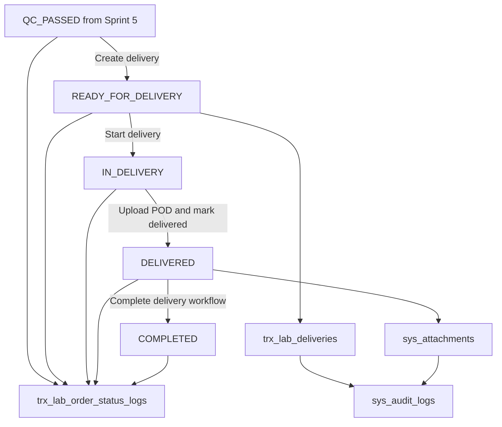

# SPRINT 6 TECHNICAL DESIGN DOCUMENT

## Project

Asia Dental Lab Management System

## Version

1.0

## Sprint

Sprint 6 - Delivery & Proof of Delivery

## Architecture

Laravel 12, Blade + Livewire 3, PostgreSQL 16, Modular Monolith

---

# 1. Sprint 6 Overview

## Business Objective

Sprint 6 membangun implementasi teknis Delivery dan Proof of Delivery (POD)
setelah Lab Order lulus Quality Control pada Sprint 5.

Tujuan bisnisnya adalah memastikan pekerjaan yang sudah `QC_PASSED` dapat
dikirim ke clinic/dokter, memiliki kurir yang jelas, memiliki bukti penerimaan
yang kuat, dan dapat ditutup sebagai `COMPLETED` sebelum proses finance pada
sprint berikutnya.

## Delivery Objective

Delivery objective:

```text
1. Menyediakan Delivery Queue untuk order QC_PASSED.
2. Membuat delivery record.
3. Mengassign courier.
4. Melacak lifecycle delivery.
5. Menyediakan Delivery History.
6. Mencatat audit dan status log untuk semua perubahan penting.
```

## POD Objective

POD objective:

```text
1. Mencatat receiver_name.
2. Menyimpan receiver signature sebagai file path atau attachment.
3. Menyimpan receiver photo sebagai file path atau attachment.
4. Mencatat received_at.
5. Menyimpan delivery_notes.
6. Menghubungkan evidence ke sys_attachments.
```

## Scope

Sprint 6 mencakup:

```text
Delivery Queue
Courier Assignment
Delivery Lifecycle
Proof Of Delivery
Delivery Evidence
Delivery History
Audit Logs
Status Logs
Permissions
Policies
Seeder
Tests
```

## Out Of Scope

Sprint 6 tidak mengimplementasikan:

```text
Invoice
Payment
Reporting
GPS tracking
Route optimization
Customer portal tracking
Separate courier master table
Separate delivery photo table
```

## Dependencies on Sprint 3-5

Sprint 6 bergantung pada Sprint 3 Lab Order Core:

```text
trx_lab_orders
trx_lab_order_status_logs
sys_attachments
sys_audit_logs
Lab Order status enum
Polymorphic attachment strategy
Polymorphic audit strategy
```

Sprint 6 bergantung pada Sprint 4 Production Workflow:

```text
Production completion to QC_PENDING
Production history visibility
Assignment/work log traceability
```

Sprint 6 bergantung pada Sprint 5 Quality Control:

```text
QC result PASSED
Lab Order status QC_PASSED
QC history
QC evidence
QC quality gate before Delivery
```

Sprint 6 starts only from `QC_PASSED`.

---

# 2. Architecture Overview

Request flow follows the project standard:

```text
Controller
-> Request Validation
-> Service
-> Repository
-> Model
-> Database
```

Delivery status flow:

```text
QC_PASSED
-> READY_FOR_DELIVERY
-> IN_DELIVERY
-> DELIVERED
-> COMPLETED
```



## Sprint 5 Handoff

Sprint 5 ends when QC passes and Lab Order becomes `QC_PASSED`.

Sprint 6 owns the transition:

```text
QC_PASSED -> READY_FOR_DELIVERY
```

No Delivery record is created by Sprint 5.

---

# 3. Module Structure

Create module:

```text
app/Modules/Delivery
```

Required structure:

```text
app/Modules/Delivery/
  Controllers/
  Services/
  Repositories/
  Interfaces/
  Requests/
  Policies/
  Models/
  Tests/
```

| Layer | Responsibility |
| --- | --- |
| Controllers | Receive request, authorize, call services, return response or view data. No business logic. |
| Services | Own business rules, workflow transitions, transactions, audit logs, and status logs. |
| Repositories | Own query, filtering, search, pagination, eager loading, and persistence. No workflow rules. |
| Interfaces | Define repository contracts for dependency inversion. |
| Requests | Validate request payloads and request-level authorization. |
| Policies | Enforce record-level authorization for delivery actions. |
| Models | Represent `trx_lab_deliveries` and relationships to orders, users, attachments, and audits. |
| Tests | Pest tests for queue, assignment, lifecycle, POD, evidence, authorization, audit, and status logs. |

Module dependencies:

```text
app/Modules/LabOrder
app/Modules/QualityControl
sys_attachments
sys_audit_logs
trx_lab_order_status_logs
```

---

# 4. Domain Models

## Delivery

| Item | Design |
| --- | --- |
| Model | `Delivery` |
| Table | `trx_lab_deliveries` |
| Purpose | Delivery record and POD tracking. |
| Soft Delete | Required. Delivery history must be preserved. |
| Audit Behavior | Create, assign, reassign, start, mark delivered, complete, upload POD, and status changes must be audited. |

Fillable fields:

```text
lab_order_id
delivery_number
courier_id
status
delivery_notes
receiver_name
receiver_signature_path
receiver_photo_path
received_at
started_at
completed_at
created_by
```

Relationships:

```text
labOrder()
courier()
creator()
attachments()
auditLogs()
```

Casts:

```text
received_at  -> datetime
started_at   -> datetime
completed_at -> datetime
deleted_at   -> datetime
```

Status enum:

```text
READY_FOR_DELIVERY
IN_DELIVERY
DELIVERED
COMPLETED
CANCELLED
```

Implementation notes:

```text
1. `delivery_number` is auto-generated and unique.
2. `courier_id` may be nullable at creation but is required before start.
3. POD file columns store file paths only.
4. Binary/blob/base64 file storage is not allowed.
5. Evidence records use sys_attachments through polymorphic relation.
```

---

# 5. Relationships

## Relationship Table

| Source | Relation | Target | Key |
| --- | --- | --- | --- |
| LabOrder | hasMany | Delivery | `trx_lab_deliveries.lab_order_id` |
| Delivery | belongsTo | LabOrder | `lab_order_id` |
| User | hasMany | Delivery as courier | `trx_lab_deliveries.courier_id` |
| User | hasMany | Delivery as created_by | `trx_lab_deliveries.created_by` |
| Delivery | morphMany | Attachment | `sys_attachments.entity_type/entity_id` |
| Delivery | morphMany | AuditLog | `sys_audit_logs.entity_type/entity_id` |
| LabOrder | hasMany | StatusLog | `trx_lab_order_status_logs.lab_order_id` |

## Eloquent Relationship Names

```php
// LabOrder
public function deliveries(): HasMany

// User
public function courierDeliveries(): HasMany
public function createdDeliveries(): HasMany

// Delivery
public function labOrder(): BelongsTo
public function courier(): BelongsTo
public function creator(): BelongsTo
public function attachments(): MorphMany
public function auditLogs(): MorphMany
```

Attachment target:

```text
entity_type = trx_lab_deliveries
entity_id   = delivery_id
```

---

# 6. Repository Design

## DeliveryRepositoryInterface

Purpose:

```text
Define persistence and query contract for Delivery.
```

Required methods:

```php
interface DeliveryRepositoryInterface
{
    public function paginate(array $filters = [], int $perPage = 15);
    public function find(int $id): ?Delivery;
    public function create(array $data): Delivery;
    public function update(Delivery $delivery, array $data): Delivery;
    public function assignCourier(Delivery $delivery, int $courierId): Delivery;
    public function startDelivery(Delivery $delivery, array $data = []): Delivery;
    public function markDelivered(Delivery $delivery, array $data): Delivery;
    public function completeDelivery(Delivery $delivery, array $data = []): Delivery;
}
```

## DeliveryRepository

Responsibilities:

```text
1. Query delivery records.
2. Eager load lab order, clinic, doctor, patient, courier, attachments.
3. Apply filters.
4. Apply search.
5. Apply sorting.
6. Persist model changes.
7. Return models or paginated results.
```

Repository must not:

```text
1. Authorize users.
2. Validate request payloads.
3. Decide workflow transitions.
4. Write audit logs directly unless called by service-level helper.
5. Write status logs directly unless called by service-level helper.
```

Pagination:

```text
Default per page: 15
Maximum per page: 100
```

Filtering:

```text
order_number
clinic_id
doctor_id
patient_id
courier_id
status
due_date_from
due_date_to
priority
```

Search strategy:

```text
1. Search exact or partial delivery_number.
2. Search exact or partial Lab Order order_number.
3. Search clinic name.
4. Search doctor name.
5. Search patient name.
6. Search courier name.
```

Sorting:

```text
priority desc
due_date asc
status asc
created_at desc
```

---

# 7. Service Layer Design

## DeliveryService

Responsibilities:

```text
1. Create delivery record from QC_PASSED Lab Order.
2. Assign or reassign courier.
3. Coordinate status transition service calls.
4. Coordinate audit and status log creation.
5. Expose read methods for queue and detail.
```

Dependencies:

```text
DeliveryRepositoryInterface
DeliveryWorkflowService
PodService
AuditLogService or shared audit helper
LabOrderRepositoryInterface
DB transaction manager
```

Business rules:

```text
1. Create delivery only from QC_PASSED Lab Order.
2. Delivery number must be generated automatically.
3. Creating delivery changes Lab Order status to READY_FOR_DELIVERY.
4. Reassignment requires notes.
5. Delivery history must not be hard deleted.
```

Transaction strategy:

```text
Wrap create, assign, reassign, lifecycle, POD upload metadata update, audit log,
and status log writes in database transactions where they affect multiple rows.
```

Side effects:

```text
1. Creates sys_audit_logs.
2. Creates trx_lab_order_status_logs when Lab Order status changes.
3. Updates trx_lab_orders.status.
4. Updates trx_lab_deliveries.status.
```

## PodService

Responsibilities:

```text
1. Validate POD completeness at service level.
2. Store POD file references.
3. Create sys_attachments rows for POD evidence.
4. Confirm receiver_name, signature, photo, and received_at exist.
5. Support retrieval of POD evidence.
```

Dependencies:

```text
Attachment service or repository
DeliveryRepositoryInterface
AuditLogService or shared audit helper
Storage service
DB transaction manager
```

Business rules:

```text
1. POD must include receiver_name.
2. POD must include signature evidence.
3. POD must include receiver photo evidence.
4. POD must include received_at.
5. File content is stored in storage, metadata in sys_attachments.
6. No delivery photo table is created.
```

Side effects:

```text
1. Creates sys_attachments.
2. Updates receiver fields on trx_lab_deliveries.
3. Creates UPLOAD_POD audit log.
```

## DeliveryWorkflowService

Responsibilities:

```text
1. Enforce allowed transitions.
2. Move Lab Order from QC_PASSED to READY_FOR_DELIVERY.
3. Move Lab Order from READY_FOR_DELIVERY to IN_DELIVERY.
4. Move Lab Order from IN_DELIVERY to DELIVERED.
5. Move Lab Order from DELIVERED to COMPLETED.
6. Create status logs and audit logs.
```

Dependencies:

```text
DeliveryRepositoryInterface
LabOrderRepositoryInterface
StatusLogService or shared status log helper
AuditLogService or shared audit helper
DB transaction manager
```

Business rules:

```text
1. QC_PASSED is required before READY_FOR_DELIVERY.
2. Courier is required before IN_DELIVERY.
3. POD is required before COMPLETED.
4. Cancelled orders cannot start or complete delivery.
5. Completed orders cannot be mutated by delivery workflow.
```

---

# 8. Delivery Status Transition Design

Allowed Lab Order transitions:

| From | Action | To |
| --- | --- | --- |
| `QC_PASSED` | Create delivery | `READY_FOR_DELIVERY` |
| `READY_FOR_DELIVERY` | Start delivery | `IN_DELIVERY` |
| `IN_DELIVERY` | Mark delivered with POD | `DELIVERED` |
| `DELIVERED` | Complete delivery workflow | `COMPLETED` |

Rules:

```text
1. QC_PASSED required before delivery creation.
2. Courier required before start delivery.
3. POD required before COMPLETED.
4. All transitions audited.
5. All transitions logged in trx_lab_order_status_logs.
6. Status logs are append-only.
7. Delivery completion does not create invoice.
8. Delivery completion does not create payment.
```

Delivery status mapping:

| Delivery Status | Lab Order Status | Meaning |
| --- | --- | --- |
| `READY_FOR_DELIVERY` | `READY_FOR_DELIVERY` | Delivery record exists and courier can be assigned. |
| `IN_DELIVERY` | `IN_DELIVERY` | Courier has started delivery. |
| `DELIVERED` | `DELIVERED` | POD has been captured and goods received. |
| `COMPLETED` | `COMPLETED` | Delivery workflow is closed. |
| `CANCELLED` | no automatic mapping | Delivery attempt cancelled or voided by allowed user. |

---

# 9. Delivery Queue Design

Queue sources:

```text
trx_lab_orders.status in:
QC_PASSED
READY_FOR_DELIVERY
IN_DELIVERY
DELIVERED
```

Queue groups:

| Queue Group | Included Status | Primary Action |
| --- | --- | --- |
| Ready to Prepare | `QC_PASSED` | Create delivery |
| Ready for Courier | `READY_FOR_DELIVERY` | Assign or start delivery |
| In Delivery | `IN_DELIVERY` | Monitor or open POD |
| Delivered Pending Completion | `DELIVERED` | Review and complete |

Filters:

```text
order number
clinic
doctor
patient
courier
status
due date
priority
```

Sorting:

```text
1. SUPER_URGENT first.
2. URGENT second.
3. Earliest due date first.
4. Delivery status operational urgency.
5. Oldest created_at first within same status.
```

Required eager loading:

```text
labOrder
labOrder.clinic
labOrder.doctor
labOrder.patient
courier
attachments
```

Queue rules:

```text
1. Cancelled orders do not appear in active delivery queue.
2. Completed orders move to Delivery History.
3. Courier sees own active deliveries.
4. Admin Lab and Delivery Coordinator see all delivery queue rows.
```

---

# 10. Courier Assignment Design

## Assign Courier

Flow:

```text
Open Delivery Queue
-> Select QC_PASSED order
-> Create delivery
-> Select courier
-> Add delivery_notes
-> Save
-> Lab Order status becomes READY_FOR_DELIVERY
-> Audit CREATE_DELIVERY and ASSIGN_COURIER
-> Status log QC_PASSED -> READY_FOR_DELIVERY
```

Rules:

```text
1. Courier must be an active user with delivery permission or courier role.
2. Courier is required before IN_DELIVERY.
3. Assignment must be audited.
4. Assignment does not create a separate courier master record.
```

## Reassign Courier

Flow:

```text
Open Delivery Detail
-> Choose new courier
-> Add reassignment notes
-> Save
-> Update courier_id
-> Audit REASSIGN_COURIER with old and new courier
```

Allowed when:

```text
READY_FOR_DELIVERY
IN_DELIVERY
```

Blocked when:

```text
DELIVERED
COMPLETED
CANCELLED
```

Assignment history:

```text
1. Current courier is stored in trx_lab_deliveries.courier_id.
2. Assignment and reassignment history is preserved in sys_audit_logs.
3. A separate assignment table is not required in Sprint 6 V1.
```

---

# 11. POD Design

Required POD data:

```text
receiver_name
receiver_signature
receiver_photo
received_at
delivery_notes
```

Storage mapping:

| POD Data | Storage |
| --- | --- |
| `receiver_name` | `trx_lab_deliveries.receiver_name` |
| `receiver_signature` | `receiver_signature_path` and/or `sys_attachments` category `POD_SIGNATURE` |
| `receiver_photo` | `receiver_photo_path` and/or `sys_attachments` category `POD_RECEIVER_PHOTO` |
| `received_at` | `trx_lab_deliveries.received_at` |
| `delivery_notes` | `trx_lab_deliveries.delivery_notes` |

Rules:

```text
1. All required POD data must exist before completion.
2. Signature is stored as attachment/file path, not binary/blob/base64.
3. Receiver photo is stored as attachment/file path, not binary/blob/base64.
4. POD evidence must be preserved through sys_attachments.
5. POD upload must be audited.
6. Missing POD blocks COMPLETED.
```

POD completion check:

```text
receiver_name present
receiver_signature_path or POD_SIGNATURE attachment present
receiver_photo_path or POD_RECEIVER_PHOTO attachment present
received_at present
```

---

# 12. Delivery Evidence Design

Reuse:

```text
sys_attachments
```

Categories:

```text
DELIVERY_PHOTO
POD_SIGNATURE
POD_RECEIVER_PHOTO
DELIVERY_EVIDENCE
```

Polymorphic usage:

```text
entity_type = trx_lab_deliveries
entity_id   = delivery_id
```

Upload flow:

```text
Request validates file and category
-> Controller calls DeliveryService or PodService
-> File stored in delivery-specific storage path
-> sys_attachments row created
-> Delivery receiver path fields updated when relevant
-> UPLOAD_POD audit log created
```

Retrieval flow:

```text
Delivery Detail
-> eager load attachments
-> group by category
-> show signature, receiver photo, delivery photo, and other evidence
```

Rules:

```text
1. Do not create delivery photo tables.
2. Do not store binary content in database.
3. Soft delete attachment metadata.
4. Audit upload, replacement, and delete.
5. General Lab Order delivery evidence may also attach to trx_lab_orders when needed.
```

---

# 13. Audit Log Design

Use existing:

```text
sys_audit_logs
```

Actions:

```text
CREATE_DELIVERY
ASSIGN_COURIER
REASSIGN_COURIER
START_DELIVERY
MARK_DELIVERED
COMPLETE_DELIVERY
UPLOAD_POD
STATUS_CHANGE
```

Audit payload expectations:

| Action | Required Payload |
| --- | --- |
| `CREATE_DELIVERY` | lab_order_id, delivery_id, delivery_number, created_by |
| `ASSIGN_COURIER` | delivery_id, courier_id, assigned_by |
| `REASSIGN_COURIER` | delivery_id, old_courier_id, new_courier_id, notes |
| `START_DELIVERY` | delivery_id, courier_id, started_at |
| `MARK_DELIVERED` | delivery_id, receiver_name, received_at, evidence_count |
| `COMPLETE_DELIVERY` | delivery_id, completed_at, completed_by |
| `UPLOAD_POD` | delivery_id, attachment_id, category, uploaded_by |
| `STATUS_CHANGE` | lab_order_id, old_status, new_status, changed_by |

Columns:

```text
entity_type
entity_id
action
old_values
new_values
performed_by
performed_at
ip_address
user_agent
```

Target rules:

```text
1. Delivery actions audit trx_lab_deliveries.
2. Lab Order status changes audit trx_lab_orders.
3. POD upload may audit both trx_lab_deliveries and sys_attachments metadata.
4. Audit writes should be in the same transaction as business mutations.
```

---

# 14. Status Log Design

Every Lab Order status transition creates:

```text
trx_lab_order_status_logs
```

Required transitions:

| Old Status | New Status | Trigger |
| --- | --- | --- |
| `QC_PASSED` | `READY_FOR_DELIVERY` | Create delivery |
| `READY_FOR_DELIVERY` | `IN_DELIVERY` | Start delivery |
| `IN_DELIVERY` | `DELIVERED` | Mark delivered with POD |
| `DELIVERED` | `COMPLETED` | Complete delivery workflow |

Required fields:

```text
lab_order_id
old_status
new_status
notes
changed_by
changed_at
```

Rules:

```text
1. Status logs are append-only.
2. Status log and status mutation must occur in one transaction.
3. Every status log should have a matching STATUS_CHANGE audit entry.
```

---

# 15. Permission Design

Permissions:

```text
manage_delivery
view_delivery
create_delivery
assign_courier
start_delivery
mark_delivered
complete_delivery
upload_pod
```

Permission matrix:

| Role | manage_delivery | view_delivery | create_delivery | assign_courier | start_delivery | mark_delivered | complete_delivery | upload_pod |
| --- | --- | --- | --- | --- | --- | --- | --- | --- |
| Super Admin | Yes | Yes | Yes | Yes | Yes | Yes | Yes | Yes |
| Admin Lab | Yes | Yes | Yes | Yes | Yes | Yes | Yes | Yes |
| Delivery Coordinator | Yes | Yes | Yes | Yes | Yes | Yes | Yes | Yes |
| Courier | No | Own only | No | No | Own only | Own only | Own only or submit | Own only |
| Quality Control | No | View handoff only | No | No | No | No | No | No |
| Technician | No | Related order only | No | No | No | No | No | No |

Seeder notes:

```text
1. PermissionSeeder must insert all Sprint 6 permissions.
2. RoleSeeder must assign grants according to matrix.
3. Permissions must be used by middleware and policies.
```

---

# 16. Policy Design

Create:

```text
DeliveryPolicy
```

Operations:

```text
viewAny
view
create
assignCourier
startDelivery
markDelivered
completeDelivery
uploadPod
```

Authorization strategy:

| Operation | Rule |
| --- | --- |
| `viewAny` | Requires `view_delivery` or `manage_delivery`. Courier sees own deliveries. |
| `view` | Admin/Coordinator can view all. Courier can view assigned delivery. QC/Technician may view related order only if allowed. |
| `create` | Requires `create_delivery`; Lab Order must be `QC_PASSED`. |
| `assignCourier` | Requires `assign_courier`; delivery must not be `DELIVERED`, `COMPLETED`, or `CANCELLED`. |
| `startDelivery` | Requires `start_delivery`; user must be assigned courier or privileged delivery user. |
| `markDelivered` | Requires `mark_delivered`; user must be assigned courier or privileged delivery user. |
| `completeDelivery` | Requires `complete_delivery`; POD must be complete. |
| `uploadPod` | Requires `upload_pod`; user must be assigned courier or privileged delivery user. |

Policy rules must never replace service-level workflow validation. Policy answers
"who may attempt this"; services decide "is this business transition valid".

---

# 17. Request Validation Design

## CreateDeliveryRequest

Fields:

| Field | Rule |
| --- | --- |
| `lab_order_id` | required, exists:trx_lab_orders,id |
| `courier_id` | nullable, exists:users,id |
| `delivery_notes` | nullable, string |

Validation failures:

```text
Lab Order missing
Lab Order not QC_PASSED
Courier inactive or invalid
```

## AssignCourierRequest

Fields:

| Field | Rule |
| --- | --- |
| `courier_id` | required, exists:users,id |
| `notes` | required for reassignment, nullable for first assignment |

Validation failures:

```text
courier required
courier invalid
notes required for reassignment
```

## StartDeliveryRequest

Fields:

| Field | Rule |
| --- | --- |
| `notes` | nullable, string |

Validation failures:

```text
courier required
delivery not READY_FOR_DELIVERY
user not assigned courier or not privileged
```

## MarkDeliveredRequest

Fields:

| Field | Rule |
| --- | --- |
| `receiver_name` | required, string, max:150 |
| `received_at` | required, date |
| `delivery_notes` | nullable, string |
| `signature` | required file or existing `receiver_signature_path` |
| `receiver_photo` | required file or existing `receiver_photo_path` |

Validation failures:

```text
receiver_name required
signature required
photo required
received_at required
delivery not IN_DELIVERY
```

## CompleteDeliveryRequest

Fields:

| Field | Rule |
| --- | --- |
| `notes` | nullable, string |

Validation failures:

```text
delivery not DELIVERED
POD incomplete
receiver_name missing
signature missing
photo missing
```

## UploadPodRequest

Fields:

| Field | Rule |
| --- | --- |
| `category` | required, in:DELIVERY_PHOTO,POD_SIGNATURE,POD_RECEIVER_PHOTO,DELIVERY_EVIDENCE |
| `file` | required, file |
| `notes` | nullable, string |

Recommended file validation:

```text
image types for photos/signature
PDF allowed only for DELIVERY_EVIDENCE when needed
max file size follows project attachment rules
```

---

# 18. Controller Design

Create:

```text
DeliveryController
```

Methods:

| Method | Responsibility |
| --- | --- |
| `index` | Show Delivery Queue with filters and pagination. |
| `show` | Show Delivery Detail with order, courier, POD, evidence, and history. |
| `store` | Create delivery from QC_PASSED Lab Order. |
| `assignCourier` | Assign or reassign courier. |
| `startDelivery` | Start delivery and move order to IN_DELIVERY. |
| `markDelivered` | Capture POD and move order to DELIVERED. |
| `completeDelivery` | Complete delivery workflow and move order to COMPLETED. |
| `uploadPod` | Upload POD/evidence attachment. |

Controller rules:

```text
1. Controllers call services only.
2. No business logic in controllers.
3. No direct model mutation in controllers.
4. Authorization must be called before service mutation.
5. Requests handle validation.
```

---

# 19. Route Design

Routes:

| Method | URI | Controller Method | Middleware |
| --- | --- | --- | --- |
| GET | `/deliveries` | `index` | auth, permission:view_delivery |
| GET | `/deliveries/{delivery}` | `show` | auth, can:view,delivery |
| POST | `/deliveries` | `store` | auth, permission:create_delivery |
| POST | `/deliveries/{delivery}/assign-courier` | `assignCourier` | auth, permission:assign_courier, can:assignCourier,delivery |
| POST | `/deliveries/{delivery}/start` | `startDelivery` | auth, permission:start_delivery, can:startDelivery,delivery |
| POST | `/deliveries/{delivery}/mark-delivered` | `markDelivered` | auth, permission:mark_delivered, can:markDelivered,delivery |
| POST | `/deliveries/{delivery}/complete` | `completeDelivery` | auth, permission:complete_delivery, can:completeDelivery,delivery |
| POST | `/deliveries/{delivery}/pod` | `uploadPod` | auth, permission:upload_pod, can:uploadPod,delivery |

Route rules:

```text
1. Use auth middleware.
2. Use permission middleware.
3. Use policy authorization.
4. Do not expose Invoice, Payment, or Reporting routes in Sprint 6.
```

---

# 20. UI Design

## Delivery Queue

Purpose:

```text
Operational list of QC_PASSED, READY_FOR_DELIVERY, IN_DELIVERY, and DELIVERED orders.
```

Layout:

```text
Filters row
Status tabs or segmented control
Delivery table
Pagination
Row actions
```

Actions:

```text
Create delivery
Assign courier
Start delivery
Open POD
View detail
Complete delivery
```

## Delivery Detail

Panels:

```text
Delivery Info
Lab Order Summary
Courier Assignment
POD Panel
Evidence Panel
History Panel
Audit/Timeline Panel
```

## Courier Assignment Panel

Fields:

```text
courier
delivery_notes
reassignment_notes
```

Actions:

```text
Assign courier
Reassign courier
```

## POD Panel

Fields:

```text
receiver_name
received_at
delivery_notes
signature upload/capture
receiver photo upload/capture
```

Actions:

```text
Upload POD
Mark delivered
Complete delivery
```

## Evidence Panel

Groups evidence by category:

```text
DELIVERY_PHOTO
POD_SIGNATURE
POD_RECEIVER_PHOTO
DELIVERY_EVIDENCE
```

## History Panel

Displays:

```text
delivery creation
courier assignment
reassignment
start delivery
POD upload
mark delivered
complete delivery
status changes
audit events
```

---

# 21. Seeder Design

## PermissionSeeder Updates

Insert:

```text
manage_delivery
view_delivery
create_delivery
assign_courier
start_delivery
mark_delivered
complete_delivery
upload_pod
```

## RoleSeeder Updates

Grant matrix:

```text
Super Admin: all delivery permissions
Admin Lab: all delivery permissions
Delivery Coordinator: all delivery permissions
Courier: view_delivery, start_delivery, mark_delivered, upload_pod
Quality Control: view_delivery only for handoff visibility if required
Technician: no mutation permission
```

## DeliverySeeder

Demo records:

```text
1. QC_PASSED order without delivery.
2. READY_FOR_DELIVERY delivery with courier.
3. IN_DELIVERY delivery.
4. DELIVERED delivery with POD evidence.
5. COMPLETED delivery history record.
```

Demo POD records:

```text
receiver_name
receiver_signature_path
receiver_photo_path
received_at
delivery_notes
sys_attachments rows for POD_SIGNATURE and POD_RECEIVER_PHOTO
```

Seeder rules:

```text
1. Demo delivery records must not create invoice.
2. Demo delivery records must not create payment.
3. Demo evidence must use sys_attachments.
```

---

# 22. Testing Strategy

Target:

```text
250+ total tests after Sprint 6.
```

Required test groups:

```text
Delivery Queue
Courier Assignment
Start Delivery
Mark Delivered
Complete Delivery
POD Upload
Evidence Upload
Authorization
Audit Logs
Status Logs
Guest Redirect
Regression Tests
```

Recommended feature tests:

| Test Area | Cases |
| --- | --- |
| Delivery Queue | lists QC_PASSED, READY_FOR_DELIVERY, IN_DELIVERY, DELIVERED; hides CANCELLED/COMPLETED from active queue |
| Create Delivery | creates delivery from QC_PASSED; blocks non-QC_PASSED; creates status log; creates audit |
| Assign Courier | assigns courier; reassigns courier with notes; blocks after DELIVERED/COMPLETED |
| Start Delivery | requires courier; moves status to IN_DELIVERY; creates logs |
| Mark Delivered | requires receiver_name, received_at, signature, photo; moves status to DELIVERED |
| Complete Delivery | requires POD complete; moves status to COMPLETED; prevents duplicate completion |
| POD Upload | creates sys_attachments; stores file path; audits upload |
| Authorization | role permissions enforced; courier limited to own deliveries |
| Guest Redirect | unauthenticated user redirected to login |
| Regression | Sprint 3-5 Lab Order, Production, QC flows still pass |

Unit tests:

```text
DeliveryWorkflowService transition rules
PodService completeness checks
DeliveryRepository filters and search
Delivery number generator
Policy decisions
```

---

# 23. Performance Guidelines

Eager loading:

```text
Delivery queue should eager load labOrder, clinic, doctor, patient, and courier.
Delivery detail should eager load attachments and audit/status history.
```

Indexes:

```text
trx_lab_deliveries.delivery_number UNIQUE
trx_lab_deliveries.lab_order_id
trx_lab_deliveries.courier_id
trx_lab_deliveries.status
trx_lab_deliveries.received_at
trx_lab_deliveries.created_by
sys_attachments.entity_type
sys_attachments.entity_id
sys_attachments.category
```

Pagination:

```text
1. Use pagination for queues and history.
2. Default per page 15.
3. Cap per page at 100.
```

N+1 prevention:

```text
1. Never loop delivery rows and lazy-load Lab Order.
2. Never lazy-load attachments in evidence tables.
3. Use constrained eager loading for audit and attachment categories.
```

Transaction usage:

```text
Use DB transactions for delivery creation, workflow transition, POD upload
metadata updates, audit log creation, and status log creation.
```

---

# 24. Security Guidelines

Permissions:

```text
All routes require auth and delivery permissions.
```

Policies:

```text
DeliveryPolicy enforces record-level access.
Courier can mutate only assigned delivery unless privileged.
```

Validation:

```text
Request classes validate required fields, file types, file sizes, and allowed categories.
Services validate workflow state.
```

Audit logs:

```text
Every delivery mutation must create sys_audit_logs.
Audit logs must not store raw file content.
```

Soft deletes:

```text
Delivery records use soft delete.
Attachment metadata uses soft delete.
Hard delete is not allowed for delivery history.
```

File security:

```text
1. Validate mime type.
2. Generate safe filenames.
3. Store files outside public write paths unless storage disk policy allows controlled access.
4. Do not trust client-provided filenames.
```

---

# 25. Risks & Edge Cases

| Risk | Handling |
| --- | --- |
| Courier reassignment | Allow before delivered/completed, require notes, audit old and new courier. |
| Missing POD | Block `DELIVERED` and `COMPLETED` until receiver, signature, photo, and timestamp are present. |
| Duplicate completion | Block if delivery or Lab Order already `COMPLETED`. |
| Receiver unavailable | Keep delivery in `IN_DELIVERY` or return to queue by explicit policy; add notes and audit. |
| Invalid signature | Reject invalid file/type or missing signature; allow re-upload with audit trail. |
| Cancelled order | Block start, mark delivered, and complete actions. |
| Failed delivery | Record notes/evidence, keep delivery from `DELIVERED`, allow reassignment or reschedule policy. |
| Blurry receiver photo | Allow replacement through sys_attachments with soft delete and audit. |
| Courier loses connection | Make actions idempotent where possible and block duplicate status changes. |
| Order returned after delivery | Not part of Sprint 6; future correction/remake workflow must preserve history. |

---

# 26. Definition Of Done

Sprint 6 is complete when:

```text
- Delivery queue works
- Courier assignment works
- Delivery lifecycle works
- POD works
- Delivery evidence works
- Audit logs work
- Status logs work
- Permissions work
- Policies work
- Request validation works
- Seeder creates required permissions and demo records
- Tests pass
- Build passes
- No Invoice implementation added
- No Payment implementation added
- No Reporting implementation added
```

Readiness checklist:

```text
- Matches delivery_workflow_design.md
- Matches erd.md
- Matches database_schema.md
- Follows modular monolith architecture
- Follows Controller -> Request -> Service -> Repository -> Model
- Reuses sys_attachments
- Reuses sys_audit_logs
- Reuses trx_lab_order_status_logs
- Avoids delivery photo table
- Avoids courier master table
- Avoids Invoice implementation
- Avoids Payment implementation
- Avoids Reporting implementation
- Implementation-ready for Sprint 6
```
