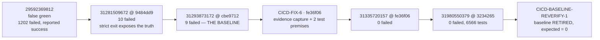

# CICD-BASELINE-REVERIFY-1 — Full-Suite Baseline Revalidation & Stale Failure-Debt Closure

```
STATUS: BASELINE RECONCILED / FULL SUITE REVALIDATED / STALE FAILURE DEBT CLOSED

HISTORICAL BASELINE   9 Full Suite failures  @ cbe9712  (run 31293873172)
CURRENT BASELINE      0 Full Suite failures  @ 3234265  (run 31980550379)

LEGACY_9_FAILURE_BASELINE            = RETIRED
EXPECTED_FULL_SUITE_FAILURE_BASELINE = 0
```

Base branch `feature/sprint-26-phase-26-8-stabilization-closure-go-watch-no-go-report`,
base SHA `323426506bd760487a9da796233e300b56451217` resolved from the remote per
DEVFLOW-FIX-BASE-REF-1. No migration, no permission, no route, no schema, no
business-logic change. Two test files and one new guard test; the rest is
documentation and rules.

---

## 1. Why this workstream exists

CICD-CTRL-3 closed with a documented residual: **nine pre-existing Full Suite
application failures**, catalogued in §10 of its sprint doc and deliberately
left untouched so that the gate would keep telling the truth.

Since then an authoritative post-merge Full Suite completed **successfully**.
That created a governance risk in the opposite direction: a stale debt note that
no longer describes reality still gets quoted in closure reports, and a baseline
kept "for historical convenience" quietly becomes a licence to ignore red.

This workstream answers one question — *are those nine still real?* — and it was
run without a predetermined answer. The conclusion happens to be that all nine
are closed, but the investigation also found something the green runs were
hiding, which is recorded in §6.

---

## 2. The historical baseline — reconstructed, not recalled

The nine were reconstructed from the **raw job log**, not from the summary that
described them.

| Field | Value |
|---|---|
| `HISTORICAL_BASELINE_SOURCE` | `docs/sprints/cicd-ctrl-3-dedicated-self-hosted-ci-runner.md` §10, corroborated by raw log |
| `HISTORICAL_BASELINE_SHA` | `cbe97129fce79ab5c54cce0eed10ae341f6a719a` (CTRL-3D closure merge) |
| `HISTORICAL_RUN_ID` | `31293873172` (push, `conclusion=failure`) |
| `HISTORICAL_TEST_COMMAND` | `php artisan test` (no filter), piped to `tee` under `shell: bash` |
| `HISTORICAL_ENVIRONMENT` | GitHub-hosted `ubuntu-latest`, PHP 8.3, **PostgreSQL 16** service |
| `HISTORICAL_SUMMARY` | `9 failed, 5642 warnings, 1 risky, 13 passed (26604 assertions)` |
| `HISTORICAL_FAILURE_COUNT` | **9** |

The immediately preceding run `31281509672` @ `9484dd9` reported `10 failed`;
the tenth (`SelfHostedHealthFailClosedTest`) belonged to CICD-CTRL-3 itself and
was fixed in CTRL-3D, leaving exactly nine.

### Evidence quality

The historical evidence is **authoritative and admissible**: real CI, on the
canonical runner, against the canonical database, running the unfiltered suite,
with strict exit propagation already in force. It is not local-only, not a wrong
checkout, not an outage, and not an orphan-worker race. The nine were genuine.

One earlier data point is *not* admissible and is labelled as such: run
`29592369812` (2026-07-17) is recorded `success` while its log reports
`Tests: 1202 failed`. That is the swallowed-exit-status defect CICD-CTRL-3
fixed, and it is quoted here only to explain why the debt went unseen for so
long — never as a passing baseline.

---

## 3. Per-failure reconciliation

All nine share one fixing workstream: **CICD-FIX-6 — Full Suite truthful-green
release evidence and deterministic contracts**, merged as `fe36f06` (PR #269).
The attribution is not inferred from the commit message; it is proven by the
run immediately after it (`31335720157`) reporting **zero** failures, and by the
diff of `fe36f06` touching exactly the implicated files.

| # | Historical test | Historical failure | Current result | Fixing change | Classification |
|---|---|---|---|---|---|
| 1 | `Architecture\Cache1GovernanceIntegrationTest` › *release evidence check expects cache governance artifact* | `'GO'` vs `'WATCH'` | passes | `ReleaseEvidenceService` (+46) — the test now captures evidence before checking it | **FIXED** |
| 2 | `Architecture\Dbperf1GovernanceIntegrationTest` › *…db-performance-check artifact* | same | passes | same | **FIXED** |
| 3 | `Architecture\Dbperf2GovernanceIntegrationTest` › *…postgres-runtime-check artifact* | same | passes | same + `config/postgres_runtime_governance.php` | **FIXED** |
| 4 | `Architecture\Queue1GovernanceIntegrationTest` › *…queue idempotency and outbox artifacts* | same | passes | same | **FIXED** |
| 5 | `Architecture\Rpt1GovernanceIntegrationTest` › *release evidence capture and check include reporting summary* | same | passes | same | **FIXED** |
| 6 | `Foundation\ReleaseSafetyEvidenceClosureTest` › *ci profile returns GO after evidence capture* | same | passes | same | **FIXED** |
| 7 | `Foundation\ReleaseSafetyEvidenceClosureTest` › *vps profile reaches GO once backup and evidence exist* | same | passes | same | **FIXED** |
| 8 | `Performance\Nsf21SqliteMigrationCompatibilityTest` › *runs sqlite in-memory migrations including rme receivables index migration* | `'sqlite'` vs `'pgsql'` | replaced by 3 passing tests | test rewritten to open an **explicit sqlite connection** | **FIXED (renamed, coverage increased)** |
| 9 | `Pilot\RmeSmokeTestRouteTest` › *allows smoke-test Perawat to access visit support routes* | 302 vs 200 | passes | seeder starts the Perawat online context through the real service; a **new negative test** pins the redirect | **FIXED (coverage increased)** |

### Neither deleted nor weakened — checked individually

Rule: *a removed test is not a fix, and a skipped test is not a fix.* Both
rewritten tests were audited against that rule.

**#8** was a broken premise, not a product defect. The original asserted
`DB::connection()->getDriverName() === 'sqlite'`, which is false by construction
in a job whose canonical database is PostgreSQL — the test could only ever pass
where it was never meant to run. CICD-FIX-6 replaced the single test with three
that open an explicit SQLite connection, so SQLite migration portability is now
genuinely asserted **regardless of the default driver**. It is not skipped: all
three execute (0.05s / 0.69s / 0.67s) and assert. Coverage went 1 → 3.

**#9** was fixed at the *setup* end, not the assertion end. RME-BRANCH-SUN4 made
a branch-only online context mandatory for Perawat; the smoke seeder had never
been updated, so the account under test could not reach the routes it exists to
smoke-test. The fix starts that context through `UserOnlineContextService` — the
same service the application uses — and then **adds** a test proving the
redirect still fires once the context is released. The redirect behaviour that
originally reddened the gate is now asserted explicitly rather than incidentally.

---

## 4. Was the suite quietly narrowed?

A baseline can also go green because the failing tests stopped running. It did
not happen here, and the check is arithmetic rather than rhetorical.

| SHA | Run | Tests | Assertions | Failed | Skipped |
|---|---|---|---|---|---|
| `9484dd9` | `31281509672` | 5 661 | 26 587 | 10 | 0 |
| `cbe9712` **(baseline)** | `31293873172` | 5 665 | 26 604 | **9** | 0 |
| `fe36f06` (CICD-FIX-6) | `31335720157` | 5 680 | 26 727 | **0** | 0 |
| `431d5af` | `31960007944` | 6 523 | 29 231 | 0 | 0 |
| `3234265` **(current)** | `31980550379` | 6 566 | 29 344 | **0** | 0 |

The suite **grew by 901 tests and 2 740 assertions** between the baseline and
today. It did not shrink.

Independently of the totals, all nine historical test files were confirmed
present in the current run's log, each rendering its own result block. No filter
excludes them: the step is `php artisan test` with no `--filter`, and the
docs-only skip branch (`run_critical_tests == 'false'`) did not fire on any of
these runs.

**Skip audit:** every run above reports **zero** skipped tests. Pest omits
zero-valued counts, and no `skipped` term appears in any summary line. No
historical failure was converted into a skip.

### Current Full Suite topology

| Field | Value |
|---|---|
| `FULL_SUITE_TRIGGER_POLICY` | weekly `schedule` (`0 2 * * 0`) · `workflow_dispatch` with `run_full_suite=true` · `push` to the base branch |
| `FULL_SUITE_RUNNER` | `ubuntu-latest` (GitHub-hosted) — never routed to the self-hosted runner; `self_hosted_heavy_jobs` names only `critical_test_gate_self_hosted` |
| `FULL_SUITE_DATABASE` | `postgres:16` service, `DB_CONNECTION=pgsql` |
| `FULL_SUITE_COMMAND` | `php artisan test 2>&1 \| tee storage/ci-evidence/nsf-r011-full-suite.log` under `shell: bash` |
| `FULL_SUITE_TIMEOUT` | none declared; GitHub's default 360-minute job limit applies |

Baseline and current run are therefore an apples-to-apples comparison: same
runner class, same PHP, same database engine, same unfiltered command.

### About the warning count

The summaries read `6552 warnings … 13 passed`, which looks alarming. What
matters for this workstream is established beyond doubt:

- **Warnings are not skips.** The tests execute and assert. Assertion count is
  the honest measure, and it rose with the suite (26 604 → 29 344).
- **Warnings never mask failures.** The baseline run reported `9 failed`
  *alongside* 5 642 warnings and concluded `failure`; run `31928614428`
  reddened the gate on a single failure beside 6 486 warnings. Failures are
  counted and gated independently of the downgrade.

**The cause is NOT established, and the previously documented explanation is
superseded.** CICD-CTRL-3 §10 attributed the warnings to an absent
`public/build/manifest.json` making every layout-rendering test emit a
`file_get_contents` warning. That cannot be the explanation for the runs
measured here: `tests/TestCase.php` calls Laravel's `withoutVite()`, which stubs
the Vite facade so `@vite` renders nothing — and it shipped **in `9484dd9`
itself**, the very merge whose Full Suite the 5 637-warning figure came from.
Locally, with no `public/build` present, the same tests report **`PASS`, not
warning**. No manifest path appears anywhere in the current run's log.

What the log can and cannot show: Pest truncates the inline warning text, so of
the 6 321 visibly warning-marked tests only 2 469 still show the
`→ file_get_contents(…` fragment and **none** retains a full path. The real
source therefore cannot be identified from this evidence, and this workstream
does not guess at one.

**Handed forward:** identify the actual warning source and restore a clean
summary line. It is deliberately out of scope here — it changes no failure
count, and inventing a second unverified explanation to replace the first would
repeat exactly the mistake this sprint exists to correct.

---

## 5. Is a failure still red? — the fail-closed check

A baseline of zero is only meaningful if a single failure reddens the gate.

**There is no failure-allowance mechanism to remove.** The nine were only ever
an evidence note in prose; they were never encoded anywhere. A scan of the CI
workflow, `scripts/ci/`, `config/ci_runner.php`, `config/ci_runtime_control.php`,
`app/Support/Cicd/` and `app/Services/Foundation/` for allowance tokens returns
nothing. There is no baseline-subtraction path, so nothing needs deleting and
nothing can be quietly relied upon.

The fail-closed property itself is already pinned by CICD-FIX-6's
`NsfReleaseGateExitPropagationTest`, which registers `Run full Pest suite` in
`ci_runner.strict_pipeline_steps` and asserts, among other things, that the step
fails when Pest fails and that *removing* its strict shell would restore a false
green. That mutation guard is exactly the right protection and is not duplicated
here.

It is also proven empirically: run `31928614428` reddened the whole gate on a
**single** failing test. One is enough.

---

## 6. What the green runs were hiding — a real non-determinism, found and closed

Run `31928614428` @ `9c803fe` reported `1 failed`. It is not one of the nine, and
it deserved an explanation rather than a shrug, because a baseline of zero is
worthless if the suite reddens at random.

```
FAILED  Tests\Feature\RME\LabCaseCandidateQueueTest › it index searches by patient name
  To contain: Oswaldo O'Kon
  at tests/Feature/RME/LabCaseCandidateQueueTest.php:105
```

The test read a **faker-generated** patient name off the model and looked for it
in the **raw** response body. Blade renders names through `{{ }}`, so
`Oswaldo O'Kon` reaches the page as `Oswaldo O&#039;Kon` and the comparison
fails. The test therefore passed or failed according to whether faker happened
to pick a name containing `'`, `&`, `<`, `>` or `"`.

That it was a flake rather than a regression is provable from history: no commit
between `9c803fe` and `3234265` touches that test or its module, yet the suite is
green on both later runs.

Two occurrences of this defect class existed. Both are closed:

- **`LabCaseCandidateQueueTest`** (proven) — the two patient names are now
  pinned, one of them deliberately carrying an apostrophe so the escaping path
  is exercised on *every* run instead of by luck, and the assertion moved to
  `assertSee()`, which escapes the expected value exactly as the view escapes
  the rendered one. The missing negative assertion its own comment promised
  (`assertDontSee` on the other patient) was added.
- **`RmePrescriptionTest`** (latent, never yet fired) — asserts the raw
  `value="…"` attribute with escaping deliberately off, interpolating
  `$visit->doctor->name` and `$visit->patient->name`. `DoctorFactory` uses
  `'Dr. '.fake()->name()`, so it carries the identical time bomb. The dynamic
  half is now wrapped in `e()`, the same `htmlspecialchars` call Blade compiles
  to, which makes it correct for every possible faker output rather than most.

Neither fix weakens an assertion. Both make a probabilistic assertion
deterministic, and the first strictly increases coverage.

A repo-wide scan found no third occurrence. `assertSee()` escapes by default, so
the many `assertSee($model->name)` call sites were never at risk; only the
explicit `, false` form and raw body comparisons are, and those are now guarded.

---

## 7. The guard

`tests/Feature/Cicd/FullSuiteBaselineContractTest.php` pins the two properties
that make a retired baseline safe. It lives in `tests/Feature/Cicd`, which
`ci_runner.critical_gate_required_filters` puts in the critical gate, so it runs
on every pull request rather than only in the weekly full suite.

1. **No expected-failure allowance** may appear in the CI or governance surface.
   The guard searches for the *mechanism* (`expected_failures`,
   `failure_baseline`, `allowed_failures`, …) rather than the number nine, so it
   stays useful if some future baseline is ever legitimately non-zero — encoding
   *that* would be just as unsafe.
2. **The escaping contract**, in three parts: no raw response-body assertion
   against a dynamic value anywhere in the suite; every `assertSee(…, false)`
   that interpolates a text-bearing property passes it through `e()`; and a
   behavioural test proving a name with `'` and `&` is absent verbatim from
   rendered output but present in escaped form.

The file excludes itself from its own scan. It must quote the offending patterns
verbatim to explain and match them, and would otherwise report itself — the same
self-scan trap that pushed the deployment scanners' literals into config.

---

## 8. Durable rules

Recorded in `.cursor/rules/92-full-suite-baseline-failure-debt.mdc` and
summarised in `CLAUDE.md`.

1. An expected-failure baseline is **temporary evidence, never a standing
   regression allowance**.
2. Any baseline must name **exact tests and failure signatures** plus the
   authoritative run that produced them. "There were N" is not a baseline.
3. A baseline may be retired only when **every** entry is individually
   reconciled *and* current coverage is verified — not because one run was green.
4. **Deleting a test is not fixing it.** Retirement by removal requires a retired
   requirement, equivalent-or-stronger coverage, or a legitimately removed code
   path.
5. **A failure becoming skipped is not a fix.** Skip counts are audited
   alongside failure counts.
6. Green must not come from **filter drift**. Test and assertion inventory is
   compared across the baseline and current runs; a shrinking suite invalidates
   the comparison.
7. When the valid baseline is zero, the gate **fails closed**: any Full Suite
   failure is red, with no subtraction path.
8. Baseline-versus-candidate comparisons require **compatible** runner class,
   database engine, test command and suite scope.
9. **Wrong checkout, runner outage, orphaned workers and missing runtime
   capability are not application debt** and must never be catalogued as such.
10. Authoritative CI evidence is **SHA-exact**; a run is invalidated by any later
    commit on the candidate.
11. Where post-merge Full Suite is the canonical authority, it must be allowed to
    **settle before GO**.
12. The current baseline is **always explicitly documented**. A stale count must
    never survive because it was convenient.
13. **A test whose outcome depends on random fixture data is a defect**, and is
    fixed by making it deterministic — never by loosening the assertion.

---

## 9. What was NOT done

- No application or business logic changed. No migration, permission, route or
  schema touched.
- No test was skipped, deleted, weakened or filtered out to reach green.
- The nine were **not** re-catalogued into a new baseline; they are closed.
- The Vite-manifest warning downgrade (`6 552 warnings`) was **not** fixed here.
  It is a reporting artifact that does not mask failures, and restoring a build
  step to the test gates is separate work.
- Historical records were **not** rewritten. CICD-CTRL-3 §10 remains true of the
  SHA it describes and now carries a forward pointer.

---

## 10. Baseline transition



```
HISTORICAL BASELINE                             9
├── FIXED (release-evidence capture)            7   #1–#7
├── FIXED (renamed, coverage 1→3)               1   #8
├── FIXED (coverage increased)                  1   #9
├── OBSOLETE_BY_DESIGN                          0
├── INVALID_HISTORICAL_EVIDENCE                 0
├── REMOVED_WITHOUT_EQUIVALENT_COVERAGE         0
├── STILL_REPRODUCIBLE                          0
└── UNRESOLVED                                  0

CURRENT VALID EXPECTED FAILURE BASELINE         0
NON-DETERMINISM FOUND AND CLOSED BY THIS SPRINT 2   (1 proven, 1 latent)
```
