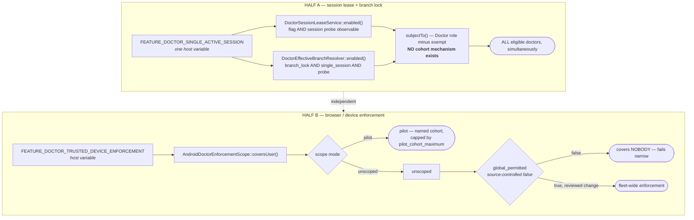
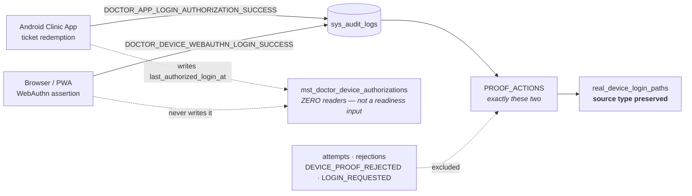

# DOCTOR-ACCESS-GLOBAL-ACTIVATION-BLOCKER-CLOSURE-1

**Parent:** DOCTOR-ACCESS-GLOBAL-ACTIVATION-1 (Phase 0 complete, activation DEFERRED)
**Type:** SECURITY_FIX · **Module:** DoctorAccess
**Base:** `feature/sprint-26-phase-26-8-stabilization-closure-go-watch-no-go-report`

**This sprint performed no activation.** `doctor.single_active_session` stays false,
`global_permitted` stays a source-controlled false, the browser enforcement cohort stays
as it was, and no lease, authorization, credential, home lock or cover was touched.

---

## Why the diagnosis came first

Three of the six blockers were stated wrongly in the brief, and one of them — B5 — asked
for an observability layer against a defect that does not exist. Every blocker was
therefore re-derived from deployed source before any code was written.

| Blocker | Stated | Established | Outcome |
|---|---|---|---|
| B1 | rollback evidence unproven | true; `global_prerequisites` read by **no** code | new suite that performs each rollback |
| B2 | 3 contradicting sites | **7 sites**; `postureCheck()` was not one of the real ones | phase declaration + `NOT_APPLICABLE` |
| B3 | checklist demands an impossible `authorizes_activation=true` | it demands no such thing — it reads the **recorded** line, not the **measured** one | one checklist step |
| B4 | §1.3/§2.2 unexecutable at UNSET=0 | true, plus a third sentence the brief missed | three runbook edits |
| B5 | readiness blind to WebAuthn | **already closed**; zero readers of the column blamed | regression pins, no runtime code |
| B6 | residual `GLOBAL_READY` | true — 2 leftovers, 2 rename-records to preserve | two prose lines |

---

## B2 — the gate that reddened on its own success

Seven sites assert fleet-wide enforcement is neither permitted, declared nor live. All are
correct for Phase 4A; all would FAIL on the state a Phase 5 exists to reach.

`android_release.enforcement.governance_phase` now declares which phase is being audited —
in the file that reads no environment, because a declaration a host could edit would not
audit the host values, it would just be a second copy of them agreeing with itself. Inside
`phase_4a` behaviour is byte-identical; the 106 existing scanner tests never moved.

Three properties the implementation holds:

1. **A skipped check is never a PASS.** `NOT_APPLICABLE` is a fourth status, counted
   separately, excluded from `passed`, still visible in the report.
2. **The halves that never stop mattering keep evaluating.** Armed-over-nobody FAILs in
   every phase; `global_enforcement_not_active` inverts at `global_activated` so a declared
   activation that failed to take is surfaced; the posture strength ceiling is untouched;
   a preflight's own containment is permanent.
3. **The prohibition is replaced by a precondition.** `global_prerequisites` — five strings
   no code read since Phase 3.5 — now gates on recorded attestations that **ship all false**.

An unrecognised phase resolves to `phase_4a`: a typo tightens the audit.

### Why the attestations ship false

An attestation is a signature, not a measurement. At least two are knowably untrue today:
no branch holds a spare tablet, and one RME branch holds none at all. Recording them now
would be recording something false — which is the failure mode the whole gate exists to
prevent.

---

## B5 — closed by design, pinned rather than rebuilt

`DoctorFleetReadinessRepository` reads the audit trail over both success actions. The
column the diagnosis blamed, `last_authorized_login_at`, has exactly one writer (Android
ticket redemption) and **zero readers**. Production reconciles exactly: the three doctors
with browser logins show combined Android+WebAuthn counts matching what the command printed.

The original diagnosis read a docblock that *rejects* that column as though it endorsed it.

What was genuinely missing was the pinning. Now: the whitelist is exactly two actions; a
doctor who has only ever used the browser reaches ready; the two paths stay distinguishable
rather than collapsing to a boolean; and the column can neither manufacture nor destroy a
proof. `DOCTOR_APP_LOGIN_DEVICE_PROOF_REJECTED` joins the exclusion dataset.

---

## B1 — rollback performed, not described

Rollback lived in two runbooks and no assertion. The new suite performs it: browser login
restored when the flag is disarmed; every device, authorization, credential, lease, lock,
cover and audit row intact across an arm/disarm cycle; branch lock dropping to ineffective
the moment single-session goes; and the config-cache roundtrip in both directions.

That last one matters most operationally: **production runs cached configuration and Laravel
skips the environment file entirely when cached**, so an activation *or* rollback that edits
the environment and stops there changes nothing.

The config-cache harness was **moved** to `tests/Pest.php`, not copied. Two harnesses can
disagree, and the one that disagrees quietly is the one a rollback would be trusted to.

---

## B3, B4, B6

- **B3** — the checklist step now reads the measured `GLOBAL_ENFORCEMENT_ACTIVE_LIVE` and
  says why not to read the recorded line beside it. `authorizes_activation` stays hardcoded
  false: the readiness engine does not authorise activation, and owner authorisation is
  external governance.
- **B4** — the branch-lock runbook now separates provisioning from verification. Its old
  precondition ("confirm every doctor is UNSET") is unexecutable at 0 unset and is replaced
  by a provenance check that works at any count. Its most dangerous sentence — "arming is
  inert and therefore NOT the risky step" — is now false twice over and is corrected:
  `branch_lock` narrows every locked doctor once the fleet is provisioned, and
  `single_active_session` was never lock-scoped at all.
- **B6** — two leftover `GLOBAL_READY` strings renamed; the two lines that *record* the
  rename preserved, along with all quoted historical production output.

---

## Parent programme state after this sprint

```
ACTIVATION_BLOCKER_CLOSURE_GO = YES
ESTATE_RESILIENCE_GO          = NO  (pending DOCTOR-ACCESS-TRUSTED-DEVICE-ESTATE-RESILIENCE-1)
GLOBAL_ACTIVATION_APPLY_AUTHORIZED = NO
SINGLE_SESSION_ACTIVATED      = NO
GLOBAL_ENFORCEMENT_ACTIVATED  = NO
```

Closing B1–B6 authorises nothing. The owner's decision stands:
**PROVISION_ESTATE_SPARE_CAPACITY_FIRST.**

Durable rules: `.cursor/rules/157-doctor-access-governance-phase.mdc`.

---

## The two activation domains, and why they are not one switch

No magnitudes here, so this is a diagram rather than a chart. The thing worth seeing is
that the two halves have **opposite shapes**: one is a single host variable that applies to
everybody at once, the other is structurally capped and needs a reviewed source change.



**Half A has no staged rollout.** Arming it is fleet-wide the moment the config cache is
rebuilt. Half B cannot reach fleet-wide from a host at all: the cohort is capped, and
`global_permitted` is not reachable from the environment.

### Proof sources stay distinct

Both paths prove a doctor reached a clinical session. They are **not** interchangeable
evidence, and the readiness engine keeps them separable rather than collapsing them.



An Android proof is **not** evidence the browser path works for that doctor, and vice
versa. Merging them into one boolean would erase the distinction an activation depends on.

### Rollback

| Domain | Rollback | Data effect |
|---|---|---|
| Half A | set the flag false **+ rebuild config cache** | none — lease/lock/cover rows all survive; re-arming needs no cleanup |
| Half B | restore the captured cohort **+ rebuild config cache** | none — devices, authorizations, credentials untouched |
| Branch lock | falls to ineffective automatically with Half A | none |

An environment edit **alone** rolls nothing back: production runs cached configuration, and
Laravel skips the environment file entirely when it is cached.

---

## Declared scope deviation — the Android SDK gate

Owner-approved 2026-09-15, and recorded rather than folded in quietly.

`Phase 3 Android Clinic App Gate` began failing in its **Set up Android SDK** step —
`Failed to find package 'tools'`, `sdkmanager` exit 1 — before gradle ran and before any
repository code was compiled. The action's default `packages` is `tools platform-tools`,
and the legacy `tools` package has been withdrawn from the Android SDK repository.

**It was not caused by this sprint, and that is provable rather than argued:**

| | last green run | first red run |
|---|---|---|
| when | 2026-09-14T13:12Z | 2026-09-14T23:38Z |
| workflow file SHA256 | `e822337f…` | `e822337f…` |
| `android/` tree object | `e3dea1fb…` | `e3dea1fb…` |

Same workflow, same action, same Android source. The only variable is wall-clock time.

The fix is one input — `packages: platform-tools`, the half of the default that still
exists — so no toolchain version is decided here and no gate is weakened; build-tools and
platforms continue to be resolved by the Android Gradle Plugin from the pinned versions in
`android/daengtisia-clinic`.

It is carried in this PR because a gate that is red for an external reason blocks **every**
PR in the repository, not only the one that happened to notice. The alternative considered
was a separate CI sprint; the owner chose to unblock the repository now.
