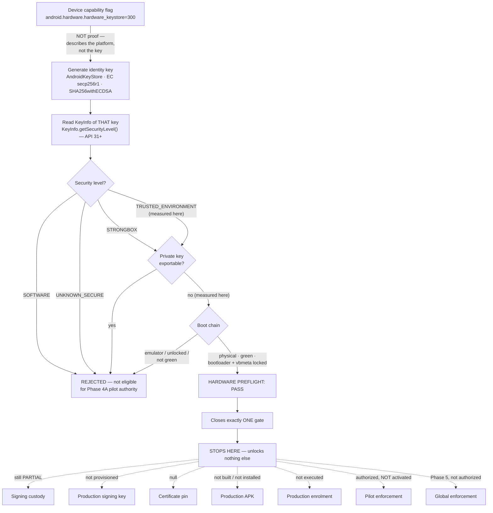

# EVIDENCE-PHASE4A-REAL-DEVICE-KEYINFO-PREFLIGHT-1

**Status: GO — real-device hardware preflight PASSED.**
**Phase 4A is NOT complete. Nothing was activated, signed, installed or enrolled.**

Programme: `FEATURE-DOCTOR-TRUSTED-ANDROID-DEVICE-LOCK-1`
Authority this builds on: `REVISION-ANDROID-RELEASE-READINESS-PHASE4A-PILOT-AUTHORITY-1`
(GO tag `revision-android-release-readiness-phase4a-pilot-authority-1-go`).

---

## What this record is

The Phase 4A pilot depends on a claim that had never actually been measured on
the pilot hardware: that the device identity key the Clinic App generates lives
in secure hardware and cannot be exported.

That claim was **assumed** through Phases 1–3.5. `DeviceIdentityManager` asks
`AndroidKeyStore` for the key and requests StrongBox opportunistically, and the
Phase 3 instrumentation suite proves the *protocol* works — but neither of them
asks the keystore where the key it just issued actually went.

This record closes that one gate on real hardware, and closes nothing else.

---

## The distinction that matters

> **A device capability flag is not proof that a key is hardware-backed.**

`android.hardware.hardware_keystore` is a property of the *platform*. It says
the device declares a hardware keystore. It does not say that the key **this
app generated** was issued there. A keystore can fall back to software for a
particular key — an algorithm it does not support in hardware, a spec it
refuses, a StrongBox request on hardware that has none — and the capability
flag reads exactly the same either way.

Reading the flag and concluding "hardware-backed" is reading the brochure and
concluding the car started.

The authoritative proof is a property of the **generated key**:

| | Source | What it actually tells you |
|---|---|---|
| ❌ Not sufficient | `PackageManager.hasSystemFeature("android.hardware.hardware_keystore")` | The platform declares the capability |
| ❌ Not sufficient | `KeyInfo.isInsideSecureHardware()` | Deprecated; pre-API-31 compatibility path only |
| ✅ Authoritative | `KeyInfo.getSecurityLevel()` (API 31+) | Where **that specific private key** lives |

**Accepted for Phase 4A:** `TRUSTED_ENVIRONMENT`, `STRONGBOX`.
**Rejected:** `SOFTWARE`, `UNKNOWN_SECURE` — an unattested claim is not a
measurement.

This is encoded in `config/android_release.real_device_preflight` and enforced
by three gate checks in `AndroidReleaseGovernanceScanner`, so a future
downgrade to `SOFTWARE` fails `php artisan android:release-readiness` rather
than passing quietly.

---

## The gate, and where it stops



The dotted edges are the point of the diagram. A hardware gate closing is the
moment it is most tempting to read the rest as consent, so each of those seven
is asserted false by `preflight_unlocks_nothing` rather than left to inference.

---

## Device under test

Referred to throughout by its logical label. **The ADB / USB serial is
deliberately not recorded anywhere in this repository** — governance needs the
class of device, never the instance a person carries in a bag.

| Field | Value |
|---|---|
| Logical label | `PHASE4A_PILOT_TABLET_01` |
| Manufacturer | samsung |
| Model | SM-X236B |
| Product | gta11pxx |
| Android version | 16 |
| API level | 36 |
| Security patch | 2026-07-05 |

### Boot and lock state

| Property | Observed | Meaning |
|---|---|---|
| `ro.boot.verifiedbootstate` | `green` | Verified Boot intact, OS signed by the OEM |
| `ro.boot.flash.locked` | `1` | Bootloader locked |
| `ro.boot.vbmeta.device_state` | `locked` | vbmeta locked |
| `ro.kernel.qemu` | `0` | Physical device — **not an emulator** |

The keystore's guarantee is only worth what the boot chain carrying it is
worth. A device that can be re-imaged under the app is a device whose keystore
answer can be replaced.

### Keystore capabilities (context, **not** the proof)

| Feature | Present |
|---|---|
| `android.hardware.hardware_keystore` | `300` |
| `android.hardware.keystore.app_attest_key` | yes |
| StrongBox | **absent** |

StrongBox absence is **not a failure**. `DeviceIdentityManager.ensureIdentity()`
requests StrongBox inside `runCatching` and falls back to the TEE via
`recoverCatching`. StrongBox is preferred, never mandated
(`android_release.device_specification.strongbox_mandatory => false`), because
mandating a separate secure element would refuse most acceptable clinic
hardware for a marginal gain.

Storage (~53 GB free of ~104 GB) and memory (~2.11 GiB available of ~5.24 GiB)
were observed and are **informational only** — they are not permanent minimum
requirements. The binding minimums live in
`android_release.device_specification.minimum`.

---

## Evidence 1 — the existing protocol suite, on real hardware

`android/daengtisia-clinic/app/src/androidTest/java/com/daengtisia/clinic/DeviceIdentityInstrumentedTest.kt`

Run targeted on the tablet:

```
./gradlew :app:connectedDebugAndroidTest \
  -Pandroid.testInstrumentationRunnerArguments.class=com.daengtisia.clinic.DeviceIdentityInstrumentedTest \
  --no-daemon --stacktrace
```

```
Starting 7 tests on SM-X236B - 16
Finished 7 tests on SM-X236B - 16
BUILD SUCCESSFUL
```

**7 run / 0 failed / PASS.** The suite exercises identity creation through
`AndroidKeyStore`, identity existence, public-key export, the server-compatible
SHA-256 fingerprint, idempotence (an approved key is never rotated), ECDSA
signature verification exactly as the server will perform it, rejection of a
signature over a different nonce, identity destruction, and a second alias
producing an independent identity.

**What it does not prove:** where the key lives. Every one of those assertions
would also pass against a software-backed key. This suite is necessary and it
is not sufficient, and it was never claimed to be.

---

## Evidence 2 — the actual `KeyInfo` measurement

A **temporary instrumentation probe** was added in an isolated inspection
worktree, run once, and reverted. It obtained a `KeyInfo` for the private key
that `DeviceIdentityManager` had just generated and read it directly.

```
Starting 1 tests on SM-X236B - 16
Finished 1 tests on SM-X236B - 16
BUILD SUCCESSFUL
```

**1 run / 0 failed / PASS**, reporting:

```
securityLevel        = TRUSTED_ENVIRONMENT
privateKeyExportable = false
```

Therefore, proven on real hardware:

- `KEY_SECURITY_LEVEL = TRUSTED_ENVIRONMENT`
- `HARDWARE_BACKED_PRIVATE_KEY = true`
- `PRIVATE_KEY_EXPORTABLE = false`
- `STRONGBOX_BACKED = false`

This is strictly stronger than observing `hardware_keystore=300`: it is a
statement about the key the enrolment protocol will actually use.

### The deprecation warning

Compilation of the temporary probe emitted `isInsideSecureHardware is
deprecated`. This is **not a Phase 4A finding**. On API 36 the active path was
`KeyInfo.securityLevel`; the deprecated call existed only as the probe's
backward-compatibility branch for older Android releases. The shipped
`DeviceIdentityManager` calls neither API — verified: no `KeyInfo`,
`securityLevel` or `isInsideSecureHardware` reference exists in the committed
Android source.

---

## Private-key non-exportability

`privateKeyExportable = false` is the second half of the gate and it is
load-bearing on its own. A key that can leave the device is not a device
identity — it is a credential that can be copied onto a second tablet, and the
whole trusted-device model reduces to a shared secret.

The scanner therefore refuses an accepted security level accompanied by an
exportable key: `key_security_level_accepted` requires **both**.

Structurally this is already how the key is generated —
`KeyGenParameterSpec.Builder(keyAlias, PURPOSE_SIGN)` over `secp256r1` with
`DIGEST_SHA256` in `AndroidKeyStore`, signed `SHA256withECDSA`. The private key
is never materialised in app memory; only the DER X.509 `SubjectPublicKeyInfo`
is exported. The measurement confirms the platform honoured that.

---

## Cleanup — what the probe left behind

| Item | State |
|---|---|
| Temporary `KeyInfo` probe committed | **no** — restored via git, never staged |
| Inspection worktree after restore | `git status --short` clean |
| Daengtisia debug/production package on device | none listed |
| Test instrumentation registered on device | none listed |
| Test key alias | destroyed by the suite's own `@After` |
| Logcat test buffer | cleared |

The probe reused the existing test fixture, whose `@Before` **and** `@After`
both call `identity.clearIdentity()`. Its alias is
`daengtisiams_instrumented_test_key` (and `..._second` for the second-install
case, cleared in a `finally`).

**That alias is not the production identity.** The production alias is
`DeviceIdentityManager.DEFAULT_ALIAS = "daengtisiams_device_identity_v1"`, and
it was never generated. No production device identity exists. No enrolment
occurred. No `DoctorDevice` or `DoctorDeviceAuthorization` row was created.

Only the test logcat buffer was cleared. **No claim is made that system logs
were destroyed** — they were not.

---

## What this evidence PROVES

- The pilot tablet is a physical device, not an emulator.
- Verified Boot is `green`; bootloader and vbmeta are locked.
- The device exposes a hardware keystore and app-attest-key capability.
- The full enrolment protocol works on real hardware: **7/7 PASS**.
- The key `DeviceIdentityManager` generates is issued at
  `TRUSTED_ENVIRONMENT` — measured, not inferred: **1/1 PASS**.
- That private key is **non-exportable**.

## What this evidence does NOT prove

- ❌ Signing custody is complete — it is **PARTIAL**.
- ❌ A production signing key exists — **none is provisioned**.
- ❌ A certificate fingerprint is pinned — `production_certificate_sha256` is `null`.
- ❌ A production APK was built, verified or installed — none of the three.
- ❌ A production device identity or enrolment exists — neither does.
- ❌ The pilot is active — `pilot_activated => false`, `current_stage => off`.
- ❌ Doctor browser login is denied — it is not, for anyone.
- ❌ Phase 4A is complete — it is not.
- ❌ The feature is complete — `FULL FEATURE = NO-GO`.

It also does **not** mean tamper-proof, unhackable, or immune to extraction
under every threat model. `TRUSTED_ENVIRONMENT` means the Android Keystore
reports the key is protected by the device's trusted execution environment.
A TEE is not a discrete secure element, and it is **not** StrongBox.

---

## Pilot vs global — unchanged

| | Scope | May first be enabled | State now |
|---|---|---|---|
| Pilot | one named doctor, one named branch | Phase **4A** | authorized, **not activated** |
| Global | every account holding the Doctor role | Phase **5** | not authorized |

- `PILOT_DOCTOR` = drg Karmila
- `PILOT_BRANCH` = Cabang Sunu
- `ROLLBACK_OWNER` = Custodian 1 / Raushan Fikri Ridha / IT
- `PILOT_ALLOWED_IN_PHASE4A = true`
- `PILOT_ENFORCEMENT_ACTIVE = false`
- `GLOBAL_ENFORCEMENT_ACTIVE = false`
- `DOCTOR_BROWSER_LOGIN_DENIED = false`
- `CURRENT_STAGE = off`

Non-pilot doctors are unaffected. Global enforcement remains prohibited before
Phase 5. This record changes none of it.

---

## Signing custody — unchanged, still PARTIAL

| Control | State |
|---|---|
| Custodian 1 | Raushan Fikri Ridha — IT / Production Signing Operator |
| Signing workstation | PC utama IT DaengtisiaMS, Ubuntu, Cabang Pusat; restricted to Custodian 1 / IT; disk encryption active; login password and screen lock mandatory |
| Custodian 2 | **DEFERRED by owner** |
| Offsite backup | **DEFERRED by owner** |
| Custodian 3 | **DEFERRED by owner** |
| Sealed cold backup | **DEFERRED by owner** |
| Production signing key | **NOT PROVISIONED** |
| Production certificate pin | **NOT PROVISIONED** (`null`) |

A hardware gate closing does not open a custody gate. These are independent,
and the deferred controls remain deferred by owner decision — they are not
requested, invented or marked complete here.

---

## Historical truth preserved

| Record | Status |
|---|---|
| Phase 4 | **BLOCKED / NO-GO** (historical) |
| Previous Phase 4A attempt | **BLOCKED / NO-GO** (historical) — blocked on signing custody |
| This record | a **later** real-device preflight gate PASS |

`docs/sprints/feature-doctor-trusted-android-device-lock-1-phase-4-blocked.md`
and `...-phase-4a-blocked.md` are unchanged. This does not rewrite them, and
does not turn either into a GO.

---

## Machine enforcement

`php artisan android:release-readiness` now emits three additional checks:

| Check | Refuses |
|---|---|
| `real_device_preflight_baseline` | an emulator, an unlocked bootloader/vbmeta, a non-green boot state, or a missing device label |
| `key_security_level_accepted` | `SOFTWARE`/`UNKNOWN_SECURE`, an exportable key, a capability flag offered as proof, or an absent measurement |
| `preflight_unlocks_nothing` | a preflight pass read as unlocking signing, pinning, enrolment or enforcement |

and prints `ANDROID_REAL_DEVICE_HARDWARE_PREFLIGHT` directly beneath
`ANDROID_REAL_DEVICE_VALIDATION`, because those two lines are the ones most
likely to be confused. They are different gates:

- `ANDROID_REAL_DEVICE_VALIDATION=false` — the Phase 4 pilot (signed release
  installed, device enrolled, pilot run) has **not** happened.
- `ANDROID_REAL_DEVICE_HARDWARE_PREFLIGHT=PASS` — the key measurement has.

---

## Remaining Phase 4A gates (reported, not executed)

1. Owner reopens the deferred signing-custody controls
2. Production signing custody reaches applicable policy
3. Production signing key provisioning
4. Backup / recovery verification
5. Production certificate fingerprint pin
6. Production release APK build
7. APK manifest / hash / signer verification
8. Controlled tablet install
9. Production device identity generation
10. Production enrolment
11. Auto-PENDING authorization
12. Approval by authorized role
13. Pilot-scoped enforcement activation
14. Browser denial for the pilot doctor
15. drg Karmila login UAT
16. Cabang Sunu branch lock UAT
17. Room isolation UAT
18. RME / RM / Odontogram no-print UAT
19. Session / device binding UAT
20. Revoke / disable UAT
21. Same-signer update-in-place
22. Rollback verification

---

## Files

- `config/android_release.php` — `real_device_preflight` (rule + recorded evidence + explicit `unlocks` negatives)
- `app/Support/Android/AndroidReleaseGovernanceScanner.php` — `realDevicePreflightChecks()`, `preflightPassed()`
- `app/Console/Commands/AndroidReleaseReadinessCommand.php` — preflight summary line
- `tests/Feature/DoctorDevice/DoctorDeviceAndroidRealDevicePreflightTest.php`
- `.cursor/rules/144-android-real-device-keyinfo-preflight.mdc`
- `docs/runbooks/android-clinic-device-provisioning.md` — preflight procedure
