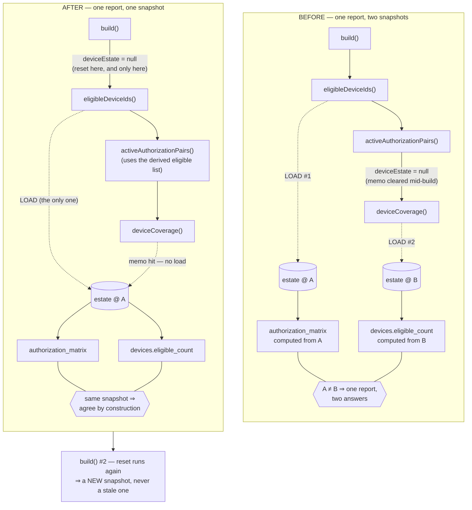

# FIX-READINESS-ESTATE-SNAPSHOT-INTEGRITY

One runtime integrity defect in `DoctorFleetReadinessService`, plus the stale
numeric evidence and the one registry line that an adversarial re-read of the
programme's own state block turned up.

**This sprint does not start Wave 5, does not authorize global activation, does
not move the browser enforcement scope and does not change a single feature
flag.** Fleet readiness stays `PARTIAL` at 9 of 15.

---

## 1. The defect

`DoctorFleetReadinessService` memoises the device estate because three separate
gates need it:

| consumer | what it decides |
|---|---|
| `eligibleDeviceIds()` | which tablets the authorization matrix targets |
| `activeAuthorizationPairs()` | drops a grant naming an ineligible device |
| `deviceCoverage()` | the estate table and the unproven-device finding |

The memo was cleared **inside `activeAuthorizationPairs()`** — which runs
*between* the first and the third. So one report loaded the estate twice:

```
build()
  ├─ eligibleDeviceIds()          → LOAD #1  (snapshot A)
  ├─ activeAuthorizationPairs()   → $this->deviceEstate = null
  └─ deviceCoverage()             → LOAD #2  (snapshot B)
```

A single readiness report could therefore compute its authorization matrix
against one moment and its coverage table against another: a complete 15×3
matrix printed beside a coverage table listing four eligible tablets. Two
answers to one question, in the report an activation sprint is meant to read.

The reset's *intent* was right — a second `build()` on one instance must not
serve a stale estate. Only its placement was wrong.

### The flow, before and after

Identity here is carried by position and label, never by colour alone.



The memo is **per build, not per service**. Caching it for the service lifetime
would also make the mixed-snapshot probe pass, and would be the worse bug: a
long-lived process would report the hardware it saw first, for as long as it
lives. Both halves are asserted (FR-R30, FR-R31).

### Why nothing caught it

`DoctorFleetReadinessNonMutationTest` measures the query budget two ways and
neither can see a duplicate read:

- **Constancy** (`$large === $small`) — a second estate read is a CONSTANT, so
  it moves both measurements together.
- **Ceiling** (`<= 24`) — one extra query fits inside headroom that exists on
  purpose.

Its comment nevertheless said the sprint added *"ONE memoised estate read"*.
That was the property everybody believed was pinned, and nothing asserted it.

## 2. The fix

Move the memo reset to the top of `build()`. One line moved; the control flow
around it is unchanged.

```php
public function build(): array
{
    $this->deviceEstate = null;   // ONE BUILD, ONE ESTATE SNAPSHOT
    ...
}
```

`duplicateActivePairs = 0` **stays** in `activeAuthorizationPairs()`. It is
correct where it is — it resets immediately before the loop that accumulates it
— and moving it would make that method depend on being called only from
`build()`.

## 3. The regression suite

New: `tests/Feature/DoctorAccess/DoctorFleetReadinessEstateSnapshotTest.php` (8).

It counts **loads, at the loader**, through a spy that implements
`DoctorDeviceRolloutReadinessRepositoryInterface` and can replay a scripted
sequence of snapshots. The spy is **injected into the service under test**, not
bound in the container: `DoctorGlobalRolloutReadinessService`, which this engine
composes, calls `deviceEstate()` twice itself with no memo, so a container-wide
bind would count four loads and "exactly one" would be unassertable.

| # | property |
|---|---|
| 1 | one build loads the estate exactly once |
| 2 | every consumer in one build is served from that load |
| 3 | **mixed-snapshot probe** — scripted A→B, the report is internally consistent |
| 4 | a second build reloads, and reflects hardware that changed in between |
| 5 | the duplicate-pair tally stays per-report; the DB keeps it at zero |
| 6 | a proof on a tablet ineligible in that snapshot still disqualifies |
| 7 | the matrix still counts against the whole eligible estate |
| 8 | two builds write nothing |

The mixed-snapshot probe is deterministic — the script is indexed by call
number, never by timing — so a regression fails on every run, on every machine.

### Mutation results

Every mutation killed; `ACTIONABLE_MUTATION_SURVIVORS=0`. Reverted by file copy
between runs, and each run refuses to score a kill unless the file actually
differs from pristine (a NOT-APPLIED mutation is not a kill).

| mutation | outcome |
|---|---|
| **the exact shipped defect** (no build reset + mid-build reset) | 8 failed — killed |
| re-introduce the mid-build reset only | 8 failed — killed |
| remove the build-level reset (memo never cleared) | 3 failed — killed |
| proof no longer scoped to still-usable hardware | 4 failed — killed |
| revoked + unverified tablets counted eligible | 6 failed — killed |
| `login_not_proven` blocker suppressed | 11 failed — killed |
| report mutates state while building | 8 failed — killed |

## 4. Evidence corrections

### 4.1 The proof-count example was backwards, not just stale

Measured read-only against the pilot database on **2026-09-13 (WITA)**, using
the repository's own predicate (`action IN (PROOF_ACTIONS) AND performed_by = 18`,
device from `new_values->>'doctor_device_id'`):

| device | proof rows | device state | authorization |
|---|---|---|---|
| 3 | **13** | active, cryptographically verified | ACTIVE |
| 6 | 6 | active, cryptographically verified | ACTIVE |
| 1 | **4** | **revoked** | revoked |
| | **23 total** | | |

The source comment, rule FR-R8 and CLAUDE.md all said *"user 18 holds thirteen
success rows naming device 1, which is revoked."* Both halves are wrong: the
thirteen are on device **3**, the tablet that still qualifies, and device 1
carries **4**.

It is worse than a stale number. The example was offered as proof that a
revoked-tablet login must not count — while naming the count that legitimately
*does* count. It argued against the rule it illustrated.

**The gate itself was, and is, correct.** `qualifying = proven ∩ authorized`
gives `{1,3,6} ∩ {3,5,6} = {3,6}`, user 18 stays READY, and 4 rows are properly
discarded. Only the supporting evidence was corrected — no gate was weakened.

Corrected in four places: the service comment, `DoctorFleetReadinessTest`, rule
`156` FR-R8, and CLAUDE.md — each now dated and labelled a snapshot, and the
service comment states the correction rather than quietly overwriting it.

### 4.2 A second false premise, found by writing a test against it

The `duplicateActivePairs` doc said *"A unique index does not exist for this
pair, so a duplicate is representable."* It does exist:
`mst_dd_authorizations_pair_unique` is a **full** unique on
`(doctor_id, doctor_device_id)`. The test that tried to seed a duplicate was
rejected by the database.

The counter is kept — as defence in depth, and because a tally that only matters
once an index is dropped is exactly the tally worth keeping — but the comment
now says what actually holds the line, and the test asserts the **rejection**
rather than an index name, so it stays portable across PostgreSQL and SQLite.

### 4.3 Branch code registry

The premise that the registry was stale is **mostly not true**, and this is
recorded rather than papered over:

- `BranchCodeAlias::TELKOMAS_CANONICAL = 'TLK1'`, `SUNU_CANONICAL = 'SPN4'` —
  the code authority is correct.
- Dedicated rules `92-telkomas-branch-code-canonical` and
  `136-sunu-branch-code-canonical` exist and are correct.
- CLAUDE.md's registry sentence already carried both `[SUPERSEDED]` annotations.

One real residual: rule `73`'s registry **list** still asserted
`**SUN4 = Cabang Sunu**`, retracted only by a footnote below it — while the
Telkomas entry in the *same list* had been fixed inline. That shape is how a
reader quotes the wrong code. Both the rule-73 list and the CLAUDE.md sentence
now name `TLK1` and `SPN4` directly, with the deprecated codes named as
historical aliases.

Historical records — sprint names (`RME-BRANCH-SUN4`), migration descriptions,
issued room codes (`TKM-A`), and the immutable incident id
`ROUTINE-20260819-TKM1-01` — are **deliberately left as written**.

## 5. Rules added

`FR-R30`..`FR-R38` in `.cursor/rules/156-doctor-fleet-rollout-readiness.mdc`,
and `FR-R29` refined so the ceremony invariant is the *equality* rather than a
hardcoded cohort literal.

| rule | in one line |
|---|---|
| FR-R30 | one readiness report, one device-estate snapshot |
| FR-R31 | that memo is scoped to one build, never to the service |
| FR-R32 | a query budget cannot pin "exactly one read", and must not claim to |
| FR-R33 | a configuration flag is not enforcement — report FLAG and EFFECTIVE |
| FR-R34 | the browser enforcement scope is mutable host config, not a constant |
| FR-R35 | a broken measurement fails loudly; it is never a green tick |
| FR-R36 | `sys_audit_logs.entity_id` is not a doctor id |
| FR-R37 | every production figure is measured, dated, and labelled a snapshot |
| FR-R38 | timestamps carry their timezone (WITA, UTC+08:00) |

## 6. State, reported without collapsing it

Read from the deployed host, not from memory.

```
LOCKED_DOCTORS=15            UNSET_DOCTORS=0
AUTHORIZATION_TARGET=45      ACTIVE=45   MISSING=0   DUPLICATE_ACTIVE=0
REAL_DEVICE_READY=9/15
READY_USERS=[9,12,14,15,18,19,20,21,28]
REMAINING_USERS=[22,23,24,25,26,27]

BRANCH_LOCK_FLAG=true        SINGLE_ACTIVE_SESSION=false
BRANCH_LOCK_EFFECTIVE=false  ← the resolver needs BOTH; it is INERT

CURRENT_BROWSER_ENFORCEMENT_SCOPE=[9,15,18]   ← host config, read now
SCOPED_BROWSER_DEVICE_ENFORCEMENT_ACTIVE=YES
GLOBAL_FLEET_ENFORCEMENT_ACTIVE=NO
GLOBAL_PERMITTED=false       GLOBAL_ACTIVATION_AUTHORIZED=NO
```

Scoped enforcement is genuinely live for three doctors. "Global enforcement is
off" must never be read as "no enforcement exists" (FR-R34).

## 7. What this sprint did not prove

That the double read ever produced a wrong number **on production**. The pilot
estate was stable between the two loads, so the defect is latent there — the
matrix (45/45 against 3 eligible tablets) and the coverage table agree today.
Latent is not harmless: the window is real, and it widens exactly when the
estate is being changed, which is when a readiness report gets read.

---

**WAVE_5_AUTHORIZED=NO · FLEET_READINESS_GO=NO · GLOBAL_ACTIVATION_AUTHORIZED=NO**

The campaign stays `PARTIAL` until the remaining six physical ceremonies are
completed and the parent's own Full Suite obligation is met.
