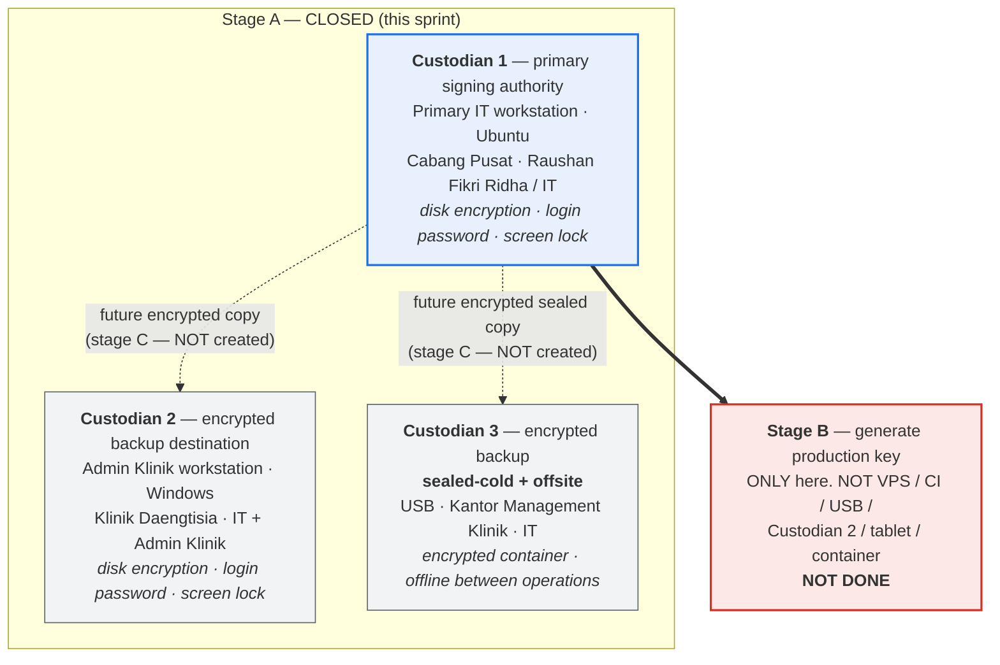

# PRODUCTION-ANDROID-SIGNING-CUSTODY-READINESS-1

**Formalise production Android signing custody so that a later, separate task
is permitted to create the first DaengtisiaMS production signing identity.**

Programme: FEATURE-DOCTOR-TRUSTED-ANDROID-DEVICE-LOCK-1.
Base: `evidence-phase4a-real-device-keyinfo-preflight-1-go` @ `3ddbea0d`.
Authority: [signing governance](../governance/android-production-signing-governance.md) ·
[ADR 0010](../adr/0010-android-direct-apk-signing-and-distribution.md) ·
rule `145-android-production-signing-custody-readiness`.

---

## 1. What this is, in one paragraph

The signing *policy* — three copies, all encrypted, one offsite, one sealed
cold, never in git, never on the VPS — has been recorded since Phase 3.5. What
did not exist was **anyone named to hold them**. The preceding record said so
plainly: custody `PARTIAL`, with Custodian 2, Custodian 3, the offsite copy and
the sealed-cold copy deferred by explicit owner decision. This sprint records
the owner's designation, so that key provisioning has somewhere lawful to put
the key the moment it is created.

**No key was created. No backup was written. Nothing was activated.**

---

## 2. The designation

The dotted arrows are **future** copies. They do not exist. That is the single
most important thing this document says.

| # | Role | Medium | Location | Responsible |
|---|---|---|---|---|
| 1 | primary signing authority | primary IT workstation, Ubuntu | Cabang Pusat | Raushan Fikri Ridha / IT |
| 2 | encrypted backup destination | Admin Klinik workstation, Windows | Klinik Daengtisia | IT + Admin Klinik |
| 3 | encrypted backup, sealed-cold, offsite | USB | Kantor Management Klinik | IT |

---

## 3. Ready is not created

This is the distinction the whole sprint exists to make structurally
impossible to lose.

| Recorded as **true** | Recorded as **false** |
|---|---|
| `primary_signing_workstation_ready` | `production_signing_key_provisioned` |
| `backup_destination_1_ready` | `backup_1_key_copy_created` |
| `sealed_cold_destination_ready` | `backup_2_key_copy_created` |
| `offsite_destination_ready` | `sealed_cold_backup_created` |
| `status = ready_for_provisioning` | `offsite_backup_created` |
| | `recovery_verified` |
| | `production_certificate_sha256` (null) |

A destination being **ready** means a place is prepared to receive a copy. A
backup being **created** means a copy exists. Every `*_ready` flag is paired
with a `*_created` flag that is false, in the same config block, so the two
cannot be read as one statement.

`custody_state_machine_consistent` enforces the ordering: a backup may not be
claimed before a key exists, a verified recovery may not be claimed before a
backup exists, and a provisioned key may not be claimed while no certificate
fingerprint is recorded. `custody_readiness_does_not_claim_provisioning`
enforces the pairing: while the status is `ready_for_provisioning`, every one
of those downstream facts must be false.

---

## 4. Two exceptions, recorded rather than smoothed over

The governance doc's own instruction is to *record the exception rather than
pretend it is not one*. There are two, and both are owner-accepted.

**One party can reach every copy.** IT is responsible for Custodian 1 and
Custodian 3 and holds access to Custodian 2. "Three custodians" in the
governance table meant three *independent holders*, so that compromising one
person could not reach every copy. Three *media* under substantially one party
is a weaker claim, and calling it "three custodians" without saying so would be
the kind of quiet overstatement this programme keeps catching. Recorded as
`single_party_can_reach_all_copies = true` with compensating controls, and a
second independent human custodian is an open item before `operational`.

**Sealed-cold and offsite sit on one medium.** The table expected the offsite
copy on the recovery custodian and the sealed copy on the cold custodian; the
owner assigned both to Custodian 3. Three copies across three sites still
satisfy the policy, and any single-site loss still leaves two copies — but
losing Kantor Management Klinik leaves no sealed copy, and the two survivors
are both workstation disks, which is precisely the population a sealed offline
copy exists to survive. The 90-day restore drill and re-sealing after any
opening are the compensating controls.

---

## 5. What changed

| File | Change |
|---|---|
| `config/android_release.php` | new `signing.custody` block: designation, lifecycle states, negative facts, media rules, generation-host lists, shared-access declaration |
| `app/Support/Android/AndroidReleaseGovernanceScanner.php` | new `signingCustodyChecks()` (13 checks), `custodySecretLeaks()`, `custodyReadyForProvisioning()`, four summary lines |
| `tests/.../DoctorDeviceAndroidSigningCustodyReadinessTest.php` | 44 tests — designation, the ready/created separation, and 22 adversarial mutations |
| `docs/governance/android-production-signing-governance.md` | §2.1 designation, §2.2 the two recorded exceptions |
| `docs/runbooks/android-signing-key-backup-and-recovery.md` | §0 stage gates A–G, named destinations, stage-C checklist |
| `.cursor/rules/145-...` | durable rule |

`android:release-readiness` went from **27/27 GO** to **40/40 GO**, with
`production_signing_key_provisioned` still false.

One deliberate behaviour change: the summary line
`production_signing_key_provisioned` was a hardcoded `false`. It now reads the
recorded custody fact. A literal would keep printing "no key" forever —
including after a key genuinely exists, which is the same lie pointing the
other way. Reading the fact and failing `custody_state_machine_consistent` when
it contradicts the certificate pin is what keeps it honest in both directions.

---

## 6. Adversarial validation

22 config mutations, each asserting the gate goes red: primary authority
removed; disk encryption, screen lock and login password off; offsite and
sealed-cold roles dropped; plaintext material permitted; password stored with
the key; key provisioning claimed without a certificate; a backup claimed
before a key; recovery claimed before a backup; an unknown custody state; the
VPS, Custodian 2 and the USB each promoted to key-generation authority; fewer
destinations than the minimum; shared access undeclared and declared without
controls; a serial and a passphrase planted in the block.

Eight **real code mutants** were applied to the scanner. Seven were killed on
the first pass; the file was restored by copy and verified byte-identical by
checksum after each. **Final survivors: 0.**

### What independent security review found

Review returned **CRITICAL: 0, HIGH: 0** and confirmed no path to a green scan
that claims a key exists, no activation, and no secret in the diff. It also
found three MEDIUM defects pointing the *other* way — checks that verified a
self-declared value against another self-declared value and then printed a PASS
message asserting a specific fact they had never checked. All are fixed:

| Finding | The hole | Fix |
|---|---|---|
| **M1** | Key generation read the permitted *and* forbidden media from the same config block being edited. Setting `custodian_1.media = 'production_vps'` and `permitted = ['production_vps']` in one edit produced PASS — while printing *"VPS, CI, backup destinations, USB and the clinic device are all excluded"*. Every clause was false. | The allowlist and the must-forbid list are now constants the scanner owns. Config may forbid more, never less, and may not widen past the allowlist. |
| **M2** | The concentration caveat was self-declared. Setting `single_party_can_reach_all_copies => false` cost nothing and required no controls, while `authorized_access` three lines away showed IT on every destination. | Now **derived** from the intersection of every custodian's `authorized_access`. Denying a concentration the data proves is a FAIL, and a destination that records no access list fails too. |
| **M3** | The secret detector was a leaf-key denylist plus one anchored hex regex. A USB serial, a filesystem UUID, a private street address, a phone number and a colon-separated fingerprint all passed — under a message claiming none of them could. | Custodian entries are confined to a **field allowlist**, plus value-shape detection for hex runs, separator-bearing hex, UUIDs, phone numbers, emails, base64 blobs and street-level address vocabulary. The PASS message now states what was actually checked. |

Three LOW findings were also closed: a second primary signing authority hidden
in the plural `roles[]` field (check 4 read only the singular `role`);
`count()` counting array entries so `'custodian_4' => []` satisfied the
minimum; and check 12 printing *"those remain false"* for any status past
readiness, including an `operational` record where all of them were true.

### Two defects found in the tests themselves

Neither was worked around.

The first secret scan swept the encoded block for the substring `passphrase`
and failed on the compensating control legitimately named
`passphrase_held_separately_from_every_medium`. Renaming the control to satisfy
the test would have been evasion; the test was rewritten to match leaf keys and
value shapes as the scanner does.

Then mutation testing caught the **allowlist test proving nothing**: disabling
`custodianUnknownFields()` entirely still passed, because the fields it probed
(`device_id`, `unlock_hint`) are *also* on the key denylist. A test using field
names on neither list (`cabinet_number`, `notes`) now kills that mutant — which
is the entire point of an allowlist, since the leak you have to survive is the
one nobody named in advance.

### Accepted limitation

The scanner never observes a filesystem. A key that existed on disk with the
config flag left `false` and no certificate pinned would be undetectable here.
This gate proves the *record* is internally consistent and not silently
downgraded; it cannot prove the absence of a key. Stage B's runbook procedure
is what establishes that.

---

## 7. What this GO authorises, and what it does not

**Authorises:** beginning `PRODUCTION-ANDROID-SIGNING-KEY-PROVISIONING-1` — a
separate, authorised task — on Custodian 1.

**Does not authorise:** generating any key here, creating any backup copy,
pinning a certificate, building or signing an APK, touching the tablet,
enrolling a device, or activating the pilot or global enforcement. No separate
key-generation consent is implied by this record.

**Stage gates B–G remain open.** Stage B without stages C and D is worse than
not starting: it creates something irreplaceable and leaves it in one place.
