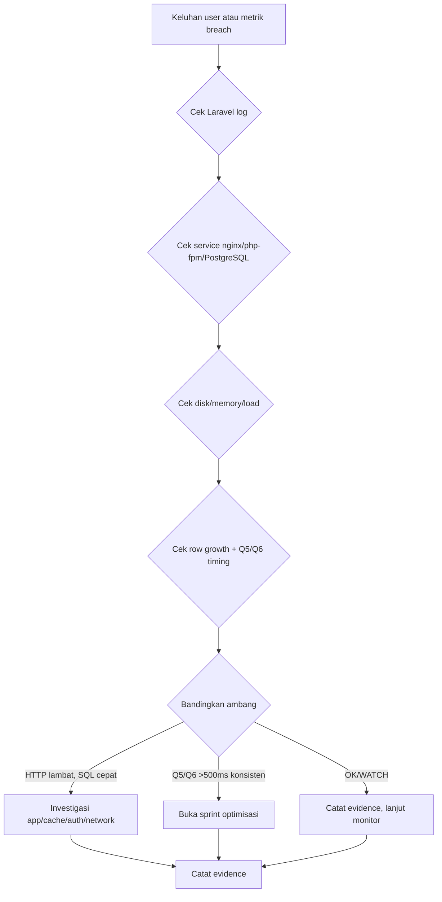

# Sprint 68.14 — Pilot Performance Monitoring Plan

## Executive Summary

- Sprint 68.8–68.13 membuktikan performa read-path RME dan Owner Dashboard pada database stress lokal (`daengtisia_stress`) tetap **OK** pada skala 250k pasien, 556k kunjungan, dan 500k pembayaran sintetis.
- Bukti lokal menunjukkan Owner Dashboard ~60 ms avg, halaman RME ~53–63 ms avg, HTTP p95 max ~71.80 ms, Q5 ~80 ms, Q6 ~118 ms — semua di bawah ambang FIX.
- **Pilot/VPS tetap perlu monitoring** karena hardware VPS, traffic nyata, distribusi data production, dan concurrency multi-user tidak identik dengan stress lokal single-session.
- Sprint 68.14 **hanya** membuat rencana monitoring dan runbook operasional — **tidak ada deploy**, migrasi, index, rewrite query, cache, atau agent monitoring.
- Operator harus mengumpulkan bukti berkala (aggregate counts, timings, resource health) sebelum memutuskan optimisasi.
- Optimisasi hanya dibuka jika ambang resmi Sprint 68.12 terlampaui secara konsisten pada pilot/VPS.
- Monitoring wajib menghindari PII (KTP/NIK, nama pasien, dump DB) dan perintah destruktif (`migrate:fresh`, `db:wipe`, restore tanpa SOP).

## Deploy Decision

| Item | Decision |
|---|---|
| Deploy needed | No |
| Reason | Documentation/runbook only |
| VPS SSH needed | No (for this sprint) |
| Migration/index needed | No |
| Runtime code change needed | No |
| Monitoring automation installed | No |

## Background Evidence

| Evidence | Result |
|---|---|
| Local stress patients | 250,000 |
| Local stress visits | 556,000 |
| Local stress payments | 500,400 |
| Local stress DB size | ~2,059 MB |
| Owner Dashboard local stress avg | ~60 ms |
| RME pages local stress avg | ~53–63 ms |
| HTTP p95 max | ~71.80 ms |
| Q4 Payment report LIMIT 50 | ~0.10 ms |
| Q5 Owner aggregate | ~79.81 ms |
| Q6 Daily trend | ~118.25 ms |
| Forced index Q5 at 500k | Rejected (333 ms vs 80 ms seq scan) |
| Decision from Sprint 68.13 | No optimization now |

**Sumber bukti:** `docs/sprints/sprint-68-12-performance-closure-report.md`, `docs/sprints/sprint-68-13-performance-closure-owner-stakeholder-summary.md`.

**Caveat:** Bukti di atas dari environment stress lokal dengan data sintetis `TST-*`, benchmark HTTP single-session, dan `paid_at` ter-cluster pada hari seed. Bukan bukti kapasitas production terjamin.

## Monitoring Goals

- Mendeteksi degradasi performa lebih awal selama operasional pilot.
- Membandingkan perilaku pilot/VPS terhadap baseline closure Sprint 68.8–68.13.
- Menghindari optimisasi prematur (index/rewrite/cache) tanpa bukti threshold terlampaui.
- Membuat jejak bukti terstruktur sebelum sprint optimisasi atau deploy performa.
- Melindungi privasi pasien — hanya aggregate counts dan timings.

## Monitoring Scope

| Area | Included | Notes |
|---|---|---|
| HTTP response time | Yes | Owner Dashboard + halaman RME kunci |
| Laravel health | Yes | `artisan about`, log, cache, queue |
| PostgreSQL growth | Yes | DB size, row counts, Q5/Q6 timing, autovacuum |
| VPS resources | Yes | disk, memory, load, service status |
| Error rate | Yes | Laravel/nginx/php-fpm, HTTP 5xx |
| Concurrency test | No | Future sprint |
| Automated alerting | No | Future sprint (WhatsApp/Telegram/email) |
| Runtime optimization | No | Future sprint only if thresholds crossed |

## Key Pages to Monitor

| Page / Flow | Route (representative) | Why It Matters | Status Threshold |
|---|---|---|---|
| Owner Dashboard | `GET /dashboard` | Owner KPI dan agregat keuangan | HTTP avg / p95 |
| RME patient queue | `GET /rme/patient-queue` | Antrian klinik harian | HTTP avg / errors |
| RME visit list | `GET /rme/visits` | Operasi kunjungan | HTTP avg / errors |
| RME patient detail/history | `GET /rme/visits/{id}` | Lookup rekam medis | HTTP avg / errors |
| RME receivables | `GET /rme/receivables` | Monitoring piutang | HTTP avg / errors |
| RME payment report | `GET /rme/reports/payments` | Laporan keuangan | HTTP avg / errors |
| Cashier payment page | `GET /rme/visits/{id}/payments/create` | Alur kasir | HTTP avg / errors |

**Catatan HTTP pilot:** Perintah `php artisan stress:benchmark-rme-pages` **hanya** diizinkan di environment `local`, `stress`, atau `testing` — **bukan** di pilot/production. Untuk pilot, gunakan pengukuran manual (lihat runbook di bawah).

## Monitoring Frequency

| Frequency | Checks |
|---|---|
| Daily during pilot | HTTP key pages (subjective atau curl timing), Laravel errors, disk/memory, service status |
| Weekly | SQL Q5/Q6 timing, table sizes, payment row count, slow query review, evidence template |
| After major data import | Row counts, DB size, key page response smoke |
| After deploy/hotfix | `php artisan about`, logs, smoke HTTP pada halaman kunci |
| When user complains | Incident triage checklist (lihat bawah) |

## HTTP Thresholds

Ambang resmi dari Sprint 68.12 closure — berlaku untuk pilot/VPS.

| Runtime | Status | Action |
|---:|---|---|
| <100 ms avg | OK | No action |
| 100–300 ms avg | OK/WATCH | Keep monitoring |
| 300–500 ms avg | WATCH | Review logs, DB growth, resource pressure |
| 500 ms–1s avg | INVESTIGATE | Capture evidence; plan optimization sprint |
| >1s avg or p95 | FIX | Create optimization sprint |

## SQL Thresholds

| Runtime | Status | Action |
|---:|---|---|
| <100 ms | OK | No action |
| 100–300 ms | WATCH | Keep monitoring |
| 300–500 ms | WATCH / investigate | Review query frequency and HTTP impact |
| 500 ms–1s | INVESTIGATE | Consider query/index/summary strategy |
| >1s | FIX | Optimization sprint required |

## Capacity Thresholds

| Metric | OK | WATCH | INVESTIGATE / FIX |
|---|---:|---:|---:|
| RME payments | <500k | 500k–1M | >1M plus user-visible slowdown |
| Owner Dashboard avg | <300 ms | 300–500 ms | >500 ms |
| Owner Dashboard p95 | <500 ms | 500 ms–1s | >1s |
| Q5/Q6 SQL | <300 ms | 300–500 ms | >500 ms |
| Disk free (VPS) | >20 GB | 10–20 GB | <10 GB |
| DB size | Document trend | Rapid growth vs baseline | Unexpected spike |

**Baseline pilot awal:** Catat angka row count dan DB size saat monitoring pertama (Sprint 68.15) — belum ada bukti VPS live pada Sprint 68.14.

## Operational Runbook

Runbook ini untuk operator yang **sudah memiliki akses SSH VPS** sesuai SOP terpisah (`docs/pilot_support_runbook.md`). Sprint 68.14 **tidak** mengeksekusi perintah berikut.

### A. Application HTTP performance

**Tujuan:** Mengukur respons halaman kunci tanpa mengekspos data pasien.

**Metode manual (pilot/production):**

1. Login sebagai user dengan permission sesuai (Owner untuk dashboard; Admin Klinik/Kasir untuk RME).
2. Buka halaman kunci; catat waktu muat subjektif atau gunakan DevTools Network (DOMContentLoaded / total time).
3. Ulangi 3× pada jam operasional normal; catat avg dan observasi p95 kasar (nilai terburuk dari 3 run).
4. **Jangan** simpan response body, screenshot berisi nama pasien, atau HAR file penuh.

**Contoh curl timing (authenticated — ganti cookie/session sesuai SOP, tanpa mengekspor body):**

```bash
# Contoh pola saja — sesuaikan URL dan cookie jar sesuai sesi login operator
curl -o /dev/null -s -w 'time_total=%{time_total}\nhttp_code=%{http_code}\n' \
  -b /tmp/pilot-session.cookies \
  'https://<pilot-host>/dashboard'
```

**Halaman yang diukur:** Owner Dashboard, antrian pasien, daftar kunjungan, piutang, laporan pembayaran, halaman kasir (jika ada kunjungan `cashier_pending`).

**Lokal/stress only (bukan pilot):**

```bash
# Hanya local/stress/testing — command menolak pilot/production
php artisan stress:benchmark-rme-pages \
  --env=stress \
  --runs=3 \
  --branch-code=TST \
  --include-owner \
  --warmup=1
```

### B. Laravel application health

```bash
cd /var/www/asia-dental-lab-v2
php artisan about
php artisan route:clear --help >/dev/null
php artisan queue:failed
php artisan schedule:list
```

**Yang dicek:**

| Check | OK | WATCH / INVESTIGATE |
|---|---|---|
| Environment | `pilot` | `local` atau `production` tidak disengaja |
| Debug Mode | OFF | ENABLED di pilot |
| Maintenance Mode | OFF | ON tanpa komunikasi |
| Config/Routes cache | Sesuai SOP deploy | Cache stale setelah hotfix |
| `queue:failed` | 0 atau diketahui | Baru muncul atau meningkat |
| Laravel log errors | 0 baru 24h | ERROR/CRITICAL/SQLSTATE baru |

### C. PostgreSQL health

Gunakan kredensial dari `.env` — **jangan cetak password** ke log atau laporan.

```bash
cd /var/www/asia-dental-lab-v2
set -a
source .env
set +a

PGPASSWORD="$DB_PASSWORD" psql \
  -h "$DB_HOST" \
  -p "${DB_PORT:-5432}" \
  -U "$DB_USERNAME" \
  -d "$DB_DATABASE" \
  -c "SELECT pg_size_pretty(pg_database_size(current_database())) AS db_size;"
```

```bash
PGPASSWORD="$DB_PASSWORD" psql \
  -h "$DB_HOST" \
  -p "${DB_PORT:-5432}" \
  -U "$DB_USERNAME" \
  -d "$DB_DATABASE" \
  -c "
SELECT 'patients' AS table_name, COUNT(*) FROM mst_patients
UNION ALL SELECT 'visits', COUNT(*) FROM trx_clinic_visits
UNION ALL SELECT 'rme_invoices', COUNT(*) FROM trx_rme_invoices
UNION ALL SELECT 'rme_payments', COUNT(*) FROM trx_rme_payments;
"
```

**Table growth dan autovacuum:**

```bash
PGPASSWORD="$DB_PASSWORD" psql \
  -h "$DB_HOST" \
  -p "${DB_PORT:-5432}" \
  -U "$DB_USERNAME" \
  -d "$DB_DATABASE" \
  -c "
SELECT
  relname,
  n_live_tup,
  n_dead_tup,
  pg_size_pretty(pg_total_relation_size(relid)) AS total_size,
  last_autovacuum,
  last_autoanalyze
FROM pg_stat_user_tables
WHERE relname IN (
  'mst_patients',
  'trx_clinic_visits',
  'trx_rme_invoices',
  'trx_rme_payments'
)
ORDER BY pg_total_relation_size(relid) DESC;
"
```

**Connection count:**

```bash
PGPASSWORD="$DB_PASSWORD" psql \
  -h "$DB_HOST" \
  -p "${DB_PORT:-5432}" \
  -U "$DB_USERNAME" \
  -d "$DB_DATABASE" \
  -c "SELECT count(*) AS active_connections FROM pg_stat_activity WHERE datname = current_database();"
```

**Long-running queries:**

```bash
PGPASSWORD="$DB_PASSWORD" psql \
  -h "$DB_HOST" \
  -p "${DB_PORT:-5432}" \
  -U "$DB_USERNAME" \
  -d "$DB_DATABASE" \
  -c "
SELECT
  pid,
  now() - query_start AS duration,
  state,
  wait_event_type,
  LEFT(query, 180) AS query
FROM pg_stat_activity
WHERE state <> 'idle'
ORDER BY duration DESC
LIMIT 10;
"
```

**Index presence (critical — read-only verify):**

```bash
PGPASSWORD="$DB_PASSWORD" psql \
  -h "$DB_HOST" \
  -p "${DB_PORT:-5432}" \
  -U "$DB_USERNAME" \
  -d "$DB_DATABASE" \
  -c "
SELECT indexname, tablename
FROM pg_indexes
WHERE tablename IN ('trx_rme_payments', 'trx_clinic_visits', 'trx_rme_invoices')
ORDER BY tablename, indexname;
"
```

**Q5 Owner aggregate timing:**

```sql
EXPLAIN (ANALYZE, BUFFERS)
SELECT COALESCE(SUM(amount), 0)
FROM trx_rme_payments
WHERE branch_id = <branch_id>
  AND paid_at >= DATE '<from_date>'
  AND paid_at < DATE '<to_date>';
```

**Q6 Daily trend timing:**

```sql
EXPLAIN (ANALYZE, BUFFERS)
SELECT DATE(paid_at) AS day, COALESCE(SUM(amount), 0)
FROM trx_rme_payments
WHERE branch_id = <branch_id>
  AND paid_at >= DATE '<from_date>'
  AND paid_at < DATE '<to_date>'
GROUP BY DATE(paid_at)
ORDER BY day;
```

Ganti `<branch_id>`, `<from_date>`, `<to_date>` dengan nilai operasional — catat **hanya** execution time dari `EXPLAIN ANALYZE`, bukan baris data.

### D. VPS resource health

```bash
df -h
free -h
uptime
top -b -n 1 | head -n 30
```

| Metric | OK | WATCH | INVESTIGATE |
|---|---|---|---|
| Disk free | >20 GB | 10–20 GB | <10 GB |
| Memory available | >500 MB | 200–500 MB | <200 MB sustained |
| Load average (1m) | < CPU cores | ≈ CPU cores | >2× CPU cores sustained |

### E. Service health

```bash
systemctl status php8.3-fpm --no-pager
systemctl status nginx --no-pager
systemctl status postgresql --no-pager
nginx -t
```

Service tidak aktif → **INVESTIGATE** segera; ikuti `docs/pilot_support_runbook.md` untuk restart SOP.

### F. Error monitoring

```bash
cd /var/www/asia-dental-lab-v2
tail -n 120 storage/logs/laravel.log
grep -Ei "ERROR|CRITICAL|exception|SQLSTATE|timeout" storage/logs/laravel.log | tail -n 50
```

**nginx error log (path umum — sesuaikan jika berbeda):**

```bash
sudo tail -n 50 /var/log/nginx/error.log
grep -Ei '500|502|504' /var/log/nginx/error.log | tail -n 20
```

**php-fpm log (jika accessible):**

```bash
sudo tail -n 50 /var/log/php8.3-fpm.log 2>/dev/null || sudo journalctl -u php8.3-fpm -n 50 --no-pager
```

| Signal | Status |
|---|---|
| 0 Laravel ERROR baru 24h | OK |
| Sporadic ERROR dengan workaround | WATCH |
| HTTP 500/502/504 berulang | INVESTIGATE |
| SQLSTATE / timeout berulang pada halaman kunci | INVESTIGATE / FIX |

## Evidence Template

Salin template berikut untuk setiap sesi monitoring pilot.

```markdown
### Pilot Performance Check — YYYY-MM-DD

| Metric | Result | Status | Notes |
|---|---:|---|---|
| Owner Dashboard avg | | | |
| Owner Dashboard p95 | | | |
| RME queue avg | | | |
| RME visit list avg | | | |
| RME receivables avg | | | |
| RME payment report avg | | | |
| DB size | | | |
| RME payments count | | | |
| RME visits count | | | |
| Q5 SQL runtime | | | |
| Q6 SQL runtime | | | |
| Disk free | | | |
| Memory available | | | |
| Laravel errors last 24h | | | |
| PHP-FPM / nginx / PostgreSQL | | | |

Decision:
- OK / WATCH / INVESTIGATE / FIX

Action:
-

Operator:
Evidence file/link (no PII):
```

## Incident Triage Flow



**Langkah operasional:**

1. Konfirmasi keluhan user atau metrik breach (tanggal, halaman, branch).
2. Cek Laravel log untuk error baru (30 menit terakhir).
3. Cek status nginx, php-fpm, PostgreSQL.
4. Cek disk free, memory, load average.
5. Cek pertumbuhan row (`trx_rme_payments`, visits) dan timing Q5/Q6.
6. Bandingkan dengan ambang HTTP/SQL/capacity di dokumen ini.
7. Jika HTTP lambat tetapi SQL cepat → investigasi layer aplikasi (cache, session, view compile, network VPS).
8. Jika Q5/Q6 melebihi ambang → jangan tambah index mendadak; buka sprint optimisasi dengan bukti.
9. Jangan `migrate:fresh`, `db:wipe`, atau restore DB tanpa SOP backup.
10. Isi evidence template; eskalasi ke `docs/pilot_support_runbook.md` jika S1/S2.

## Optimization Decision Rules

**Tidak ada optimisasi sekarang** — keputusan Sprint 68.12–68.13 tetap berlaku.

Buka sprint optimisasi **hanya** jika satu atau lebih kondisi berikut terpenuhi **secara konsisten** pada pilot/VPS:

- Owner Dashboard HTTP avg >300 ms secara konsisten.
- Owner Dashboard HTTP avg >500 ms pada pilot/VPS.
- Owner Dashboard p95 >1s.
- Q5/Q6 SQL >500 ms secara konsisten.
- Payment rows melebihi 1M **dan** pengguna merasakan kelambatan.
- Bukti pilot/VPS **materially slower** dari baseline local stress (mis. Owner Dashboard >3× local avg tanpa penjelasan resource).

**Jenis sprint optimisasi yang mungkin (future, dengan persetujuan):**

| Sprint type | Trigger |
|---|---|
| Owner Dashboard Aggregate Optimization | HTTP >300–500 ms atau Q5 >500 ms |
| Materialized/Summary KPI Table | Q5/Q6 >500 ms + volume >1M payments |
| Payment Aggregate Index Review | Bukti plan menunjukkan index membantu (bukan memperlambat seperti forced index Q5) |
| Owner Dashboard Cache Strategy | HTTP lambat, SQL acceptable |
| Controlled 1M Payment Benchmark | Persetujuan eksplisit + environment terkontrol |
| Multi-user Concurrency Benchmark | Keluhan multi-user bersamaan |

## What Not To Do Yet

- Do not deploy performance changes.
- Do not add PostgreSQL indexes without evidence sprint.
- Do not rewrite Owner Dashboard queries.
- Do not add materialized summaries.
- Do not add cache layer.
- Do not install Netdata/Prometheus/node exporter tanpa sprint terpisah.
- Do not enable cron monitoring scripts tanpa sprint terpisah.
- Do not benchmark VPS/pilot tanpa rencana terkontrol (Sprint 68.15).
- Do not expose patient data, KTP/NIK, atau dump DB dalam laporan monitoring.
- Do not run `migrate:fresh` atau `db:wipe` pada VPS.

## Privacy Rules

- No KTP/NIK dalam laporan monitoring.
- No patient names dalam ringkasan benchmark.
- No raw HTML response bodies disimpan atau dilampirkan.
- No DB dumps dilampirkan ke tiket/evidence.
- Hanya aggregate counts, timings, status service, dan error counts.
- Screenshot opsional — pastikan tidak ada data pasien terlihat.

## Relationship to Existing Runbooks

| Document | Purpose |
|---|---|
| `docs/pilot_support_runbook.md` | First-level support, severity S1–S4, restart, backup, rollback |
| `docs/sprints/sprint-68-14-pilot-performance-monitoring-plan.md` | Performance monitoring, thresholds, evidence (this doc) |

Gunakan pilot support runbook untuk insiden availability; gunakan dokumen ini untuk degradasi performa terukur.

## Recommended Next Sprint

**Primary: Sprint 68.15 — Pilot Performance Monitoring Evidence Pack**

- Jalankan checklist monitoring ini sekali pada pilot/VPS dalam mode read-only terkontrol.
- Tangkap bukti VPS/pilot aktual (row counts, DB size, HTTP subjective/curl, Q5/Q6).
- Bandingkan dengan baseline local stress Sprint 68.8–68.13.
- Putuskan apakah automasi monitoring (cron, Laravel command, dashboard UI, alert) diperlukan.

**Alternatives:**

- Multi-user Concurrency Benchmark Plan.
- Pilot Monitoring Automation Plan (cron scripts, slow-query reports, alerting).
- Controlled 1M Payment Benchmark (hanya dengan persetujuan eksplisit).

## Future Options (Not Sprint 68.14)

Dokumentasikan sebagai opsi masa depan — **jangan implementasi sekarang:**

- Cron-based monitoring scripts
- Automated slow-query reports
- Laravel artisan command untuk pilot metrics (read-only)
- Dashboard UI monitoring internal
- Alerts ke WhatsApp/Telegram/email
- PostgreSQL extensions (pg_stat_statements, dll.)
- VPS agents: Netdata, Prometheus, node exporter
- nginx/php-fpm/PostgreSQL tuning config changes

## Safety Confirmation

- No deploy.
- No VPS SSH (during Sprint 68.14 execution).
- No migration.
- No destructive DB command.
- No business logic changed.
- No `.env`/backup/SSH key/DB dump committed.
- No real PII/KTP/NIK exposed.
- No live VPS evidence collected in this sprint.

## Commands Run

```bash
cd ~/Projects/new_lab_app
pwd
git status --short
git status --short --ignored | grep -E '(^!! .env$|.env|storage/app/backups|graphify-out|ssh|daengtisiams_vps|dump|\.sql|benchmark|screenshots)' || true
git branch --show-current
git log --oneline -5
php artisan about

graphify update .

# Doc discovery
ls docs/sprints | grep -E "68-(8|9|10|11|12|13)|68-8|68-9|68-10|68-11|68-12|68-13" || true
find docs -maxdepth 3 -type f | grep -Ei "runbook|monitor|performance|pilot|sprint-68" || true

git switch feature/sprint-26-phase-26-8-stabilization-closure-go-watch-no-go-report
git switch -c feature/sprint-68-14-pilot-performance-monitoring-plan

# After doc authoring
git diff --check
git status --short
git diff --stat
```

## Final Status

DONE / COMMITTED / PUSHED / PR MERGED / GO-TAGGED / NO DEPLOY
